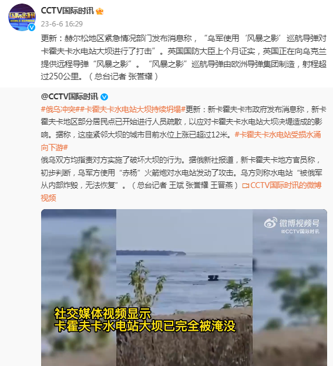

# 赫尔松紧急情况部门：乌军用导弹对卡霍夫卡水电站大坝进行打击

**相关报道：**

快讯！乌媒：卡霍夫卡水电站大坝遭破坏，泽连斯基发声谴责俄军

赫尔松地区紧急情况部门发布消息称，“乌军使用‘风暴之影’巡航导弹对卡霍夫卡水电站大坝进行了打击”。英国国防大臣上个月证实，英国正在向乌克兰提供远程导弹“风暴之影”。“风暴之影”巡航导弹由欧洲导弹集团制造，射程超过250公里。（总台记者
张誉耀）

来源：CCTV国际时讯

