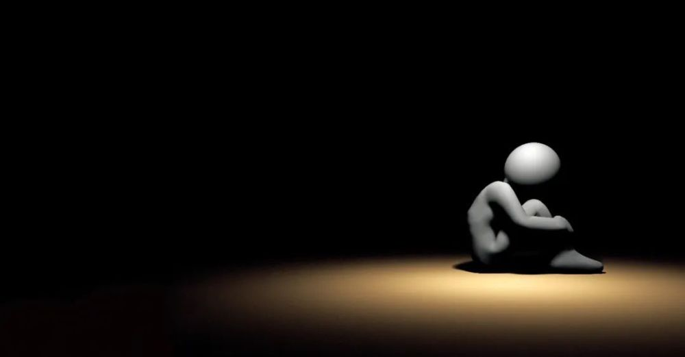

# 青少年抑郁症诊疗，是否被扩大化了？

李欣迪脱去白大褂，走进医院电梯，又听到从精神科门诊出来的患者抱怨，“好不容易挂上了号，结果医生几句话就把人打发走了”。李欣迪也很无奈，她是辽宁省一家综合类三甲医院精神科医生。其所在医院每天有两位医生出门诊，从早上8点半到下午4点半，每个医生要看50名患者，平均每小时要接诊7人，给每个患者的时间只有不到10分钟，“一直在加班加点，都没工夫抬头”。

近些年，她所接诊的患者中，抑郁症患者明显增多，青少年的比例逐年上升。但对于抑郁症初诊的病人，仅10分钟，医生难以做到充分检查。多数情况下，李欣迪只能问一些典型的抑郁症症状，尽快给出诊断，建议患者回家吃药。

今年4月底，教育部等17部门印发《全面加强和改进新时代学生心理健康工作专项行动计划（2023—2025年）》，提出要规范心理健康监测、完善心理预警干预、优化社会心理服务，加强儿童医院、精神专科医院和妇幼保健机构儿童心理咨询及专科门诊建设。

多位受访精神科医生表示，青少年抑郁症症状更复杂，需要的诊断时间比成人更长。有观点质疑，一些医院仓促的诊断，是否会将正常痛苦医学化，造成诊断扩大化的趋势？

_图/视觉中国_

**是否存在扩大化诊断？**

抑郁障碍是最常见的慢性精神障碍之一，以显著且持续的心境低落为主要临床症状，俗称抑郁症。抑郁症的病因和发病机制尚不明确，临床上不能进行病因学诊断，也不像高血压等疾病有客观、可量化指标，医生根据患者症状进行鉴别，往往带有一定主观性。

目前，中国精神科医生评估和诊断青少年抑郁症，通常使用世界卫生组织制定的ICD-10（《国际疾病分类》第十版）和美国的DSM-5（《精神障碍诊断与统计手册》第五版）。2020年，国家卫健委印发《精神障碍诊疗规范（2020年版）》（以下简称《规范》），供临床参照使用。

北京大学第六医院（以下简称北大六院）儿童病房主任、儿童心理卫生中心副主任曹庆久向《中国新闻周刊》表示，国内青少年抑郁症诊断的确存在诊断扩大化的现状。一方面，近年来青少年抑郁就诊人数增多，客观上会导致扩大化诊断可能性；另一方面，更关键的是，抑郁症有严格诊断标准，但与之对应的是，国内儿童精神科医生短缺。

有外地家长到北京找曹庆久看病时提到，当地一些精神科医生缺乏相关儿童精神疾病的诊断技能，只根据量表来评定，假如量表显示孩子有重度抑郁，医生就诊断为重度抑郁。量表是抑郁症诊断的常用评估工具，《规范》中汇总了十多种量表，用于评估抑郁症状、治疗等。曹庆久强调，量表只能反映孩子的主观体验，以及家长提到孩子的一些问题，是否确诊抑郁症，需要临床医生进行专业精神检查和判断。

2021年，中科院心理所发布《中国国民心理健康发展报告（2019-2020）》。统计显示，2020年，中国青少年抑郁检出率为24.6％。中科院心理研究所发布的《中国国民心理健康发展报告（2021~2022）》显示，青少年群体有14.8％存在不同程度的抑郁风险。

这并非医学上抑郁症群体的真实比例。上海市精神卫生中心儿少科主任杜亚松对《中国新闻周刊》解释说，包括上述研究在内的许多相关研究，是用量表评估抑郁情绪或抑郁状态。每个人都会有抑郁情绪，但这不是“疾病”。临床诊断抑郁症，则会遵循一套明确标准，比如当孩子情绪低落等抑郁情绪持续4周，严重到影响学业和生活，甚至人际交往等能力时，医生便会诊断其为抑郁症。

青少年抑郁症的诊断并不简单。北大六院儿童精神科医生钱英向《中国新闻周刊》介绍，门诊时，除了让患者做相关量表，以及进行一些操作性测试，对其智力、记忆力全面评估外，也会做一些物理检查，最后是最核心的环节——与患者交谈，进行精神检查。

北京渡过诊所首席专家、北京某三甲医院青少儿心理病房创建者王智雄解释说，精神检查时，医生会问孩子的感觉、知觉、思维、情绪等方方面面的问题，得出一个初步诊断，也能让孩子对自我有更深入了解。

王智雄介绍说，在北大医学部精神科专业的研究生临床技能考试中，精神检查是考核核心，时间为30分钟。曹庆久在专家门诊初诊抑郁症患者时，单人诊断时间很少低于40分钟。诊断儿童青少年病情，往往比成人花更长时间，青少年多在家长陪同下看诊，医生问及孩子病情，可能不止一个家长回答。此外，一些孩子表达不清晰或不愿说话，曹庆久只能耐心换不同的问题提问，激发孩子的表达欲。

钱英告诉《中国新闻周刊》，北大六院儿科普通门诊的大夫经常面对这样的矛盾。一天要看20个病人，如果遇到较多首诊或病情复杂的孩子，加班是常事。曹庆久介绍，儿童精神科门诊几乎每天都在加班，他如果出门诊，问诊时间长，又常常有人加号，一般晚上10点前很难下班。

现实中，多数普通门诊医生诊断时间并不充足。一位不愿具名的北京某三甲医院精神科医生向《中国新闻周刊》提到，很多外地患者都慕名到北京的这几家精神专科医院。如果门诊接诊人数太少，很难满足患者需求，也不利于医院营收，如果门诊人数达三四十个，平均到每一个患者身上的问诊时间就只有五六分钟。

为了效率，李欣迪不需要详细了解患者抑郁情绪的原因，一般会先让患者做量表，假如结果与她的判断没有冲突，就可以快速出一个诊断。但她往往会采取比较比较模糊的态度，初次诊断，不熟悉对方的情况，会先诊断为“抑郁状态”。她坦言，这一过程不可避免会出现扩大化诊断。

儿童青少年抑郁症的诊断要比成人更复杂。青少年生理、心理、情绪管理等方面多变，不同个体抑郁症症状差别可能非常大。青少年抑郁症症状也不如成年人典型。抑郁症诊断标准中，成年人抑郁症的一个重要症状是，持续两周情绪低落，临床中，这类典型病例不多。曹庆久分析说，一些家长反映，孩子在面临困难时会情绪低落，但和同伴玩耍时又很开心，诊断时，只要孩子一天中有一半时间是感觉抑郁的，就可以作为诊断抑郁症的症状。

不同于成年人，青少年抑郁症会表现出易激惹的症状，遇到不愉快情况，极易生气、激动，而且常有多种共患病，曹庆久在临床最常见的是青少年抑郁症共患多动症。曹庆久分析说，这对儿童精神科医生的要求极高。

李欣迪还遇到一种特殊情况，医生扩大化诊断，是出于对家长的“配合”。她曾遇到来就诊的孩子只是抑郁状态，但最后她不得不将其诊断为抑郁症。“我能感受到家长看到我写下抑郁症时松了一口气。”李欣迪说。这些家长解决不了孩子抑郁背后的问题，不知道拿孩子怎么办，确诊抑郁症后，就可以对孩子放松要求。

李欣迪向《中国新闻周刊》坦言，相比之下，她更担心漏诊带来的风险，如果孩子未得到及时治疗，有可能自伤乃至自杀。她所在医院曾出现过先例。一位患者的状态见好，其父母想要减少药量，并得到了医生的同意，这个孩子回校上课，不久后便自杀了。

钱英认为，从整个人群来讲，国内抑郁症诊断很难真正扩大化。抑郁症在国内长期被污名化，很多患者担心被贴上精神疾病的标签。这会在一定程度上限制临床诊断扩大化的趋势。

**开药成最“现实”的治疗方案？**

1988年，抗抑郁药百忧解（氟西汀）问世，随后10多年里，这一药物引发轰动。约翰斯·霍普金斯大学医学院精神科医生弗朗西斯·蒙迪莫等人在《我的孩子得了抑郁症》一书中提到，该药物没有此前抗抑郁药的副作用、过量使用也不会有毒性，百忧解一度被宣传成是改变世界的灵丹妙药。很多精神科医生认为，上到重度抑郁，下到普通悲伤情绪，所有问题都用百忧解来解决。

2004年，美国食品药品监督管理局（FDA）对百忧解在未成年人中的应用表态，因怀疑它增加了青少年自杀倾向，反对青少年使用这类药物，并发出最高级别黑框警告。此外，抗抑郁药物在国外引发长期争议，人们认为，制药公司对产品效果过度营销，进一步加重了抗抑郁药物的滥用。

在中国，多位精神科医生提到，青少年抑郁症治疗也存在过度用药，但背后现状却与美国有所差异。《规范》提到，国内外还没有一种抗抑郁药对儿童和青少年绝对安全。美国FDA和欧洲药品管理局允许氟西汀可用于治疗8岁及以上儿童和青少年的重度抑郁障碍，国内目前没有批准用于治疗儿童青少年抑郁障碍的抗抑郁药。

但抗抑郁药仍是儿童青少年治疗抑郁症的有效方式。《规范》提到，使用抗抑郁药的潜在获益，超过自杀行为相关的风险，但医生需要告知患者获益和风险。曹庆久解释说，儿童用药时起始剂量要低于成人，加药速度也比成人更慢。

对于青少年抑郁症治疗，多位受访儿童精神科医生提到要“权衡利弊”。抑郁症治疗包括药物、心理、物理治疗等，一些医生也会对青少年的家长进行家庭治疗。曹庆久对《中国新闻周刊》说，轻度抑郁的孩子如果没有自伤自杀等行为，心理治疗是首选方式。在北大六院，精神科医生通常建议患者挂心理治疗门诊。但一些偏远地区缺乏心理治疗资源，患者仍需改善状况，只能不得已用药。

心理疗法，是通过与心理师或接受过专业训练的精神科医师交谈来治疗心理健康问题的方式。不同于心理咨询，心理治疗一般在医院、心理诊所开设门诊，一次治疗约为50分钟，医生要获取卫健委颁发的专业资质。王智雄坦言，一般三甲精神专科医院会开设心理门诊，但心理治疗师数量少，患者挂上号的概率极低，哪怕患者第一次幸运挂上了号，之后也不一定能挂上同一位心理治疗师的门诊。此外，业内的共识是，心理治疗的有效率一般不高于药物治疗。

李欣迪分析说，她所在综合性三甲医院没有公开设立心理治疗师，因为投入产出比太低。她向《中国新闻周刊》算了一笔账，假如一万名抑郁症患者需做心理治疗，一名心理治疗师一天只能接诊5名患者，一个月20个工作日，大约要100名心理治疗师接诊，而一名精神科医生一天可以看50人，只需10人就可以对1万名患者诊疗。另外，药物治疗大概率能在2
~3周内起效，让孩子情绪达到一个相对稳定状态，也比心理治疗便宜。

今年2月，王智雄接诊了一名14岁的女生，她在2022年下半年确诊抑郁症，但父母担心药物副作用，不让孩子用药。随后病情恶化，女生注意力无法集中，记性变差，不得不休学。今年1月，其父母终于同意其吃抗抑郁药。该药物足剂量为每次4粒，孩子从1粒开始吃，并根据效果逐渐加大剂量。王智雄建议，2个月内需要加药到3~4粒，但家长起初仅让孩子吃半粒，过了3个多月才加到3粒。5月，女生病情进一步加重，“到了天天不想活的程度”。

“我们不能确认这个孩子加药后一定有效，但如果不去做，治疗就是停滞的，病情也会加重。”在王智雄看来，当患者出现抑郁症状，药物只是帮助人们缓解痛苦、提高生命质量的手段，医生评估吃药带来的利大于弊之后，由患者和家长来选择。

**更大问题是诊断不足**

“青少年抑郁症有诊断扩大化的情况，但还有很多青少年患抑郁症没有被认识到。”曹庆久向《中国新闻周刊》强调，比如，一些孩子和父母顶撞、本来学习成绩很好突然开始逃学打架，或者出现网瘾和过度使用手机等，这都可能是抑郁症的早期症状，但家长对抑郁症认识不够，导致孩子病情被延误。

2021年，《柳叶刀》杂志发表了世界精神病学协会关于抑郁症研究的重大报告《是时候对抑郁症采取联合行动了》，报告估算，在高收入国家，约一半抑郁症患者未得到诊断或治疗，而在中低收入国家，这一比例则达到80％
~90％。

在中国，心理健康被社会进一步关注，是近十年的事。2016年，国务院发布《“健康中国2030”规划纲要》，心理健康、精神障碍开始得到政策重视。多位受访者提到，诊断不足是国内青少年抑郁症面临的更大问题。

“渡过”是国内知名抑郁症互助社群和完整解决方案平台，成立于2015年，目前75％以上用户是青少年及其家长群体。渡过CEO李香枝从许多家长的描述中得知，家长往往将孩子的抑郁症表现与青春期症状混淆。进入“渡过”社区的家长总会表达，他们直到孩子确诊后才发现，原来孩子跟同学吵架，可能是抑郁症状，“也许那时让孩子做一些心理咨询，就好了”。

不同城市对抑郁症的认知仍有差异。李香枝观察，北京的家长整体对抑郁症认知水平最高，但也有四五线城市的家长，在早期得知孩子患抑郁症时，甚至会选择用迷信的方法干预，这类家长往往发现孩子病情非常严重时，才会到市里看病。

为减轻患者病耻感，钱英经常向患者打一个比喻：抑郁情绪就像烟雾报警器，你心理免疫力下降，抑郁了，说明你现在压力超过了能承受的范围。一些人认为，抗抑郁药像是在提醒自己是一个精神障碍患者。钱英也试着给对方解释，药物治疗像是一个拐杖，帮助你在跌倒时行走。抑郁症是一个慢性疾病，人们总是要学会从试图消灭它，转变为与之长期共存。

专家建议，为提升青少年抑郁症的诊断水平，各地医院要加强对儿童精神科医生的培养。2019年，《柳叶刀》上发布的一篇文章《中国儿童精神科医生稀缺》中提到，全国专职的儿童精神科医生不足500人，且多分布自一线大城市，许多中小城市甚至没有专门的儿童精神科医生。

曹庆久提到，目前国内未有儿童精神科医生数量的确切统计。不过他指出，国内儿童精神科医生的确稀缺，很多地方医院并未设立儿童精神科，因为“没有医生愿意干”，医生的能力也需要进一步加强。儿童精神科医生的培养周期长，同等时间内，儿童精神科医生单个患者的诊断时间更长，工作量比成人精神科医生更低，收入也会更少。

曹庆久指出，目前国内缺乏对儿童精神科医生的统一规范化培训体系。北大六院的儿童精神科医生培养，需要6年的规范化培训，儿童精神科医生要比成人精神科医生多在儿童精神科培训一年。2020年，三甲精神病专科医院深圳康宁医院首次在全国举办儿童精神医学专科医师培训班，邀请哈佛大学医学院附属波士顿儿童医院及其他各附属医院教授师资团队，为特别是偏远地区的医生开展系统儿童精神医学专科医师培训。

“一些医生对儿童精神科感兴趣，接受了短期培训、进修，甚至可能有些人都没有听课，回到自己医院后就开始发展儿童精神科。”曹庆久建议，目前国家相关部门要制定统一标准，医生要具备怎样的资质、接受哪些培训，才能成为合格的儿童精神科医生。曹庆久呼吁国家加大儿童精神科的投入，规范培训更多医生，地方医院在发展儿童精神科时也可以给予更多补贴，吸引医生加入。据他介绍，在病房的收入分配上，北大六院对老年和儿童精神科都有一定鼓励。

多位受访者表示，青少年抑郁症治疗过程中，医生不可能解决所有问题。李欣迪向《中国新闻周刊》展示一张图片，一座岛屿上，所有的树都朝着一个方向横倒着生长，“因为这里常年吹一个方向的风，树必须长成这样，否则很难活下来，现在青少年抑郁症也同样如此”。在李欣迪看来，教育、社会的压力，如同刮向同一方向的风，人们有一天突然醒悟，并发问，我们孩子怎么长成了这样？“这怪孩子吗？他们承担了太多不该承担的重量”。

多位受访者建议，青少年抑郁症的治疗，应以家庭为单位。李欣迪认为，一部分抑郁的孩子，其实是一个生病家庭的代表患者。她在临床观察到，每一个自残孩子的身后，都有一对麻木的父母，他们和孩子之间没有情感交流，看不到孩子的痛苦，甚至直接否认孩子的痛苦。很多孩子不愿上学，她进一步了解后发现，其中大部分孩子的父母关系都非常紧张，“孩子得在家看着他们，不然家就散了”。多数家长会暂时搁置夫妻矛盾，孩子会认为，抑郁症状对家庭关系有帮助，“有继续抑郁下去的理由了”。

此外，学校参与也极为重要。王智雄在治疗一些患者时，会给学生的老师通电话。电话那头，老师对抑郁症并不理解，抱怨学生在学校不尊重老师，或者上课时突然出走。王智雄会给老师耐心解释，这是因为孩子的抑郁情绪突然爆发，或者惊恐发作，需要出去发泄。

曹庆久描述了一个理想的青少年抑郁症治疗方案：精神科医生、心理治疗师、患者家庭、学校建立治疗联盟，使青少年抑郁症得到更早、更有效干预。

4月底，教育部等十七部门联合印发《全面加强和改进新时代学生心理健康工作专项行动计划（2023—2025年）》。其中提到，加强青少年心理健康教育已成为当前全社会的共识。该计划要求，中小学开设心理健康相关课程，加强心理辅导室建设，并建议学校与家庭、精神卫生医疗机构等建立协同机制，及早发现学生严重心理健康问题，畅通预防转介干预就医通道，及时转介、诊断、治疗。

曹庆久经常去学校给老师作心理健康科普讲座，讲解抑郁症的早期临床标准、如何识别抑郁的孩子，什么情况下需要给予帮助和转诊。对青少年心理健康重视的学校增多，但他也注意到，学校心理老师专业性仍不够，对孩子的实际帮助有限。他建议，未来，学校仍需对老师、心理教师等进行更系统的心理健康培训，甚至可以送到精神专科医院学习。“在一个完整的系统中，儿童精神科医生的数量最少，如果学校、社区、家庭等能做得更多、更好，医院的压力将会减少很多。”

（应受访者要求，李欣迪为化名，实习生吴佳睿对本文亦有贡献）

发于2023.6.5第总第1094期《中国新闻周刊》杂志

杂志标题：青少年抑郁症诊疗之困

记者：杨智杰

