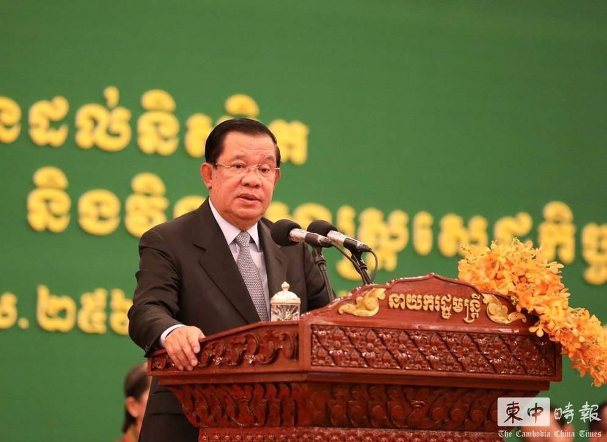

# 马克龙反对北约在日本设立办事处：管好自己的北大西洋地区

【文/观察者网
熊超然】今年5月，日媒爆料称，北约计划未来一年在日本设立办事处，该办事处将作为联络处使用。对此，包括中国在内的许多亚洲地区国家均表示担忧和反对。

据英国《金融时报》当地时间6月5日报道，此事即使是在北约内部也存在相当大的争议，法国总统马克龙就反对北约在日本开设办事处这一提议，他认为北约这个跨大西洋安全联盟应该继续专注于自己的北大西洋地区，而非亚太地区，并对北约如此“工作失焦”表示担忧。

《金融时报》的这则报道援引多达八名知情人士指出，法国方面的反对，使得北约内部几个月以来关于在“印太地区”建立首个“前哨站”的讨论变得复杂化。

_《金融时报》报道截图_

据报道，马克龙在上周的一次会议上表示，北约不应将其势力范围扩大到北大西洋地区以外，并补充说：“如果……我们推动北约扩大范围和地理位置，我们将犯下一个大错误。”

一名法国官员表示，法方认为，根据北约宪章的要求，该联盟的地理范围是限制在“北大西洋”的。这名官员还表示，在面对中国的时候，尤其是在西方要求中国不得向俄罗斯提供武器的同时，北约将“触角”伸及亚太地区，很可能会损害欧洲在俄乌冲突问题上的“信誉”。

一名了解北约内部辩论的人士则表示，事实上，法国不愿意支持任何“助长北约与中国产生紧张关系”的事情。报道称，马克龙在今年4月访问中国期间就曾表示，欧洲必须减少对美国的依赖，并避免卷入中美在台湾问题上的对抗，并强调了欧洲“战略自主权”理论。与此同时，他的这一言论也引发了美国及其盟友的一些不满。

《金融时报》称，设立新的北约办事处一事，需要得到北约最高政治决策机构北约理事会的一致支持，这意味着法国有关阻止此举。对此，北约方面拒绝透露“正在进行的讨论”的具体细节。

同时，日本政府方面没有发表评论，但一名日本官员表示，日方希望加强同北约的关系。此外，白宫方面也没有回应置评请求。

据报道，北约在乌克兰和摩尔多瓦等国设有十多个联络处或代表团，大多数的规模都是小型的，旨在帮助与东道国政府和军方联系。

2007年，已故的时任日本首相安倍晋三访问了位于比利时布鲁塞尔的北约总部，而自那时起，日本和北约就一直在讨论于东京设立办事处。2018年，日本更是在布鲁塞尔开设了北约分支机构。去年，岸田文雄成为首位出席北约峰会的日本首相，并还将参加今年7月在立陶宛举行的北约峰会。

_当地时间1月31日，斯托尔滕贝格（左）与岸田文雄在东京会面。图自日本外务省_

今年5月3日，日本经济新闻报道称，北约与日本拟提升合作关系，并计划在东京开设亚洲首个联络处，以便与日本、韩国、澳大利亚、新西兰等地区主要伙伴进行定期磋商。

据悉，该计划已得到日本和北约官员的确认，参与协调的北约国家驻日大使还声称，此举将不仅是象征性的。日本经济新闻提到，其背景在于，除了传统关注的俄罗斯以外，中国也成为了北约的“新挑战”。

对此，中国外交部发言人毛宁5月4日曾表示，亚洲是和平稳定的高地，合作开发的热土，不应当成为地缘争夺的角斗场。北约持续东进亚太，干预地区事务，势必破坏地区和平稳定，推动阵营对抗，应当引起地区国家的高度警惕。

事实上，北约意图插手亚太地区事务，美国及其北约盟友在该地区的一系列动作，已引发国际社会的普遍担忧。

俄罗斯外交部副部长亚历山大·格鲁什科去年11月在接受媒体采访时曾表示，“北约是一个没有敌人就无法生存的组织，如果没有敌人，它就会湮灭。对它来说最重要的就是去创造一个敌人的形象，并朝着这个潜在敌人的边界前进。”他称，北约正在向新的地区扩张，已经将亚洲划为其利益区。

据《柬中时报》报道，当地时间6月5日上午，柬埔寨首相洪森在出席柬埔寨皇家法律与经济大学毕业典礼时发表演讲称，全球“新冷战”格局已成形，北约“亚太化”趋势令人担忧。若有军备竞赛，世界将面临更大的危险。

洪森表示，当前大国博弈日趋激烈，地缘政治已成为世界关注的焦点。不仅在俄罗斯和乌克兰之间，亚洲亦是如此，特别是中国南海正逐渐成为地缘政治的热点地区。

_当地时间6曰5日，柬埔寨首相洪森在皇家法律与经济大学毕业典礼上发表讲话。图自《柬中时报》_

6月5日，中国外交部发言人汪文斌强调，亚洲是全球最具增长活力和发展潜力的地区。亚洲应该成为合作共赢的“大舞台”，不应该被割裂为一个个封闭排他的“小圈子”。亚洲各国欢迎一起来“成事”的努力，不欢迎专门来“搞事”的企图。中方坚定维护东盟中心地位和包容性区域合作架构，愿同包括东盟国家在内的地区伙伴一道，秉持开放合作、互利共赢理念，反对在亚洲煽动阵营对抗的言行，携手把亚洲打造成和平的支柱、发展的高地、合作的热土。

**本文系观察者网独家稿件，未经授权，不得转载。**

