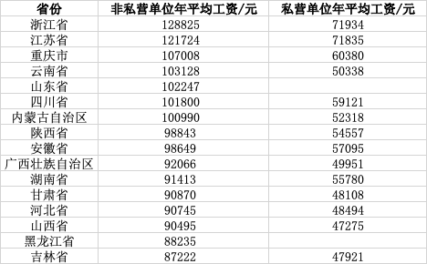

# 16省份公布去年工资水平：浙江最高，IT行业、采矿业在多省“领跑”

近日，各省份陆续公布2022年平均工资数据。截至目前，公布相关数据的省份已有16个。

从公布的数据看，16个省份的城镇非私营单位就业人员年平均工资均高于上年， **7个省份超过10万元，浙江、江苏超过12万元** ；
**不同省份的高收入行业差别较大，信息传输、软件和信息技术服务业和金融业稳居江苏、浙江、重庆等部分省份高收入行业的同时，采矿业以及电力、热力、燃气及水生产和供应业在另一些省份如内蒙古、安徽、山西等成为收入靠前的行业**
，此外， **卫生和社会工作也在部分省份进入收入前三** 。

16省份公布去年平均工资，浙江最高

据澎湃新闻记者不完全统计，截至目前，已有浙江、江苏、重庆、云南、山东、四川、内蒙古、陕西、安徽、广西、湖南、甘肃、河北、山西、黑龙江、吉林16个省份公布2022年平均工资数据。

_数据来源：各地统计局_

16个省份均公布了城镇非私营单位就业人员年平均工资，除山东、黑龙江外，14个省份公布了城镇私营单位就业人员年平均工资。同一省份的非私营单位平均工资高于私营单位。

从公布的数据看，16个省份的2022年城镇非私营单位就业人员年平均工资均高于上年，但不少省份增幅收窄，内蒙古、河北等少数省份增速提高。

这一变化趋势与全国一致。此前，国家统计局发布的数据显示，2022年，全国城镇非私营单位就业人员年平均工资为114029元，比上年增长6.7%，增速比2021年回落3.0个百分点。

从数值看，浙江、江苏、重庆、云南、山东、四川、内蒙古7个省份城镇非私营单位就业人员年平均工资超过10万元，浙江、江苏在12万元以上，浙江目前最高，为128825元。

浙江统计局的数据显示，2022年浙江非私营单位就业人员年平均工资为128825元，比2021年度增加6516元，增长5.3%，扣除价格因素，实际增长3.1%；私营单位就业人员年平均工资为71934元，比上年增加2706元，增长3.9%，扣除价格因素，实际增长1.7%。

从区域看，无论是在城镇非私营单位还是在私营单位中，工资水平都是东部较高，东北相对较低，西部的表现略好于中部，西部省份中，重庆、四川的工资水平相对更高，比如重庆、四川的非私营单位就业人员年平均工资分别为107008元、101800元，中部省份中，目前安徽最高，但其非私营单位就业人员年平均工资仍未进入10万元“门槛”。

一些省份还公布了省内不同地区的平均工资水平。一般而言，省会城市、中心城市、中心区域工资水平在全省领先。如，安徽合肥以112019元的非私营单位就业人员年平均工资位居全省第一；湖南长株潭地区城镇非私营单位就业人员年平均工资107487元，为四大区域中最高；内蒙古自治区统计局表示，2022年呼包鄂乌区域一体发展进一步推进，地区工资水平最高，城镇非私营平均工资达到106436元。

行业差异大，IT行业、采矿业工资水平在多省“领跑”

平均工资数据涉及19个行业门类。从全国看，2022年，无论是在城镇非私营单位还是在私营单位中，就业人员年平均工资水平排在前三位的行业均为技术含量较高的信息传输、软件和信息技术服务业，金融业，科学研究和技术服务业。

从16省份公布的数据看，信息传输、软件和信息技术服务业工资水平在多个省份都是“领跑”，这一趋势与全国基本一致。比如，浙江、江苏、重庆、山东、四川、陕西、湖南、河北等省份非私营单位就业人员平均工资最高的行业都是信息传输、软件和信息技术服务业。其中，整体工资水平最高的浙江，其非私营单位的信息传输、软件和信息技术服务业工资水平高达287088元。

其次，采矿业的工资水平表现也较好，内蒙古、安徽、甘肃、山西、黑龙江5个省份的城镇非私营单位中，采矿业工资水平最高。5省相比，内蒙古城镇非私营单位采矿业年平均工资最高（160200元），内蒙古自治区统计局表示，城镇非私营单位中，煤炭开采和洗选业、石油和天然气开采业等受价格上涨、煤炭保供政策等因素拉动，年平均工资均超过16万元。

从全国看，虽然采矿业工资水平未进入前三，但其平均工资增速相对较高，2022年，采矿业城镇非私营单位和私营单位就业人员平均工资分别增长12.0%和9.3%。

金融业仍在多个省份的工资水平前三行业中。其中，云南、广西的城镇非私营单位中，金融业平均工资位居第一。

此外，吉林城镇非私营单位中，电力、热力、燃气及水生产和供应业工资水平最高。卫生和社会工作、科学研究和技术服务业等行业在部分省份工资水平进入前三。

行业间的工资水平差距较大，从全国看，城镇非私营单位工资水平行业高低倍差达到4.08，城镇私营单位工资水平行业高低倍差为2.91。

16省份中，浙江、陕西的非私营单位工资水平行业高低倍差高于全国，其中，浙江工资水平最高的信息传输、软件和信息技术服务业与最低的住宿和餐饮业高低倍差为4.65，陕西工资水平最高的信息传输、软件和信息技术服务业与最低的居民服务、修理和其他服务业高低倍差为4.33。

