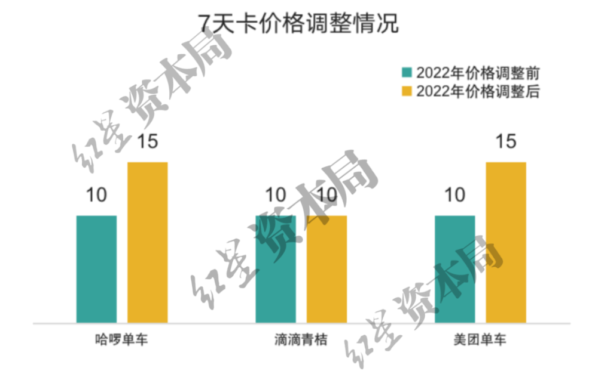
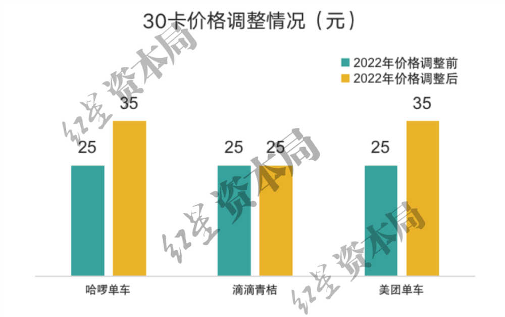
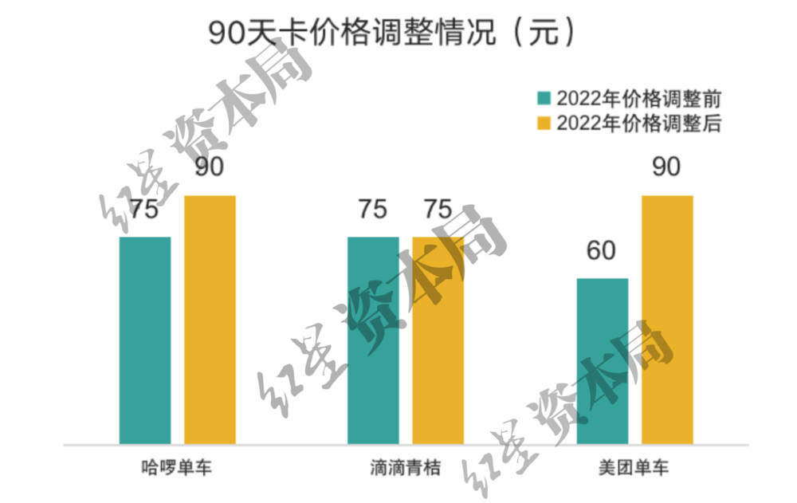
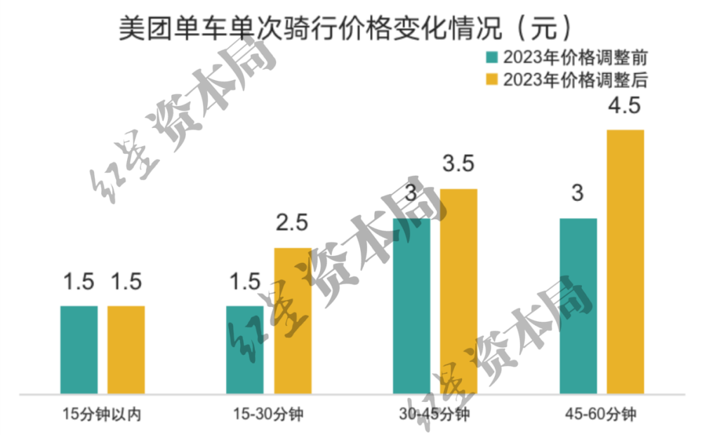
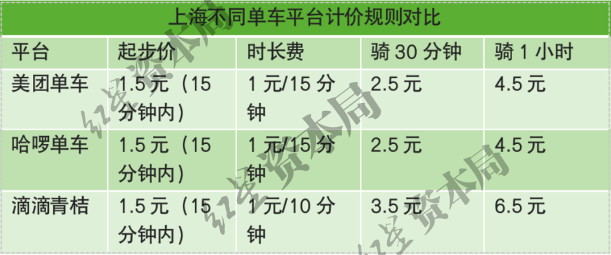
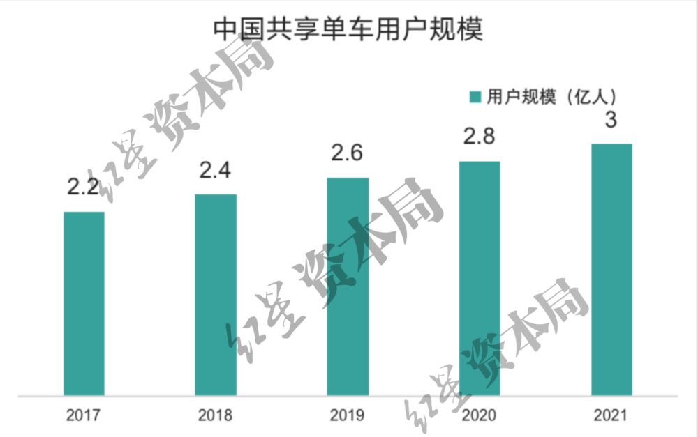
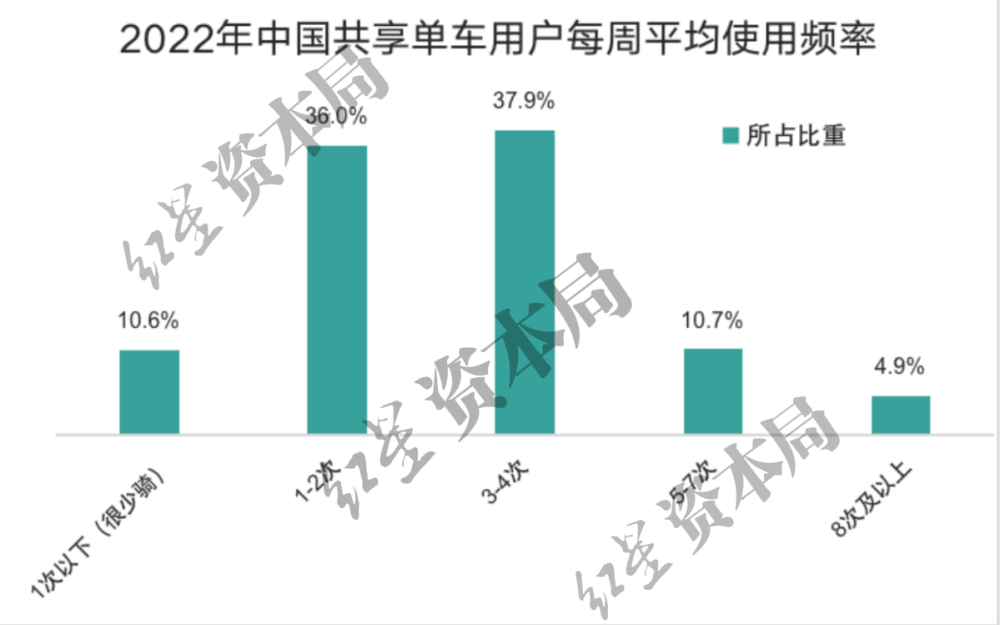
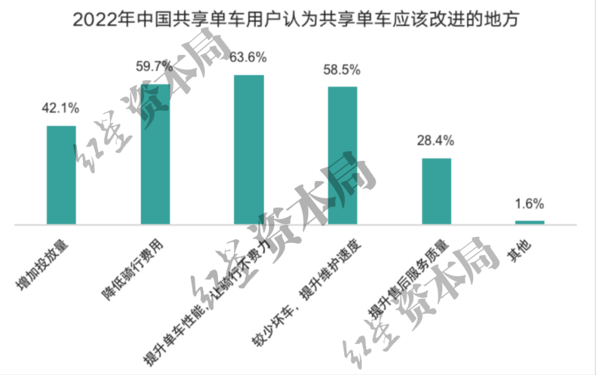
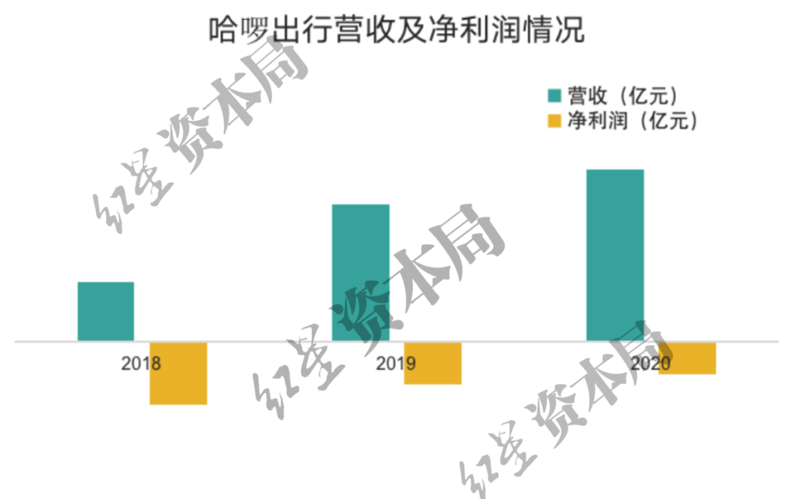

# 1小时6.5元！共享单车悄然涨价，已贵过公交地铁

2015年，被称为共享经济元年。风口之下，市场上涌现出共享单车、共享充电宝、共享雨伞、共享健身房、共享玩具、共享服装等一系列共享经济产物。

经过此后几年行业洗牌重塑，共享单车保留了下来。

当然，共享单车的玩家发生了彻底洗牌。2016年有20余家企业混战，到如今市场呈现美团单车、哈啰单车、滴滴青桔“三巨头”竞争状态，三家企业占据了95%的市场。

按照互联网企业“拉新、留存、转化”的玩法，随着行业进入成熟稳定期，企业便不再烧钱补贴用户，而是开始向用户侧“收割”。

近一两年，“共享单车又双叒叕涨价了”的话题不时在网上引发讨论。红星资本局注意到，目前部分城市的共享单车价格已经涨至1小时6.5元。

面对越来越贵的共享服务，消费者还会买单吗？

_↑资料配图
图据视觉中国_

**（一）**

**共享单车悄然涨价**

**部分城市1小时6.5元**

对于共享单车涨价，想必不少消费者都有共鸣，可共享单车价格又是何时悄然上涨的呢？

按照消费者的购买形式，共享单车有套餐骑行与单次骑行两种收费模式。

**1、套餐骑行：2022年迎来集体涨价潮**

从去年1月开始，共享单车的套餐骑行卡迎来集体涨价潮。

2022年1月，哈啰单车宣布将骑行套餐7天卡10元涨到15元，30天卡25元涨到35元，90天卡75元涨到90元。

2022年8月，美团单车也发布公告将骑行畅骑7天卡从10元涨到15元，30天卡从25元涨到35元，90天卡从60元涨到90元。

至此，除滴滴青桔之外，这两大单车品牌的套餐卡价格已调整至同一水平。

_来源：公开资料整理、红星资本局_

2022年单车企业对骑行套餐的价格调整幅度并不小，涨价达到了20%-50%，对于经常骑单车的粘性用户影响较大。

以美团单车涨价后的价格为例，如果不计额外优惠，现在的季卡（90天）价格为90元，一年就是360元，这个价格对于消费者来说，已经可以买一辆自行车了。

此外，用户还需要考虑用车时能否找到对应美团品牌的单车，以及找不到停车点时还要面临额外的调度费、管理费等。

**2、单次骑行：不同地区价不同，整体仍在持续涨价**

在单车用户中，仍有不少用户并不购买套餐卡骑行，而是选择单次结算的方式。

据艾媒咨询数据，2022年中国共享单车用户结算骑行费用方式中，36.6%消费者表示会选择单次支付。

此外，不同城市、不同品牌，单次结算的价格有多不同。

比如，今年5月初，有媒体报道厦门市部分单车品牌计价方式发生变化；今年年初，也有媒体报道了成都市部分单车品牌计价方式发生变化；此外山东、江苏等地用户也反映所在地区共享单车品牌进行了调价。

以成都的美团单车为例，红星资本局了解到，今年1月23日起，美团在成都地区实行了新的计价标准，之前起步价1.5元包含时长为30分钟，如今调整为15分钟。

_来源：公开资料整理、红星资本局_

也就是说，若用户骑行20分钟，如今需要支付2.5元，此前为1.5元；若骑行50分钟，如今需要支付4.5元，而此前为3元。

这个涨幅同样不小。如用户每天通过共享单车上下班，按照20分钟骑行时长计算，22个工作日消费者每月需要支付在共享单车上的费用就在110元左右，而此前仅为66元。

若不开套餐骑行卡，按这个价格三个月就能买一辆自行车了。

值得一提的是，美团涨价后，成都市其他单车品牌也调整了骑行计价规则。目前美团单车、哈啰单车（平日）、滴滴青桔（经典版）三家的价格在成都市内保持一致。

此外，由于价格调整因城市而异，因此部分一线城市部分单车品牌价格实则更高。

以上海为例，目前美团单车与哈啰单车收费规则都是前15分钟1.5元，之后每15分钟1元，相当于1小时4.5元。而滴滴青桔(经典版）收费标准为前15分钟1.5元，此后每10分钟收费1元，相当于骑行1小时的收费为6.5元。

_来源：各共享单车平台、红星资本局_

综上，不管是采用套餐骑行还是单次骑行的方式，共享单车的价格确实在不断上涨。

那个曾经的五毛钱半小时、各种红包甚至免费骑的时代早已不再。难怪有消费者会抱怨如今骑共享单车的价格已经贵过公交与地铁。

**（二）**

**消费者“又爱又恨”**

**九成用户每周都会骑**

从用户层面看，根据艾媒咨询发布的《2021年上半年中国共享出行发展专题研究报告》数据显示，用户选择共享单车出行主要因素是认为其环保、锻炼身体、不想走路、不想坐公交、价格实惠等原因。

_来源：艾媒咨询、红星资本局_

因此，共享单车成为不少消费者解决“最后一公里”的出行选择，据网经社数据，2021年，中国共享单车用户规模已经达到3亿人。

_来源：网经社、红星资本局_

此外，这些用户使用共享单车的频率也并不低。据艾媒咨询数据，2022年中国共享单车用户中，37.9%中国共享单车用户每星期平均使用3-4次，36.0%用户每星期使用1-2次，有少部分消费者每星期使用高达5次及以上。

也就是说，近90%的共享单车用户，每周都会使用共享单车。

_来源：艾媒咨询、红星资本局_

而在比较容易发生交通拥堵的大城市，消费者往往更加依赖共享单车。

以北京为例，据北京晚报消息，2022年北京共享单车骑行量已达9.37亿人次，日均骑行量280.65万人次。

虽然这些城市上班族对共享单车比较“依赖”，但在使用共享单车过程中，也给他们带来了不少麻烦。

在黑猫投诉上，搜索相关共享单车品牌，用户的投诉量众多，基本都围绕“找不到停放点”“乱扣调度费”“单车质量问题”等。

此外，根据艾媒咨询数据，在2022年中国共享单车用户调查中，除了提升单车性能外，近60%的消费者都认为共享单车应该降低费用，以及较少坏车，提高维修的速度。

_来源：艾媒咨询、红星资本局_

总的来说，环保便捷让共享单车有着庞大的用户规模，不少一线城市用户粘性也很强，不过对于综合的使用感受，也有不少消费者对此并不满意。

**（三）**

**共享单车，是个好生意吗？**

或许很多人认为共享单车频繁涨价，是企业为了依靠共享单车赚更多的钱。毕竟共享单车也是个用户基数大，使用频次高的生意。

但事实上，对于涨价，企业可能也很委屈，因为共享单车并不怎么赚钱。

根据哈啰出行招股书显示，2018年、2019年、2020年营收分别为21.14亿元、48.23亿元、60.44亿元；净亏损分别为22.08亿元、15.05亿元、11.34亿元。

_来源：招股书、红星资本局_

也就是说哈啰出行3年间累计亏损约48亿。截至2020年底，哈啰91%的收入来自共享两轮车服务（自行车与电单车）。

美团情况也没好到哪去。财报显示，美团在2018年4月以27亿美元全资收购摩拜单车，由摩拜贡献的计入综合收益表的收入为15.07亿元，同期摩拜为美团贡献的亏损达45.5亿元。

2022年，美团实现营收2199.55亿元，经调整溢利净额28亿元，不过共享单车业务与社区生鲜所在的新业务板块经营亏损高达284亿元。

2021年，青桔共享单车被滴滴划分进300亿元“其他业务”的亏损中。

滴滴招股书显示，截至2021年3月31日，滴滴在全国约220个城市部署了520万辆自行车和200万辆电动自行车。2018、2019年、2020年来自该部分的收入分别为2亿元、15亿元和32亿元。

总的来说，不管是哈啰、美团单车还是滴滴青桔，共享单车对于这“三巨头”来说，都是显得有些“苦哈哈”的生意。

**为什么共享单车看起来用户众多，实际上却不怎么赚钱？**

从企业的收入端考虑，其实共享单车的盈利模式比较单一。以前还能以消费者的押金来做杠杆，变相成为融资工具，如今大家都是“免押金”模式，盈利模式只剩下用户付费与广告。

从企业的成本端考虑，首先造车属于重资产，成本不低。

据钱江晚报，早期的共享单车一辆成本平均达到2000多元。不过买车的成本只是一方面，更大的成本还在于投入市场后居高不下的运维成本。

哈啰CEO杨磊此前在接受媒体采访时曾表示，一辆单车每日运维成本为0.3元，每天每辆车的折旧成本是0.6元。

也就是说，每辆共享单车每天的运维和折旧成本大概在1元左右，而一辆单车每年就要花费365元。

假设共享单车企业投放10万辆自行车，一年的运维成本就能高达三千多万元。这还没有计算丢失、严重损坏等极端情况，最终成本只会更高。

**不过，为什么共享单车营收结构单一、各项成本繁杂，互联网巨头却要纷纷布局？**

其实坚持做共享单车背后，企业各自自有“权衡”。

对于哈啰来说，共享单车为代表的出行业务只是一个入口，企业想做的是出行及生活服务平台。

2022年4月，哈啰还把名字中的“出行”二字去掉，并启用“陪伴生活每一天”的全新品牌口号。哈啰方面表示，这意味着公司从移动出行平台向专业的本地出行及生活服务平台转型的全新发展阶段。

哈啰的业务边界也在不断扩大，打开APP，除了骑行、顺风车、打车等出行领域业务外，哈啰还涉足包括酒店、餐饮、线上跑腿、火车票、景点门票、宠物等业务。

_来源：哈啰APP_

可以说，从共享单车到出行平台，再扩展到整个本地生活的业务，哈啰在持续扩充业务版图，向更有可能实现盈利的板块进军。

美团单车则主要为了补上美团在本地生活上的缺口，是美团完善本地生活服务的重要一环。从外卖、买菜和买药再到旅游，美团单车则更多是作为出行端的补充。

青桔则是在完善滴滴平台的出行版图。对于滴滴来说，共享单车相对更低端，企业可以通过高频的共享单车来培养用户习惯，进而过渡到网约车业务上去，补齐用户出行需求。

总的来说，滴滴和美团对共享单车的需求向“内”，通过共享单车维护好稳定的流量入口。哈啰对于共享单车的需求向“外”，企业从出行出发去探索更多的业务可能。

**小结**

如今共享经济的浪潮已褪去，那些不被消费者认可、不具备商业价值的共享产物已被淘汰，而共享单车作为能解决消费者实实在在需求的产品，被保留了下来。

这些互联网企业在共享单车上，也都打着不同的“算盘”。说到涨价，这或许是意料之中。不过如何科学管理单车、提升服务质量，市场也给这些共享单车企业提出了更高的要求。

红星新闻记者 刘谧

编辑 杨程

