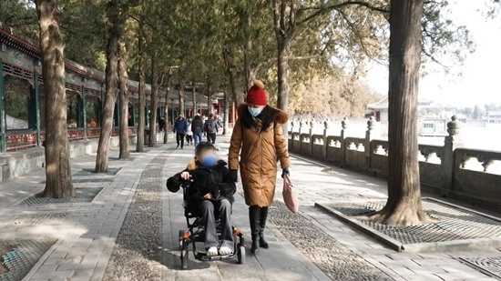
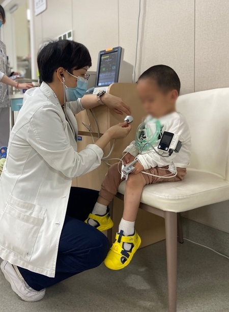

# 一滴30元、一次用药总价6万，一罕见病特效药即将退出中国

_郑芋与甜甜日常散步。图片由受访者提供_

药的重量，张玉清再了解不过了。一包100ml的药，注射完需要4.5小时，药液流尽，还要再换一袋生理盐水把管子里残留的药冲干净。

她每周都会带着女儿到医院用药。注射的时候，张玉清会牢牢盯着吊瓶，确保每一滴药液都能流入女儿小希体内。用一次药的总价是6万元，张玉清算过，一滴药30元。

吊瓶里装着“唯铭赞”（Vimizim，依洛硫酸酯酶α），是目前世界上唯一获批用于治疗黏多糖贮积症IVA型（MPS
IVA）的特效药。2019年7月，小希确诊该罕见病。医生告诉张玉清，在不进行干预治疗的情况下，女儿可能会在10岁左右全瘫，30岁左右离开人世。

张玉清几乎用尽全部力量，才把药送到女儿面前。由于药价昂贵，她曾经在世界范围内找仿制药。但该药为大分子生物制药，几乎没有低价仿制的可能性。2020年年末，她跟药企负责人打了6小时电话，终于争取到自费购药的优惠，通过部分自费、部分赠药的方式，让女儿用上了药。

但如今，她还是面临无药可用的困境。2023年2月，她拿到了最后一批赠药，而后收到了来自“唯铭赞”的国内市场代理商——百傲万里（上海）生物医药技术咨询有限公司的消息——后续不再有赠药政策，随之该药将退出中国大陆市场。

对于此事，药品生产商百傲万里制药（BioMarin）向中青报·中青网记者解释，百傲万里已决定不再为唯铭赞在中国的进口药品注册证（IDL）续期，目前该注册证将于2024年5月到期。“我们正在探索可行的方式，确保目前正在接受治疗的患者的持续供应。”

_患者在用药时需要监控生命体征。图片由受访者提供_

**退市**

目前，张玉清手里的药只够用到今年7月底。

女儿的治疗，还要继续。中医调理、通过手术针对性治疗并发症、甚至基因疗法都在张玉清的计划之内，但相比于特效药，这些疗法目前对女儿的病情效果有限。

她不断地给百傲万里制药写信，希望能保证中国患者在现有政策的情况下持续用药。“药用光了，可能就没有办法了。”

小希是2019年确诊的。那时，她只有两岁多，张玉清发现孩子胸骨前突，本以为是缺钙导致的“鸡胸”，但在医院检查时，医生怀疑是黏多糖贮积症IVA型。

这种病的患者体内缺少一种可以降解黏多糖的酶（N‐乙酰半乳糖胺‐6‐硫酸酯酶），无法代谢的黏多糖会堆积在细胞、血液和结缔组织中。最常见的症状就是骨骼畸形，患者会因为关节病变，举不起手，走不了路，发展到后期，往往需要坐上轮椅。

中国人民解放军总医院第一医学中心小儿内科的孟岩医生见过一些带着片子、病历等资料来求诊的IVA型患儿家长。孟岩说孩子没法来诊室，是因为意外事件正在ICU（重症监护室）接受治疗。

孟岩是《黏多糖贮积症IVA型诊治共识》（以下简称《诊治共识》）的执笔专家之一。她说，IVA型患者的骨骼问题通常是结构性问题，他们的脖子比较短，生命最大的威胁在于颈部寰枢椎关节不稳定，在外力的碰撞下有可能脱位，严重可致高位截瘫甚至死亡。除了骨骼外，患者的心肺功能也会受到影响，最明显的表现是体能下降。

根据《诊治共识》，用药进行酶替代疗法，是能够真正改变IVA型患者体内“黏多糖沉积”的疗法之一，也是最推荐的一种治疗方式。通过静脉注射唯铭赞，能暂时补充体内缺少的酶，延缓疾病进程，但患者需要持续性终身用药。

唯铭赞由总部位于美国加利福尼亚州的百傲万里制药生产，2019年5月获得中国国家药品监督管理局上市批准，被列入我国第一批《临床急需境外新药名单》。目前，若该药退市，在尚无替代药品的情况下，中国多名黏多糖贮积症IVA型患者将面临无药可用的问题。

黏多糖贮积症分为7个亚型，中国大陆暂无关于该病准确的流行病学数据。根据2019年《中国儿科杂志》发布的数据，中国台湾黏多糖贮积症IVA型发病率为1/300000，在我国临床诊断的黏多糖贮积症患者中，IVA型患者占比约为
30%，是罕见病中发病率相对较高的疾病之一。

正宇黏多糖罕见病关爱中心（以下简称“关爱中心”）是一家为黏多糖患者和家庭提供信息咨询与关怀救助的民间公益机构，其创始人郑芋介绍，关爱中心目前已知的IVA型患者大约在100人左右，“但数量应该远远不止这些”。

郑芋见证了药企“入市”的过程，就更难接受他们“退市”的决定。

2009年，唯铭赞尚在研发阶段，药方代表就曾来到北京考察。“那时候，他们就有进入中国市场的打算。”郑芋说，2010年，药企在中国设立了办事机构，准备耕耘中国市场。但在当时，药品什么时候能进入中国，需要多长时间的审批流程尚属未知。

2018年唯铭赞在中国大陆申请上市，借着中国政府对罕见病药物开辟的绿色通道，2019年5月，唯铭赞就获得了国家药品监督管理局的上市批准，用于治疗黏多糖贮积症IVA型患者。

唯铭赞在中国的定价为7500元一支（5mg），需要依据患者体重决定用药剂量。一个25斤的孩子，一年用药的总价在200万元左右。

作为高值药物，唯铭赞曾出现在2021年的医保谈判预选名单中，但最终谈判失败，2022年未参与医保谈判，因此目前该药仍未纳入国家医保目录，只纳入了部分地方医保及惠民保。

2021年，唯铭赞以46万元/年的价格与成都医保达成合作，后续与江苏省医保达成合作。另外，药方为中国其他的自费患者提供赠药的优惠政策，“每年自费到一定限额后就可以享受药方赠药，赠药覆盖当年度的全周期用药”。据患者家属介绍，药方和不同患者达成的用药价格稍有差异，并要求其保密，但总体在50万元左右。

记者了解到，目前国内用药的患者只有十几个。2023年2月27日，百傲万里制药发布2022年财报，全年营收20.96亿美元，唯铭赞去年全球营收6.64亿美元，同比增长7%，目前该药在中国营收空间占比有限。

在向中青报·中青网记者提供的书面回复中，百傲万里制药称，“复杂的市场准入规则使得药物的供应不可持续，特别是在罕见病治疗方面。尽管我们在过去几年中尽了最大努力，仍然没有促使唯铭赞进入医保报销体系，我们决定不再续签该产品的进口药品注册证。”

“医药退市可能出现在任何医保国家。”医疗战略咨询企业上海思知信息咨询有限公司创始人赵衡说，当药方认为在某国家或地区定价太低，形成“价格洼地”，导致其维持不了全球价格体系，药方就会退出该地医保，甚至退出市场。“相关的药方肯定是算过一个模型，他们发现就算以更低的价格进入（医保/市场），可能也盈利空间有限，那就退出。”

英国也是实行全民医疗保险制度的“医保国家”。为避免类似情况，制药企业同政府进行价格谈判时，有一定的保密协议。根据《中国卫生经济》杂志发布的相关研究，部分谈判中只提供药品简单的百分比折扣，其他属于药企的商业秘密，可应药企要求不对外公开。这种措施有助于药企稳定全球价格体系，避免某地价格调整带来的连锁反应。

有业内人士认为，罕见病药退出中国的背后，折射出罕见病高值药可及性低的现状，药价与患者人数相关，需“量价挂钩”。

2019年唯铭赞在中国批准上市时，郑芋觉得很高兴，“这些家庭在面对疾病的时候，少了我们过去的那么多恐惧，有更多选择，也不至于孤注一掷，冒着死的危险去选择一个方案。”

但现在，唯铭赞的退市再一次为患者“减了一个选项”。

_端端佩戴呼吸睡眠监测设备。图片由受访者提供_

**治疗**

根据《诊治共识》，目前针对黏多糖贮积症IVA型的治疗方式主要有3种，一种是非特异性治疗，简而言之就是“对症治疗”，哪里出问题修补哪里，这也是目前绝大多数患者选择的治疗方式。

症状较轻时，患者可以通过佩戴一些肢体矫正器具，进行保守治疗，一旦出现严重并发症，就在对应科室做手术，但是，由于一些患者有颈椎不稳定、气道扭曲、心脏疾病等并发症，手术风险较大。

据孟岩介绍，这种“对症治疗”的方式不能从根本上解决患者体内的“黏多糖沉积”，部分已经改善的病症可能出现反复。

真正改变患者体内“黏多糖沉积”这一状况的治疗方式除了用药外，还有一种是“异基因造血干细胞移植”。

过去，移植只用于出现语言障碍、智力障碍等中枢神经系统症状的黏多糖贮积症亚型，比如Ⅰ型及Ⅱ型。现在，随着移植技术进步，有案例显示，IVA型患者移植成功后，其体内酶活性有所提高，可以分解沉积的黏多糖。

但是，据部分患者介绍，造血干细胞移植有“不能下手术台”的风险，治疗效果存在个体差异，且患儿年龄越小（3岁前），移植的成功率越高，目前在国内仍然属于风险最大的治疗方式。

“医学的治疗一定是建议患者选择最方便、对身体损伤最小的方法。”孟岩说，这也是为什么，用药物是《诊治共识》最推荐的疗法。

使用唯铭赞之前，张玉清也曾考虑过移植。配型成功后，医院通知住院，张玉清还是拒绝了。

“如果选择做移植，至少有一年时间要持续治疗，再有几年身体恢复期，正好把最黄金最快乐的年龄都过去了，我挺不舍得的。”

她不想去冒这个险。但是，按小希当时的体重，每年买药的费用大概都在200万元。她和爱人都是高校老师，即使变卖家产，也不够支付一年的费用，何况是终身用药。

希望出现在2020年4月，根据浙江省医疗保障局等四部门《关于建立浙江省罕见病用药保障机制的通知》要求，经专家推荐，唯铭赞和其他两种药品一起被确定为罕见病特殊药品谈判对象。另外两种药品用于其他罕见病，费用也均在一年百万元以上。

2020年5月底，张玉清打电话到医保局咨询结果，唯铭赞在浙江医保谈判失败了。“我当时一个人坐在办公室里，只给爱人打了一个电话，欲哭无泪。”

但她不想就这么放弃。第二天晚上，张玉清联系了当时百傲万里中国区的负责人。在6个小时的通话里，张玉清给药方的理由是，一个药品需要社会认知度才能打开市场，获取信任，药方如果能够降价至她的可承受范围，她愿意后续配合其宣传真实的药效。

一周后，药方同意了。经过两次变更，现在小希的用药价格是“50万元用一年”。

为了支付药费，张玉清想尽一切可行的办法，但她想，这个药进医保可能就是一两年的事，咬咬牙，总能挺过去。

大概在持续用药一个月左右时，她发现小希走路就像高抬腿一样。“可能是因为从前迈一步要用很大的劲，现在不用了。”张玉清笑着说，她也敏锐地捕捉到了女儿知觉上的改变。“小希的头发又厚又多又涩，从前给她梳头她好像感觉不到痛，用了药之后，一梳头就会喊‘妈妈我痛’，再就是洗澡，水一热就喊，‘妈妈好烫’。”这些在小希身上真实发生的变化总让她觉得“药不能停”。

用药后，王其也在儿子端端身上看到了变化。端端出生时7斤9两，算是“大个子”，在一岁半的时候确诊黏多糖贮积症IVA型，此后，他的生长好像“一下子按了暂停键”。王其常常觉得，端端坐在那里，脖子短短的，就像一个“小虾米”。

几乎每周六，王其都会带着端端去医院用药，4次用药之后，王其忽然间发现，“孩子的鞋子穿不上了”，直至现在，他还记得当时的兴奋，“一年没长个儿的端端，脚丫子长大了。”一家人都很激动，带着孩子去商场买了两双鞋子，花了356元。

_用药时，父亲向端端竖起大拇指鼓励。图片由受访者提供_

**希望**

今年，将“用药”作为主要治疗方式的小希已经6周岁了，端端也4周岁了。停药后，由于错过最佳移植期，两名家长都不再考虑移植治疗。

对于这些家庭来说，用药是他们最大的希望。

郑芋的孩子甜甜也是黏多糖贮积症IVA型患者。为了用药，郑芋把孩子送到了美国读书。当地的学生医保售价1999美元/年，可以支付甜甜全部的药费。去美国之前，她已经用上了轮椅。

甜甜是2004年确诊的，郑芋记得当时国内的很多医生连这个病都没听说过。“似乎全世界只有我这么倒霉，自卑又无助。”

直到2008年，郑芋才听说台北有一个黏多糖关爱协会。她慕名而至，在这里得知美国百傲万里制药在研发针对黏多糖贮积症IVA型患者的特效药，并且正在招募亚洲“试药者”
的消息。

自此，郑芋开始拼尽全力接触药方的人，希望能为孩子争取到试药的机会，甚至还去澳大利亚参加了国际会议。“一句一句地翻译，一句一句地学英语。”

甜甜在台北参加了试药前的体检，但最终，她的试药申请被拒绝了，药方告诉郑芋，罕见病药的售价昂贵，在没有商业保险或国家医保支付的情况下，患者很难用得起，而药方对于唯铭赞进入大陆医保没有信心。

有药，但用不到。郑芋那时的绝望，不亚于孩子确诊时。“我知道得了这个病，孩子可能活不长，等不起。”

2014年，唯铭赞在美国上市，两年后，郑芋就将甜甜送到了美国。用药后，甜甜的身体条件几乎没有恶化，在美国独自上学。“她站不稳，扶着墙可以自己做一些东西吃。”郑芋的朋友常说她心狠，把甜甜一个人放在异国他乡，但对于郑芋而言，“逼她自立，她才能无限自由。”

目前，甜甜仍在读大学二年级。他们面临的困境是，大学毕业后，一旦回国，可能就无药可用。未来，甜甜只能通过获取美国的工作签证，实现持续用药。“以后的事都不好说，对于罕见病家庭来说，每一个决定都是一次闯关。”郑芋告诉记者。

郑芋觉得出国用药最难的是选择保险，美国的保险有成千上万种，并不是每一种都能保唯铭赞，她在业内朋友的帮助下才选到了甜甜目前使用的这款保险。“当地人甚至都没听说过。”

唯铭赞退市消息传来，不少家庭有过“出国”的念头，有家长来咨询郑芋去美国用药的可行度，郑芋说：“太难了，那种艰辛我切切实实地经历过。”

对于年纪小的孩子而言，在国外用药，意味着至少一个家长全程陪同，“没有收入、没有社交圈、还要承担精神压力。”郑芋觉得并不容易坚持，她帮助过国内想要出国用药的家庭，但后来这个家庭放弃用药，选择回国。

还有的患者希望能够从海外代购唯铭赞。代购药在操作上同样存在难度。“静脉注射用药对药品储存、运输的要求较高，需要专业的操作环境，患者在注射唯铭赞这种大分子生物药时，可能发生皮疹、高烧、腹泻、呼吸困难等过敏反应，需要专业人员的监护。”孟岩说，一般的医院很难允许使用外来的静脉注射用药，风险很高。

**保障**

其实，地方政府已在探索罕见病用药保障机制。

2021年唯铭赞分别进入江苏及成都的地方医保。

毛毛是目前使用江苏省医保用药的患者。他是在2022年年末开始申请用药的。那时，毛毛9周岁，按照他的体重，一年要用300多万元的药。

据《江苏省建立罕见病用药保障机制（试行）的通知》和江苏省《关于确定罕见病指定诊断医疗机构等有关事项的通知》，参保患者在罕见病用药保障机制定点治疗机构治疗规定的罕见病保障病种，对谈判成功的药品，由罕见病用药保障资金按费用累加计算分段确定支付比例。

毛毛生活的常州市，也有针对罕见病药品报销的医保政策，唯铭赞就在其中。各类保险，各级政府互相补充着报销，用药一年的花费可能不到5万元。

2022年12月1日，毛毛第一次用药，距离他正式确诊，不到一个月时间。

2023年1月，江苏省人大通过了《江苏省医疗保障条例》，其中明确，对于罕见病要建立一个特殊的类似基金的管理模式，要求对罕见病用药保障资金实行省级统筹、单独筹资，建立由政府主导、市场主体和社会慈善组织等参与的多渠道筹资机制。从2023年6月1日开始实施。

2023年两会期间，全国政协委员、对外经济贸易大学保险学院副院长孙洁提出推动建立国家罕见病专项基金的建议。她在接受媒体采访时表示，罕见病高值药多元付费、多主体分担、多层次保障已成为一个新时期的发展趋势，已有一些制度途径，如将罕见病纳入基本医保、惠民保等。专项基金在地方已有探索，能够为罕见病的用药保障和负担提供稳定可持续的资金来源。

关于罕见病高值药的可及性探索，国内专家公认的路径为“1+N”，所谓1即基本医保，N则包括地方专项基金、政策型商业保险、社会救助以及患者个人自付在内的多方筹资。

据记者了解，包括唯铭赞在内的多款罕见病药物已经进入数个城市的惠民保报销。南开大学卫生经济与医疗保障研究中心主任朱铭来认为，惠民保是由政府主导的一种商业补充健康保险，是对医保报销的有效补充，即通俗意义上的二次报销。

对于高值罕见病药来说，惠民保的报销可以减轻患者用药的经济负担，但很难能从根本上解决“药价贵，可及性低的问题”，以端端和小希使用的地方惠民保“西湖益联保”为例，其扣除年度累计1万元起付线后，按60%比例进行给付，年度累计最高支付限额为15万元。目前，两个孩子的购药花费在惠民保报销后大约能减少10万元，年度用药总价在40万元左右。

若赠药政策停止，端端和小希的用药总价在200万元左右，扣除每年15万元的惠民保报销额度，仍需自付185万元左右。

广州惠民保的“穗岁康”报销额度较高，对于起付线以上的规定范围内费用，其报销比例为50%-80%，年度最高支付限额合计超过235万元，该地患者家属告诉记者，如果自费用药，经过穗岁康报销后，年用药总价也在100万元左右。

**停药**

被停药是一种什么感受？小希和端端都“预习”过。

小希第一次停药是2021年8月，药方说没有存药了。张玉清记得，那是一段很难熬的时间，“头发都变白了不少”。但药方当时的态度让她觉得“停药只是暂时的”。她一边催促药方，一边筹钱准备第二年度的用药。

2022年4月13日，小希再次停药。药方给出的说法是，由于世界战争局势和疫情等不可抗力，赠药从进口到审批检测的流程十分缓慢。

这一次停药将近5个月，与上一次不同，张玉清隐隐约约觉得小希的体能开始下降了，身体状况和持续用药时有差别。她只好一遍又一遍地询问药方，到底什么时候能用到药。

端端从2022年3月24日开始用药，2022年8月，药方以相同的理由向王其表示赠药库存不足，但如果继续自费买药，还可以供应。

郑芋说，当时药方告诉她，商用药与赠药是通过两个渠道进入中国市场的。根据规定，药方需要通过基金会向患者赠药，进程可能不同步。

但是王其实在付不起了，他只能等待赠药。“每天一通电话，不仅询问药方，也询问当地接收药品的药房。”那是一段极其焦虑的时间，度日如年。“有文献说3年以上用药，孩子改善得会比较好，端端才用了半年。”

2022年9月1日4:30分左右，王其和张玉清才接到了药品到货的通知。

虽然用上了药，但张玉清的心却再也放不下。“当时就有预感，以后用药可能不会那么顺利。”

如果真的没有药，该怎么办？

在孟岩看来，没有药用不代表不治疗，近些年医疗的发展和十几年前相比，已发生翻天覆地的变化。孟岩认为，国内医生对罕见病的认识加深，多学科会诊逐年增加，对症治疗的空间也逐渐宽阔。

“定期来复查。”孟岩总会叮嘱来看病的孩子和家长，“不能真的回家什么都不治了，还是要慢慢修修补补，没准就等到技术性突破了，维护好身体，来了药才能用。”

被不少患儿家长寄予厚望的“技术性突破”是基因治疗，他们认为，黏多糖贮积症IVA型说到底是一种常染色体隐性遗传病，治疗的根本在“基因”。

目前，包括脊髓性肌萎缩症（SMA）在内的多种罕见病已经实现基因治疗。黏多糖贮积症I型的基因疗法也在临床试验阶段。

张玉清在小希第二次停药后就开始各处拜访国内研究基因治疗的专家学者，表达诚意的方式是“面谈”，不论多远，她都会前往专家所在的城市，抓住一切机会，让他们对这个病“感兴趣”，为孩子寻找基因治疗的可能性。

但是，开启一项罕见病的基因治疗研究并不容易，从立项研发到临床应用的过程非常漫长。

对于很多家长来说，用药就是为了延缓病程，等待新疗法问世。

确诊后，李文光为了给孩子用药，卖了老家的房子，在医院附近租房。李文光觉得，罕见病患者是医学的敲铃人，“他们用自己的健康提醒人类觉察到基因缺陷带来的风险，提醒家族成员在生育时排查相关风险。”

用药半年，孩子身高长了6厘米，虽然李文光也无法确定是因为用药还是孩子的正常发育，但他们是欣喜的，“如果能这样持续下去，是充满希望的。”

“以后如果不赠药了，我每年自费，竭尽全力买一点药，但我不确定一年只用几周，是否有效。”但如果药完全退出中国市场，他能选择的就只剩对症治疗了。

“对症治疗”是林雷熟悉的“疗法”。

林雷生于1988年，1995年确诊黏多糖贮积症IVA型。“当时政府都给了我们家二胎指标，我爸妈二胎证都办下来了。”他说。

2019年，林雷也关注到了唯铭赞在中国上市的消息，他打听到，“按我80斤的体重来算，一年光药费就在600万元。”林雷又重复了一遍，“600万，而且是不能停的，一直要用。”

“就像溺水的人看见一个救生圈，但是救生圈还离你很远。”他放弃用药。

2022年年末，林雷感染了新冠病毒，在床上昏睡了半个月。转阴后，身体情况大不如前，在家休养，有时在病友群和大家交流。

他觉得，很多患者虽然用不起药，但是药存在于市场，就好歹还有一丝希望，他说：“可能以后国家医保出来了以后（唯铭赞纳入国家医保目录），就还有用药的希望。”

他没有了解过基因治疗，但是他最喜欢的歌曲是《如果有一天我变得很有钱》，如果能像歌名一样，他要建立一个罕见病的基金池，让每一个患者都能用得起药。

（文中林雷、张玉清、小希、毛毛、李文光、王其为化名）

来源：中国青年报

