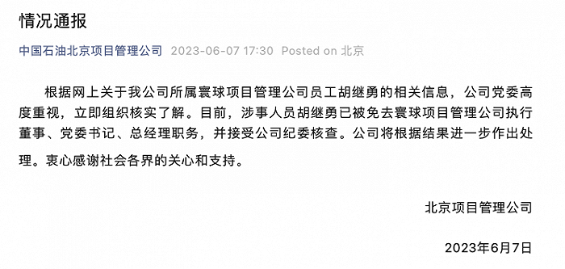

# 中国石油北京项目管理公司：涉事人员胡继勇已被免去寰球项目管理公司执行董事、党委书记、总经理职务，并接受公司纪委核查

6月7日，中国石油北京项目管理公司发布情况通报：根据网上关于我公司所属寰球项目管理公司员工胡继勇的相关信息，公司党委高度重视，立即组织核实了解。目前，涉事人员胡继勇已被免去寰球项目管理公司执行董事、党委书记、总经理职务，并接受公司纪委核查。公司将根据结果进一步作出处理。衷心感谢社会各界的关心和支持。

**此前报道**

街拍国企领导与女子牵手，摄影师回应：当时两人未拒绝

国企领导疑携第三者出游？中央巡视组：已收到数个关于此事的举报

