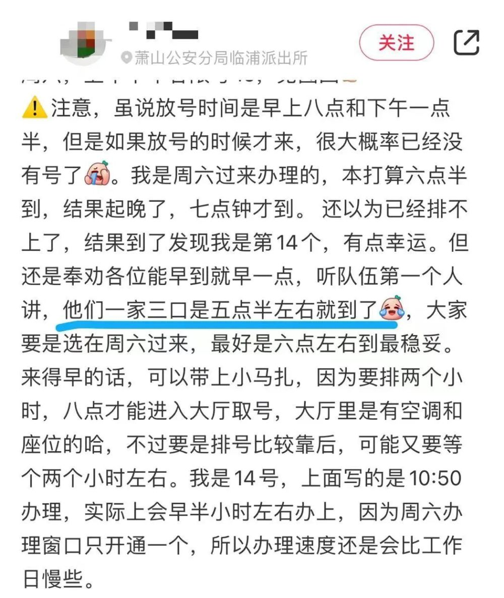
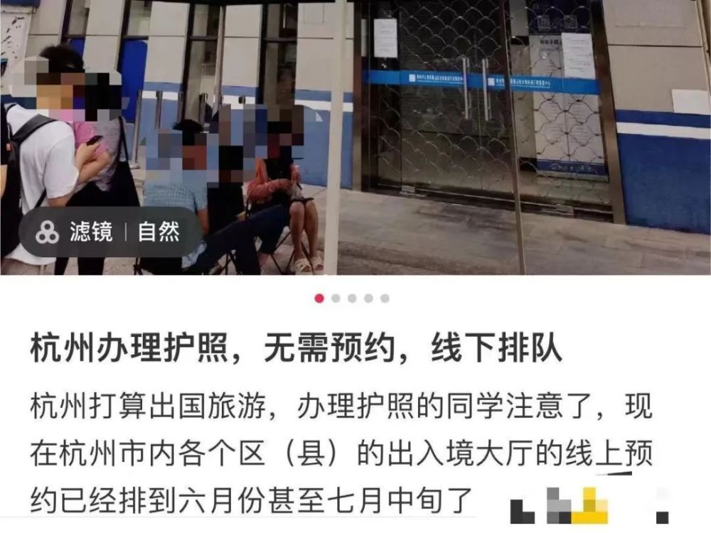
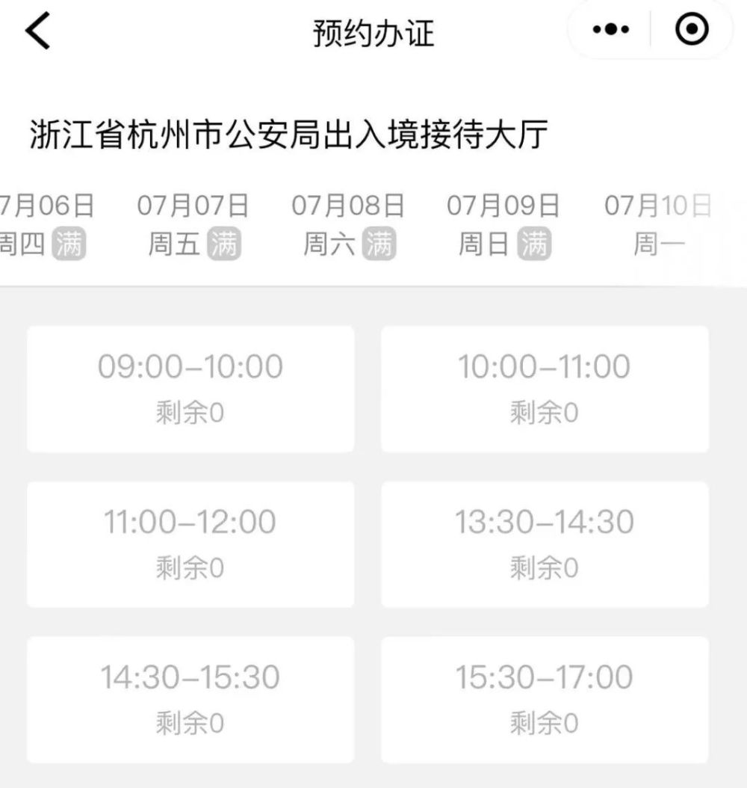
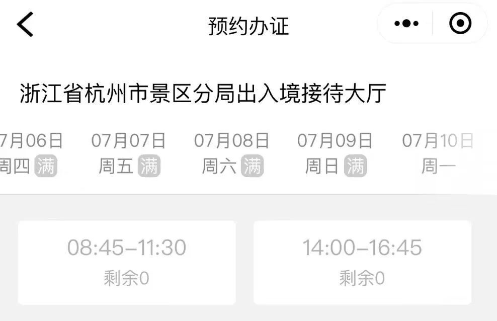
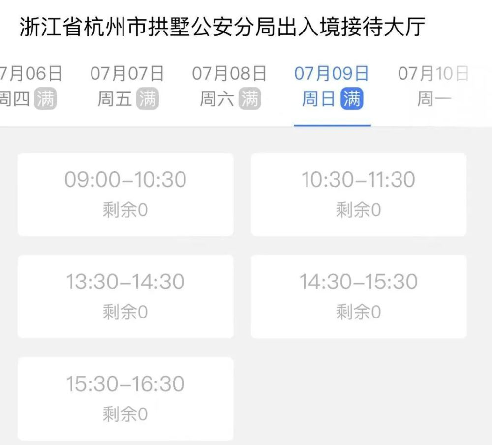
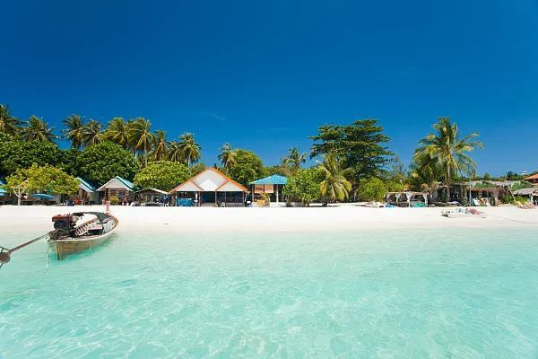
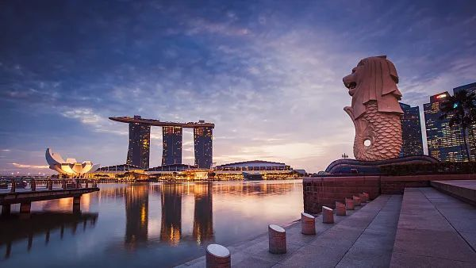

# 人数激增！杭州多地民众排队办护照，有人凌晨5点半赶到现场

正值暑期旅游前期，大家已经开始计划到哪里游玩了，但不少人发现杭州的护照办理十分紧俏，办证接待大厅的预约名额全满，有人甚至凌晨5点多就去现场排队了。

出入境接待大厅的预约显示，目前7月初的名额都已约满。

今年暑期旅游市场风向标在哪里？游客倾向于哪些地方游玩？哪些产品更受大家欢迎？针对今年暑期恢复旅游航线，市场欢迎度如何？潮新闻记者采访了杭州各大旅行社负责人。

**办理护照游客激增**

**四类旅游产品受欢迎**

“今年暑期旅游不是特别热， **相比之下国内市场比出境市场要好一点。** ”
浙江中青旅综合管理部总经理俞文杰告诉记者。为什么会出现这样的情况？他分析可能还是受政策影响。具体有：

一方面最近几个月东南亚旅游相继出了一些负面新闻，大大降低了市场热度。另一方面，受三年疫情影响，
**目前办理护照游客激增，目前预约已经排到了七月底，在一定程度上影响了出境旅游报名。**

那么今年暑期有哪些旅游产品受市场欢迎？ **“国内亲子研学游、出境留学游、东南亚海岛游、日韩自由行四类产品目前较受欢迎。”** 俞文杰说。

通常情况下，旅行社都会在常规产品中加入亲子研学元素，比如浙江省中旅的贵州线产品中，加入了“中国天眼”的行程；而在北京线产品中，会加入环球影城和博物馆行程，“这也是我们针对客人的需求，综合考量和规划后，在行程中加入这些元素。”浙江省中旅集团旗舰店负责人杨芬告诉记者。

**低龄段的家庭亲子游偏向于东南亚海岛，或者日韩自由行产品。**
今年上半年，杭州口岸恢复多条直飞东南亚海岛航线，比如巴厘岛、长滩岛、以及6月份即将恢复的济州岛航线，对旅游市场有明显拉动效应。“日本和韩国由于没有恢复团队旅游，但是自由行热度居高不下，很多客人有订机票酒店以及一日游行程需求。”杨芬说。

**相比之下，高龄段的亲子家庭有研学和留学需求。**
“今年暑期，欧洲线比如法国、瑞士一些产品，我们都有安排大学游。因为国外大学完全开放，不需要预约。而在国内游中，清华、北大也是每年留学产品热门之地，每年暑期，清华北大都会有一些参观校园的预约名额放出来，我们会帮大家预约。”
俞文杰说。

从目前来看，今年暑期出境游欧洲线因为受到签证预约名额限制等客观因素影响， **目前到七月中旬前已经基本售罄，大家要报名要等七月底看看有没有名额了。**
东南亚如新加坡、泰国因为签证方便，预留的位置还比较充足。

**暑期旅游价格如何？**

**这一时段价格较低**

至于大家最关心的价格问题，潮新闻记者也帮大家打听了。

暑期旅游分三个时段， **第一个时段为高考结束至6月25日之前，这个时段大部分学生还在考试，相对价格还比较低** ，第二个时段为
**6月28日到7月8日** ，价格会比平时 **上涨10%—20%** 左右，第三个时段为 **7月9日至8月25日** ，这个时段为真正的暑期旺季，
**价格浮动较大些** 。“今年暑期没有疫情前那么热，涨幅不是很大，目前到七月底之前， **出境价格涨幅为700元—1000元/人左右。** ”杨芬说。

来源：潮新闻·钱江晚报综合自潮新闻 记者 陈棠棣、网友评论、图自视觉中国等

值班编辑：董箫乐

