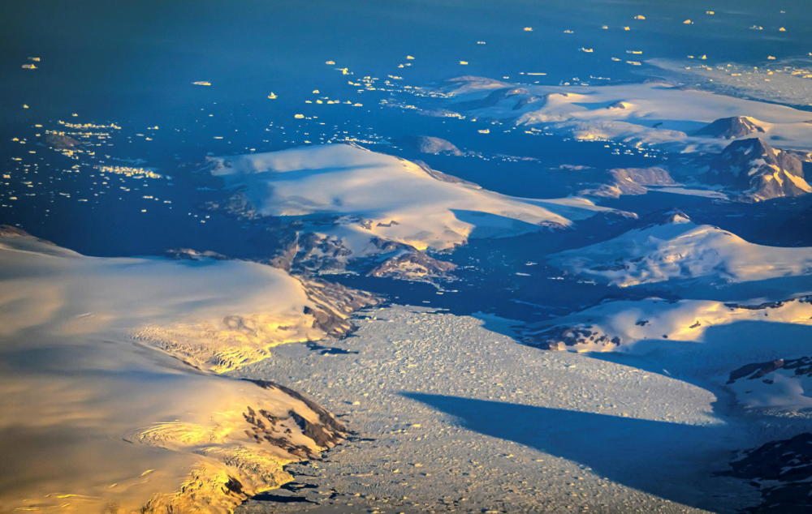
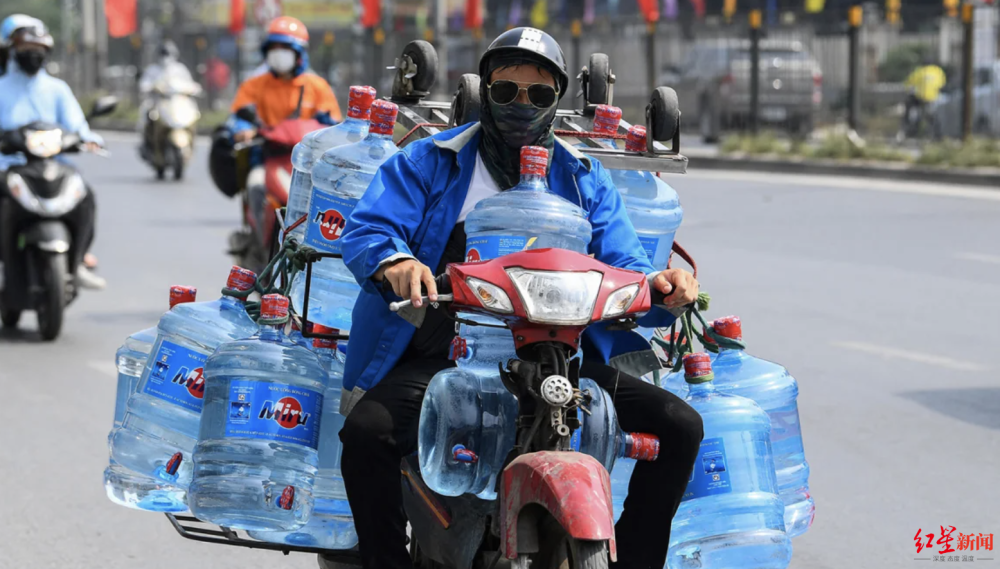

# 北极出现“无冰夏季”或提前至2030年，科学家警告北半球极端天气频发

据报道，一项于6月6日发表在《自然》杂志上的研究表明，北极可能将在2030年出现“无冰夏季”，这比研究人员此前预测的时间提前了大约10年。

科学家指出，现在拯救北极地区的夏季海冰可能已经为时过晚，北半球要为更频繁地出现极端天气做好准备。

_↑资料图片_

与此同时，美媒指出东南亚4月时就经历了“200年一遇”的热浪天气，包括泰国、老挝等在内的多国均创下了当月最高温记录。极端高温加上潮湿的气候，东南亚的气候将对人体造成更大的危险。按照联合国预测数据显示，如果按照目前的碳排放量和全球变暖速度来看，未来20年，泰国每一百万人中将有30人被热死，预计到本世纪末，这一数字将上升至130人。

**北极将于2030年出现“无冰夏季”？**

**科学家警告极端天气频发**

据悉，9月是大西洋湾流影响北冰洋最强的月份，湾流对北冰洋冰雪融化起到了促进作用。美媒称，北极的海冰量会在夏末的9月达到最低值。数据显示，自1979年有卫星记录以来，北极夏季冰层达到每10年减少13%的水平。2012年，北极海冰面积创最低纪录，仅有340万平方公里，2020年和2019年海冰面积也处于历史低位。

研究表明，如果未来温室气体排放量缓慢下降或者持续上升，北极可能至2030年就会在9月间没有海冰，这比预期早了约10年。据美国大气研究中心此前预测，“到2040年9月，北冰洋夏冰可能消失。”研究还表明，即便是未来温室气体排放量大幅度下降，北极也可能在未来数十年内出现无冰夏季。

正如德国汉堡大学海洋学研究所教授迪尔克·诺茨所说，现在拯救北极夏季海冰已经为时已晚。“作为科学家，我们一直在警告北极夏季海冰的流失，但是人们并没有听从我们的警告。这（北极夏季海冰）将是我们的气候系统因温室气体排放而失去的首个主要组成部分。”迪尔克补充称，这也给我们敲响了警钟，气候系统将在未来数十年内发生巨大变化。

领导此次研究的韩国浦项科技大学教授申金敏（Seung-Ki
Min）警告称，人类正在经历诸如热浪、洪水等在内的极端天气频发的情况，且频率可能越来越高，“我们现在需要努力减少温室气体排放量，并准备好适应北极加速变暖给整个生态系统带来的影响。”

_↑格陵兰岛
图据IC photo_

据英媒2021年分析，全球变暖将导致北极海冰加速融化，而海冰融化将减小冰层对太阳辐射的反射，让海水吸收更多热量，从而加剧北极气候变暖，削弱急流，继而导致北美、欧洲和亚洲等地区出现更多极端天气事件。据介绍，北极海冰融化不会导致海平面上升。不过，申金敏指出，北极变暖可能加速格陵兰岛冰原融化，从而造成海平面上升，引发冻土融化并释放出更多温室气体。

**“200年一遇”热浪席卷东南亚**

**应多关注弱势群体**

据世界气候归因组织（World Weather
Attribution，下称WWA）5月发布的一项报告显示，东南亚在4月经历了“200年一遇”的热浪，如果没有人为因素影响，绝不会出现这样的情况。

_↑泰国曼谷街头_

据美媒介绍，通常来看，每年雨季来临前的4月和5月，是东南亚最热的时间段。今年4月和5月，东南亚多国纷纷刷新最高气温纪录。4月15日，泰国记录到45.4℃高温，刷新了该国此前44.6℃最高纪录。老挝则是在5月连续两天创下了43.5℃的最高气温纪录。而越南在5月6日测量到44.1℃的高温，打破了2019年4月20日在阿宣省香溪地区测得的43.4℃最高纪录。

_↑越南最高气温达44.1℃
视频截图_

除了高温外，东南亚的潮湿气候将让人体更难实现降温。英国研究极端天气变化的研究人员马里亚玛（Mariam
Zachariah）介绍，湿热比干热更危险。人体会通过出汗以降温，当人体所处环境湿度非常高时，汗液难以蒸发，人体体温难以降低，可能造成脱水甚至中暑，严重情况下还可能有生命危险。

报道还指出，当大气变暖时，其保持水分的能力也会变高，而潮湿热浪的风险也会加剧。数据显示，如果全球继续变暖2℃，潮湿热浪发生的频率可能会增加十倍。

_↑5月，越南街头的送水工_

此外，美媒还指出，难以获得医疗支持和降温系统（如空调）等的人、不得不在极端高温天气下从事户外工作的人、靠天吃饭的农民等恐更难应对频繁出现的极端高温天气。

WWA的科学家呼吁，各国政府需要制定解决方案，例如开发高温预警系统、完善城市规划、实行高温行动计划，让所有人都能在极端高温天气下得到降温。

红星新闻记者 黎谨睿

责编 任志江 编辑 张莉

