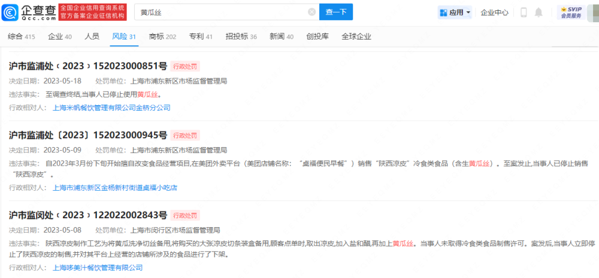
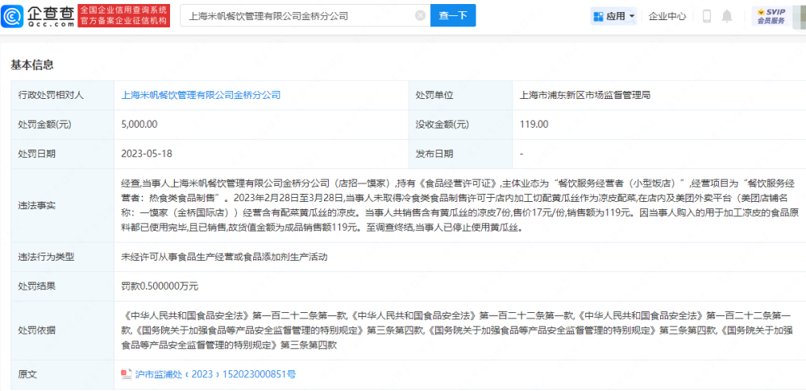
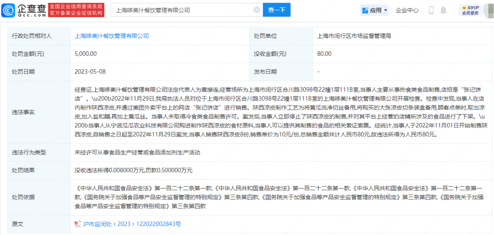
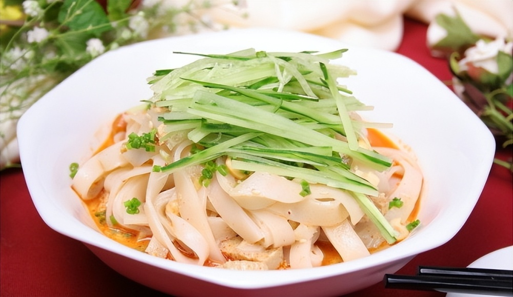

# 因在凉皮内放黄瓜丝，上海多家饭店被罚

企查查APP显示，近日，上海米帆餐饮管理有限公司金桥分公司因未经许可从事食品生产经营或食品添加剂生产活动，被上海市浦东新区市场监督管理局罚款5千元。

具体违法事由为，当事人经营项目为“餐饮服务经营者：热食类食品制售”，在未取得冷食类食品制售许可的情况下，于店内加工切配黄瓜丝作为凉皮配菜，在店内及美团外卖平台经营含有配菜黄瓜丝的凉皮。当事人违反了食品安全法相关规定，被罚款5千并没收119元。

风险信息显示，上海市浦东新区金杨新村街道桌福小吃店、上海哆美汁餐饮管理有限公司等餐饮企业，也因未取得冷食类食品制售许可而销售含有黄瓜丝的凉皮被罚。

**【来源：企查查APP】**

