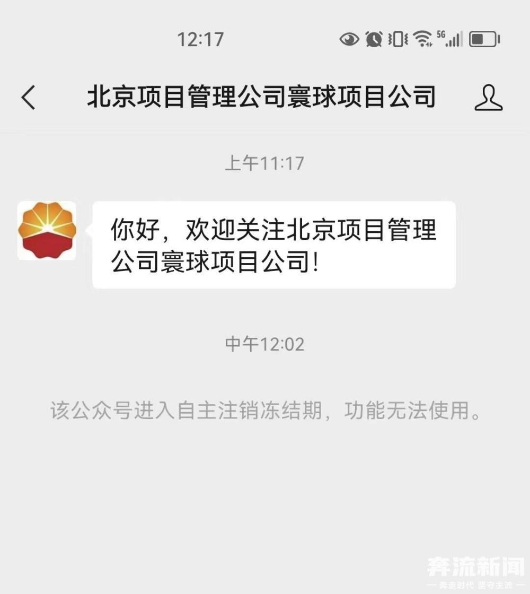

# 国企董事与人亲密逛街被拍，牵手女子并非其妻女，公司账号火速注销

6月7日，寰球工程项目管理（北京）有限公司执行董事、总经理胡某某和一女子牵手逛街的视频在网络上传播。当天，该公司工作人员回应奔流新闻记者“不知情”。

_网传视频截图_

网传视频显示，一中年男子和一年轻女子手牵手正在逛街，举止亲密。知情者透露，视频中的男子是寰球工程项目管理（北京）有限公司执行董事、总经理胡某某，牵手的女子不是胡某某的妻子，也不是其女儿。两人此前在成都逛街，被网友街拍后发到网络平台。

当日上午，寰球工程项目管理（北京）有限公司工作人员告诉记者，对于网传视频一事不知情。

天眼查APP显示，寰球工程项目管理（北京）有限公司成立于1995年，是中国石油集团工程有限公司北京项目管理分公司下属二级单位，法定代表人为胡某某。

中午11时左右，记者检索该公司微信公众号“北京项目管理公司寰球项目分公司”内容发现，涉及胡某某的内容已删除，仅标题可见，但不确定是之前删除还是最近删除。该账号2023年1月19日发布的2023年“新春贺词”依然可见，落款为胡某某。

就在刚刚12时左右，该微信公众号显示已自主注销，停止使用。

文丨奔流新闻记者张鹏翔

