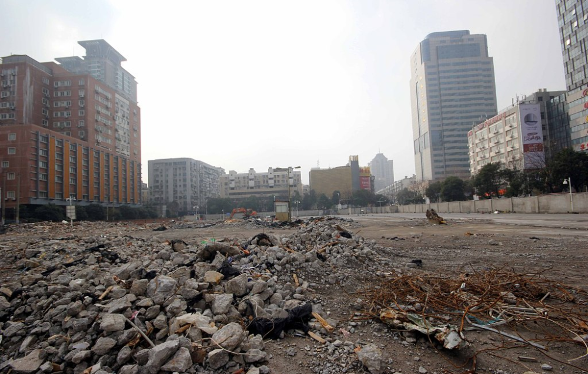

# 在北京45家房企争抢一块地：政策活了，开发商活跃了，楼市又要火？

_来源：视觉中国_

作者 | 郭一非

编辑 | 陈弗也

出品 | 棱镜·腾讯小满工作室

开发商们的悲欢并不相通，一边是暴雷房企排队退市，一边“土豪”房企发愁如何花钱买地。

6月1日，一场竞争激烈的土拍，出现在了北京近郊顺义区，当地一宗地块引来了45家房企的竞拍。最终，一家名为“福建雄旺”的企业以16.56亿元的价格摘走。与起拍价相比，成交价的溢价率达到15%。

45家，也是北京一块土地参拍企业数量的最高记录。3个月前，昌平区朱辛庄地块曾遭到42家房企的争抢。

起拍价低，利润大，是顺义这块土地受欢迎的重要原因。根据公开信息，该土地的房价与地价相差约3万元。更为重要的是，此次土拍取消了一个限制，即拿地后，房企可以让其他参拍对手入股，这激发了开发商入场竞拍的动力。拿地拼“马甲”的时刻又到了。

在45家竞拍房企中，除保利、华润、万科、绿城等头部房企外，还有10多家陌生房企，有的房企成立不足1个月，主业做防水的东方雨虹也来凑热闹。“幸运儿”福建雄旺则仅成立7个月，参保人数为零，此前从未独立开发过楼盘项目。

公开资料显示，福建雄旺曾参股福建国企建发集团旗下的项目。市场猜测，其可能是帮助建发拿地的“马甲”。

中指研究院在一则研报中指出，房企当前的投资逻辑趋同，导致核心城市土拍中签率不断走低，央国企尤甚。为了拿地，房企会广泛参与土拍，甚至动用“马甲”，这推高了摇号难度。部分下游房企也积极参与土拍，拿地后，在与甲方的合作中可以增添谈判筹码。

从债务危机中缓过劲的开发商们，则变得异常谨慎，为了寻求确定性投资，他们纷纷从三四线城市撤离，转战一二线城市的核心板块。

以号称“三四线之王”的碧桂园为例，今年初，他们宣布重启拿地，并将投资转到一二线城市及三四线核心区位。

拿地风口转向，加剧了不同城市的分化，一线及部分二线城市土拍市场回暖，三四线城市则继续遇冷，不见起色。

申港证券的数据统计称，今年前5月，一线城市成交面积同比增长30%，二三线城市仅增长3%、2%，一线城市成交总价同比增长10%，二三线则下滑19%、12%。

**利润足，抢地像“打新”**

在以往，林海（化名）经常会到飞到全国各地出差，他是一家国企开发商的投拓人士，要去各地看土地，甄别项目质量。但现在，这样的差旅少了，公司也提高了拿地标准。

他所在的公司，2020年时，一个项目的净利润达到6%、内部收益率（IRR）达到20%，公司就会批准拿地。眼下，这两项指标分别被提高到10%和30%。

“只有达到这个标准，总部过会了才会有希望批准拿地。”林海向作者感叹，
“从去年下半年开始，大家拿地策略比较接近。现在融资限制多，偿债压力大，与利润率相比，公司对现金流回正时间的要求更高。”

按照如此高标准，林海所在的房企大幅收缩了投资战线——除了北上广深四个一线城市外，还包括杭州、苏州、成都、厦门、合肥、南京、西安这些二线城市，以及东莞、宁波等极少数三线城市。

“像武汉、重庆、天津、郑州这些城市，库存实在太大了，就不在我们的投资战线中了。”林海说道。

民营房企也不例外。在5月份的股东大会上，新城控股董事长王晓松也判断称，公司在现金流健康后会重新拿地，现在上海、苏州、杭州等核心城市的项目各项利润指标都不会错，这种肯定100%股权来做，一旦有好的项目肯定不会放过。

在这一轮“抢地潮”中，争夺激烈的只有核心城市的优质地块。

比如，除北京顺义的土拍外，成都青羊区一宗土地也有35家房企进入摇号抽签环节，3.5万元的楼面价也创下当地新房最高限价；杭州萧山一宗地，摇号房企更是多达60家，厦门五缘湾地块甚至引来88家房企参拍。

足够的利润空间，是吸引开发商蜂拥而至的核心原因。

以土拍持续火热的成都为例，作者统计，在2021年的土拍中，房价与地价的起始价差，基本在每平米7000元-9000元。到了2022年，主力价差则拉升至1.2万-1.6万元。2023年的土拍也延续了去年的势头，最高一宗地的起始房地价差达到1.85万元。

一位熟悉成都土拍的市场人士曾告诉作者，土拍入市前，当地国土部门都会预公告，通过召开土地推介会等形式进行摸排，看看房企有无参拍兴趣，要保证去化率、溢价率等等，一旦流拍掉，还要内部复盘写报告，维持土地市场的热度。

“政府非常懂市场，最近卖的都是优质地块，基本都要摇号”。这位市场人士说。

**局部火热，整体偏冷**

“现在区域为了拿地都很卷。”宋佳（化名）对作者表示，她是一家TOP20房企某区域投拓负责人。

去年，她所在的房企资金有限，他们需要四处跟踪地块，写投资报告，做市场和客户研究，好不容易找到可以满足投资标准的项目，上报集团后，依然会给砍掉几个，到了集团决策会后，又会被砍掉几个。

“报了10宗地块，最终只批准去参拍两宗。”宋佳说。

到了今年，集团的资金充裕了，对项目的利润率要求也降低了，开始鼓励区域公司多去拿地。但是，宋佳也明显感觉到土拍竞争更激烈了，一二线城市的优质地块基本都要摇号，完全拼运气，三线城市地价低、区位好又有客户基础的地块，集团也鼓励去拿。

宋佳表示，三线城市拿地最核心要素是，地价要和周围竞品持平或更便宜。

“一旦将来市场下行，大家都降价，别人可以降2000元，如果你拿地的价格高，你就没得降，就会被玩死。”宋佳坦言，今年以来，尽管她的团队看了不少地，但一宗三线城市的土地也没敢拿。

克而瑞研究中心近期一篇研报指出，未来土地市场仍将延续近期“局部火热、整体偏冷”的格局。对于大部分三四线城市，尤其是长三角和粤港澳之外的低能级城市，短期热度难见起色，底价成交是常态。

上述机构统计称，2023年1-5月，全国300个城市推出了1691宗住宅用地，共成交1201宗，成交规划建面同比下探27%。百强房企的拿地总额仅为4290亿元，同比下降8.4%。

一位山东某地级市本土开发商负责人告诉作者，地方政府举办土地推介会，上半年卖了七八块地，表面看上去挺红火，但这些地块不是工商业用地，就是在补手续的老住宅地块，今年并未新增招拍挂住宅用地，开发商也没什么拿地热情。

“地方政府也着急，没有卖地收入，现在都跑出去搞招商引资了。”这位负责人说。

他补充称，今年二三月份，当地市场还不错，配合着降价，很多项目卖了去年半年的销售业绩，但进入4月份，市场就急转直下，小地方流动人口少，也缺乏外来投资者。

值得注意的是，一旦高能级城市放松拿地门槛，虹吸效应显现，更多的三四五线城市就会逐渐被遗落。

以开发商重仓的浙江为例，杭州拿地宝研究院统计称，今年前5月，杭州卖出去83宗地，成交金额高达786亿元，其次为温州和宁波，分别为201亿元、172亿元。但放眼全省，经营性用地（住宅+商办）出让成交面积和总额，则分别同比下滑21%、24%。

其中，温州洞头区、绍兴诸暨市、金华浦江县、丽水庆元县四个区县，经营性用地至今都是零成交。

**“马甲”何以重出江湖**

在房地产行业，用“马甲”去抢地的玩法并不新颖，2021年上半年，土拍市场竞争激烈，多地政府甚至发文禁止房企在竞拍土地时使用“马甲”。

此后，伴随着土拍市场的骤冷，这种“马甲”抢地的现象逐渐消失。如今，摇号中签率不断走低，优质地块的竞争又异常激烈，“马甲”开始重出江湖。

不过，在以往，“马甲”多是与开发商存在股权关系的子/孙公司。时下的“马甲”则与房企没有股权关系，但又具备房地产开发资质，比如东方雨虹这样做防水保温的下游供应商，一些开发商也甘愿做同行的“马甲”。

今年2月，新城控股以25亿元的总价，摇中杭州临平区一宗土地。据地产自媒体《一勺言》内容，该地块要建商业综合体，新城更符合条件，招商蛇口便找到新城，要求对方做自己的马甲公司，拿下地后即转手，招商蛇口在后续项目的股权中占绝对优势。

《一勺言》的文章还写道，在长三角地区，招商还会找有开发资质的总包单位做马甲公司。拍中了，项目就做股权转让，后续的总包工作也会交给对方，算是一种交换。

目前，对于这类“新型马甲”，各地尚未见到明确的监管动向。

在3月份，42家房企围猎北京朱辛庄地块时，中建系6家子公司都有参拍。不久之后，北京规划和自然资源委员会为土拍规则打了补丁，将“同一企业及其控股的各个公司不得参加同一宗地的竞买”，调整为更严格的“同一集团成员企业不得同时报名竞买同一宗地”。

在6月1日的北京土拍中，北京规自委又直接取消了土地成交后不得将股权转给其他竞买方的限制。这意味着，一旦摇中后，开发商可以引入其他同行合作开发。

即便土拍市场竞争激烈，但开发商依然非常谨慎，几乎到了不能拿错任何一块地的状态。

林海向作者介绍，在以往，如果利润率等指标无法达到集团要求，但操盘团队的成本管控、销售能力很强，出于培养团队的目的，集团可能会对拿地条件适当照顾。但现在，则不会有这样的事情了，集团可能会建议区域做“代建项目”来养活自己。

“即便裁撤团队，也不会冒险去拿房价没有支撑的地块。”林海说。

从去年开始，华润、碧桂园、龙湖、华夏幸福等一大批开发商，相继挤进了代建赛道。但眼下，能赚钱的土地基本都要靠招拍挂公开市场抢，而代建方多靠和地方城投合作，而后者手中囤积的项目大多地价高企，并不好赚钱。

一位TOP30民营房企福建区域高管对作者表示，大家都是职业经理人，对项目价值研判区分度不大，加上当地土地供给有限，抢地很激烈，即便城投兜底拿地，自己团队也能开发，很少听说城投把地交给谁代建，江浙那边有很多城投兜底后找代建方开发的模式。

同样谨慎的，还有房地产行业的投资机构。

根据西政资本近期的一篇研报，目前，大部分投资机构只盯着优质融资主体或优质地块项目，市面上能做地产投资业务的信托机构只有五六家，私募机构更是屈指可数，央企金控平台今年初激进了一阵子后，又开始观望了，剩下的民营金控也开始战战兢兢。

