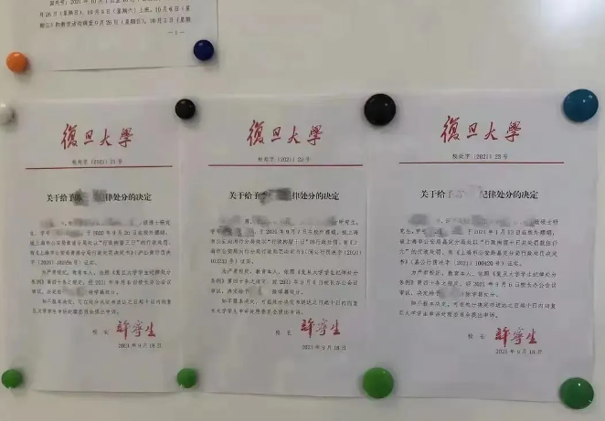

# 复旦大学一研究生嫖娼被开除起诉学校“处罚过重”，二审判了

6月7日，东方网·纵相视频记者从复旦大学研究生嫖娼被开除起诉学校一案的原告代理律师处获悉， **该案二审结果为驳回上诉，维持原判。**

5月25日，上海市第三中级人民法院对此案进行二审。

原告代理律师当时告诉东方网·纵相视频：‍根据《治安管理处罚法》第66条，原告受到的行政处罚属于情节较轻。而根据教育部的《普通高等学校学生管理规定》第52条，“受到治安管理处罚，情节严重、性质恶劣的”才可以被开除学籍。

2021年9月‍，复旦大学3名研究生（1名博士生2名硕士生）因嫖娼被学校公开开除，引发社会关注‍。

**实名公示**

**3名博士硕士生因嫖娼被公示除名**

**网传的纪律处分决定书显示：**

复旦大学 **2019级博士研究生** 陈某，在2020年9月26日于校外嫖娼，被上海市公安局黄浦分局“行政拘留三日”；

**2019级硕士研究生** 李某，在2020年9月7日于校外嫖娼，被上海市公安局闵行分局“行政拘留十日”；

**2020级硕士研究生** 葛某，在2021年1月13日于校外嫖娼，被上海市公安局嘉定分局“行政拘留十日罚款伍仟元”。

而校方依照《复旦大学学生纪律处分条例》第四十条规定，经2021年9月6日校长办公会议审议， **决定给予上述三名学生开除学籍处分** 。

值得注意的是，上述三份纪律处分决定书是 **以实名的形式公开张贴** 在学校的公示栏里，此事一度在网上引发热议。

被学校开除后，本案原告以“处分决定程序严重违法，认定事实、法律适用均错误，目的不合法”为由，
**于2021年10月起诉学校，请求撤销学校作出的处分决定，同时要求对学校学籍管理相关内容进行合法性审查。**

2022年11月，上海市静安区法院认为《普通高等学校学生管理规定》中所指的情节严重、性质恶劣是对学生违纪行为性质的判断和评价，而《治安管理处罚法》中所涉及的情节严重，
**系公安机关适用《治安管理处罚法》履行治安管理职责时进行裁量的基准，两者并无关联性且本质不同，学校《处分条例》不存在纲目冲突、违反《普通高等学校学生管理规定》的情形，判决驳回原告的诉讼请求。**

来源：东方网综合‍‍

视频：陈丽娜、丁一涵

编辑：夏小夏、小能手

审稿：卞英豪

