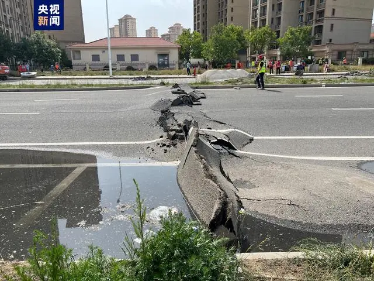
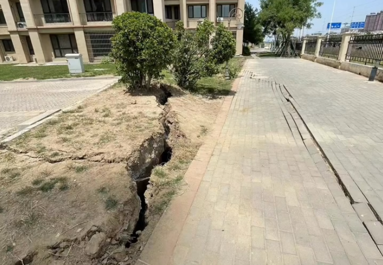

# 天津地面沉降小区业主：这个房子还能不能住？我们何时能回家？

潮新闻客户端 记者 季建荣 王嘉楠

5月31日18时20分，天津市津南区八里台镇八里台东路部分路面隆起开裂，附近某楼盘凤锦庭院局部草坪路面开裂、部分地下停车场出现墙体裂痕、渗水。

意外突如其来，紧接着一场连夜转移安置居民工作也迅速展开。

据津云新闻6月6日报道，面临地面沉降现象，当地短时间内转移安置4031名市民，并成立群众工作组和生活保障组，逐楼、逐酒店成立服务工作组，全力以赴帮助群众排忧解难。

_八里台东路路面隆起开裂 来源：央视新闻_

**突发：道路隆起 地面开裂**

5月31日18时许，刚吃完晚饭的凤锦庭院业主陈晓（化名）透过窗户远眺发现，小区东南角位置有一辆流动舞台车在搭台演出，“我就想着带妻子和孩子一起过去看看。但没有想到的是，还不到半个小时，那辆舞台车就匆匆忙忙离开了。”

一个小时之后，陈晓下楼散步的时听邻居讲起，才知道出事了。

陈晓介绍，自己从小区东门走出，来到八里台东路边，发现现场已经来了好几个警察，“问过才知道，因为八里台东路部分路段莫名隆起开裂，导致有车辆经过时发生事故，把发动机都磕漏油了，边上的邻居还说，刚刚隔壁工地打井的架子也倒塌了。”

“‘嘭’的一声很响，就跟有什么东西爆炸了一样。”同住在凤锦庭院的杨莹（化名）表示，自己当时刚好在小区里散步，隔壁工地施工塔架倒塌的声音听得真切。

随着时间的推移，越来越多的业主知道八里台东路上发生的事情，并逐渐开始向这边聚集。一些细心的业主们开始注意到，与八里台东路一起变形的，还有自己小区所属的院墙（围墙），“几乎也成了波浪型，错位开裂的。”

到了晚上10点左右，凤锦庭院内部的草坪、路面、楼房墙角等位置也相继开始出现裂口，“大概到（晚上）11点的时候，一些裂口可以踩进一只脚。”

“房子还能不能住？”有居民问道，然而现场并没有人可以给出答案。之后就是一拨接着一拨的工作人员赶到现场。

“燃气、电力、供水、消防、应急等部门都来了，马上就拉起了警戒线，而且（时间）越往后警戒线的范围越大。”杨莹称，部分被劝离的居民返回后，到自己家的地下室看了看，发现地下室已经出现了明显的裂纹，而且还出现了渗水。

_小区地面明显沉降
受访者供图_

**搬离：一家三口暂居酒店**

回到家的陈晓跟妻子商量后决定，为了稳妥起见，晚上还是先带着孩子去附近的酒店住一晚再说，“小区里也有做土木工程建筑方面工作的业主让大家尽量别住了，但有些邻居还想再看看。”

深夜，陈晓带着家人来到距离小区不远的一个商务酒店，花了不到两百块钱要了一个10几平米的一个标间，“条件比较简陋但至少住着安心，想着等天亮之后再说。”

事后证明，陈晓的决定是正确的。

当晚，到场的有关部门和专家经过勘验后认为，出现裂缝的相关楼栋已经不适合居住，业主们需要连夜转移安置。相关部门的效率非常高，连夜组织工作人员开始挨家挨户敲门，劝导业主转移到酒店。

“非常震惊，太突然了，出来时就拿了换洗衣服，大家也是一脸疲倦。”当晚，杨莹一家也跟着大部队转移到了酒店，等安顿下来，天也快亮了。

提前入住酒店的陈晓当晚也并没有休息好，业主群不断刷新的消息和酒店内逐渐响起的嘈杂声让陈晓难以入眠，“（6月1日）凌晨1点左右，酒店的大堂开始吵闹起来，到了3、4点钟，外面还在排队（办入住）。政府部门也在酒店安排的工作组，为大家提供服务。”

陈晓和杨莹都表示，自入住酒店以来，房费、一日三餐都不需要业主们操心，“每天会按时按点把饭送到酒店，如果有外出上班、上学等不在酒店用餐的，提前在群里说一声就行。”

6月2日，津云新闻刊发报道称，情况发生后，天津市区两级迅速行动，成立工作专班，组织20余个部门在一线工作。为最大限度保障人民群众生命财产安全，有序转移涉事楼栋及周边居民。

同时，由天津大学、中国铁设、中石油、天勘院等单位知名专家组成专家组，现场划定安全管控区域，布设44个倾斜监测点、38个垂直变形监测点，每两小时报告一次具体情况，细化应急抢险施工方案，采取有效措施避免地面进一步沉降。

_小区地面开裂沉降
受访者供图_

**等待：我们什么时候能回家**

几天下来，一家三口只能挤在一个十几平方米的酒店里也让陈晓颇为无奈，“孩子每天写作业也没有一个合适的地方，酒店就在路口位置，晚上来往车辆也多，噪音非常大，搞得很焦虑，也很苦恼。”

但陈晓知道，短时间内肯定回不去了，“6月3日，业主群先后发布通知，让业主们回家取一些日常生活必须品和贵重物品。”

“家里的推拉门关上就自动滑开；我们也用玻璃球在地上试过，在没有阻挡的情况下，就自动往东方向滚动。”同样收到群里通知回到家的杨莹，明显感觉到房子不一样了。

“只能先收拾一些衣服和生活用品带走，其他大件东西根本搬不了。”但即便如此，杨莹和家人前前后后也至少爬了5、6趟楼梯，“一边收拾，一边忍不住流泪，一点一点都是自己亲手置办起来的。”

“我家住在20层，电梯已经停电了，搬大件也不现实。”6月3日晚，下班后的陈晓准备回家收拾收拾，“可以明显感觉到地面的裂缝比一开始出现的时候大了，有些地方沉降已经差不多到膝盖的位置，小区周边也用围挡围了起来，里面除了工作人员外，没有其他人，现场的领导跟我们说，沉降的势头已经遏制住了。”

当地媒体的报道也证实了现场领导的说法。

据天津日报6月4日消息，天津市主要领导再次到津南区八里台镇局部地面沉降现场察看处置进展并在指挥部召开会议，进一步研究部署应对处置工作。自然资源部、应急管理部等国家有关部门安排专家专程赶赴现场指导处置。

报道称，地面沉降趋势减缓，前期应急措施初显成效，后续工作正紧张有序进行。

“我们现在最想知道的这个房子还能不能住？如果能，接下来需要修多久？修完之后，后续还会不会沉降？会不会有补偿？”陈晓说，针对这些问题，截至目前官方还没有一个明确的答复。

