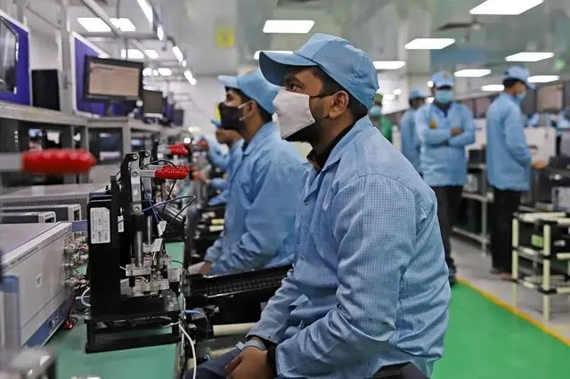
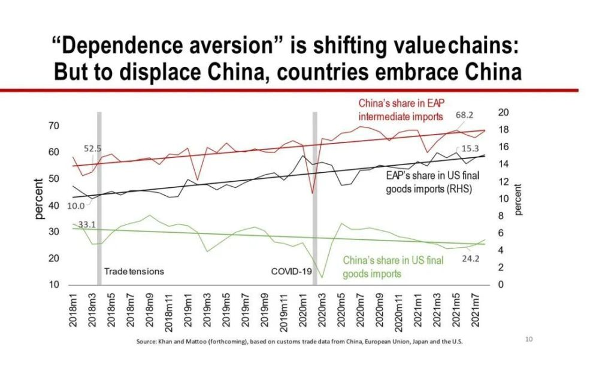
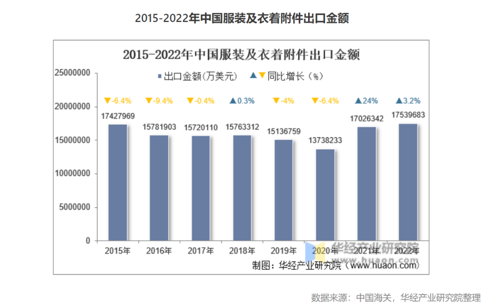
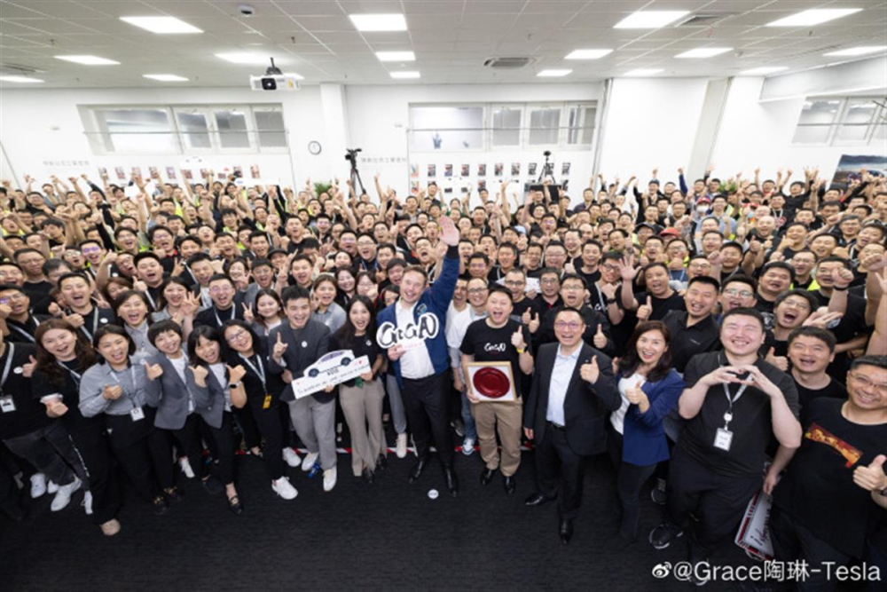

# 果链外迁背后，是美国主导的“脱钩”，也藏着印度的世界工厂梦

_《果链风云》是腾讯科技推出的苹果产业链研究策划，本期聚焦果链外迁印度、越南背后的政治诱导因素。_

**文/ 刘典 复旦中国研究院特邀副研究员、观传媒公共事业部总监**

当地时间5月27日，以美国为首的“印太经济框架”（IPEF）部长级会议在底特律举行，共有14个印太地区国家的代表参会，并在供应链领域达成一项协议。

美国主导的“印太经济框架”于2022年5月正式成立，初始成员国包括美国、韩国、日本、澳大利亚、印度、越南等。美国方面称，“框架”将成为美加强同“印太”国家经济联系的重要平台，为地区提供中国以外的替代选项。

长期以来在美国的主导下，众多企业将产业目光从中国转向印度、东南亚等第三方国家。

_印度工厂里的工人
（图源：华尔街日报）_

再结合先前外媒报道，拜登政府拟在近期，对美国企业严格限制在中国部分高科技产业投资签署一项行政令的消息，引发了对中美关系变化和产业迁移的讨论。

**产业迁移是一个重要的现象，它受到中美关系变化的牵引。** 在产业迁移的过程中，企业面临着许多挑战，包括当地经济、文化和政治方面的问题。

01 制造业转移，一场有预谋的“全面脱钩”

近年来，中美关系的演变引发了产业迁移的浪潮。

美国政府限制中国的发展，包括增加对华关税、限制对华高新技术投资等，导致一些美国企业将其产业链从中国转移到其他地区，尤其是印度和东南亚地区。

从特朗普到拜登，美国政府对中国的限制政策发生了巨大变化。尽管出发点存在差异，但限制中国发展成为共识，这种共识在美国民众的选票中得到了体现，迫使每届政府都会采取类似的政策。

2018年特朗普政府发起的“贸易战”
中，虽然涉及了部分高技术产品，但惩罚性关税的主要目的是贸易平衡，此后的对华技术出口管制，也是由针对少数企业的恶意打压，逐渐转向规模性、领域性的大范围管制。

随着美国国内的政治极化问题愈发严重，美国对华科技遏制无论在意图上还是措施上，都变得更加清晰和果断，科技领域的中美“科技脱钩”正是这种共识的外在表现。

2022 年8 月9 日，拜登签署《2022 芯片与科学法案》，在授权联邦政府向芯片产业提供527 亿美元补贴的同时，要求受补贴企业“ 选边站”
，十年内不得参与在中国的实质性扩大半导体产能的重大交易。

此外，美国及其七国集团的盟友也希望以不损害全球贸易和投资的方式减少与中国的经济联系，进一步加剧了对华脱钩的趋势。

_彭博社报道截图_

**脱钩浪潮下的产业迁移，不仅仅是商业上的决策，核心是美国主观上认为对中国的依赖所引发的国家安全、经济风险、意识形态价值观以及美国政治氛围等** 因素所致：

**● 国家安全：**
美国担心过度依赖中国的关键技术和供应链会使得中国能够在必要时对美国进行经济上的压制，从而危及到美国的国家安全。例如，美国认为过度依赖中国的5G网络设备制造商华为可能存在网络安全问题，可能被中国政府用来进行间谍活动。同样，美国也担心中国会窃取美国相应的关进技术、信息安全等相关内容。

**● 经济风险：**
美国担心中国的经济实力和影响力已经足够大，如果继续依赖中国的制造和供应链，将会导致美国企业和经济在某种程度上受制于中国。例如，美国担心过度依赖中国的制造业会使得失去了核心产业链的掌控权，面临着日渐增长的经济风险。

**● 意识形态价值观：**
美国认为中国的人权记录和民主价值观与美国的价值观背道而驰，因此不愿意与其过度合作和依赖。例如，美国担心过度依赖中国市场会使得美国企业成为中国政治话语的工具，违背了美国支持民主和人权的原则。

**● 美国国内政治氛围：** 过去几年中，美国民众普遍认为中国是一个竞争对手而非合作伙伴。此外，美国政治精英和媒体的愈发批评中国的态度也反映了这种趋势。

02 产业转移进行时

在中美脱钩的进程中，一些西方企业将生产从中国转移到印度和东南亚等地，以逃避美国对中国的关税和限制。
**企业希望减少对中国依赖的原因包括：对政策因素带来供应链韧性不确定性的担忧、整体地缘政治紧张局势和关税影响、以及中国持续提升的劳动成本等。**

部分企业已经开始迁出中国，但他们选择了临近中国的“亚洲替代供应链”（Altasia）地区。

编注：“亚洲替代供应链”（Altasia）是由英国知名财经媒体《经济学人》周刊创造的新概念，有学者指出该概念的提出是用以配合以美国为主导的“新冷战”论调。

在消费电子产品行业，随着产业链体系在东南亚的逐渐成熟，实现供应链的多元化，苹果和三星等公司已经开始将生产从中国迁往越南和印度。

美国计算机巨头戴尔已经制定了新的目标，计划在2024年停止使用来自中国的芯片，并减少产品中中国零部件的比重。

苹果公司将目光转向印度，在那里生产iPhone、AirPods、Apple
Pencil以及其他组件。来自中国台湾的供应商富士康、和硕和纬创都在印度建厂。去年9月，美国苹果公司（Apple）就宣布计划在印度生产5％到10％的新款智慧型手机iPhone
14。富士康也将与印度矿业集团韦丹塔（Vedanta Resources）合作，斥资200亿美元（约270亿新元）在印度建造半导体工厂。

彭博社的一篇报道就说，苹果连一颗螺丝钉都要印度造。在消费电子行业中，因为产业链体系的重要性，将生产完全迁离亚洲尚不具备可行性。

随着“亚洲替代供应链”受到更多的关注，这些国家或地区也在大力投资基础设施建设，出台激励措施，推动对这一生态系统的部分复制，提高本国或本地区的吸引力。

新加坡国立大学南亚研究中心高级研究员帕里特（Amitendu
Palit）接受《联合早报》访问时，提到了印度的几个主要优势，“印度位于东亚和西亚之间的战略经济位置，不论是海路或陆路，它都与中亚、西亚、东南亚和东亚有着良好的连接，这使它成为可服务亚洲所有地区的有利地点。其次，对许多行业来说，印度拥有年轻且流动性强的劳动力队伍，他们可轻易在全国各地流动，拥有高技能，学习速度也很快。此外，印度拥有强大而成熟的资本市场，拥有大量先进的金融产品，能够迅速调动包括海外市场的资金。”

但 **印度要成为下一个世界工厂，仍然面临三大障碍：投资风险太高、政策内向性过强，以及宏观经济失衡太大。**
企业对印度政府依然缺乏信心，担心他们投资时的政策过后会出现变化，以致最终无利可图。企业也无法确定印度官方能否公正执行相关贸易规则，不会倾向于政府偏袒的国内大型企业。

03 中间商赚差价

美国对华脱钩“理由”看起来非常充分，通过产业转移、限制高新技术投资等方式在操作上也是可行的，但问题是想让这政策是有效的，该政策的支持者就需要不断证明中国对美国经济的依赖程度远远超过了美国对中国经济的依赖程度。

事实恰恰相反，美国并未改变大量依赖中国制造业的局面。

**中美两国经济紧密相连，互为重要的贸易伙伴和投资对象，彻底割断这些依赖关系非常困难，彻底脱钩会对双方自身经济带来负面影响。**
在一些领域，双方仍保持着合作和互相依赖的关系。

根据统计，2022年1-12月，中美贸易额为7594.27亿美元，同比增长0.6%。其中，中国对美国出口5817.83亿美元，增长1.2%；中国自美国进口1776.44亿美元，减少1.1%。

美国挑起的引发产业转移的“脱钩”，绝大部分成本由美国企业和消费者承担。

根据美国前财政部长保尔森日前在美国《外交事务》杂志上撰文指出，美国政府推行对华全面对抗政策伤害了中国，也伤害了美国，将本国企业置于竞争劣势地位，限制了美国企业商业化创新的能力。

美国商会发布的报告显示，如果对所有中国输美商品加征关税，将令美国经济在2025年前每年损失1900亿美元。

除了贸易逆差，“脱钩”本身也被一些专家证明是一个伪命题。

近期世界银行经济学家 Aaditya Mattoo的研究表明，中美脱钩的表面效果近乎是一种“脱钩幻觉”，该买的该卖的并不少，基本都从“中间商”这里过去了。

从下图可以看出，红线显示东亚太平洋国家随着时间的推移从中国进口增加，黑线显示东亚太平洋国家向美国出口逐渐增加，绿线显示中国对美国的出口减少。

可以得出这样的结论，东亚国家最近向美国出口更多产品的同时，也从中国进口更多产品，以为脱钩了，其实换了一条通道。中国的商品本来直接向美国出口，变成借道东南亚向美国出口，因此藏在明面上“产业转移”背后的，是大量产业仍在中国，但多了一堆“中间商”，成本增加后，为成本买单的仍是美国自身。

04 东南亚接盘的硬实力

**在产业转移过程中，面临最大的两个问题，一是转移出中国产生的额外成本，二是“第三国”的接受能力。**

北美和欧洲、日本这些发达国家人力成本太高，非洲又很难开展有一定技术含量的产业，中东地缘局势又非常复杂，南美除了美国外距离世界其他地区又太远，因此印度和东南亚成为了相对优质的目的地，但这一目的地本身也存在很多问题。

**首先是地区稳定性。**
近几年，东南亚向欧美等地区出口成衣享受免税政策，利润较国内提高了8%-10%，因此出口欧美的服装大多在东南亚生产，相对的中国服装及衣着附件出口金额也逐年递减，而在东南亚疫情严重的2021年，受制于失控的疫情，东南亚的服装产业链显然已不堪重负，这部分订单也顺势流到了中国。

从下图华经产业研究院根据中国海关数据制作的图表可以明显看出，2021年开始，服装及中国衣着附件出口金额开始回升。

但随着全球疫情逐步稳定，有学者预计未来这一部分订单有可能会再次部分外流，但从目前来看，形式依旧不明显。

**其次是人口技能素质。**
4月19日，印度多家媒体纷纷报道，根据联合国人口基金的最新数据，2023年印度人口将达到14.286亿，“超过中国”而“成为世界上人口最多的国家”，部分专家甚至得出中国的人口红利正在消失的结论，但问题在于，人口红利不光要看人口数量，更要看人口质量。

2021年中国单位就业者劳动生产率为16512美元（以2010年不变价美元计价），印度单位就业者劳动生产率为6688美元，我国劳动生产率是印度的2.5倍。而印度教育普及程度有待提高，人口平均受教育年限较中国低1.4年。

**然后是营商环境。**
很多产业迁入国对国外优质产业的进入持欢迎态度，但却严控企业的资金流出。以小米为例，2014年进军印度，20次年选择印度本土化生产制造，截止目前，智能手机生产线在印度就有7条，在职雇佣印度员工2万多人，但在2022年印度起诉小米违反《外汇管理法》，非法向三家国外公司汇款，扣押小米555亿卢比，约46亿元。

同样的事情也发生在谷歌身上，2022年印度政府以谷歌涉嫌垄断被印度监管机开除1.13亿美元的罚款，而这个罚款还是归印度中央政府，同时谷歌还遭遇了印度其他邦联地区的罚款。

可以说是外国公司可以在印度开展业务，花钱养印度雇员，但赚的钱不能带走。

05 制造商大呼“被坑”

中国庞大的市场和高效的供应链系统依然具有吸引力，近期一些企业开始重新考虑将产业迁回中国的可能性。

据《华尔街日报》、彭博社等外媒近日报道，由于与中国制造“脱钩”难度巨大，美国政府面向多国的普惠制也已到期，加之诸如不稳定的社会环境等多种因素，让不少企业已将目光重新投向中国，将订单迁回中国生产。

普惠制是发达国家给予发展中国家出口制成品和半制成品普遍的、非歧视的、非互惠的一种关税优惠制度。

以印度为例，据印度报业托拉斯在2019年特朗普宣布将结束对印度的优惠贸易待遇的报道中称，印度每年向美国出口金额接近800亿美元的商品中，50多亿美元的商品适用于美国普惠制，每年减免关税达1.9亿美元。

自1975年生效以来，通常美国的普惠制都会在到期后迅速获得延长。但近年来，受美国两党博弈的影响，普惠制的延期变得复杂化。

对于美国企业而言，
**普惠制的到期意味着一项艰难选择：要么提高商品售价，要么降低自身利润或寻找成本更低的生产地。对于这个问题，很多企业的解决方案是：重返中国。**

报道中提到，为应对美国政府对中国输美商品加征关税，在美国弗吉尼亚州经营收纳袋生意的法扎克利（fazackerley）夫妇在2019年选择将业务从中国迁至柬埔寨。但现在，他们已选择将订单迁回中国生产。夫妇俩说，由于美国政府没有续签一项针对发展中国家的贸易协议，他们从柬埔寨进口的商品面临关税，公司利润大幅缩水。“我们做的是小本买卖，尽量不怨天尤人。”这对夫妻说，他们将业务迁出中国，是做了历届美国政府和国会希望企业做的事，但他们感到“被坑了”。

美国altus公司总裁加里·莱曼斯基（gary
lemanski）曾在菲律宾做了近三年的皮质枪托包，但他在2022年初已决定将生产迁回中国宁波。他说，菲律宾的成品可能更好，但运输和其他成本比中国高。而且，普惠制到期失效后，这些产品需要被征收17%的关税，令公司无利可图。

**营商环境恶劣等因素也让多数企业选择离开。5月初，据印度媒体《印度商业在线》（The Hindu Business
Line）引述消息人士透露，在印度深耕15年的ODM大厂纬创资通（Wistron）将撤出印度。**
纬创对此作出解释，认为印度当前的环境不适合正常经营。据《印度商业在线》报道，由于存在工人闹事、工资支付制度、医疗事故等问题，导致纬创在印度频频遭遇争议，纬创无力长期维持在印度的经营及市场维护或是导致其撤资的重要原因。

_2020年12月遭打砸后的印度纬创工厂（图源：现场视频截图）_

时隔三年，疫情结束、中国社会再度开放后，世界各国又将投资的目光放到了中国。

来华访问的法国总统马克龙给中国带来了第二条飞机生产线，并明确表示反对同中国“脱钩”。诸如新任巴西总统卢拉等一系列近期访问中国的外国领导人也都表达了同样的观点。而在一众各国领导人访华的背后，是各国的企业家们对中国的访问。

先是3月24日下午，苹果公司CEO蒂姆·库克突然现身位于北京三里屯的苹果零售店内，再然后就是最近，5月30日，特斯拉CEO马斯克抵达北京，开启时隔三年的首次访华之旅。

从实际的情况来看，马斯克访华的接待是相当有规格的，当天，中国国务委员兼外长秦刚在北京会见了马斯克，5月31日，中国工业和信息化部部长金壮龙、商务部部长王文涛、中国贸促会会长任鸿斌分别会见马斯克。

_马斯克在特斯拉上海超级工厂（图源：陶琳微博）_

在会见秦刚外长时，马斯克表示，中国人民勤奋、智慧，中国发展成就理所当然。美中利益交融，如同连体婴儿彼此密不可分。特斯拉公司反对“脱钩断链”，愿继续拓展在华业务，共享中国发展机遇。美国彭博社称，这番话让人想起梅赛德斯-
奔驰集团股份公司董事会主席康林松上月说的话：从中国剥离是“一种幻想”。

苹果CEO库克在3月也强调了iPhone制造商与中国关系的共生性质。

此外，就在马斯克访华的同时，星巴克新任CEO纳思翰、摩根大通董事长兼首席执行官杰米·戴蒙等金融集团和大企业的CEO也都纷纷云集中国。

过去相当长一段时间，产业迁移的变化和趋势对中国和美国都带来了一些挑战，部分企业虽然在推动产业外迁，但对于中国大陆市场、供应链仍然存在强需求。对于中国来说，需要进一步改善营商环境，加强知识产权保护，提高创新能力，以吸引更多的企业回流并保持竞争力。对于美国来说，需要审慎考虑其对中国的限制政策，避免过度脱钩对自身经济和全球经济造成的负面影响。

扩展阅读：换汤不换药的“去风险化”

近期，随着美国政府的“脱钩”战略逐渐失去市场认可，于是重新推出“去风险化”概念。然而，这种转变只是换汤不换药。美国宣称其对中国的行动并非脱钩，而是在涉及国家安全的领域进行风险管理，但具体领域和风险减少方式完全由美国自行决定。高附加值和高技术含量领域无一例外地与美国国家安全相关，都被视为潜在风险。

这种文字游戏难以欺骗中国和世界。事实上，许多西方企业选择与中国合作的最主要原因是，在全球范围内，与中国合作的风险最低。中国政府治理能力强，政策连续性高，营商环境优越，中国工人素质高且勤劳。中国成为制造业大国与美国企业互利共生，并非因为中“偷袭”美国，而是相对于其他国家，中国在规模、环境和效率方面具有明显优势。

忽视西方企业的投票结果和以自我为中心的态度，使美国政府成为这些企业面临的最大风险来源。中国的优势不会因为美国的几句话而改变，相反，由于美国对中国的围追堵截，中国对外资的包容度和开放度不断提升。如果西方企业听从美国对中国的“去风险化”建议，最直接的后果将是失去物美价廉的生产工厂和广阔的消费市场。

