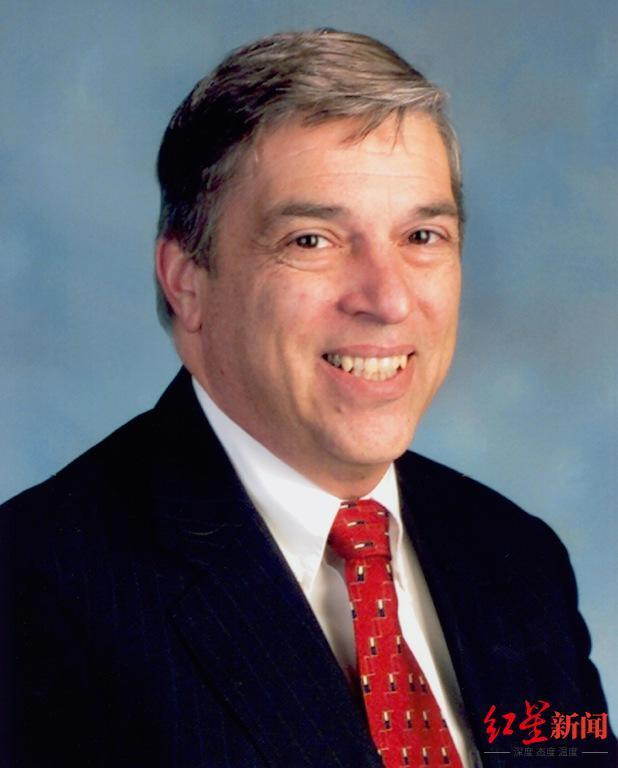
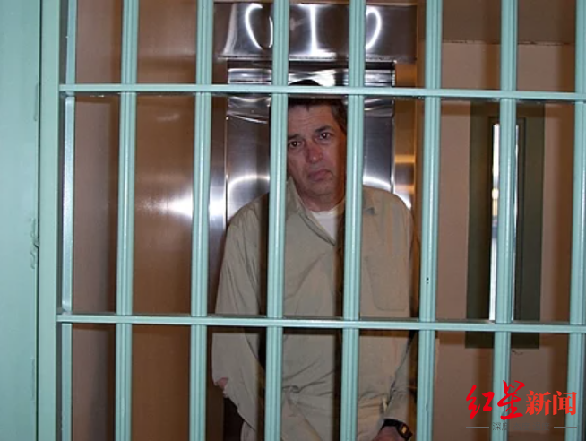

# 美国FBI史上“最强内鬼”狱中死亡！卧底数十年，300人合力才将其抓获

_↑汉森_

当地时间本周一（6月5日）早上，现年79岁的美国联邦调查局（FBI）前特工罗伯特·汉森在科罗拉多州一处戒备森严的监狱中被发现死亡，此时距离其被判处终身监禁已经过去了21年。

汉森的死亡，标志着一段“间谍史上的传奇”终结。他曾在美国联邦调查局（FBI）和中情局（CIA）卧底数十年，向前苏联和俄罗斯出售过包括美国核武器部署方案在内的大量顶级机密文件，还帮助前苏联抓获美国安插的大量间谍。

直到他快退休时，美国官方才察觉到他有可能是一名间谍，安排了300多人的团队日夜监视才将他抓获。FBI称他为该局历史上“最大的内鬼”，CIA也称他为“历史上前所未见的情报泄露源”。

_↑汉森被关在牢中_

**“传奇间谍”狱中去世**

**平时行事风格低调**

美国监狱局本周一（6月5日）称，79岁高龄的汉森在当天被发现死在科罗拉多州佛罗伦萨ADMAX监狱的牢房内。汉森因被判间谍罪，在这里被终身监禁，而这座美国最高安全等级的监狱因每天将囚犯单独关押23小时以上的严苛管理而臭名昭著。

美国监狱局发言人克里斯蒂·比希尔斯在一份声明中说，在发现汉森不省人事后，监狱工作人员试图让他苏醒，并呼叫了紧急医疗服务。比希尔斯称：“监狱外部的紧急医疗人员赶来现场查看后，立即宣布汉森已经死亡。”目前汉森的死因尚未确定。

汉森1944年出生于芝加哥，1976年加入FBI。从1979年开始，他持续向前苏联及后来的俄罗斯出售美国机密信息，直至2001年被捕。他的间谍活动被美国司法部描述为“可能是美国历史上最严重的情报灾难”。美国前武官斯科特·里特表示，汉森等人造成的泄密程度之深，“导致上世纪80年代中期美国中情局在苏联的情报网络几乎彻底瘫痪”。

在工作中，汉森只用假名“拉蒙·加西亚”与对方联系，并且坚持不线下碰面。直到他被捕时，俄罗斯方面都不知道他的真名和面容。

在工作之外，汉森与妻子邦妮和6个孩子在郊区过着平静的生活。在他被捕后，邻居完全不相信这个面容和善、个性平庸乏味的男人竟然是美国历史上破坏力最大的间谍。

汉森的妻子邦妮后来告诉记者，她其实早在1979年就从家中角落里零散出现的现金钞票，猜到汉森可能在从事间谍活动。但在对质中汉森成功说服了她，表示“他是通过向苏联人提供虚假信息来‘欺骗’他们”。

_↑汉森收过的美元现金_

**卧底数十年**

**造成美国巨大损失**

据FBI统计，汉森在间谍活动中收到了超过140万美元的现金，还有一些钻石和存入俄罗斯银行账户的款项。凭借聪明的头脑，汉森在FBI任职期间就职于重要的反间谍部门，因此他可以轻易接触到机密信息，并将重要材料发送到前苏联和俄罗斯的情报部门。

据称，汉森总计向克格勃出售了数千份机密文件。根据FBI网站介绍，他泄露了“大量的人力资源、反间谍技术、调查报告等美国政府机密文件，以及具有非凡重要性和价值的技术操作手册”。

其中，汉森泄露的最重要的一份文件，详细介绍了美国在发生核战争时的战略部署、核武器技术的发展以及美国反间谍情报网络的状况。此外，汉森还透露了FBI在前苏联大使馆下建造窃听隧道的消息。当时美国方面试图通过雷达、卫星和信号拦截等电子手段侦查前苏联情报。1977年当前苏联开始建造新的驻美大使馆时，FBI在他们的解码室下面挖了一条隧道，计划用它进行窃听，但由于害怕被抓到而一直没有付诸行动。汉森在1989年9月向前苏联披露了这一信息，并在次月收到了5.5万美元的付款。汉森还曾两次提供潜伏在前苏联内部的美国双重间谍的完整名单，对美国情报工作造成了极大的破坏。

1994年潜伏在CIA的俄罗斯间谍奥尔德里奇·埃姆斯被捕，但情报泄露事件仍在发生，这让美国当局意识到内奸并没有被除尽。FBI向一名克格勃特工支付了700万美元巨款，获取一份关于一名匿名内奸的档案，FBI后来通过指纹和语音分析将内奸确认为汉森。

**被抓时蔑视FBI特工：**

**“怎么等了这么多年才找到我”**

汉森身份暴露时已经即将退休，因此调查人员必须迅速行动。FBI组建了专门团队紧密监视，希望在汉森实施间谍行动时抓到现行。

汉森当时正驻扎海外，正在国务院外国使团办公室担任派遣人员。为了方便监视，FBI领导层决定以高薪和升职为诱饵，将汉森调回FBI总部，给他安排了一间秘密配备监控摄像头和麦克风的办公室。特工唐·沙利文是当时FBI华盛顿办事处主任，他自愿接替汉森原来的职位，并以工作交接为理由近距离观察汉森的办公室布置和会客情况。

汉森有权限访问FBI的自动案件辅助系统 (ACS)
和国务院的计算机信息系统。沙利文指出，汉森花了很多时间从ACS下载获取信息。沙利文回忆说：“他有大把的机会窃取情报。他喜欢坐在办公室里关上门，在ACS系统中泡上一整天。他本身的职位并不是一项要求很高的工作，只是一个文员而已。”

到2001年2月，大约有300人在调查和监控汉森。汉森每天从离开弗吉尼亚州费尔法克斯县的家到他晚上回到家，一直被人无死角跟踪，种种迹象表明他仍然是一名活跃的间谍。

2001年时，调查人员获悉，汉森将在当年2月18日用间谍界惯用的“死角掉包”手法（将情报留在公共场所制定位置等接头人来取）传递情报，此前一天他已经向俄罗斯接头人发出了行动暗号。

_↑汉森打算传递情报的地点_

2001年2月18日当天，一个FBI逮捕小组跟随汉森进入狐石公园的位置，汉森把车停在一条居民区街道上，沿着一条林荫小道走到一座人行天桥，把机密材料用塑料袋包裹着留在桥上。当汉森走回他的车时，逮捕队员冲上前将他控制。当时汉森还对逮捕他的FBI特工挤眉弄眼地表示，“你们怎么等了这么多年才找到我？”

为了避免死刑，汉森全程配合调查，于2001年7月6日承认了15项间谍罪。2002年5月10日，他被判处终身监禁，不得假释。

红星新闻记者 郑直

责编 任志江 编辑 潘莉

