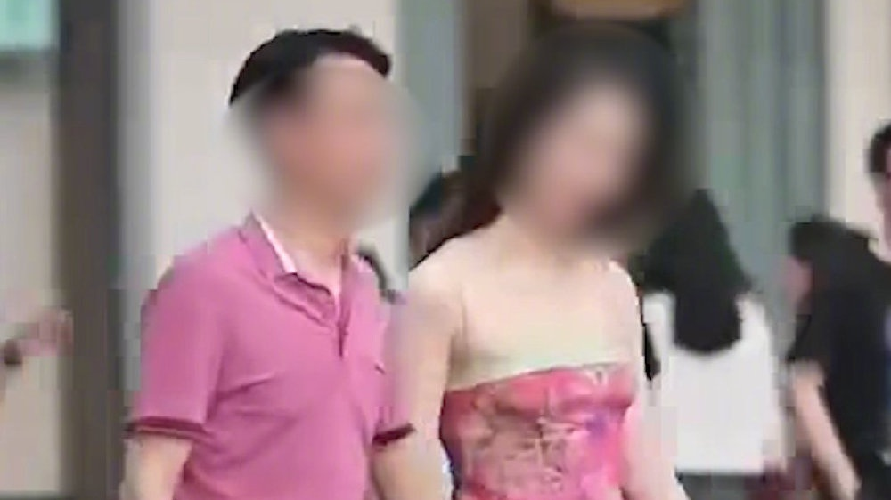
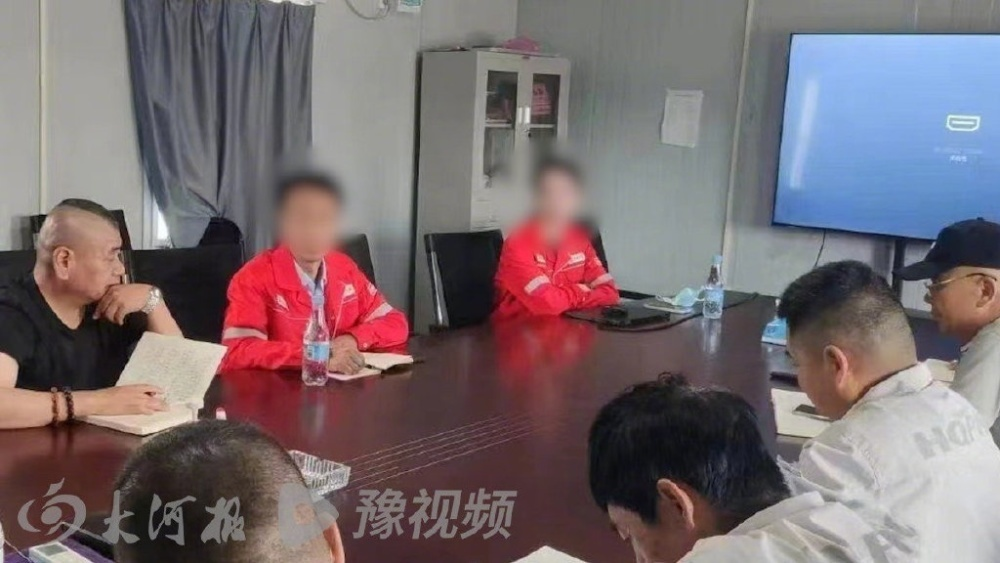

# 街拍国企领导与女子牵手，摄影师回应：当时两人未拒绝

6月7日，据大河报报道：近日，在四川成都，一名男子与一年轻女子的牵手街拍引发关注，网传视频中男子疑似寰球工程项目管理（北京）有限公司领导胡某勇。

拍摄该段视频的摄影师小米告诉记者，视频发布后收到当事人的私信，目前视频已删除。

小米回忆，当时街拍的时候，两人并没有拒绝。很多摄影师都在拍，正大光明地站在他们面前追着拍，他们并没有拒绝。“如果拒绝了，我们都不会拍，不会发。

（来源：大河报）

