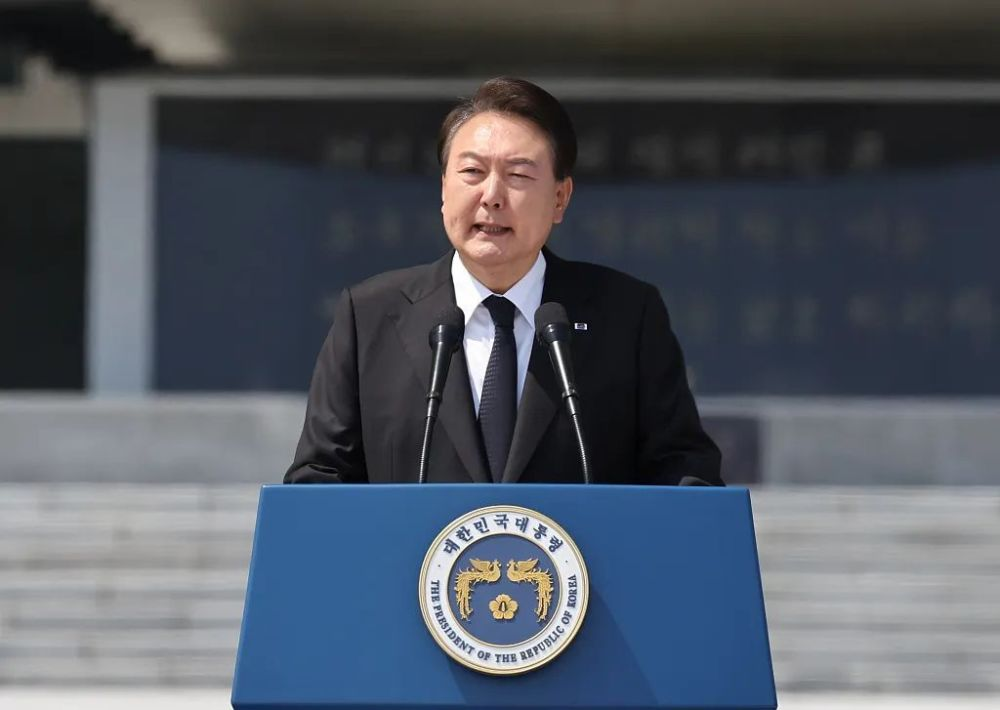

# 韩国总统尹锡悦宣布：韩美同盟已升级为“以核为基础的同盟”

“韩美同盟现在已经升级为‘以核为基础的同盟’。”

据韩联社6日报道，韩国总统尹锡悦当日在国立首尔显忠院出席第68个“显忠日”追念仪式，致辞时他再次强调了此前的访美成果——《华盛顿宣言》，并作出了上述表态。

_韩国总统尹锡悦在追念仪式上致辞。_

长安街知事（微信ID：Capitalnews）注意到，5月2日，尹锡悦在首尔龙山总统府主持召开国务会议时，曾表示“韩美同盟以核为基础进行升级，并已扩大到包括供应链、工业和科技联盟”，仅一个多月后，尹锡悦针对两国关系的定义又发生了变化。

“真是天真，相信美国和日本能解决所有问题。”面对此番“升级”的表述，韩国网民们直言荒唐。

抱薪救火

“如今韩美同盟比任何时候都要强大，韩国政府和军队将以此为基础，构筑铜墙铁壁般的安保态势，守护国民的生命和安全。”致辞中，尹锡悦强调，朝鲜正在升级核导能力，而他与美国总统拜登4月发布的《华盛顿宣言》旨在加强美军核资产延伸威慑执行力。

_4月26日，尹锡悦与拜登举行联合记者会。_

在上述宣言中，美方表示将通过扩大美韩核危机磋商、新增美韩军事训练和模拟演习、成立“美韩核磋商小组”机制、扩大半岛周边美战略资产出动等，升级对韩提供“延伸威慑”。

宣言一经发出，便在韩国国内引发质疑，认为其可能违反“朝鲜半岛无核化宣言”。但也有韩媒分析称，美方的“核保护伞”或“延伸威慑”恐流于形式，仅具有象征意义。

事实证明，美方的口头承诺确实存在一定的弹性。

此前就有消息称，美军计划在5月下旬举行的日本广岛G7峰会之际派遣战略核潜艇在韩国釜山基地停靠。而如今峰会结束已两周有余，据韩国国防部发言人全河奎表示，韩美仍基于《华盛顿宣言》就美国向韩半岛派遣战略武器进行必要磋商，但具体内容不宜公开。

_5月25日，韩军的KUH-1完美雄鹰直升机盘旋在天空中。_

说好的美军战略核潜艇没等来，但不可否认的是，韩美两军近期在“三八线”附近举行名为“联合协同火力剿敌”的史上最大规模实弹演习，以及两国此前一系列极具针对性的举动，正在为紧张的朝鲜半岛局势“火上浇油”。

6月2日，中国常驻联合国副代表耿爽批评美韩《华盛顿宣言》加强“延伸威慑”、与推进半岛无核化目标背道而驰。

而对此，韩国驻华大使馆高层负责人却将火引向中方，他表示中方不应只重视朝鲜的正当安全关切，也应考虑韩国的正当安全关切。

反观韩国的一系列操作，究竟是谁不顾其安全关切，答案不言自明。

“我们一向反对有关各方在半岛周边举行刺激性军演、搞施压对抗的‘小圈子’，这些做法充斥冷战思维、激化各方矛盾、加剧地区紧张，无助于化解冲突、增进互信。”6日，中国外交部发言人汪文斌在例行记者会上回应称，在朝鲜半岛问题上，中方始终根据事情本身的是非曲直决定立场，主张均衡解决各方合理关切，不存在只重视某一方关切的问题。

国格取决于什么？

67年前，为纪念韩国国土防卫与民族统一而做出贡献的所有烈士英雄，韩国政府宣布将每年的6月6日定为“显忠日”，即为国家献上赤胆忠诚的日子，并举行相关悼念活动。

在今年长达九分钟的致辞中，尹锡悦分别提及了八次“英雄”以及“自由”。

_6月6日，尹锡悦和妻子金建希出席第68个显忠日纪念仪式并默哀。_

“为了以民为主的国家献身，并守护自由的英雄们造就了今天的韩国。”尹锡悦表示，国格取决于国家将如何记住谁，只有通过向后代传达和教导英雄们的故事，铭记历史，才能在国际社会上获得认可。

在“三一运动纪念日”上，大谈与日本的合作伙伴关系，在强征劳工赔偿问题上，主动对日妥协让步，提出“代偿”方案，在面对美国时表现出“一边倒”的态度......反观尹锡悦今年的一系列外交行为，很难想象，他会如何将自己的表态付诸实践，究竟是为谁“献上赤胆忠诚”？

此前，韩国共同民主党党首李在明曾就尹锡悦“大妥协”式的外交批评称，韩国国格已跌入谷底。而更令人唏嘘的是，尹锡悦的一再让步，并未将真正关系到国民安危的问题妥善解决。

5月31日，韩国赴日本福岛第一核电站考察核污染水排海的考察团举行了记者会，会上并未就核污染水排放将如何影响民众的健康安全得出结论。

“考察团在访日期间一直避开媒体，只接受日本方面提供的数据。”韩国共同民主党发言人权七胜当天发表书面简报称，韩国政府派出的考察团是“帮助日本政府将福岛核污染水排放入海的宣传团”，他们此行的目的并不是通过实质性的验证来确保韩国国民的生命安全，而是为了让日本政府将核污染水排放入海的行为正当化。

眼下，这份来自核污染水的“威胁”正在步步逼近。6日，据日本广播协会电视台（NHK)报道，福岛第一核电站核污染水排海隧道内的管道里，已注入了约6000吨海水，这些海水将用来进一步稀释即将排放的核污染水。

“如果坚持以不负责任的'语言炸弹'助长危机，继续以阵营对抗为主的‘一边倒式外交'，那么将随时都有可能重复历史的悲剧。”据韩媒报道，李在明在“显忠日”当天表示，先烈们毫无保留地用血泪铸就了现在的韩国，而将国家的命运交到他国手中，会让多少国民陷入痛苦，战争将带来残酷的代价，这是无数无名英雄用生命换来的惨痛教训。

图片来源：视觉中国

