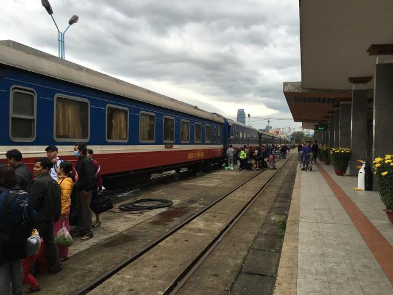
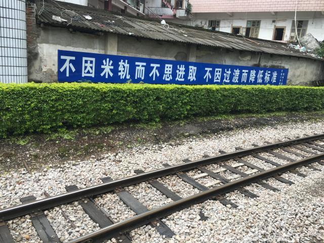

# 3天7场会见，越南高官密集拜会中国铁路系统，对接铁路合作

这是一趟不太被注意却令人遐想的中国行程。

5月的最后三天，越南交通运输部部长等人带队访华，先后与交通运输部、国家铁路局、中交集团、中国中车、国铁集团、中国铁建和中国中铁等部委和央企举行会见会谈。

近10多年来，中越铁路合作的呼声很高，但至今没有实质性项目推动，此时越南积极与中国对接铁路合作，透露哪些信号？

**积极与中国对接铁路合作**

根据官方消息，5月29日，交通运输部部长李小鹏在京会见了越南交通运输部部长阮文胜，双方就深化中越交通运输合作深入交换了意见。同日，国家铁路局局长费东斌会见了阮文胜一行，双方就加强中越铁路合作进行了深入交流。

5月29日，中交集团董事长王彤宙在中交大厦会见了阮文胜一行，双方就进一步深化交通基础设施等领域合作进行座谈交流。5月30日，中国中车总经理（总裁）楼齐良在京会见阮文胜一行，越南国会财金委员会副主任阮有全等参加此次会见。

5月31日，中国国家铁路集团有限公司董事长刘振芳在国铁集团与阮文胜举行会谈，就提升中越两国铁路互联互通水平、加强铁路领域合作进行深入交流。同日，中国铁建党委常委、副总裁刘成军会见阮有全率领的越南铁路代表团，双方就进一步加强铁路建设合作座谈交流。5月31日下午，中国中铁总裁陈文健与阮有全及越南交通运输部代表团在总部举行会谈。

在国铁集团的会谈中，刘振芳表示，积极推动中越铁路互联互通，促进两国间和过境货物运输发展。阮文胜表示，希望双方加强沟通交流，积极开辟中越铁路新通道，推动双方跨境货物运输发展，提升两国铁路合作水平。

阮有全在与中国铁建的交流中表示，越南正在持续加大对铁路等重大基础设施领域的投资，希望中国铁建充分发挥自身优势，分享铁路建设等领域的经验，加强双方在铁路等基础设施建设领域的交流合作，共同为越南经济发展注入新活力。

广西社科院东南亚研究所副所长雷小华向第一财经表示，越南现在这些积极的动作，第一个原因就是中老铁路的开通对越南有一定的刺激作用，它看到了中老铁路的物流运输价值和带来的通道效应。

国家铁路局网站6月6日发布的“一句话新闻”显示，中老铁路开通运营18个月来，累计发送旅客1640万人次、货物2100万吨，黄金运输通道作用日益凸显。云南省发改委主任王正英在6月7日的新闻发布会上表示，下一步将推进中老铁路沿线综合开发，推动中老铁路与西部陆海新通道、中欧班列实现战略对接、联动发展。

雷小华表示，第二个原因是越南意识到自己产业要转型升级，但是，物流尤其是铁路等交通基础设施建设严重滞后于经济发展的需要，对产业转型形成瓶颈制约。那么，要实现产业转型，必须在基础设施方面做一个自我革命式的迈进才行。

越南现有铁路线路3000多公里，大多是法国殖民时期留下的。这些线路采用的是米轨，即轨矩为1000mm。米轨铁路列车速度、载重性能都比较差。

雷小华认为，第三个原因就是现在全球经济不景气，越南对欧美出口下降比较明显，但是和中国的经贸合作是上升的，中国市场是越南一个巨大的大后方。

随着RCEP生效，越南农产品大量出口中国。最近，榴莲、菠萝蜜、荔枝、火龙果等多种水果正在进入收获期，大量水果涌入越南北部口岸。越南政府总理范明政近日要求主动采取紧急措施破解北部边境口岸拥堵困局，并促进农产品的出口活动。

**泛亚铁路建设能否提速**

实际上，越南和中国在100多年前就实现了铁路互通。法国人修建了从中国昆明到越南海防的滇越铁路。1910年4月1日，滇越铁路全线通车。不过，这条铁路也是米轨，年代久远。同时，昆明到河口已经建成标准轨铁路，原滇越铁路昆明至河口段仅保留部分货运功能。

根据公开报道，早在2015年11月，中越双方签署《关于越南老街-河内-
海防标准轨铁路线路规划项目可行性研究换文》，拟将此段铁路改造为标准轨铁路。但该方案一直未能实行。

今年3月，中越有关方面协商同意，共同推动中越铁路（红河）40尺集装箱国际联运线路在年内开通，使其成为中越两国贸易发展的新通道。届时，国际海运的40尺集装箱通过越南海防港发班后，最迟可以在6小时内到达河口北站，在完成米轨到准轨吊装后，可以确保12小时内运至昆明。

去年11月中越双方发表的《关于进一步加强和深化中越全面战略合作伙伴关系的联合声明》提出，为推动货物进出口，提升两国贸易额，双方同意推动航空、陆路和铁路运输合作并为此创造便利条件。尽快商谈修订1992年签署的《中越国境铁路协定》。双方支持两国铁路企业就提升越南货物过境中国运量加强合作。

如果中越铁路通道能够在双方联合声明和当前国际经济形势下加快推进速度，这将有力推动泛亚铁路网的进展。

作为泛亚铁路中线的中老铁路在2021年12月率先建成运营。2022年10月，中泰铁路合作项目一期（曼谷-
呵叻段）进入全面建设阶段，预计2026年建成通车。根据泰国媒体报道，二期呵叻至廊开段计划2024年开始实施，建成后中线的中老泰铁路将全线贯通。

中越铁路是泛亚铁路的东线，目前，与越南连接的云南和广西都在积极推进与越南的铁路互通项目。云南方向的昆河铁路已经建成投运，广西方向南宁至凭祥铁路南宁至崇左段2022年12月通车，预计2025年全线建成。

不仅如此，在广西方向，一条中越互通新铁路线路也在加快推进中。5月28日，新建广西防城港至东兴铁路全线连续梁结构全面完成。防东铁路直通东兴口岸向越南延伸可至海防，同时，作为广西沿海高铁的延伸线，可经沿海高铁至珠三角、长三角、京津冀乃至东北。

因此，如果老街-河内-
海防标准轨项目得以实施，加上越南推出的南北高铁计划，修建河内到胡志明市的高铁，则泛亚高铁东线有望提速建设。值得一提的是，2022年7月，泛亚铁路西线大瑞铁路大理至保山段已经投入运营，在东中西线，中国已经做好了准备。

雷小华表示，泛亚铁路应该要加快推进，特别是中老铁路开通后，要把它的功能完全发挥出来一定是要泛亚铁路网络的连接。否则的话，中老铁路也只是一条单独的线路，没有一个网络来支撑它的发展。

他认为，泛亚铁路建设现在面临的主要难点就是“缺钱”。越南、老挝、泰国、柬埔寨都缺资金，这是最大的现实制约因素。

随着中国与东盟经贸合作的更加紧密，以及中老铁路开通发挥出来的示范效应，已经对相关国家产生了影响。尤其是快速增长的双边贸易量对物流运输的现实需求和发展前景，迫切需要加快铁路等交通基础设施建设。

据《广西日报》，目前，广州、青岛、兰州、苏州、义乌、莆田、郑州等地均已开通经国铁凭祥口岸至越南河内的跨境班列。越南河内经凭祥至成都、重庆的国际班列也已实现常态化开行。

雷小华表示，如果铁路基础设施能够提升到中国国内这种标准和等级，很多产业愿意通过铁路运输的。因为通过这个铁路，一方面可以进入中国市场，另外一方面它可以对接中欧班列去到欧洲。

