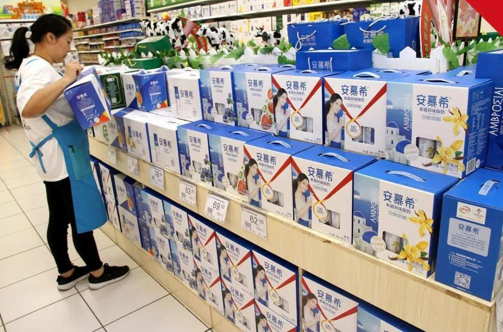

# 5元以下酸奶，不见了

01、“酸奶刺客”来了

继“雪糕刺客”后，便利店的冰柜里又多了一位默默无闻的“酸奶刺客”。

“在超市冰柜里随手拿了一款，没想到一结账发现手里的这款酸奶要18.8元，当时就想直接放回去”，一位被酸奶刺客“背刺”的消费者无奈吐槽道。

还有消费者表示，她曾在便利店拿起了一盒只有125g的卡士酸奶，当时她还不知道卡士有着“酸奶届爱马仕”的称号，到了结账的时候，小小一盒就卖10元的价格把她震惊到了，“这个价格不好吃也得说好吃，我最后连酸奶盖都舔干净了。”

“以前吃早饭的时候会买个面包再搭配一瓶酸奶，现在一瓶酸奶的价格能让我买五个面包”，如今的酸奶已经贵到有些高攀不起了。在社交平台上，被酸奶刺客“偷袭”的消费者也不在少数，光是在小红书，带有“酸奶刺客”的话题浏览量就已经超过了41万次，在这个话题中，酸奶的价格没有最贵，只有更贵。

有人外出吃饭的时候下单了四盒458ml的光明酸奶，结果最后买单发现一盒的价格就高达23元；还有人发现，一款名为优诺的酸奶在国外一瓶不超过1美元，到了国内却“麻雀变凤凰”要9.9元一瓶；“简爱·原味”“君乐宝纯享”“伊利畅轻”这些看似包装平平无奇的酸奶，一结账发现一瓶也要10元左右。

曾几何时，3-5元的酸奶是大家印象中最常见的配置，在两年前媒体发起的全民投票中，有78%的消费者表示只接受1-5元的酸奶，能接受10元以上价格的只有3%。出乎意料的是，两年过去，大家似乎对5元以上的酸奶都见怪不怪了。

“一盒5块钱的酸奶算贵吗？”在社交平台上，有人抛出了这样的疑问。大家纷纷留言表示，“10块钱一瓶的酸奶才是常态”“5块钱一瓶的酸奶已经很少见到了”。

「市界」走访北京多家超市、便利店发现，货架上5元以内的低温酸奶已是屈指可数，以联排奶的价格最低，价格通常在10元左右。而“伊利畅轻”“简爱·原味”“活润发酵乳”等10元的酸奶最为常见，一瓶酸奶的价格有时比8盒联排奶的价格还要高。

并且为了维持品牌的高价形象，许多酸奶宁可第二份半价，也不愿打折销售。以伊利畅轻的0蔗糖品牌“蛋白时光”为例，该品牌一排三盒的正常价格在36元，平均一盒酸奶价格在12元左右，然而在超市货架上，该品牌却打出了第二份半价买6盒只需要40.2元的优惠。

_▲（图源/市界）_

酸奶价格越来越贵也正在成为行业内普遍的共识。来自中研普华的研究报告显示，2020-2022年，国内酸奶销售量的年均复合增长率为9%，而销售额的年复合增长率却超过销量，达到了11.67%。凯度消费者指数也表示，酸奶的高端化趋势近几年一直存在，酸奶价格不仅持续增长，层出不穷的高端品类更是推涨了酸奶整体的销售均价。

此外，在资本热捧的现制酸奶赛道上，茉酸奶、Blueglass、王子森林、K22等现制酸奶品牌价格更是超越了喜茶、奈雪的茶，一杯动辄30元的价格让不少人直呼“喝不起”。以茉酸奶的招牌品类牛油果酸奶奶昔为例，该品类一杯的售价就高达31元，而喜茶相似品类的牧场酸酪牛油果售价仅为23元。

02、为什么越卖越贵？

酸奶越卖越贵，还要从一场事先谋划好的高端化之路开始讲起。

多位业内人士对「市界」表示，国内酸奶的高端化起源于2009年前后。2009年，光明推出了国内首款常温酸奶莫斯利安，凭借独特的品类优势，莫斯利安销量一路飞升，到了2014年，单一款莫斯利安的营收就占据了光明乳业营业收入的四分之一。

看到莫斯利安取得的巨大成绩，伊利和蒙牛两大巨头也按捺不住了，在2013年底先后推出了自家的常温酸奶品牌安慕希和纯甄，自此，莫斯利安的垄断地位被打破，国内的常温酸奶市场进入了“三国鼎立时代”，三家的市场份额一度占到70%-80%。

真正让市场看到高端酸奶背后价值的，则是安慕希弯道超车后惊人的营收和毛利率。2017年，经过短短三年时间，安慕希的营收突破百亿，超过莫斯利安，成为了市占率第一的常温酸奶品牌，据当时的研报称，安慕希的毛利率预计在40%以上。“此举不仅给伊利带来了高营收和高利润，也带动着其他中小企业开始向高端酸奶的方向布局。”

_▲（图源/视觉中国）_

也就是在安慕希奠定市场老大地位的这一年，我国酸奶的市场销售额第一次超越了牛奶的销售额。与此同时，乐纯、卡士、简爱等新酸奶品牌也开始在市场崭露头角，想从三巨头口中分一杯羹，我国酸奶高端化也由此按下了加速键。

天眼查数据显示，2018年为国内酸奶品牌的融资高峰期，共发生9起融资事件，仅乐纯一家就获得了来自可口可乐领投的数亿战略融资。到了2022年，依然有简爱等品牌不断接受外部融资。另一边，Blueglass、王子森林等现制酸奶品牌也是动辄拿下上亿融资，为本就水深火热的酸奶赛道源源不断注入火力。

“依托于资本发展起来的新势力，追求的不再是销售额，而是利润。”乳业分析师宋亮告诉「市界」，翻开新势力们的产品菜单，无一例外净是高端、超高端款，“因为这些企业需要用利润说话，然后一轮轮融资、上市、变现”。

要卖出高价，首先需要一个好故事。简爱的“生牛乳，乳酸菌，其他没了”，吾岛的“中国新一代高端酸奶”，乐纯的“接近四倍生牛乳提纯”都是这个路数。无论是“0添加”还是“高蛋白”，都会一定程度上推高生产成本。

紧接着，为了迅速触达消费者，社交媒体传播、明星代言人、直播带货成了标配。说是营造网红效应也好，传递品牌理念、获取品牌情感溢价也罢，这部分宣推费用无疑也加在了售价里，最后由消费者买单。

与此同时，面前有伊利、蒙牛这两座大山，新势力们还得加速快跑，通过不停炒作概念不断推高售价，继而获得高利润，甚至于资本青睐，然后在奶源、菌种、渠道上下功夫。据不完全统计，简爱、乐纯、吾岛、北海牧场等都在融资后将金额用于上游端的产业链和工厂建设。

“酸奶的生产成本在5000元～7000元/吨。”乳业专家王丁棉告诉「市界」，酸奶的涨价一般由头部企业带动，例如占市场总量一半以上的伊利、蒙牛、光明、君乐宝，占高价酸奶近半全国市场的卡士、简爱等等。

宋亮则表示，市场对高端酸奶的一腔热忱，内驱力还是更高的毛利润。“假设一杯中端酸奶的成本是1元，售价是5-6元；高端酸奶的成本是两元，原奶和益生菌等各方面都比中端酸奶要好，售价是8-10元。中端酸奶的毛利率可以达到30%，但是高端酸奶的毛利率高达60%，后者的边际收益远高于边际成本。”宋亮解释说。

03、一条道走到黑？

酸奶高端化的红利正在收窄。或者更准确说，整个酸奶市场在日益触及天花板。

根据Euromonitor的数据，2015年，中国酸奶行业销售额年复合增长率首次出现下滑，降为23.4%。此后7年间（2015年到2022年），年复合增长率更是一路降速至9.2%。即便是新品牌扎堆、资本涌入的低温酸奶赛道，也在2018年放缓了增速。

冷链物流成熟、消费升级、新老品牌混战......无论从哪个角度看，酸奶业似乎都拿到了“前景广阔”的剧本，按照剧本设定，未来定是“高定价换得高毛利，一路量增价升”的故事。但事实却不然。

事实上，如果拆解过往几年的酸奶销量数据，便能窥见其“虚胖”体质。

根据《2019酸奶行业分析与展望》报告显示，2019年上半年，虽然酸奶整体销量出现下降，但销售额却较上年同期有所增长。华创证券研报则显示，2021年11月，阿里线上电商平台，酸奶销售额为3.76亿元，同比降19.40%，与此同时，酸奶均价却同比增长13.06%至69.94元。

换句话说，以2018年为时间节点，酸奶业的“繁荣”是以高价为支撑的。而其高价，又是新势力试图破局、老玩家要高毛利的共同结果。“尤其是低温酸奶赛道，其本身市场增量也不大，主要靠提价来支撑业绩增长。”宋亮告诉「市界」。

为何死守高端？原因无他，高价带来的高毛利着实“太香了”。宋亮告诉「市界」，对于绝大多数乳企而言，价格稳定、需求减少的红利，远比价格下行、需求增加的红利要大。于是乎，稳价盘、保利润成了一众乳企的首选。

常温酸奶历来是巨头们的战场。得益于成熟的物流网络、经销商体系，蒙牛、伊利们将常温酸奶的触角无限延伸。王丁棉告诉「市界」，目前国内生产常温奶的企业大约有40-50家，其中伊利的安慕希、蒙牛的纯甄、光明的莫斯利安、君乐宝的开菲尔等品牌占据了70%的市场份额。

紧接着，巨头们在不断扩张的过程中形成规模优势，逐渐占据市场，掌握定价权。早年间多份研报显示，安慕希、莫斯利安等产品的毛利率在40%至50%之间。

而在更加百花齐放的低温酸奶赛道，则充斥着“0添加”“高蛋白”“保健功能”等诸多卖点。为了给高溢价找到合理性，各家极尽所能，不断在细分人群、功能、场景上做文章。

前有简爱推出“父爱配方”系列，紧接着“新希望Mimo系列”“卡士宝贝第二餐”等悉数上线。先有光明联合华熙生物推出“美の牛”系列，主打玻尿酸添加，随后，号称平衡血糖、美容养颜、增强免疫力等诸多功能的产品接连问世。

_▲（图源/视觉中国）_

宋亮向「市界」回忆，早年间，为跳脱出血拼“高端”的怪圈，有乳企还尝试过降价，但由于利润受影响太大，紧接着又把价格调了回去。而从目前来看，概念也好，功效也罢，各家怕是要在高价的道路上一往无前了。

高价酸奶能和高质划等号吗？答案显然是否定的。王丁棉告诉「市界」，以业内炒作火爆的“0添加”概念为例，粗略估计，有超过20家企业打出了所谓“0糖”“无糖”概念，但这更像是噱头和伪命题，“任何乳制品都不可能是0糖，只要是乳或者水果，都会含糖”。

而竞相追逐高价酸奶，除了给部分企业带去利好外，从长期来看，对行业发展毫无益处。

“中国消费者对于酸奶的消费习惯还没有被完全培养起来，或者说，酸奶还不是刚需。”宋亮告诉「市界」，通常来说，一个成熟市场的产生，会先通过基础款产品进行用户教育，培养消费习惯，然后再出现高中低端不同品牌定位的细分市场。

纵观中国酸奶过往数年，在巨头把持奶源、渠道的大背景下，行业直接跳级，深耕起高端价格带。“这就导致消费习惯没有被培养起来，行业很快到达天花板。”宋亮告诉「市界」，与其火拼高价，一众乳企该做的，反倒是用性价比培养用户。否则，被高价支撑的虚假繁荣，迟早有破灭的一天。

作者 | 张继康 李丹

编辑 | 陈芳

运营 | 刘珊

