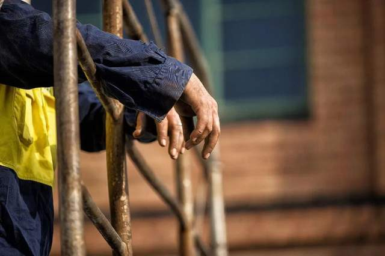
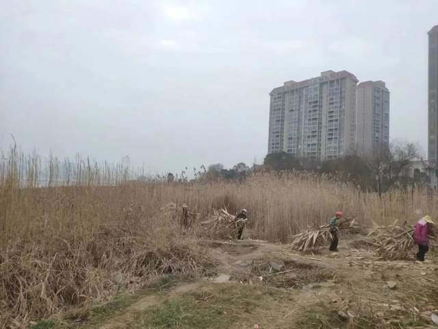
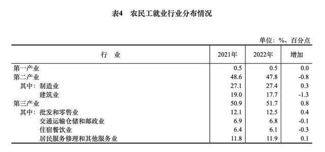
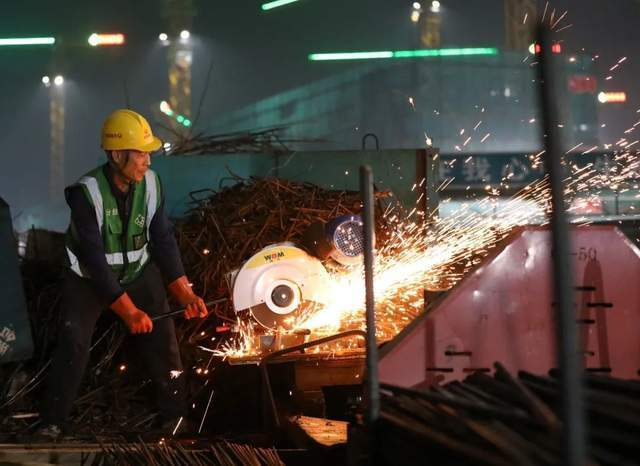
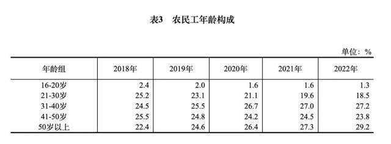
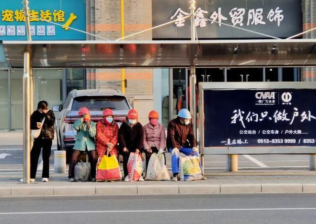
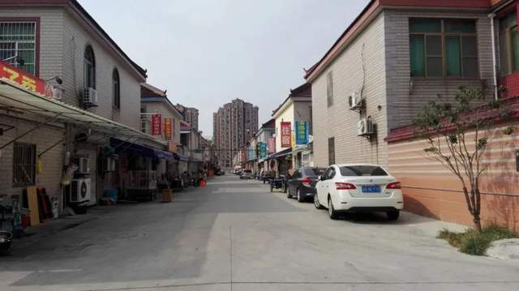
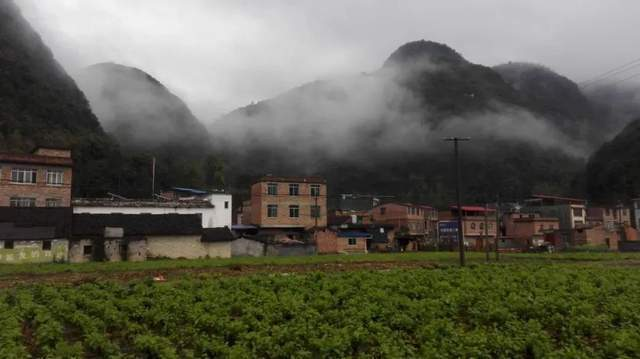
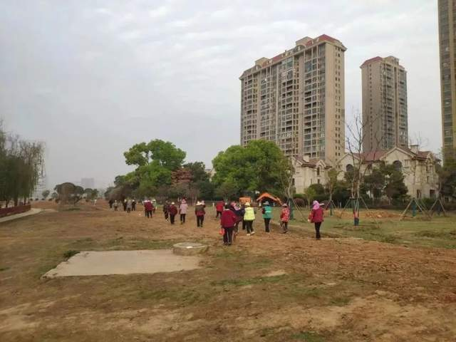

# “清退令”下的超龄农民工：没有社保养老困难，不断进入城市边缘行业

**4月28日，国家统计局发布了《2022年农民工监测调查报告》，其中农民工的平均年龄42.3岁，达到了历史最高，50岁以上农民工的比重连年上升，达到29.2%，总人数超过了8600万。随之而来的新闻是，务工行业实行实名制，建筑工地清退超龄农民工，有超龄农民工办假证被抓——他们试图让自己的年龄显得小一些。**

**王欧是华中师范大学社会学院的青年教师，关注、跟踪和调查农民工群体超过十年，做过许多田野调查，访谈过全国各地的第一代农民工和新生代农民工。他希望，城市社会可以更包容一些，不要用一刀切的方式，认为60岁以上就是超龄农民工，就得走，就得被清退，而是根据他们的身体状况去管理，去规制。“不是说把健康的、有劳动能力的超龄农民工赶走就完了，更重要的是，怎么让工作本身变得安全，不要让工人们太过疲惫地工作。”**

**王欧说话声音不大，却有一种很沉静的力量，讲述农民工故事的时候，他有一种切身的体认。因为，他就是第一代农民工的孩子。他的父母在上世纪90年代，跟随第一批南下打工潮来到深圳，在各种工厂间辗转，或者以收购工厂废料为生。那时，他像一只小候鸟，迁徙在赣南与岭南之间，见到号称打工天堂的深圳的样子，也见到那些怀揣梦想的农民工们是如何在城市中拼搏，又如何努力获得微小的生存空间。**

**他原本不觉得这些经验有什么出奇，本科学的是数学，机缘巧合考上了教育学硕士，接触到了农民工子女，才产生了对这个群体身份的自觉，开始了长达十年的劳工研究。**

**十年间，他发现农民工们不断地被挤向城市的更边缘，形成了一个不断向下流动的路径。但是，又有一些原因，让他们无法回到乡村，回到土地上。**

**这些超龄农民工与子女，与新生代农民工的代际关系也在面临着前所未有的挑战。无论身体，还是情感，他们似乎从来没有真正属于哪个地方。王欧也从自己的人生经历和母亲的故事中不断反思，第一代农民工的家到底在哪里？他们与城市到底是一种什么关系？超龄农民工的归处又在哪里？**

**以下是王欧的讲述。**

**文 |** 赖祐萱

**编辑 |** 槐杨

**运营 |** 岩蕊

**图 |** 除特殊标注外，图片由受访者提供

**1**

关于超龄农民工，我们先从一个小故事开始吧。

我住在武汉的南湖边上，早些年南湖污染特别严重，为了治理水域，市政想把湖中芦苇割掉，造一座绿化公园。有一天，我经过那里，看见很多农民工，白发苍苍，几乎都是65岁、70岁以上的年纪，穿着防水服站在湖边，水漫到了腰部，拼命砍着芦苇，砍完再一捆一捆往上拉，背着重重的芦苇走上岸。

站在那里，我问小包工头，这些人从哪里来，他说，很多都是他们老乡带出来的。又问项目是哪里的，包工头说，他也不知道工程是从哪里来的，这是非常临时的、完全一次性的工作，而这些高度非正规化的工作，通过层层分包，才能流向这些超龄农民工。

这些农民工是被一个大面包车拉过来的，他们每个人背个包，或挎个手提袋，里面是帽子、衣服，还有午餐，统一拉过来，收工又被统一拉走。很有意味的是，现在那片湖水重新种上了植被，变成了小公园，成为城市老年人每天散步、打太极拳的地方，而那些与城市老年人同龄的、为此劳作的农民工已经不见了。离开这里，他们住在哪儿，又要去哪儿工作，没人知道。

这就是超龄农民工的现状，不断进入城市各种边缘的行业、边缘的部门，那些你根本想象不到的地方，越来越边缘。

_▲
湖边割芦苇的工人，大多为大龄农民工 。_

从社会管理的角度，年龄大的农民工的确更容易出事，出事以后就会有后续的纠纷，无论是医疗的赔偿，还是工地闹事等等，这也使得管理者对年龄大的农民工的使用更慎重。一个行业正规化程度越高，老人被清退的可能性就越大。比如，武汉严格规定清洁工不能超过60岁，哪怕马路的清洁工，哪怕已经外包给一些公司，也要遵守这个规定。

但我目前看到的关于超龄农民工的“清退令”，只是在一些局部城市的特定行业，比如上海、天津、南昌、深圳的建筑工地，不是国家层面统一的政策，应该说绝大多数地方是没有的。令人难过的是，真正决定超龄农民工是否能够继续工作的，不是像建筑行业那样赤裸裸地查办假证，劝退高龄者，更多是劳动力市场的调节，是一个市场行为，而这种广泛的、隐秘的针对大龄、超龄农民工的“清退”
很多年前早就开始了。

最典型的是制造业，比如说电子厂，最早说30岁以上不要，后来劳动力短缺了，改成35岁以上不要，现在扩展到40岁-45岁就不要。这意味着农民工年龄大一点，电子厂就不要你。我们似乎只是在看政策有没有变动，但只要去制造业实地看一看，会知道超过45岁，甭想找好工作了，这样的风气在劳动力市场已经盛行了很多年。

我跟踪过一个大龄单身男工，还不到45岁，在制造业就不太好找工作。他在类似于模具厂之类的地方做操作工，做事慢了，腿酸活动一下，主管就骂他，想办法扣他钱，把他给搞走。这就是劳动力市场默默进行的，隐蔽的、没有被关注的“清退”。后来，他换了好几个工作，分派过快递，去餐馆端过盘子，在商场地下车库岗亭做保安，每个都做不长久，因为总是会被驱赶，被辞退。

这样的现状意味着，很多第一代农民工的人生轨迹，是不断向下流动的。

年轻时，你建造大楼，建造城市，你在制造业工作，创造了最火热的东西，年纪大了，你开始进入相对边缘的部门，做保安、保洁，做搬运工、建筑工，甚至做一些杂工，当你年龄再大一点，成为“超龄农民工”，你只能去商场做清洁，扫马路，或者去收废品，最后流向清除芦苇这样的完全临时性的工作，一直向下流动。

大量的超龄农民工，他们工作了10年、20年，没有人力资本的积累，也没有社会资本的积累，留下的只有年龄和劳动对他们身体的消耗和损伤。

_▲
图 / 视觉中国_

**2**

建筑工是超龄农民工聚集最多的地方。

2015年左右，我和另外一个青年社会学者在国内做建筑工的调研，主要观察了几十个北京的建筑工地。通过近一年的跟踪调查，我发现建筑工有几个特点。

第一，他们都是老乡带老乡，一个包工头带着一串人，要么是亲戚，要么是同村子，建筑工地会形成非常紧密的同乡网络，这也是第一代农民工找工作最传统的方式。

第二，建筑工是高回报的工种，那时候在北京，一个男性建筑小工一天差不多能有180~200块钱，女性差不多120~140块钱，如果大工会有两三百，如果再有技术，比如夫妻俩承包木工，一天两人可能有七八百。很多建筑工家里生活压力都很大，有欠债，或为下一代攒房子首付，我跟踪的新生代农民工，结婚成家特别是有了小孩子以后，好多都转到建筑工地去了。

第三，建筑工比较灵活，很多建筑工都是男性在外，老婆在家里带孩子种地，同时他们有事很容易请假，不像工厂，机器非得有个人看着，建筑工的腾挪相对来说容易一点，从一个工期去下一个工期，中间可能隔一段时间，还能照顾家里。

第四，建筑业的合同签约率非常低，有统计数据显示全国建筑工合同签约率不到20%，有的城市百分比只有个位数。比如，中建三局或北京建工的工程，里面真正的施工方根本不是中建三局或北京建工，极有可能是河北的某个建筑公司，几经转手，再分包给不同的工程队，管理松散，什么人都可以干。

所有的特点聚在一起——监管不那么严，挣得又比较多，又是那种老乡带老乡的关系，这样的地方才会留下一个缝隙、一个空间，聚集起大量的超龄农民工，吸纳了更多愿意吃苦耐劳，愿意去卖力气，挣相对多一点的钱的超龄、高龄的农民工。

_▲
国家统计局发布的《2022年农民工监测调查报告》显示，近50%的农民工流入建筑业和制造业。_

同时，这些超龄农民工是最不懂得保护自己的权益的一批人。

首先，建筑工出工伤的概率比较大，其中高龄、超龄的农民工又更甚。到了酷暑日，正常农民工干上8个小时，身体都吃不消，很容易走神，更何况年龄大的人爬很高的脚手架，危险系数会成倍增加。

当他们出工伤了，怎么办？大多数农民工只能去闹事。有一句话叫，“大闹大解决，小闹小解决，不闹不解决。”那些人都懂的，老家搞一些人来到工地上，拦马路也好，爬塔吊也好，无论是年轻人出工伤，还是老人出工伤，只有“闹”才能要到钱。

因为走法律途径维权是非常非常艰难的，他们去哪里找律师，又怎么找到靠谱的、律师？

我读博时，曾经深入参与一起个案，北京门头沟一个60多岁的农民工，从4层楼高的脚手架踩空掉了下来，砸断了脊柱，半身瘫痪。他的儿子赶来北京陪护，没治几天就花了几千块，结果包工头赶来，把他弄到私立医院，是专门处理这种工伤的医院，也不给用什么好药，钱没了就赶走。

那里有律师发名片，说你有工伤，我们可以帮你打官司，他们就信了，交了5万块钱，还签了合同。结果，那个律师跑到工地现场找人聊了几句，做了笔录，找劳动局反映了情况，又找到门头沟法院提交了上诉，就置之不理了。后来，我才知道很多无良律师跑到这种医院发名片，专门挑受了工伤的农民工，骗他们的钱。

后来，他儿子走投无路，到了北京某城建局信访处，我们就是在那里遇到他的。我们帮他在劳动局劳动监察科登记，又帮他联系公益机构的律师，第一个律师是个男性，特别傲慢，爱理不理，觉得太多这样的案例了，搞不过来。第二位律师是个女性，态度很好，专门帮忙跑这个事情，最后法院判了120万赔偿，但也只拿回来50万，剩下70万到现在没拿到。他儿子还很感谢我们，说如果没有我们，可能连50万都拿不到。

这个例子让我意识到，还有太多太多根本没有门路、没有人帮忙的农民工，可能再也讨不回说法和权益。

他们的社会保障也很不完整。第一代农民工和超龄农民工没有太强烈的要买社保、要跟城里人一样的概念，尤其是建筑工人。

城市里什么样的外来打工人会买社保？有稳定工作的人，比如在工厂上班的工人，他们在城市久了，跟人有接触，和城市发生了联系，就会想要有一份保障。出租车司机买社保的最多，他们每天跟各种人聊天，有了见识，知道城里人退休了有退休金，生活是什么样的。

但是，建筑工长期住在工地里面，没有时间也没有机会和城市接触、发生联系。在城市社会学或者移民社会学里面有个术语叫“飞地（enclave）”，一个临时性的聚集地。建筑工白天工作，晚上放工了，吃个饭洗个澡，就聚在一起打牌或刷抖音。他们就处于城市的飞地。

只有下好几天雨，没有材料要停工了，或从一个工地转移到另一个工地，还在等待的时候，他们会在附近市场走一走。有个建筑工跟我说，夏天待在板房太热了，才会跑到超市里面去吹空调。

其余的大多数时间，他们的生活空间、工作空间跟城市社会是隔离的，与此同时，他们把很多乡土性的东西带过去了，亲属关系，熟人社会等等。所以，无论走到哪里，建筑工都是跟乡土社会连得很紧的一些人。

_▲
一线建筑工人。图 / 视觉中国_

**3**

国家统计局每年会公布农民工监测调查报告，这个报告会显示农民工群体的年龄是如何变化的。我记得，2013年的报告特别关心新生代农民工，数据显示很多年轻的农民工进入这个群体，比重甚至超过了45%，但是从那一年开始，2014年到2022年，这9年的监测报告显示，青年农民工越来越少，大龄、超龄农民工越来越多。

2022年最新的数据，农民工平均年龄42.3岁，40岁及以下农民工低于50%，50岁以上农民工接近30%，其中本地农民工，就是那些回到家乡继续打工的农民工，平均年龄接近47岁，50岁以上占比超过40%。你可以看到，农民工老龄化现象非常严重，尤其过去三五年，问题更加凸显。

很多人说，超龄农民工没有工作，那就回农村呗，去种地，回归乡村。

我从2010年开始关注农民工问题，那段时间前后，第一代农民工最高年龄才五六十岁，还算当年，劳动力市场对年龄也没有什么限制，超龄农民工问题还没有浮现。那时，农民工和农村、农业的粘性还比较紧密，如果在城市待不下去，他们还可以回家种地。

但如今，十几年过去了，中国的农业和农村发生了很大变化。我在全国农村地区调研，看到很多空心村，年轻人都出走了，大片大片的荒地，都是上一辈农民开荒开垦出来的土地，都荒废了。农资在涨价，种子、农药、除草剂都在涨价，粮食价格又一直很便宜，水稻、小麦、玉米都一样，回报率很低的，一亩地一年挣不到1000块钱。

没有人愿意种地了，另一方面，种地也不需要那么多人了。过去，农民还用牛耕地，收了谷子扛回去，把它晒干再卖。现在都不需要了，播种都是抛秧，一天用机器可以搞好多亩，收成了直接把稻谷往田埂上一扔，大米加工厂车子直接来装。今天的农业就是越来越不需要那么多劳动投入，超龄农民工就算回去，也种不了地了。

他们可能会流向家乡当地的劳动力市场，这几年县城建房很厉害，超龄农民工干不了大工，就干点小杂工，还有采石场、伐木场很多石头树枝要清理，都是大龄的男性农民工去做，他们在狭小的空间中获得一点机会。那么女性都去哪里了？我老家村子有几十亩地，被一个蔬菜老板承包了，地里都是六七十岁的女性在干活，1小时10块钱，这样工资很低的农业雇工，都是留守村子的女性。

_▲《2022年农民工监测调查报告》显示，2022年，年龄在50岁以上的农民工占比29.2%，较2021年同比增长1.9%。_

超龄农民工群体中的女性，她们所面临的困境会比男性更多。

劳动力市场中所提供的劳动机会，很多本就偏向男性，比如工资相对更高的建筑工，还有保安、清洁工。不管在哪里，男性相比女性，找到新工作、维系生存的可能性依旧更大。即使在不起眼的地方当保安，在某个小商场打扫卫生，都宁愿要大龄男性，不愿要女性。即便他们回到老家，采石场、伐木场，甚至工业园看门的，都是要男性。

同时，女性农民工受家庭的影响要更大。除了身体原因，把农民工拉出劳动力市场的，还有很大的一个因素，就是家庭的代际责任，而这更多是落在女性农民工身上。比如我妈妈，我弟弟生了小孩，她就要去帮忙带小孩，或者是老家有病人要照顾，她就不能打工了。这种家庭责任，往往伴随着承担更多家庭内部的压力，比如跟儿媳之间的冲突，跟比她年龄更大的老人之间的矛盾……总是女性放弃工作，回到村庄留守，或跟到子女家中劳作，责任总是落在她们的身上。这也是为什么我们常常看见乡村里那些工资极低的农业雇工，都是大龄的、超龄的女性农民工。

在整个结构中，超龄农民工在城市里面打不了工，村子和土地又不需要他们，这些劳动力就被闲置了。所以，他们无论如何都尽力不要退回农村，对他们来说，那不是一个可以让人安稳栖息的地方。农业收入有限，劳动力闲置不起，考量到将来可能生病，可能干不动需要养老，这些超龄农民工但凡在外头能找到一点活干，是不会回农村的。

_▲江苏南通，老年妇女农民工正在候车，她们会统一乘坐大巴进入市区工作。图
/ 视觉中国_

**4**

当我们在讨论超龄农民工、大龄农民工的时候，很少有人意识到，在农民工这个群体之中，从来没有“超龄”一说，年龄绝不可能使他们停止工作，但凡身体吃得消，即使他们60多岁，70多岁，可能还会打工，只要可以，他们永远都能干下去，永远不会有退休的概念。

他们不得不工作。第一代农民工的一生，就是自我牺牲的一生。

如果保持健康不生病，靠着常年打工，他们会有一点积蓄，但不会太多。这一代农民工，年轻时打工是为了建房子，为了养大孩子；年龄大一点，他们又开始养孩子的孩子，倒贴钱养孙辈，等孙辈长大了，离开农村了，这些人的攒钱才算真正开始。

实质上，这一代超龄农民工在经济方面是一直补贴下一代的。不要说抚育子代和他们的孩子，连第二代农民工在县城买房的首付，一般都是第一代农民工掏的。教育资源向县城上移，但凡有一点经济能力或对下一代期望高的农民工，都想着子女将来不要像自己一样，让他们离开村镇，到县城读书，创造的条件之一就是买房。

县城的房子不便宜，很多地方一套至少都要五六十万，还是毛坯。结婚要求也很高，很多年前我在河北调研，当地有句顺口溜：“万紫千红一片绿，三金两银一动不动。”一万张紫色的五元，一千张红色的百元，一共15万多的彩礼，三金两银是手镯、项链等可传家的贵重饰品，“一动不动”是指一辆车，一套房。对于仍然还有劳动力的第一代农民工，为了下一代也不得不继续打工。

大量第一代农民工的子女也还是农民工，收入有限，这些老去的农民工没有经济条件比较好的子女可以依赖，没有生活的保障，没有退休金，只有很低的养老保险。他们有一个非常典型的观念：不想给子女添麻烦，他的消费会自己想办法去挣，自己为自己的生病、死亡做准备。

比如，我的姨父今年70岁了，体力已经种不了地了，一旦回家就没有收入，之前他当保安，干了四五年不让干了，就在小区里面清理垃圾，开个小车，把一桶一桶的垃圾拉上去，再转移到大垃圾车上。过去一段时间，他已经接连被开除两次，别人觉得他年龄大，搬东西吃力。其实，他的孩子也就是我的表哥，生活条件不错，但姨父说，问孩子要钱是不容易的，也不忍心。哪怕去服务业当保洁保安，甚至去清运垃圾收废品，他也愿意，为了将来生病想方设法去攒钱。

这就是第一代农民工的想法，也是这么多超龄农民工不愿意回乡的原因。与此相伴的问题是，他们为下一代付出了一辈子，却无法和下一代产生亲密的联系。

长久以来，第一代农民工在家庭中没有多少权威感和话语权。年轻时，他们在外打工，远离妻儿；年老了，赚钱能力越来越弱，对子代家庭没有更多帮助，他们会慢慢被子代家庭边缘化，联系也会变少。

这也使得很多退到农村的超龄农民工，总是面临养老困难。

这些年，我在全国农村调研，发现超龄农民工对待医疗的态度，有病都是忍着，不去看，永远都是一点小病小疼拖到不行了，错过最佳治疗时期，再一查都是晚期或者没法治了。他们认为，一旦看病，就需要有人照顾他，但他们的子女几乎都是在外打工，同时他们自己又承担着隔代抚养的责任。

2016年在广西农村调研时，一对夫妻60多岁，丈夫说话有时说得出来，有时说不出来，疑似得了帕金森症，应该及早干预治疗，但是这个家庭有三个留守儿童，都是他们的孙辈，需要老夫妻照顾，而他们的孩子都在外面打工。我劝他们要去看病，老头说，去一趟医院可能要2万块钱，这一年到头我都不一定搞得到2万块钱。

当然，新农保和新农合还是帮助农民解决了不少问题。过去他们看病都是自己掏钱，新农合实施以后，至少在本县看病，有一部分是可以报销的，但生病牵连出来的一系事情，是无法估计的。谁来照顾老人？外出打工者断了工作怎么办？留守儿童怎么办？所有劳力停工了没有生活来源怎么办？

我特别能够理解老一代农民工为什么不去看病，因为会影响太多太多。每每看到这些事情，我的心里面都是不容易那么平静。

很多国外的学者都很难理解，为什么中国的农民工会有这么大的韧性？这一代农民工，是特别会自我牺牲的一些人。只要他们能动，他们就在工作，就要劳作一辈子，为子女做贡献，对他们个体来说，没有超龄的问题。

_▲江苏昆山，年轻夫妻工人的住所多从工厂宿舍换到周边的城中村，节俭生活，共同为遥远的家庭打拼。_

**5**

对于农民工的这些认识，来自我的调研，也来自我的生命经验。我就是农民工的孩子，我的父母就是第一代农民工，上世纪90年代末期，他们从江西出来，到深圳打工。爸爸是一个闲人，不愿意去厂子，就搞了一辆三轮车走街串巷，回收工厂的废料。妈妈换了很多厂，针织厂、玩具厂、五金作坊，后来也跟我爸一起做废料收购。那时候，爸妈的收入加起来，每年差不多上万，比在农村强很多。

那时候我在老家读初中，每年寒暑假，我都像小候鸟一样，去深圳见爸妈，每次我都很兴奋，终于可以离开老家那个小村子，到了大城市，有很多小伙伴，一起到公园玩儿，去网吧打游戏，那都是农村没有的。

那时候，我只有本地人和外来人的概念，和爸妈一样的“外来人”都是打工的，在这里讨个生活，“本地人”不是收租的房东，就是公务员、老板。我没想过爸妈是不是受到了不公平的待遇，他们的处境是什么，我认为天然就是这样，这只是一种生活方式。我对自己农民工子女的身份，也没有任何自觉和反思，更谈不上发现它是一个值得研究的学术问题。

关注农民工群体，并走上社会学的启蒙之路，对我来说是一条曲折又有意思的道路，更像是一种自我意识的唤醒。

我本科在天津一所二本院校天津工程师范学院，学信息与计算科学，课程大多与数学有关，但逐渐地，我对数学感到兴趣索然，隔壁宿舍有个朋友，学职业教育，我就跟着那位朋友看了很多教育学书籍，结果考上了华中科技大学教育学的硕士。

2010年前后，读教育学硕士期间，我开始大量阅读教育社会学、劳工社会学方面的著作，硕士论文课题是关于农民工子女的教育，那时候武汉光谷刚刚开始搞起来，大量拆迁，很多农民工涌入。花了几个月时间，我在光谷边缘一所农民工子弟学校中跟踪调查了几个农民工孩子，他们的父母来自重庆、四川、湖南、湖北，我想了解这些孩子的家长是怎么管他们的，怎么在教育方面投入的。

我去过一个女孩家，她挺善良的，但反应总感觉比别的孩子慢一拍，我就很想去她家看看。她爸爸是重庆人，租了一个城边村要拆迁的私房，旁边空地上搭了棚子养猪。到了她家，发现她爸爸每天除了照顾猪，就是找人打牌，也不管孩子学习，出了问题就是骂和打。

我突然想到，我爸爸妈妈是怎么管教我的？好像他们从来没有在学习方面给我建议，只是学费、生活费会负责，别的方面他们不管。我犯了错误，我爸也是打，没有太多语言的交流。

教育社会学领域有一本很有名的书叫《不平等的童年》，谈中产阶级和劳工家庭分别是如何管教小孩的，中产阶级强调父母和子女要平等，要对话，要沟通，要协商，书里提到，中产阶级的家长跟小孩子说话，会蹲下来，跟小孩子同样的高度，鼓励小孩子发表他们的看法，然后讨论。

我想起来，我父母从来不会这样，我看到的劳工家庭的小孩也从来不是这样。那是一套两极化的教育，不是放任就是痛打，劳工阶层的孩子，很容易受到外面消费文化和网络世界的影响。我很好奇，当农民工子女在城市边缘，能否通过教育制度往上走，最终走出农民工家庭，成为一个中产阶级？

就是在这一刻，我开始真正对农民工、农民工子女这个群体发生兴趣。我也突然意识到，对啊，我的父母也是农民工，我自己也是一个农民工的小孩，我也曾经是留守儿童，我才拥有了对这个群体的自觉。

后来，因缘际会考上了清华大学的博士，我接触到了全国乃至全世界最优秀的劳工社会学的研究者，终于能够站在一个更广阔的层面上，去回看农民工群体，回想我的成长经历。

2015年暑假，我到江苏昆山做了很久田野调查，主要是针对流动家庭问题。

我每天在那里，收集各种各样的资料，最疯狂的时候，实在找不到工人访谈了，在一个公交站，别人在等车，我就上去问愿不愿意跟我谈一会儿。在公交车上，坐我对面的是个工友，我也跟人聊。跟年龄比较大的农民工打交道，要有熟人介绍，农民工社会也是熟人社会，只要有人介绍，他们啥都跟你讲。

从那时起，我非常注重调查农民工的生活史，每次访谈一个工人，都从他的家庭背景开始询问，小时候读书怎么样，什么时候出去打工，混了哪些工作，有没有谈恋爱，怎么追得女朋友，结婚以后又怎么办，怎么安家养小孩？我也会回到他们的家乡，看看他们的妻子、孩子和父母都在做什么，他们之间的关系如何。那一年，我建立了很多农民工的生活史档案，从中观察他们的行为模式。

当我唤醒了自己的身份意识，唤醒了我对农民工群体的关注，每天我的脑海中就有好多好多的问题想要研究。我想知道农民工如何在老家搞城镇化，想知道农民工家庭的变化，尤其是代际的对比，还有老一代农民工和那些已经回到村子里头的大龄、超龄的农民工，他们在生命晚期跟子代之间的关系。他们生病了会怎么办？他们生命的最后阶段，他们跟土地，跟农业会发生什么样的关系？

我想到田野去，和更多的具体的农民工在一起，了解他们的故事，弄清他们要往哪里去。

_▲
王欧前往广西农村调研_

**6**

关注了几年农民工问题，我不断调整自己思考、观察和研究农民工群体的角度。最近，我更多会从城市社会学，城乡结构的角度去思考农民工群体的生存，我发现自己看到了更多、更深的东西。

我小时候，爸妈在深圳龙华大浪街道待过很长时间，那里有很多来自江西吉安永丰的同乡，都来深圳当农民工。大家在这里的生活都是很边缘的，他们都知道，来这里是打工的，并不属于这里。

后来，随着深圳的产业升级，城市扩张，龙华的工业区渐渐被中产阶级小区吞并了。

我爸妈离开深圳，也是因为城市开始巨变。当时，深圳地价越来越贵，好多电子厂都搞不下去了，纷纷外迁到东莞或别的地方。我们家主业就是收电子厂的废品，电子厂没了，生路也断了，当时我大学毕业了，弟弟大专也差不多读完了，他们想，那就回老家吧。

回去后，他们也没闲着，先跟着村里人搞了一点小工程，我爸开手扶拖拉机去拉土，妈妈跟到工地煮饭，没搞几年，我爸就生病了，干不了了。我爸爸重病卧床后，妈妈一边照顾他，一边去附近大米加工厂打工，干了几年，我爸走了，我弟弟也结婚了，有了小孩，她才停下。

2019年夏天，我从清华博士毕业那年，回龙华一趟，找到了父母当年住的地方。当年，龙华都是四五层的自建房，农民工都住在那里，父母和我表哥租了一个店面，隔成两间，父母睡里面，表哥睡外面。但那次回去，以前的旧房子都不见了，变成了房价每平米6万多的商品房小区，还是一个社会治理很有名的社区。曾经我们这些农民工的孩子很喜欢爬的高坡，被推平了，为了建小区挖地下停车场，所有的路面都重新改造了。当年的记忆，全部没有了。

2015年，我在北京建筑工地做了一年多的调研，去过几十个建筑工地，那是无力感最强的时候，也是我最深刻体会到“无情”的时刻。

一个楼房从地基开始，噌噌蹭一层层往上走，最后建成了三四十层的高楼，农民工在建房的过程中，就住在旁边的板房里，那是他们的栖身之所，等房子建得差不多了，开发商就开始销售楼盘了，各种广告铺天盖地，农民工也要走了。

清华大学社会学系的李强老师研究城市社会学，他说，我们其实应该要为中国的建筑工颁一些奖，他们在城市建了那么多房子，那些房子上面至少应该给他们留下一个名字。

但实际上，那一年，我看到了无数这样的画面——工程结束，这些建筑工人们没有箱子，都是大蛇皮袋，装着一捆被子、一些衣服，往肩上一背，手上再夹点东西，包工头租个面包车，车门一拉，他们就走了。这个空间是他们生产出来的，但是跟他们毫无关系，你走，去下一个工地，或者回到你的老家。

_▲
在湖边种草木景观的大龄农民工 。_

有学者说，农村是超龄农民工的退路，其实，第一代农民工本就是这样认为的，他们大多数人会落叶归根，但是能不能在他们还有劳动力的时候，不要把他们赶回农村呢？

我希望城市社会更包容一些，不要用一刀切的方式，
60岁以上就是超龄农民工，就得走，就得被清退，而是根据他们的身体状况去管理，去规制。不是说把健康的、有劳动能力的超龄农民工赶走就完了，更重要的是，怎么让工作本身变得安全，不要让工人们太过疲惫地工作。

还有，超龄农民工的社会保障，新农合的报销比例是不是能更多一点。对于流动的农民工群体，只要在城市里头工作，对他们社保的认定是不是可以放开，假设一位超龄农民工为城市服务了5年，这5年是不是可以让他在城市里也拥有一份“特殊的社保”？也许少一点，但是要有。

当然，这对有关部门会增加很多工作量，可是超龄农民工群体为我们这个城市社会贡献了自己的一生，最终只能每个月拿到100块钱的补助，是不是太艰难了？

最后，还是要监督每个工程给工人们买意外险、工伤险。毕竟这个群体年纪大了，一旦出事情了，总是要非常辛苦维权，而且常常是没有结果的维权。

这一代农民工，在外漂泊那么多年，他们只是认为城市是打工的地方，体面赚钱的地方，他们不会觉得自己属于或者应该属于城市，他们只是在这里寻找生存的机会，城市对他们来说永远是一个临时性的地方。

比如，我的母亲，她就是第一代农民工的非常具体的样本。

她在90年代末出去打工，辗转了很多工厂，和我爸一起攒钱供我和弟弟读书，工厂没落了，我爸生病了，她才回老家待了那么3、4年，我爸去世后，她去上海帮我弟弟带孩子，一个人，没有朋友，没有社交。她现在有什么收入呢？就是每年耕地补贴1000多块钱，就这一点钱，她还拿出来给我弟买菜，给弟弟的两个小孩买东西吃。她就是赤贫状态，一个无产者。现在，她每年交300块钱新农保，60岁之后每个月才能拿到100多块钱养老金。

她在外头20多年了，身份证地址还是老家那个村子，身份还是个农民。我妈妈这一生是很孤独的，一直都在漂泊，从深圳漂到上海，现在又在嘉兴漂。哪里才是她的家呢？她肯定不觉得弟弟的家是她的家，那是我弟弟、弟媳和两个小孩的家。她也不会觉得武汉我这里是她的家，我在武汉这么多年，她只来过两次，每次都只待了两三天。她会觉得，她的家在我们老家，那栋三层的小楼，她一直想着那里，尽管她离开20多年了。

那栋小房子，是我们家这么多年攒钱一点点盖起来的。现在没人住，只是过年回去一下，平时门一锁，都是落灰。但是，妈妈每次都跟我说，将来弟弟的小孩子长大了一点，她要回去，她要回到那里，那里才是她的家。

**文章为每日人物原创，侵权必究。**

