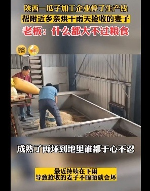
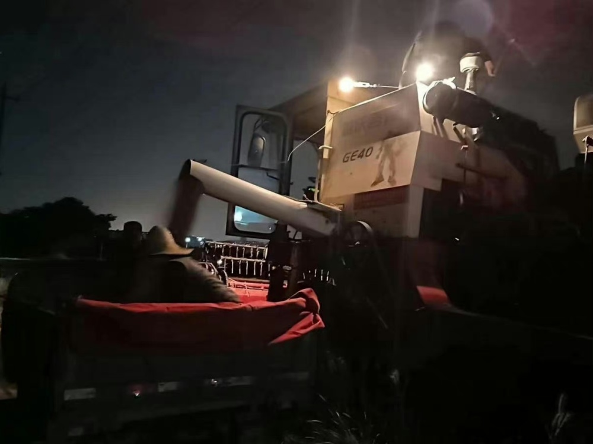

# “烂场雨”刚走，“卖粮难”又来？中国农民种地为何这么难？

**核心要点：**

  * _1_ 小农户应对自然灾害的韧性较强，“船小好调头”，但是小农经济也被看作落后的经营方式，被“现代化”和资本下乡挤压。规模越大风险可能也越大，这场“烂场雨”提醒大家要重新认识农业的风险之患，以及大规模经营的可能弊端。
  * _2_ 一些地方政府出于政绩考虑，喜欢引进大企业、大资本，搞规模化经营。有的大户经营状况好，“利润比自己做生意还高”。有的则因为规模太大、风险太大而亏损。有老板“开着宝马进入，骑着自行车出来”，最后因毁约弃耕而跑路，把麻烦抛给地方政府。
  * _3_ 河南“烂场雨”之后，大家都比较关心是否会出现“卖粮难”的问题，因为虎口夺下来的粮食已经有了出芽、发霉的问题。而流通体系对种植环节的挤压占取也是行业事实，“国家定的保护价，不及粮贩子一句话”。
  * _4_ 遇到天灾，不能让种植者独面风险，地方政府可以通过做好生产服务扶持小农户和中农，比如改善灌溉排涝等基础设施，保证农村晒场空间等，还可以组织分散经营的小农户集体投保，规避可能的天灾风险。

前段时间，北方部分小麦主产区的“烂场雨”引起了全社会的关注和担忧。时逢三夏抢收，奈何天公不作美，广大网民不免“哀民生之多艰”，同时也期待各地政府能够积极作为以解民生之困。

好在近日以来天气晴好，也有很多地方政府积极作为，协调跨区机械服务、开放晾晒场所、联系保险理赔等等，农机手、烘干厂、收购站也开足马力，最大程度地确保颗粒归仓，减少自然风险带来的冲击。也有企业积极参与到抢收工作中来。

_陕西一家企业帮忙烘干（图片来自网络）_

一套组合拳下来，总算是稍解了农民紧皱的眉头，也算减轻了大家对粮食安全的担忧。但这场多年不遇的“烂场雨”警醒我们，要把控好农业发展的方向，也要时刻关心农民处境。

**“鸡蛋不能放在一个篮子里”**

**风险始终是农业生产的命门**

农业和工业生产不同，农业受自然环境影响太大了，哪怕是现在生产技术和设施水平已经达到相当高的程度，农业还是免不了受气候、地域、季节和水土的影响。可以说，自然风险始终是农业生产的命门。
**因此，风险影响着农业生产经营的基本形态。**

我国历史以来形成的小农经济形态，恰是风险约束下传统农业经营智慧的凝结。小农户应对自然灾害的韧性较强，“船小好调头”，遭遇风险时应对能力较强，即便受到灭顶之灾，也能够迅速从风险中恢复过来。

为了应对风险，传统小农采取了很多经营策略。

**一是分散风险，鸡蛋不会放在一个篮子里。**
小农户在粮食种植之外，一定还会有多种分散风险的作物，还会有养殖、手工等等抵御风险的兼业，小农家庭经营中也会拨出一些劳动力从事其他职业，以在遭受风险时家庭内可以调配资源；

**二是抵御风险，**
传统农作中也有很多抵抗天灾的生产技术，比如错茬、间种等技术，比如排涝抗旱，农民不惜劳力看护好自家禾苗，总能够在风险下降低天灾带来的损害；

**三是借助家庭再分配和村社集体的社会互助，实现天灾后的快速恢复。**

可以说，正是这种经营智慧，确保了小农经营方式存续千年，客观上也形成了农业上 **规模小而散、农民群体保守谨慎和农村共同体的守望相助** 特征。

问题在于，一段时间以来，这些特质被通通归纳为“小农思想”、小农形态，小农经济也被看作落后的经营方式，需要被更先进的生产方式所取代。一时间，现代化这一美词被资本下乡、被大规模土地流转和企业式农场所专有，各地的“职业农民”“新农人”也无一例外都是规模化了的、外来的、专业化的主体。

通过这些“烂场雨”，我们可否重新检视一下，规模越大风险越大，是否越“现代”的生产主体越对粮食安全有利？

当然，笔者并不是简单直接地否定规模化经营，而是说，当天灾之剑始终悬挂在经营者头顶的时候，必须要考虑怎么样基于风险约束重构风险化解体系。小农可以通过经营韧性、家庭再分配和村社统筹，规模化了之后呢？况且现在的粮食生产体系已经完全不同了，如果不能通过这场“烂场雨”重新认识农业的风险之患，恐怕大规模经营迟早要引发更大的次生风险。

**“开着宝马来，骑着自行车走”**

**农业风险不应由种植者独自承担**

当前，我国粮食种植领域已经出现了非常大的变化，传统小农式的经营或多或少地都出现了新变化。

**第一个变化是，农业生产已经高度分工，形成了由诸多专业群体构成的复杂经营体系。**
这次河南收麦中最关键不是农民，而是跨区作业的农机手、从事烘干的烘干厂、收粮食的粮食贩子等等。实际上，全国主粮种植中分工体系的生成早已有之，而且部分环节均已高度职业化，他们都是农业的从业者，已经是整个生产体系不可或缺的环节。现在这些主体主要被纳入“农业社会化服务”的范畴。生产环节分工和职业群体生成之后，他们都是在农业链条上分利的，生产剩余被一步步分走后，种植环节利润就非常薄了。
**这也是为何当前“种地越来越不划算”的原因之一，核心问题是种植环节利润被挤压。**

这就导致了 **第二个变化，即从事种植的主体分化了。** 大致有三个形式：

**第一个形态是还能维持传统小农“小而散”但集约程度相当高的形式**
，但从事种植的都是老人，“老人农业”存在的原因是劳动力本身就是剩余的，可以借助“社会化服务”完成繁重活计，老人还能有口粮和收入，同时在村的老人还要做点其他兼业，这样保证在种植利润愈加有限的条件下还能够经营得下去。而且关键是，这批老人还愿意务农。笔者调研中很多务农的老人讲
**“七八十岁务农正当时”** 。需要指出的是，这种形态其实是当前农业经营中的最大多数。

**第二个形态是以家庭为单位的适度规模经营**
，这些务农者或因各种原因不能外出打工，或者在家搞产业还能保持体面生活，所以愿意务农，但他们需要在自家承包地基础上再扩大一点面积，或者接外出务工的亲戚朋友的地种，或者在本乡本土流转一点，达到有限的规模后，这样夫妻二人劳动，置备点小农机，再使用一些“社会化服务”，平时可以做点兼业，这样就能够获得中等收入水平，还能够留在村里。需要强调的是，笔者认为这个可以称之为
**“中农”** 的群体才是最适合的经营主体。

**第三个形态就是通过集中的、大规模的土地流转所形成的农场式经营。**
一些地方政府出于政绩考虑，喜欢引进大企业、大资本，搞规模化经营。而一些城市工商业资本也愿意下乡谋利，因此很多地方现在还有这种超级大户，也出现了“不在村”的农场主群体。

笔者在豫东某县调研时有大户讲，当地气候条件相对稳定，在本地经营小麦+玉米两茬作物，利润率能够达到20~25%，“比自己做生意利润率还高”，因此这个老板将全村千亩地流转过来经营，因为
**“现在做什么生意都不如种地保险”** ，而且能够“只投资不下地”。

需要看到的是，笔者调研的很多地方，更多出现的是大户因为规模太大、风险太大而亏损的案例。有老板说 **“开着宝马进入，骑着自行车出来”**
，因为这种毁约弃耕而跑路，把麻烦抛给地方政府的案例不胜枚举。原因无他，规模大风险也大，一次风险就能让所有投入打水漂。

理解了这些新变化后，大家就能理解， **风险始终是农业经营绕不过去的坎。**

问题是，当产业体系已经高度细分、种植主体分化的背景下，整个体系的风险应该如何分配？

目前来看，种植环节承担了几乎所有的自然风险。问题是，从事种植的最主要群体还是“老人农业”和“中农”，他们化解风险的方式仍是非常传统的小农式化解办法，如果风险应对不利，建基于种植环节之上的庞大的农业产业体系毛之焉附？

河南“烂场雨”之后，大家都比较关心是否会出现“卖粮难”的问题。这种担忧不无道理，因为虎口夺下来的粮食已经有了出芽、发霉的问题。而流通体系对种植环节的挤压占取也是行业事实，米厂、粮贩子出于自身利益会联手压价。

鄂中的一位“中农”告诉笔者， **“国家定的保护价，不及粮贩子一句话”**
。国家粮食保护收购价需要达到相应的水份、纯度才行，而小农户只能把粮食卖给粮贩子，粮贩子一般扣完水分，给与农民的价格就远低于保护价了。

实际上整个“社会化服务”体系在占取农业剩余的时候，并没有相应地承担风险，农业的风险之患还是种植户，特别是小农户在承担。而诸多提供社会化服务的主体则相对旱涝保收，按作业面积计价，不承担自然风险。因此一位由种植大户转行烘干厂的老板说，
**“干烘干厂就是投资大点，但不担风险”。** 实际上，整个社会化服务体系所做的都是在避免承担自然风险带来的干扰，而将种植环节的风险转嫁给农户。

因此一些精明的下乡资本就不愿做种植，而愿意做服务，特别是愿意搞一条龙式、订单式的服务，垄断除种植之外的全部环节。全托管模式就是这样的逻辑。但生产托管之所以还不受农户欢迎的原因之一就是，产业风险分摊不均。因此调研中才有种植户吐槽“大托管就是大忽悠”。虽然社会化服务中的机械作业质量、肥料质量、植保飞防水平等都会影响产量，但服务主体显然是不愿承认这种风险的，风险都转嫁给了种植环节，服务环节则旱涝保收，且牢牢控制了种植环节。
**这样就导致目前主粮生产的体系中，基本是以家庭经营+市场化服务形式出现的。**

_各地连夜抢收_

**“水利不搞好，种田就等于进赌场”**

**应对农业风险，政府可以做的有很多**

天灾免不了，风险少不了，我们能做的，就是如何最大程度化解风险，减少风险带来的损害。这一点上，
**除了从事农业的市场主体之外，政府可以、也应该发挥更好的作用。**

**一是地方农业发展中避免“亲大户、远小农”。** 事实证明，小农家庭经营的韧性依然是化解风险的基础要件，农业经营的风险之患提醒我们，规模并非越大越好，
**地方政府出于政绩亮点，或出于治理便利而引入超级大户，一旦遭遇风险就不免“搬石头砸自己的脚”**
，结果是政府补贴打了水漂、大户亏了本、粮食安全还没法保证，最后毁约弃耕，矛盾甩给地方。

**二是做好小农户为基础的农业生产服务。**
事实上很多粮食主产区的种植者是小农家庭，虽然面积扩大到适当规模，但经营逻辑仍是家庭自耕，具有抵御风险的能力。但遇到天灾，也不能让种植者独面风险，地方政府可以通过做好生产服务的办法扶持小农户、中农。

如基础设施上改善，特别是灌溉排涝的水利配套，鄂中一位种植户就说， **“水利不搞好。种田就等于进赌场”**
，国家每年投入那么多支农资金，完善水利、道路等基础设施应该不难；如很多地方挤占了农村晒场，农民收麦后无法晾晒只能卖湿稻，这个短板也不难补齐。

还有，政府可以做好产业服务，如链接社会化服务来抢种抢收，事实上这次“烂场雨”中有地方就做得不错，积极外出寻找农机服务队。

如农业保险上，保险公司不愿和分散的小农户做生意，小农户也无积极性投保，单家独户理赔太麻烦，笔者调研的一个县，县里农业部门就组织全县分散经营的小农户集体投了保，主要粮食作物政策性农业保险由各级财政承担80%，农户仅承担20%。一旦遇到天灾减产，经过政府组织而形成了规模，保险公司也好定损理赔。当地干部说，“为了粮食安全，这点钱值得投”。

可见，除了传统的家庭再分配、村社互助之外，小农户也可以和保险体系对接，只要政府做组织工作。

**三是提高农业产业的治理能力。**
“三农问题”是全党工作的重中之重，各级地方政府和农业部门也都有治理农业的重任，问题是怎么才能实现“有效治理”，这就是农业治理能力的内涵。

现在很多地方政府要么对小农户置之不理，要么就过度干预，治理手段主要靠做项目，离了项目就不会做工作。

如笔者在皖北某县调研时，三夏大忙机械跟不上，地方政府的包保干部就跑到外县去调机械。河南“烂场雨”中的抢种抢收工作里，很多都是不依靠项目资金的，农业部门只要联系群众，回应群众的急难愁盼，对接好市场服务，这也是农业治理能力的体现。

**四是推动构建一个利益共享、风险共担的产业体系。**
中央文件多次提到要实现小农户与现代农业发展有机衔接，有机衔接的可行路径就是形成利益共享、风险共担的契约关系。很多农业龙头企业在订单农业模式下，需要通过保底线来为农民解决后顾之忧，一些具备集成优势的社会化服务主体，也应建立与种植户的风险分摊机制，避免甩包袱，真正打造良性的农业产业秩序，只有保证种植环节的利益，才能让农业产业体系真正稳定下来。

