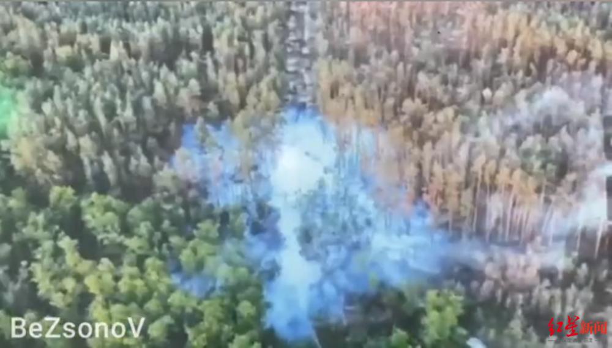
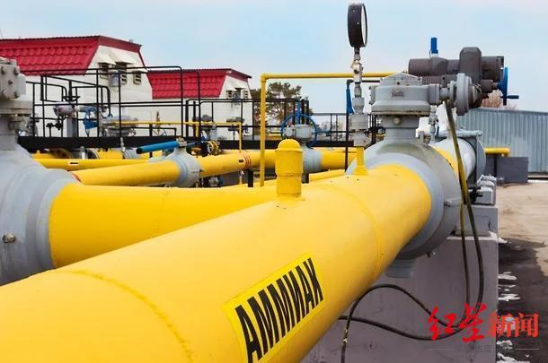

# 俄乌冲突转向破坏基础设施？大坝才被炸，世界最长液氨管道又被炸！剧毒气体外泄

一波未平一波又起。在俄乌双方仍就炸毁卡霍夫卡水电站大坝相互指责之际，乌克兰境内又一重要基础设施被炸毁。大坝爆炸引发的洪水致4万人“流离失所”，而一场“可怕的化学灾难”又在乌克兰北部发生了。

当地时间6月7日，俄罗斯国防部称，乌克兰破坏分子5日晚炸毁了位于哈尔科夫州的“陶里亚蒂-
敖德萨”液氨输送管道，造成平民受伤。但乌方则表示，该管道是被俄军破坏的。

_↑俄媒公布的现场图_

更令人关注的是，管道中的氨气属于剧毒物质，有消息称，已有乌军士兵因氨中毒死亡。此外，这条管道被毁，或将导致本已岌岌可危的黑海运粮协议彻底终结。

**或引发又一场环境灾难**

**已有乌军士兵因氨中毒死亡**

6月7日，俄国防部发言人科纳申科夫称，莫斯科时间5日21点左右，一个乌克兰侦察破坏分子小组炸毁了位于哈尔科夫州马休季夫卡村附近的“陶里亚蒂-
敖德萨”液氨管道，造成平民受伤。

_↑俄媒公布的现场图_

科纳申科夫表示，受损管道内残留的液氨正在乌克兰境内泄漏，俄方将此视作“恐怖袭击”事件，乌克兰发动炮击是为了破坏重新开放管道的协议。

据称，事发地点位于乌克兰哈尔科夫州与俄罗斯交界地区，属于交战双方之间的“灰色地带”。

多家媒体援引哈尔科夫州军事行政长官奥列格·西涅古博夫的说法称，事发当天，俄军连续对该地区管道多段进行了炮击，附近发生6起爆炸，并指责俄方应为此负责。与此同时，乌总统泽连斯基也表示，俄罗斯是“罪魁祸首”，但这是“战争的后果”，而不是炸毁卡霍夫卡大坝一样的“恐怖主义行动”。

由于氨气是一种剧毒物质，会对肺部、喉咙、鼻子和眼睛造成严重刺激，泄漏引发了人们对乌克兰再次发生环境灾难的担忧。有消息称，一团“可怕的毒云”正从爆炸地点扩散，被风吹向哈尔科夫州库皮扬斯基区的乌克兰阵地。据悉，氨气泄漏已导致几名乌军士兵中毒，其中一人因氨中毒死亡，“其他乌军士兵已被命令戴上防毒面罩。”

不过，西涅古博夫称，截至周二晚，没有因管道破裂造成污染的记录，“空气中没有氨气，局势已得到控制。”但乌总统泽连斯基表示，正在计划从三个乌克兰控制的村庄撤离民众。

**“事关全球肥料生产”**

**全球最长液氨管道之一**

氨是硝酸盐肥料的关键成分，而俄罗斯则是全球主要氨出口国。据报道，被炸毁的“陶里亚蒂-敖德萨”液氨输送管道则是俄罗斯出口氨的重要通道。

_↑“陶里亚蒂-敖德萨”液氨输送管道_

“陶里亚蒂-
敖德萨”液氨输送管道建于20世纪70年代，1979年10月首次投入使用，并于1981年全部投产。管道全长2470公里，从俄罗斯陶里亚蒂延伸至乌克兰敖德萨等三个黑海港口，是世界上最长的液氨管道之一，产能可达250万吨/年。俄罗斯通过这条管道输送的氨气可以生产约200万吨肥料，足够种植养活4500万人的庄稼。

这条管道隶属俄罗斯知名企业“陶里亚蒂亚佐特”化学公司，也是全球最大的氨生产商。该公司生产的液氨通过“陶里亚蒂-
敖德萨”管道输送至乌克兰港口装船，并送往全球各国，是全球化肥贸易中的重要和关键组成部分。数据显示，2020年，俄罗斯通过这条管道向欧洲出口了200万吨液氨。

自2022年2月俄乌冲突以来，这条管道一直处于关闭状态，但管道内仍有大量氨气。

6月7日，俄外交部发言人扎哈罗娃在例行新闻发布会上说，据初步估计，修复这条受损的液氨管道需要1到3个月时间，俄方将努力查明该管道爆炸的相关情况。

**黑海运粮协议恐“终结”**

**被炸毁管道是协议关键条件之一**

据报道，这一事件或令本已“岌岌可危”的黑海运粮协议就此“终结”，因为恢复“陶里亚蒂-
敖德萨”管道正是达成黑海运粮协议的关键条件之一。5月18日，黑海运粮协议再次被延长两个月。但俄罗斯外交部表示，如果不消除对其粮食和化肥的出口障碍，俄方将不会同意继续延长协议。

_↑“陶里亚蒂-
敖德萨”液氨输送管道路径示意图_

俄方的要求包括俄罗斯农业银行重新连接到国际资金清算系统（SWIFT）、恢复农业机械和零件供应及服务、取消对保险和再保险的限制、取消进入港口禁令、恢复“陶里亚蒂-
敖德萨”氨气输送管线的工作，以及解除涉及食品和化肥出口的俄罗斯公司的资产和账户封锁。

俄罗斯方面称，黑海运粮协议中允许俄方安全出口氨气，但乌方却拒绝履行协议内容。乌克兰辩称，协议内容不包括俄罗斯在乌境内运输氨气。俄罗斯则认为，氨气的转运“虽然没有从字面上明确说明，但协议的逻辑是隐含的”。

此前，乌总统泽连斯基曾表示，将批准从俄罗斯向敖德萨港运输氨气，但前提是按照“所有人换所有人”的原则交换被俘人员。但克里姆林宫拒绝了这一提议，称氨气和人“不是一回事”。

当地时间6月2日，联合国表示，俄罗斯已通知伊斯坦布尔的联合协调中心，决定在进行氨出口之前，船只在乌克兰港口注册，黑海运粮协议再次被暂停。据悉，联合国已邀请乌克兰、俄罗斯和土耳其开始为俄罗斯通过乌克兰转运氨气做准备工作。

俄军事记者亚历山大·哈尔琴科说，液氨管道爆炸事件就像一出“悲喜剧”。作为粮食协议的一部分，俄罗斯过去几个月一直试图重启这条管道。就在俄罗斯方面重启“陶里亚蒂-
敖德萨”管道有望取得进展之际，这条管道就被炸毁，“这暗示乌克兰武装部队希望确保管道处于离线状态。”

红星新闻记者 徐缓

编辑 张莉 责任编辑 魏孔明

