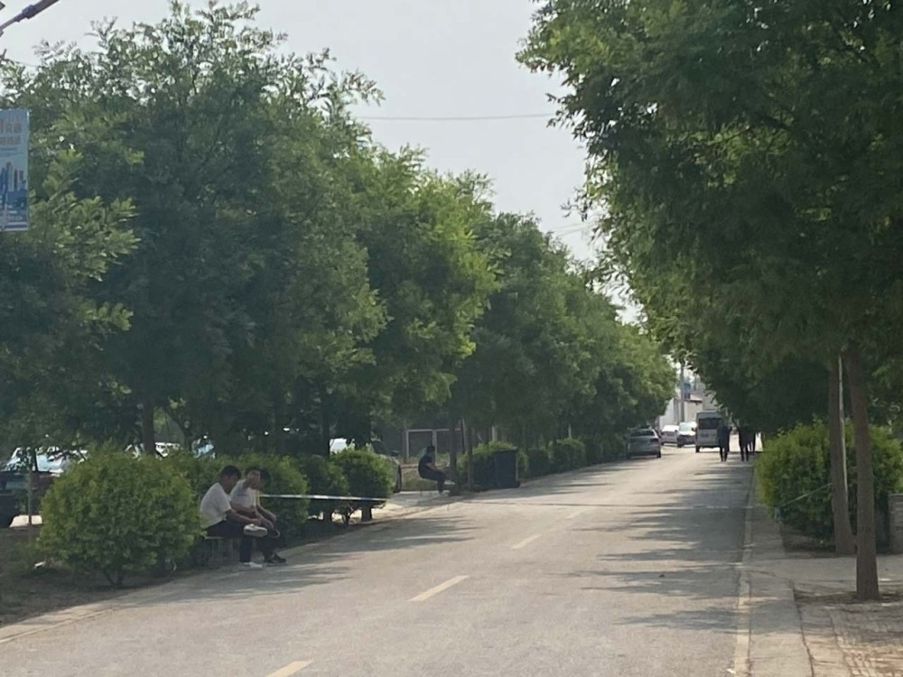
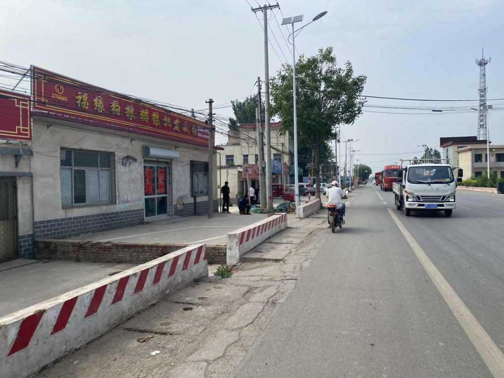

# 全城多次禁令之后，烟花爆竹炸在了小镇派出所

_通往事故点的路口被拉起警戒线，禁止出入。 （南方周末记者 李在磊/图）_

2023年5月26日，河北省廊坊市大城县臧屯派出所发生一起严重爆炸事件。5月27日，大城县政府发布通报称，臧屯派出所民警在对烟花爆竹进行取样鉴定时发生爆炸。初步核查，现场涉及人员11人，其中，5人正在救治，4人无生命体征，失联2人。

这起罕见的爆炸事件，将一个县城的烟花爆竹管理难题呈现在公众面前。南方周末记者调查发现，早在2021年，大城县便禁放烟花爆竹，但是屡禁不止，未能彻底杜绝。在此次极端事件中，如此爆炸威力的烟花爆竹为何会储存在派出所，又因何而爆炸，截至发稿，当地未有进一步信息通报。

6月2日，南方周末记者致电大城县臧屯派出所和大城县应急管理局求证事情原委，臧屯派出所一位工作人员回应称不了解情况，应急管理局称，事故发生后，应急管理局派出人员到现场，但是没有直接参与救援和调查工作，具体情况并不了解。

“这里封锁了”

派出所发生爆炸，立即成为震动大城全县的大事件。

“没想到还有这种事，把派出所炸了。”一位出租车司机的家就住在臧屯镇周边的村落，他向南方周末记者回忆，爆炸发生在5月26日下午4点左右，当天他收车回家路过事故现场的路口，距离爆炸已经过去两个小时，可是还是堵车。

这是华北地区一个寻常小镇。臧屯镇地处大城县中部，距离县城约10公里，国道“京澳线”由北向南横穿全镇。臧屯派出所与镇政府一墙之隔，沿途是错落的临街门面和民居，主要是餐馆、美发店、水果店等各类商铺，民居以平房为主。

据媒体报道，爆炸中心点位于派出所一角，派出所院内满是爆炸后产生的建筑碎块，有车辆被建筑碎块包围。附近一家联通营业厅门窗皆被震碎，屋内到处是碎玻璃，一片狼藉。

上述出租车司机说，那天下午，他看到很多救护车和警车，工作人员拉起警戒线维持秩序。“爆炸威力很大，还有两个人找不到了。”

5月29日，距离爆炸发生已经过去3日，路口的警戒线仍然没有撤除。南方周末记者发现，以派出所为圆心向外辐射，臧屯镇所有出入口都有工作人员值守。“这里封锁了，不让进，也不让拍照。”一位值班人员说。

爆炸打破了当地村民的宁静。“你进不去，路口有人拦着。”村舍四周，便是庄稼地和果园，5月29日下午，一位农妇在打理自家田地，她告诉南方周末记者，她家和爆炸点相隔很近，村民们一直不知道派出所里存放了那么多危险物品，事后回想，大家感到有些后怕。

“声音很大，还冒黑烟。”这位村妇说，爆炸当天下午，她正在家里做家务，听到巨响后，走到院子里一探究竟，发现自家院子里飘落了一地的鞭炮皮，“有红的，白色的，还有很多报纸”。紧接着，派出所爆炸的消息传遍全镇，多位伤亡者当中，还有一位路人，爆炸发生时，他正从派出所外边经过，被一块飞来的砖头砸中遇难。

储存、抽样等有严格规范

据大城县政府通报，爆炸系派出所民警对涉嫌非法买卖的烟花爆竹进行取样鉴定时发生的。

大城县禁止烟花爆竹已有数年时间。早在2016年，大城县便发布了《大城县禁止燃放烟花爆竹暂行管理办法》。此后数年间，又有诸多政府通告发布。通告中，大多提及移风易俗、减少污染、保障安全等禁放原因。这座距离首都160公里、天津70公里的河北小城，近几年，随着京津冀一体化进程加速，禁燃烟花爆竹又有了响应防治空气污染联防联控的政策诉求。

到了2020年3月，大城县发布通告，提出全年任何时间禁止在禁放区域内燃放烟花爆竹，重污染天气预警期间，全县范围内一律禁止燃放烟花爆竹。禁燃力度日益加强。2023年1月17日，大城县又发布了《大城县关于在全县范围内禁止生产储存运输经营和燃放烟花爆竹的通告》。相较于2020年，此公告更加明确了“全县范围内禁止生产、储存、运输、经营”的内容。

“目前不营业，因为没有货，出事前就不让卖了。”2023年5月31日，南方周末记者通过工商登记电话，联系到一位烟花爆竹店老板了解情况，该老板对南方周末记者说，大城县已经全面禁止烟花爆竹，他们家的店面已经停业很久，要跑到衡水市或石家庄市才能拿到货，“现在不可能有”。

“河北很多地方不让放了。”周毅（化名）是当地原来一家烟花爆竹厂老板，在行业内经营多年，她保持着对各个地方政策的敏感。她向南方周末记者介绍，烟花爆竹属于危险化学品，生产、存储、运输、销售的监管非常严格。

“丝毫不能马虎，稍微一不留神，就容易出问题。”她介绍，首先在生产和存储环节，预防安全问题的措施便相当严格。通常而言，车间和仓库的空间要足够大，避免在封闭环境里作业、存储；其次，车间和仓库也要选用专门的防火材料修建，更为重要的是，车间和仓库的选址，要远离人流密集的地方，尤其是居民聚集区，“一般都是在很远很远的山沟沟里”。

因为涉及数量同样很大，所以，针对生产厂家的严格规范和要求，同样适用于批发商。“批发商的仓库，和我们都是一样的。”周毅解释，只有到了终端销售环节，因为存储量大大降低，各方面安全要求才有所降低，但是对终端商家的压货量有着严格要求：“一般不超过100件，相当于不超过两三斤原料用量。”

因为各地政策不同，如果运输车辆经过禁放烟花爆竹的区域时，那么运输车辆须禁停、禁下高速、禁止卸货。“运输车都是专门的危化品车。”周毅介绍，运输车辆需是专门审批的具有消防、防爆、密封性能的厢罐车辆，运行路线也为指定路线。她说，无论是商业经营行为还是执法活动，转运易爆危险品都应该按照这一规范进行。

此外，进行危险爆炸物品的成分、杀伤力和危害性的抽样调查、检测和鉴定，需要专业人员护送到实验室进行，在场人员必须是具备相关资质的专业技术人员，而且必须限定现场人数。“每个环节都涉及安全，马虎不得。”她说。

中国烟花爆竹协会一位负责人向南方周末记者证实了上述说法。他称，早在2009年，国家便发布了《烟花爆竹工程设计安全规范》，2022年12月，住建部在原来基础上，发布了《烟花爆竹工程设计安全标准》。

住建部还强调，烟花爆竹厂房的危险等级，应由其中最危险的生产工序确定，仓库的危险等级，应由其中所存储最危险的物品确定。“正规的都会按照这些标准，一一对应执行。”该名负责人说。

_臧屯镇主干道上人来车往。
（南方周末记者 李在磊/图）_

半成品、礼炮弹

臧屯派出所爆炸事件，对烟花爆竹行业也带来很大震动。“很快就知道了，最近大家都在讨论这个事情。”周毅说，她在网上看到派出所的房屋被炸毁，伤亡数人，还有两个人“失踪”，足见爆炸威力巨大。

周毅分析，通常而言，成品烟花爆竹带有鞭炮皮，以及纸箱、纸盒的内外包装，可以起到很好的阻隔作用，虽然仍然是易燃物品，但是瞬间爆炸的风险很低。“即便是把一整车的烟花爆竹点燃，也不会一下子爆炸。”她说，只有聚集着大量半成品，才会瞬间发生威力巨大的爆炸现象。

在烟花爆竹的类别里，有一类是“礼炮弹”。因为需要把烟花投射到几十米的高空中，所以礼炮弹的威力更大，禁止向普通消费者销售，只有举办大型烟火晚会时，由有资质的专业团队燃放。

周毅说，无论是半成品，还是礼炮弹，通常会出现在生产车间或者仓库内，不会出现在零售烟花爆竹的商店、摊位上。

工商信息显示，大城县烟花爆竹经营企业，都处于注销或者存续状态。大城县应急管理局一位工作人员向媒体透露，县域内烟花爆竹销售许可早已全部收回，县里已经没有生产烟花爆竹的厂家。

根据大城县2023年1月发布的上述通告，对未经许可的烟花爆竹生产、经营，由应急局责令停止非法生产、经营行为，处2万元以上10万元以下罚款，并没收生产、经营物品及违法所得；对未经许可运输烟花爆竹的，由公安部门责令停止非法运输活动，处1万元以上5万元以下罚款，并没收非法运输的物品及违法所得。

这则通告显示，大城县对烟花爆竹采取“一刀切”的政策，全县禁止生产、储存、运输、经营、燃放烟花爆竹。同时，厘清了各个部门的监管职责和范围，其中，涉及违规生产、经营的执法部门，由应急管理局负责，涉及违规运输、燃放的执法机构，则是公安部门。

而根据爆炸发生后县政府公告，大城县臧屯派出所民警是在对涉嫌非法买卖的烟花爆竹进行取样鉴定时发生爆炸，说明涉事烟花爆竹不是涉嫌非法运输和燃放，而是涉嫌非法买卖，应该属于应急管理局的职能范围。

周毅补充说，市场监督管理局、环保局以及消防、应急和公安，都对烟花爆竹生产有一定监督管理职能，因为涉及安全生产，所以烟花生产厂商的直属主管单位是安监局，也就是后来的应急管理局。而到了终端销售环节，因为涉及的数量减少很多，所以更多由公安部门行使监管责任。

“隔行如隔山，不是说哪个部门都可以处理。”湖南省浏阳市一位从事烟花爆竹生产的老板向南方周末记者举例说，磷粉类的原料或者半成品，如果受潮、遇水，便会发生爆炸，所以烟花爆竹的车间、仓库会有严格的通风透气要求。此外，工作人员衣物上的静电也有可能引爆原料或者半成品，所以，在一些生产和储存环节，需要专业人士穿戴消除静电的衣服和手套作业。

他说，涉及烟花爆竹行业的监管部门很多，交通和公安都可以对违法行为进行查处，但是，查处之后的处理，通常会交给应急管理部门。“应该原地封存，交给专门的人处理。”

多头管理、监管重叠

根据当地媒体公开报道，大城县禁止烟花爆竹是廊坊市的统一行动，而此项行动的初衷，是出于环境保护的考虑。

2023年2月，廊坊市发布“重污染天气橙色预警”，并且定于2月4日18时启动II级应急响应。其中，“强制性减排措施”当中的第四条规定，全市区域内禁止燃放烟花爆竹、露天焚烧，市县主城区禁止露天烧烤。

“环保确实也可以管（烟花爆竹）。”中国消防协会理事范强强向南方周末记者介绍，针对烟花爆竹的态度，没有全国性的法律法规，只有地方性政策。禁止烟花爆竹的出发点不同，那么监管侧重点和各个部门承担的职责也有所侧重。

范强强解释，经过实践验证，燃放烟花爆竹尤其是在建筑密集城市内的燃放行为，的确和火灾发生率有直接关联。所以，相较于环保部门，消防部门和禁止烟花爆竹的关联度更高。不过，公安部门也承担着一定程度的防火任务，所以两者之间存在着一定程度的监管重叠。

预防火灾以及涉及危险化学品的生产、处置，专业性非常高，相较而言，消防部门比公安部门更为专业。“之前出现过一种情况，公安部门没处理好，界定责任时说，是因为消防没有给他们做好培训。”范强强说，因为消防专业性很强的缘故，所以，在涉及复杂监管任务时，也会把消防部门列入应急管理范畴，同时，消防保持着自身的独立性。

关于这几个部门在烟花爆竹领域的职责划分，早在2017年，廊坊市政府发布的《廊坊市烟花爆竹安全管理办法》便在第四条规定：公安部门负责烟花爆竹的运输、燃放、销毁处置等环节的公共安全管理；安全生产监督管理部门负责烟花爆竹的生产、经营、储存等环节的安全生产监督管理；其他各相关部门按照职责分工做好烟花爆竹的安全管理工作。

不过，这一规定在实施过程中出现偏差。据大皖新闻报道，大城应急管理局一位工作人员回应称，对于网友提出的烟花爆竹处置问题，应急管理局曾经设立有专门的烟花爆竹处置科室，与公安机关存在交叉管理，“但后来对这块的管理进行了厘清，涉及烟花爆竹的违法行为是由公安机关去处置”。

“的确存在多头管理、监管重叠的问题。”中国消防协会科普教育工作委员会高级工程师郑瑞文向南方周末记者分析，安监局改组为现在的应急管理局，不仅仅只是名字的更迭，其改组的初衷，更多是希望解决多头管理的问题，希望能够理顺监管责任。不过改组后，这一问题仍然没有彻底解决。

郑瑞文说，因为安全生产和消防，涉及很多非常专业性的行为，所以，多头管理、监管重叠、职能重复的问题一旦出现，便会引发很多意想不到的安全隐患。

南方周末记者 李在磊 南方周末实习生 张蔚婷

