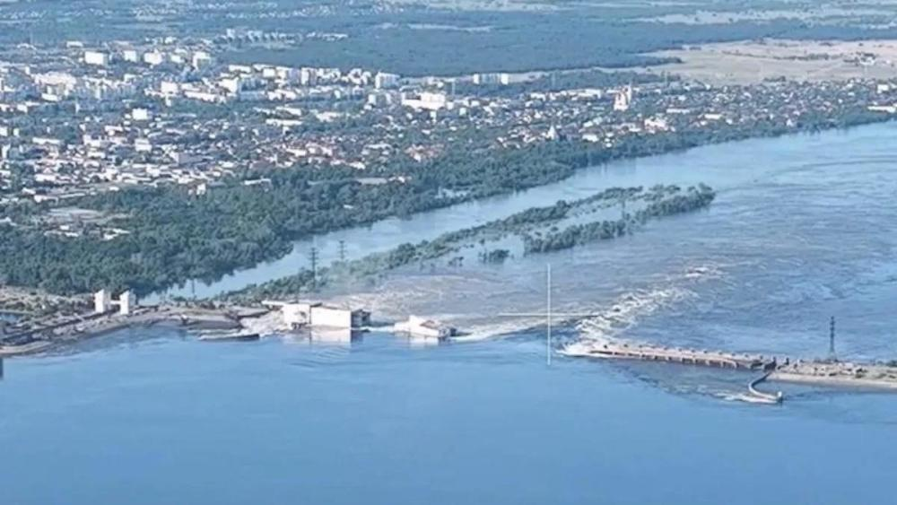
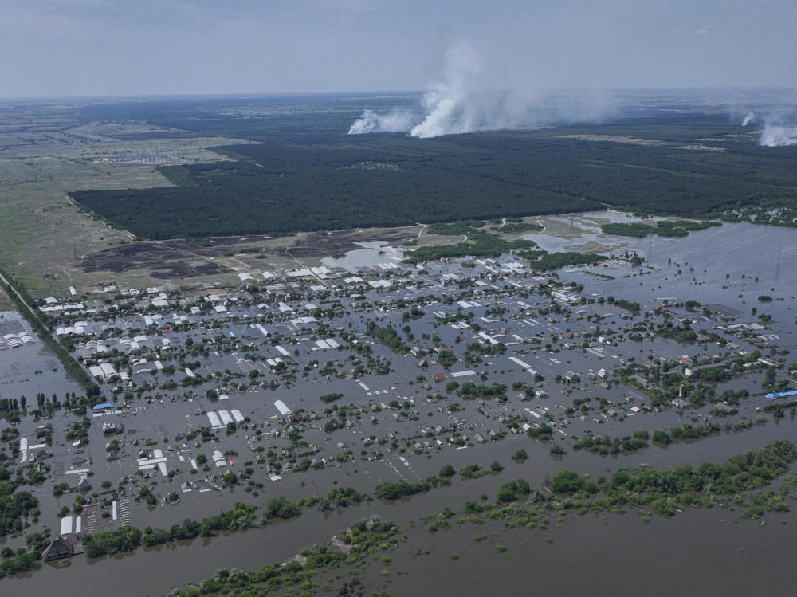
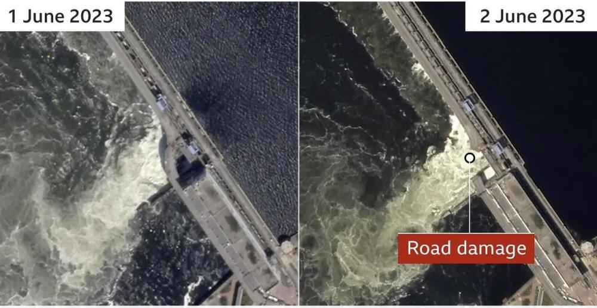

# 到底是什么力量让能抵御核弹袭击的水坝“断成两半”？

当地时间6月6日，位于赫尔松地区、目前由俄方控制的卡霍夫卡水电站大坝6日遭到破坏，水从裂口中涌出，向下游泛滥。

针对卡霍夫卡水电站大坝被破坏，俄罗斯总统普京7日首次公开回应称，乌克兰当局是在西方的建议下轰炸卡霍夫卡水电站。克里姆林宫在一份声明中说，普京在电话中告诉土耳其总统埃尔多安，此次破坏是“导致大规模环境和人道主义灾难的野蛮行为”。乌克兰总统泽连斯基当天表示，他当天也与埃尔多安通电话，在通话中谈及卡霍夫卡水电站大坝遭袭事件引发的“人道主义和环境后果”。

_↑大坝被毁后，洪水泛滥_

目前，俄乌双方均指认对方发动了袭击。美国国家安全委员会发言人约翰·柯比6日表示，美国政府“无法确定”谁应对大坝溃堤负责。白宫7日表示，仍在评估谁应负责。

对于能抵御核弹袭击的卡霍夫卡水电站大坝为何发生坍塌，有专家表示，最大可能原因是“蓄意的内部爆炸”，而英国伦敦大学学院自然地理学教授马克·穆里根则称，还有一种可能是大坝长期遭受炮击致结构受损，再加上水库中的水位非常高，从而发生了灾难性的结构崩溃。

**【现场】**

**600平方公里被淹**

**赫尔松州平均水位达5.61米**

卡霍夫卡水电站大坝具有重要的经济和战略意义，它是乌克兰最重要和最大的基础设施项目之一。正常运行时，它为上游地区和克里米亚提供用水，还为装机容量达5.7GW的扎波罗热核电站提供电力和冷却水，是一道抵御“核灾难”的屏障。国际原子能机构（IAEA）表示，目前没有监测到直接的核安全风险。

据俄乌两方官员7日发布的消息，卡霍夫卡水电站大坝遭破坏后，事发地和受波及的第聂伯河两岸地区共有超过2700居民被转移。俄罗斯媒体报道称，7日最少有7人失踪，赫尔松继卡科夫卡市后于7日亦宣布进入紧急状态。据乌克兰媒体报道援引俄控赫尔松地区官员的话，赫尔松地区有“3人溺水身亡”。

_↑当地时间6月7日，赫尔松地区，卡霍夫卡水电站大坝倒塌后，德涅普里亚尼村的房屋被水淹没
图据视觉中国_

乌克兰媒体报道称，乌控地区官员于6月8日表示，在卡霍夫卡大坝决堤后，乌克兰赫尔松州600平方公里的地区被淹没。其中，68%被淹土地位于俄罗斯控制的第聂伯河东岸，32%位于乌克兰控制的西岸。该官员报告说，截至6月8日上午，赫尔松州的平均水位已达5.61米。乌克兰赫尔松州军事管理局在同一天报告说，西岸的20个定居点被淹没，2629户人家受到影响。他补充说，在俄罗斯控制的东岸，情况“极其困难”。

乌克兰武装部队总参谋部6月8日称，控制赫尔松州第聂伯河东岸的俄罗斯军队没有做好应对卡霍夫卡大坝被破坏的准备，导致人员和军事装备受到损失。美国战争研究所(ISW)
称，大坝倒塌造成的洪水“严重破坏”了俄罗斯在该河东岸的防御阵地，其可能被迫从两个一线阵地撤退。

对于水电站后续的修复，目前俄罗斯和乌克兰的水电领域专家均认为不容乐观，修复费用不是一笔小数目。乌克兰国有水力发电公司的负责人伊霍尔·西罗塔于6月7日表示，重新建设新的大坝和水电站将至少需要五年时间，至少需要10亿美元。

**【分析一】**

**“大坝断成两半”**

**最可能原因是内部爆破**

据报道，多位工程及军事专家认为，用导弹从外部轰炸，或是水坝年久失修自行倒塌都比较难解释水坝被毁的情形。大坝发生垮塌最大可能原因是“蓄意的内部爆炸”，并称这种解释“最有可能，也最合乎逻辑”。

据乌克兰国有水力发电公司的负责人伊霍尔·西罗塔说，位于赫尔松的卡霍夫卡大坝能抵御核弹的袭击。“导弹袭击无法造成这样的破坏，发电站是以能够抵御核弹攻击的标准建造的。”他说，“很明显，大坝内部发生了爆炸，断成了两半。”

_↑相关报道截图_

美国伊利诺伊大学香槟校区的工程学教授、炸药专家尼克·格卢马克称，“即使是发射核弹头，运载能力也是有限制的。所以即使是用核弹直接命中大坝，也可能无法摧毁大坝。”

“大坝确实会发生自行坍塌，（但是）我看到视频后就觉得，‘老天，这看起来非常可疑’。”美国马里兰大学工程系教授格雷戈里·贝歇尔称，有些水坝确实会因为异常大量的水流溢出而坍塌，但通常会从两侧开始崩落，卡霍夫卡水电站大坝却是先从中间断裂。水坝的两侧起初似乎完好，后续才逐渐坍塌。

几位专家警告，目前可得的证据相当有限，不过他们认为，内部爆破是最有可能的解释。封闭空间内发生爆炸的破坏力最强，因为能量全作用在周围的结构上了。用炸弹或导弹进行外部引爆对大坝的作用只有其威力的一小部分，而要达到类似的效果则需要威力大许多倍的炸药。但即便如此，至少也需要成吨的炸药才能炸毁大坝。

**【分析二】**

**长期遭受炮击致结构受损**

**水位升高而溃坝**

五角大楼前官员斯蒂芬·布赖恩则认为，“引爆数吨炸药”不太可能是形成此次破坏的原因。他认为，很少有武器可以直接打破大坝。

他举例提到，去年克里米亚大桥被炸时，“有人试图用水下车辆炸毁大桥的支撑柱”。“主桥支柱没有倒下，这意味着水下爆炸的爆炸力不足以完成这项工作，”他说，“大桥没有被飞机、滑翔炸弹或导弹炸毁，也很少有武器可以打破大坝。”

“此外，大型炸弹不太可能造成我们在视频上看到的那种破坏，”布赖恩提出了一条线索——长期炮击造成大坝结构受损。“应该指出的是，在5月和6月，乌克兰人向大坝发射了导弹和炮弹。据称这些攻击造成了大坝的一些裂缝。”

_↑卫星图像显示，溃堤数日前大坝出现部分破裂_

目前还不清楚大坝何时“首次受损”，但卫星图像显示，溃堤数日前，大坝状况已经恶化了。6月2日，横跨大坝的一条道路被严重破坏。6月6日，可以从卫星图像清楚地看到大坝墙体破裂、附近建筑物倒塌，但水流似乎没有发生变化。

英国伦敦大学学院自然地理学教授马克·穆里根表示，围绕该地区的冲突可能影响了大坝结构。穆里根教授说：“由于与冲突有关的早期破坏的影响而导致大坝产生结构性问题，这仍然是一种可能性。”在一年多的激烈冲突中，卡霍夫卡大坝一再遭到破坏，俄乌双方都反复指责对方炮击了大坝。

根据美国对外农业局进行的卫星图像分析，大坝水库水位在过去几个月里上升。“水库中的水位非常高，再加上以前的破坏，导致水不受控制地流经大坝，可能会导致灾难性的结构崩溃。”穆里根说。

红星新闻记者 邓纾怡

编辑 郭宇 责任编辑 魏孔明

