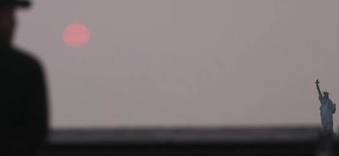
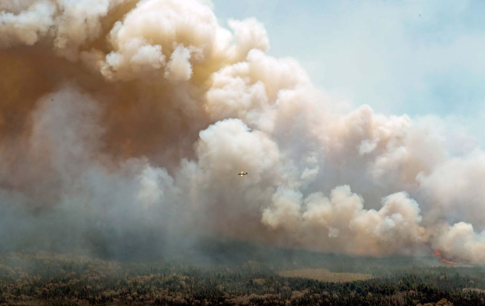
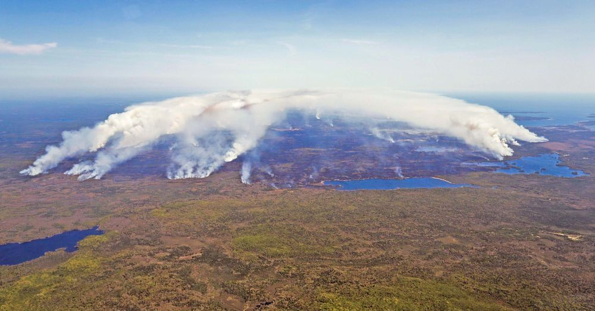

# 加拿大野火连烧10多天：纽约空气爆表，帝国大厦、自由女神像被笼罩

每经编辑：毕陆名

据环球时报6月7日消息，加拿大起火，美国遭殃。

受加拿大野火产生的烟雾影响，纽约市和美国东北部大部分地区6日紧急发布空气质量警报。瑞士空气监测公司IQAir的数据显示，纽约市6日晚成为全球空气污染最严重的主要城市。美国有线电视新闻网（CNN）7日报道称，
**纽约的PM2.5浓度是世界卫生组织设定标准的10倍以上，浓烟甚至笼罩自由女神像和帝国大厦等标志性建筑。**

_加拿大野火肆虐，烟雾蔓延至美国纽约市（美国广播公司视频截图）_

据央视新闻6月8日消息，当地时间6月7日，由于来自加拿大的山火浓烟导致能见度降低，美国联邦航空管理局（FAA）对
**纽约拉瓜迪亚机场发布了地面停飞指令（ground stop）。此前，纽约和新泽西地区的主要航空公司警告，可能会因浓烟而出现航班延误的情况。**

美国联邦航空管理局在声明中表示，“由于山火浓烟导致能见度降低，联邦航空管理局已采取措施管理进入纽约市区的航空交通流量，从中西部和东海岸飞往拉瓜迪亚国际机场的航班已经暂停，飞往新泽西州纽瓦克自由国际机场的航班也有延误”。

加拿大野火，纽约也跟着遭殃

据海外网6月7日援引美国有线电视新闻网6月7日报道，加拿大野火燃烧产生的有害烟雾连日来持续飘往美国东北部，导致纽约市一度成为全球空气污染最严重的主要城市，引发当地居民担忧。

_5月31日，在加拿大新斯科舍省谢尔本县巴灵顿湖附近，一架飞机飞过野火上空（图片来源：新华社）_

**自5月28日加拿大新斯科舍省野火爆发以来，**
火势不仅在加拿大全境蔓延，还导致有害烟雾笼罩纽约市等美国东北部地区。瑞士空气净化信息科技公司网站“IQair”数据显示，
**美国东部时间6日上午和晚间，纽约市空气污染指数在全球所有主要城市中居于榜首。**

野火燃烧产生的烟雾含有PM2.5，这种微小颗粒物被吸入人体后，可以深入肺组织并进入血液，引发哮喘、心脏病等健康问题。6日，纽约市空气中PM2.5的浓度已达世界卫生组织所设标准的10倍以上。

在持续被烟雾笼罩的纽约市等美国东北部地区，当地居民对连日来糟糕的空气质量深感担忧。纽约州中部至少有10个学区于6日当天取消各类学生户外活动，美国肺脏协会等机构也呼吁居民尽量呆在家中。

美多州建议居民避免户外活动

据央视新闻6月7日报道，当地时间6月7日，随着加拿大山火浓烟继续蔓延，美国东北部多个州政府建议居民避免户外活动，防范浓烟所造成的潜在健康风险。

当地时间6日，山火浓烟使纽约市一度成为全球主要城市中空气污染最严重的地区。空气质量检测数据显示，截至美国东部时间7日早上7时，纽约市的空气质量指数略低于180，仍属于“不健康”级别。对此，纽约市长已要求居民避免户外活动；纽约市公立学校遵从政府建议，取消了所有学生的户外活动；纽约州环境官员正为该州居民定期发布空气质量健康咨询建议。

发布限制户外活动建议的还有华盛顿哥伦比亚特区。据空气质量检测数据，受浓烟影响，该地区7日的空气质量无法达到“健康”标准。当地政府已建议儿童、老年人以及患有呼吸系统疾病或心脏病的敏感群体，减少户外活动时间。

_这是5月31日在加拿大新斯科舍省谢尔本县上空拍摄的野火（图片来源：新华社）_

美国气象局称，烟雾对美国东北部的影响将持续到6月8日。预计纽约、费城和华盛顿哥伦比亚特区等地的空气质量将在7日晚些时候出现改善，但东部的波士顿、匹兹堡以及北卡罗来纳州多地的空气质量会进一步恶化。

据新华社6月6日报道，加拿大仍有400多处在燃野火，其中249处处于“失控”状态。加政府官员5日警告，未来几个月火情严峻，东部魁北克省已寻求别国帮助灭火。

受火情持续影响，在过去一个月内，加拿大累计有约12万人被迫疏散，而目前仍有约2.6万人被要求离开住所，撤至安全地点。

一些官员指出，野火持续蔓延主要缘于近几个月异常炎热干燥的天气条件。这种情况预计将持续至8月。

“模型显示，这个夏天可能是特别严重的野火季。”加拿大总理贾斯廷·特鲁多在新闻发布会上说。

加拿大自然资源部长乔纳森·威尔金森说，目前野火过火面积已经达到历年平均水平的10倍。照此形势发展，加拿大很可能迎来“有史以来最严重野火季”。

“每个省和地区都需要在这个野火季保持高度警惕。”威尔金森说。

艾伯塔省、新斯科舍省和魁北克省已经请求联邦政府援助。在魁北克省，官方已经报告160多处野火，其中至少114处处于“失控”状态，已经疏散约一万人。

据法新社报道，来自澳大利亚、法国、墨西哥、新西兰、南非和美国等国约1000名消防员已经抵达加拿大或正在赶来，协助加方灭火。

法新社说，受全球变暖影响，加拿大近年来极端天气频现。

加拿大本轮野火所致污染波及美国东海岸和中西部地区。依据美国国家气象局发布的空气质量警报，密歇根、威斯康星、俄亥俄、宾夕法尼亚、新泽西和纽约等州部分地区受到影响，敏感人群被建议尽可能减少剧烈户外运动。

每日经济新闻综合央视新闻、新华社、海外网

每日经济新闻

