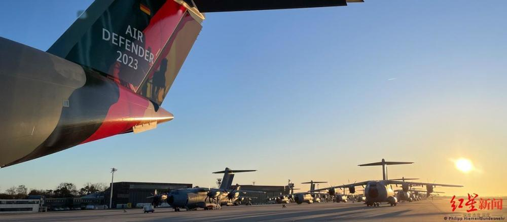
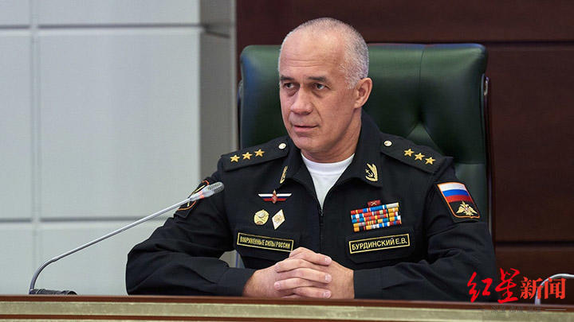
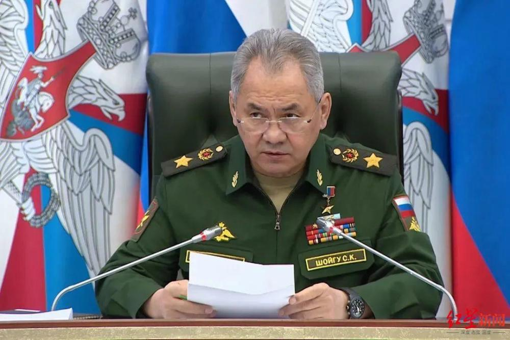
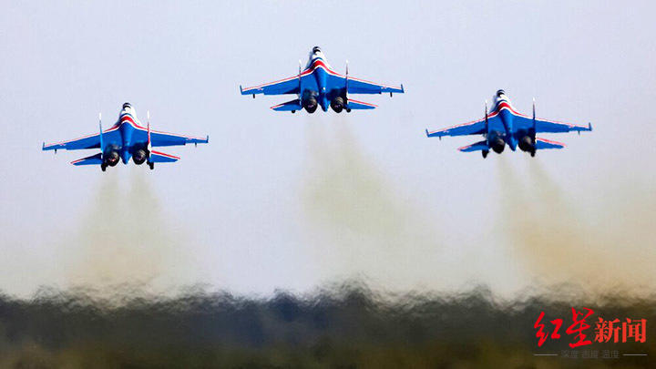

# 北约将举行“史上最大规模空中军演” 俄宣布前所未有扩军计划：增兵至150万

_↑北约“空中卫士23”（Air
Defender 23）演习下周将在德国拉开序幕_

当地时间6月12日至24日，北约“空中卫士23”（Air Defender 23）演习将在德国拉开序幕。

据报道，这将是北约“有史以来最大规模的空中军事演习”，来自25个国家的1万名士兵和250架军机将参加此次演习。美国和德国官员表示，此次演习将“绝对令人印象深刻”。

而就在北约频繁举行大规模军演之际，俄国防部本周宣布了一项“前所未有的扩军计划”。

**北约史上最大空演：**

**瑞典和日本也将参加**

据报道，此次军演将模拟北约成员国遭袭以后的应对，为期10天，共有25个国家参与，其中包括今年4月刚加入北约的芬兰。与此同时，瑞典和日本作为非北约成员国也将参加演习。

根据德国联邦国防军（简称“联防军”）的说明，此次演习将主要在德国主导，大部分课目也将在德国领土及领空进行。而根据一张德国联防军发布的地图显示，一些课目将在与俄罗斯接壤的爱沙尼亚及与乌克兰接壤的罗马尼亚领空进行。

据悉，来自25个国家的1万名士兵和250多架军机将参加此次演习，其中约一半的飞机由美国提供。报道称，美国空军大约将有110架飞机和2000名士兵飞越大西洋，前往欧洲参加演练。此外，预计将有来自北约国家的80架飞机和来自国际伙伴国家的60架飞机参演。

德国联防军表示，此次演习旨在“优化”参与国之间的合作，并展示北约军事集团的“力量”。此外，此次演习与美国主导的另一个名为“保卫欧洲-23”演习时间存在重合。

美国和德国官员表示，演习将“绝对令人印象深刻”。德国空军中将英戈·格哈茨表示，此次军演将表明“北约领土是我们的红线，我们准备保卫每一厘米领土”。他补充道，此次演习旨在展示对俄罗斯的“防御”姿态。

**军演频频：**

**引发俄罗斯强烈反应**

近段时间以来，北约已举行了多场军演。5月29日至6月9日，北约国家在靠近俄边境的北极战略要塞地区举行了“北极挑战-2023”联合军事演习，引发俄罗斯强烈反应。5月29日当天，北约“军刀卫士-2023”大规模军演同时在罗马尼亚启动，来自13个国家的1万名军人和1700件装备参演。

在此之前，5月26日至6月2日，芬兰与美国在芬兰举行联合地面演习。5月15日至26日，北约“春季风暴”大型演习在爱沙尼亚举行，来自北约多个国家的1.4万多名军事人员以及战斗机和直升机等参演。

对于北约频繁在俄罗斯附近地区展开军演，俄《国防》杂志主编伊戈尔·科罗琴科在采访时指出，在当前的军事政治形势下，西方国家的任何军演，都是以“某种方式针对俄罗斯的潜军事行动”。他表示，芬兰加入北约后，该地区的局势“非常紧张”，“考虑到目前俄罗斯和北约的关系，莫斯科和芬兰可能成为直接的军事对手。现在甚至没有人试图隐藏这一点。”

俄外交学院教授弗拉基米尔·维诺库罗夫也指出，尽管北约没有提到演习针对的具体对手，但西方在演练与俄对抗的所有场景。而这些演习出动了大量飞机，无疑将给俄罗斯安全带来威胁。

**俄启动扩军：**

**卫国战争以来从未有过的规模**

为了与北约进行长期对抗，俄罗斯近日宣布了一项前所未有的扩军计划，引发大量关注。

_↑俄军总参谋部副总参谋长叶甫根尼·布尔金斯基_

据俄媒6月6日报道，俄军总参谋部副总参谋长叶甫根尼·布尔金斯基在隶属俄国防部的一本杂志上刊文称，俄军今年将新建2个集团军、1个陆军兵团、1个亚速海海军军区、5个师、26个旅，并成立莫斯科和列宁格勒两大新战区。布尔金斯基称，必须在短时间内完成这些大规模任务。

目前，俄军事委员会的主要任务是根据合同选择公民服役，并将新组建的部队合同兵的配备维持在95%-97%的水平。此外，布尔金斯基还表示，在实施部分动员期间俄军已组建了280多个部队和师团，“这是自卫国战争以来从未有过的规模”。

_↑俄国防部长谢尔盖·绍伊古在国防部委员会扩大会议讲话_

事实上，早在2022年12月21日的俄国防部扩大会议上，俄罗斯国防部长谢尔盖·绍伊古便宣布即将展开大规模改革计划。在宣布将成立莫斯科和列宁格勒战区时，绍伊古称这种需要“是因为北约希望增加其在俄罗斯边境附近的军事潜力，并以芬兰和瑞典为代价扩大北约”。今年1月，绍伊古又宣布计划在2023年至2026年期间对俄罗斯军队进行大规模改革，其中包括将俄武装部队总人数增加至150万人。

一位军事专家称，组建莫斯科和列宁格勒战区是对十年前“轻率地削减了军事单位”错误的纠正。叙利亚战争的经验和“对乌特别军事行动”表明，这两个军区是强大和有效的部队集群。

_↑俄空军战机。资料图_

另一位俄罗斯国防部消息人士透露，为了对抗北约，俄罗斯决定在莫斯科和列宁格勒战区的西部战略方向组建一个新的空中集团军，将有5-6个航空兵团，配备轰炸机、战斗机、直升机等数百架战机，以及装备有S-300及S-400导弹的防空部队、装备新型设备的电子战部队。俄罗斯军事专家称，在芬兰和瑞典加入北约的背景下，俄空天军加强对西部边界保护尤为重要。

此外，为了让黑海舰队可以集中应对北约在地中海方向的威胁，新组建的亚速海海军军区将负责修复俄军控制的马里乌波尔港、别尔江斯克港，并配备岸防导弹部队、火炮部队、包括扫雷艇在内的多型舰艇，全力保障舰队基地安全。

俄军事专家认为，此次大举扩军表明，俄罗斯正在为与北约进行长期对抗及远远超出对乌特别行动边界的新局势紧张点做准备。

红星新闻记者 徐缓

编辑 潘莉 责任编辑 魏孔明

