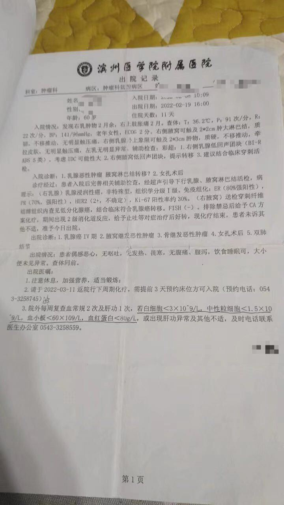
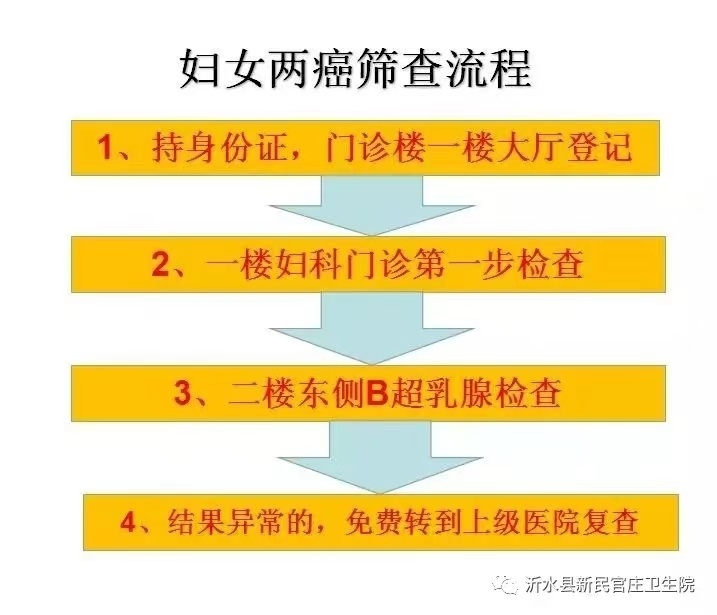

# 女子两癌筛查9个月后查出乳腺癌晚期不幸去世，山东沂水卫健局已介入

近日，山东临沂沂水县诸葛镇石埠子村村民于先生向澎湃新闻（www.thepaper.cn)反映称，他的母亲黄亚琴（化名）2021年5月在当地的新民官庄卫生院做了两癌（乳腺癌、宫颈癌）筛查，不到九个月后在山东省滨州医学院附属医院检测出乳腺癌IV期临床晚期，最终于2022年5月6日因该病离世。

于先生质疑，为何母亲在此前的两癌筛查中没有检测出乳腺癌？

对此，6月7日上午，山东沂水县卫健局办公室一位工作人员告诉澎湃新闻，当地卫健局医政科已介入了解此事。

涉事卫生院相关负责人称，此前筛查结果显示没有问题，患者不到9个月就查出乳腺癌晚期虽不合医学常理，但癌症病情的发展因人而异。

_患者黄亚琴（化名）的出院记录_

**两癌筛查说“没事”，9个月后查出乳腺癌晚期**

于先生向澎湃新闻回忆，2021年5月，母亲黄亚琴在新民官庄卫生院做了例行两年一次的两癌筛查，之后没有接到任何通知，也没有关于彩超等的反馈，只接到卫生院的电话通知说妈妈没事。

于先生说，2022年春节前，母亲总是说不舒服。当年2月18日，他带妈妈前往滨州医学院附属医院检查。检查报告出来后，才发现母亲已经患有乳腺癌IV期临床晚期。

于先生向澎湃新闻提供的山东省滨州医学院附属医院出具的《诊断证明书》显示，黄亚琴被诊断为乳腺癌IV期、腋窝继发恶性肿瘤、骨继发恶性肿瘤等。

于先生说，母亲被确诊为乳腺癌晚期后，总共做了7次化疗，最终于2022年5月6日不幸去世。

于先生质疑，两癌筛查工作不到位，存在漏诊的情况。

针对此事，6月5日，沂水县新民官庄卫生院耿姓副院长告诉澎湃新闻，黄亚琴此前的确在该院做过“两癌筛查”，当时检查结果显示没有问题，因此现场反馈并登记情况后就没有留存相关的彩超结果、检测报告等，该操作是符合政策规定的。

他解释称，患者不到9个月就查出患乳腺癌晚期虽然不合医学常理，但癌症病情的发展因人而异。

此外，该耿姓副院长表示，两癌筛查仅为基础性筛查，如果患者身体出现不适，还是应当及时前往更专业的综合医院进行检查治疗。

_沂水县新民官庄卫生院两癌筛查流程图_

**专家：不能排除筛查漏诊，也有可能是肿瘤长得快**

6月7日上午，山东临沂市沂水县卫健局办公室一位工作人员告诉澎湃新闻，当地卫健局医政科已介入了解此事。

前述工作人员称，他们为于先生提供了几条解决途径：一是做医疗事故鉴定，二是信访，三是进行医疗纠纷调解，四是诉讼。不过由于医疗事故鉴定已超时限，现在无法进行。

中山大学附属第六医院乳腺外科主任李海燕副主任医师告诉澎湃新闻，恶性肿瘤分为0期、1期、2期、3期、4期。0期是最早，而4期属于最晚。一般来说，乳腺癌4期在国内只有30%至40%的存活机会。

李海燕认为，黄亚琴的情况不能完全排除筛查存在漏诊。“按照平均的生长速度来看，一个肿瘤细胞长到一厘米（的肿块），大概需要一年的时间，而黄亚琴没到一年时间肿物已经长至两三公分。”

但李海燕强调，也不能排除少部分非常凶险的肿瘤长得非常快、非常凶狠。

李海燕称，不同地区之间筛查能力差别很大。目前国内对于乳腺癌的筛查大部分选择B超彩超进行筛查，筛查的仪器可能存在差别，医生的能力也有差别。

李海燕表示，医生在进行筛查时应当注意患者是否处于高危人群年龄、有无乳腺癌家族病例史、以及特殊遗传基因突变等情况。

李海燕曾被邀请过参与普及两癌筛查工作宣讲活动。在她看来，开展两癌筛查工作项目本身的出发点非常好，能够及时筛查。如果能够及时发现早期的乳腺癌，可以进行治疗，患者愈后情况也会比较好，治疗的经济负担也会比较小。

李海燕指出，部分地区开展两癌筛查工作不足的地方在于，筛查过于流程化形式化，对于45至59岁这些年龄段的女性可以适当增加两癌筛查工作的投入。

