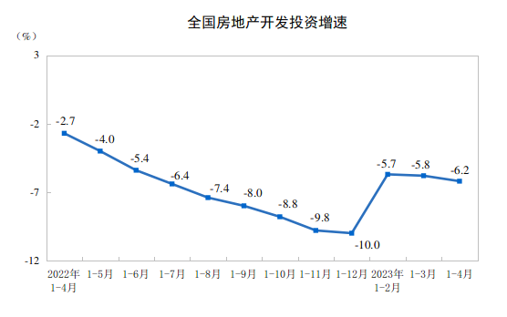

# 经济学家马光远：房地产不需要救，需要耐心

房地产在经历一季度的反弹之后，市场的数据又进入到下行：主要城市二手房交易环比大跌，挂牌量大增，最新的数据显示，作为一线城市的北京，二手房的挂牌量超过了14万套，上海二手房挂牌量达到20万套左右，广州有超过13万套二手房出售，深圳截至5月29日全市共有53829套有效二手房源在售，创近一年来新高。

从房地产主要的指标看，前4个月，房地产开发投资同比下降6.2%，房地产开发企业房屋施工面积771271万平方米，同比下降5.6%。其中，住宅施工面积542968万平方米，下降5.9%，房屋新开工面积31220万平方米，下降21.2%。

其中，住宅新开工面积22900万平方米，下降20.6%。这些指标也意味着，房地产在经历1季度的反弹之后，总体仍然处在调整的周期，而且因为预期不好，包括开发投资增速等指标仍然在下行。

而房地产的下行，很显然拖累了4月和5月份中国经济的表现。

在房地产再次面临调整的情况下，市场又响起了“救房地产”的声音。

有人说，救房地产就是救内需，救中国经济；有人一下子拉出了救房地产的政策清单。从房地产对中国经济的重要性而言，维护房地产市场的稳定当然是必须的选项，关键是如何稳，是必须通过所谓的“救市”的刺激政策来稳定房地产吗？

在房地产的稳定对于中国经济至关重要这一点上，我没有任何疑义，这两年房地产下行引发的一系列连锁反应让很多人再次理性的思考房地产问题。但是，当下房地产的数据不尽如人意，究竟是房地产自身的周期导致，还是政策导致，这是必须搞清楚的。

只有搞清楚了这一点，才能知道出台“救市”的刺激政策有没有用。

如果说，当前的房地产市场的低迷是房地产周期自身演化的结果，坦率而言，出台任何政策都无济于事。

比如，一些四五线城市，房子的确供应过剩，即使出台任何刺激政策，短期可能有效，但由于市场本身处于供过于求的状态，长期而言，救市政策肯定是无效的。

解决市场出现的过剩问题，只能靠市场自己“出清”，任何所谓的救市政策只能导致市场的扭曲，而且会有严重的后遗症。

但如果由于政策的原因，导致整个市场出现了断裂，一些真实的购房需求被抑制，一些有能力的房地产开发企业的融资渠道仍然没有打通，那么，出台政策解决这些问题，对市场而言无疑是必要的。

**但解决这些由于政策本身导致的市场扭曲，很显然不能叫“救市”，而应该叫政策的纠偏。**

从中国房地产目前的表现看，可以说，房地产自身周期与政策的扭曲导致的问题并存。

从房地产自身周期看，房地产20年的大周期已经宣告结束。

**供给侧，开发商的“三高”模式已经走到极致，急需新的发展模式；**

**需求侧，三线以下城市房子普遍过剩，需求饱和；**

**投资端，房地产已经不再是最好的投资品** ，特别是经历三年的疫情之后，经济大周期的转换带动房地产周期的加速下行。

在这种情况下，即使出台所谓的救市刺激政策，一方面效果有限，另一方面，并不利于房地产自身完成“市场出清”。

但是，与房地产自身周期转换对应的，是过去严厉调控时候的房地产政策和当下的房地产市场的走势已经完全背离。

中国房地产市场的区域性决定了，很难有一个统一的全国性的政策来调控全国的房地产市场。一些城市市场很冷，但一些城市市场很热。一些城市供大于求，房子太多，一些城市供不应求，房子不够。

从2017年到2021年，中国房地产市场处在史上最严最长的调控周期，出台了大量的打压房地产的政策，从打压需求，到打压供给，从以“限购”为代表的各种限，到以“三条红线”为代表的直接扼住房地产企业的融资渠道，无所不用其极，这些政策很显然是有效的，导致了市场的降温，并且引发了房地产企业资金链的危机。

从2021年9月30日开始，房地产政策开始转向，市场的快速降温，以及房地产企业的债务危机可能引发的系统性风险让政策终于转向维护房地产市场的稳定。房地产政策开始支持居民自住购房和改善性需求，同时，把防范化解房地产市场的风险作为重要工作。

根据我的统计，2022年全年，全国出台的政策超过了1100个。然而，令人不解的是，一方面出台大量的政策稳定市场预期，但是，另一方面，过去5年出台的大量的严厉抑制房地产市场的政策却大量存在，这就是虽然出台大量的稳定市场的政策而市场依然不稳定的原因。

**等于一方面不断输氧，另一方面却不松开卡住脖子的手。**

以一线和需求依然旺盛的二线为例。四五月，媒体热炒的市场降温，主要是一线和部分热点二线。但是，从需求而言，一线和热点的二线城市并不缺需求，特别是改善型需求。

但是，奇怪的是，尽管高层的房地产政策支持的需求明确是“自住和改善”两种需求，但，我们的政策只体现在支持首套房，改善型的政策一点都没有放松，仍然是严厉调控时的政策。

一些城市实现最严格的“认房又认贷”，一些城市的二套房首付比例是全球最高的80%，二套房的房贷利率远高于一套房，而且在利率上还实行惩罚性的利率，这显然和中央的房地产政策是相违背的。

这等于把改善型需求仍然划入打击而不是鼓励的范畴。

**卡住真实需求的脖子，市场当然没有需求了。**

笔者认为，只要在改善型需求的政策回到支持鼓励的轨道上来，降低首付比例，降低利率，房地产的真实需求起码在三线以上的城市仍然存在，并且目前是主流的需求。

基于此，笔者并不支持那些“救房地产”的口号，因为“救”既不符合房地产市场的事实，也不利于房地产市场的“出清”和长期健康。

**房地产市场不需求刺激，只需求政策纠偏。笔者呼吁：**

**第一，正确认识中国房地产所处的阶段。**

从中国城镇化的周期、房地产自身周期、中国经济大周期，以及中国人均居住面积而言，中国房地产并没有进入“晚期”，而是刚刚进入到中期。

就绝对的住房面积看，按照官方统计，中国城镇人均面积不到40平，这还是包含公摊的建筑面积，抛去公摊，人均面积也就刚过30平，距离OECD认为的房子“够住”的平均水平45平差距还很远。

考虑到中国目前2000年前的房子占一半以上，老破旧的改造量惊人，城市更新和住房升级带来的需求并不亚于过去20年的需求，特别是，新的科技革命，人类对绿色、健康、智能化房子的需求刚刚处于起步阶段，房地产距离“晚期”还很远，那些认为中国房地产会崩盘之类的言论只是情绪的宣泄而已。

**第二，清理不合时宜的房地产政策，松开卡住房地产脖子的手。**

笔者认为，目前是中国房地产调控政策退出的最好的时机。中国已经不需求房地产调控，房地产调控也无法解决房地产未来的健康发展问题，到了该真正落实制度建设，长效机制的时候了。

**限购、限贷、限售等调控措施都应该彻底退出房地产市场，一点尾巴都不留。**

有人担心彻底放开又出出现炒房的。

放心，你现在拿着小手绢满大街喊“大爷，快来玩”都没人敢来了。目前是房地产投资需求最小的时候，这个时候放开，根本不必担心有人炒房，如果有人炒房，那真的是来救房地产的天使。

**第三，真正贯彻支持“改善型需求”的政策。**

降低二套房的首付比例到30%，降低二套房的利率，降低相关税费。这是政策的纠偏，不是救市。

**第四，畅通房地产市场的循环体系。**

支持一些“好的”房地产企业继续留在市场，解决他们的融资问题，解决房地产企业与供应商和建筑商之间的债务问题。

只要市场循环，一切问题都会随着时间解决，一旦房地产企业真的倒下，所有的问题就真的是问题和麻烦。这就是为什么美国每一次金融危机，华尔街总是会被救的原因。

**最后我想说，解决房地产问题需要耐心，需要大智慧。**

中国房地产用了20年发展到今天，解决房地产的问题也需要很长时间，千万不能着急，让市场循环，让音乐继续响起，大家继续在舞池里跳舞，问题才会解决，如果强行让音乐停止，结果是不言而喻的。

**（马光远为民建中央经济委员会副主任）**

