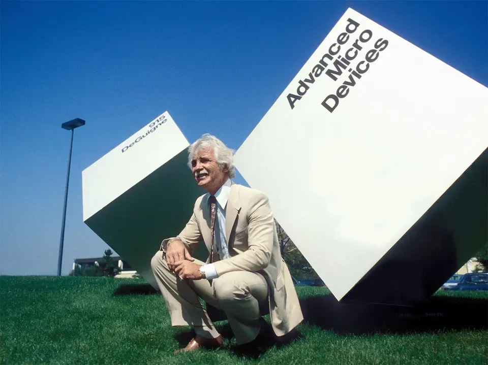

# 苏姿丰欲战英伟达“AI王座”，执掌九年如何让AMD咸鱼翻身？

**划重点：**

  * _1_ AI热潮让英伟达尝到了甜头，市值突破万亿美元。而英伟达的老对手AMD还在努力寻找突破口，AMD CEO苏姿丰也毫不掩饰地表达了想要摘取 “英伟达AI王冠”的野心。
  * _2_ 苏姿丰执掌AMD九年，策划了一次“逆风翻盘”的转变，使这家濒临破产的半导体制造商扭转乾坤，其股价在不到十年的时间里增长了近30倍。
  * _3_ 目前，苏姿丰正在这场人工智能竞赛中的秘密武器，是即将正式发布的用于人工智能模型训练的芯片Instinct MI300，与英伟达争抢客户。

_本期为硅谷封面第十期，由硅谷封面和硅兔赛跑联合发布，聚焦AMD崛起史。未经允许，请勿转载，违者必究。_

正文

随着生成式AI热潮当道，显卡战场竞争依旧。英伟达尝到了甜头、市值一度突破1万亿美元。而作为英伟达的老对手，AMD还在努力寻找突破口。近十年间股价飙升了30倍的它，也想重现当年的逆风翻盘，在AI芯片领域分得一席之地。

在CES 2023展会上，AMD曾展出了一款最新的旗舰加速处理器Instinct
MI300，可用于人工智能运算。这款产品封装了多达13个小芯片，部分采用3D堆叠技术提高密度，总共约有1460亿个晶体管。
**在下周（6月13日），AMD将举行发布会，正式发布MI300这款最新的处理器。**

苏姿丰称，该芯片可以将推理建模过程的时间从几个月缩短至几周。有行业人士表示，MI300的推出也是在针对一个由英伟达占据主导地位的市场，新款AI芯片的推出也看出AMD的“宣战”：与英伟达抢客户。

据MoneyDJ消息，随着发布会临近，美国机构的分析师纷纷对AMD表示看好。研究机构Piper Sandler的分析师Harsh
Kumar表示，他预计AMD Instinct
MI300发布后，有望在第四季度为AMD贡献超过2亿美元的营收。众多投资者都在等待下周的这场发布会，期待AMD和英伟达展开的又一轮对抗，
而在最近外媒的一次采访中，苏也毫不掩饰地表达了想要摘取 “英伟达AI王冠”的野心。

其实，AMD公司在硅谷历史上策划了一次“逆风翻盘”的转变，使这家濒临破产的半导体制造商扭转乾坤，其股价在不到十年的时间里增长了近30倍。接下来，她正为即将到来的人工智能革命做准备，并期望再续传奇。

2014年，53岁的苏姿丰接任AMD首席执行官时，这家芯片制造商正处于谷底之中。公司已经裁员约四分之一，股价徘徊在2美元左右。AMD前高管Patrick
Moorhead回忆道，当时的情况只能用“山穷水尽”来形容。彼时，英特尔开始由于生产延迟和苹果决定不在iPhone上使用其芯片而陷入困境。
**苏姿丰抓住了这次机会，凭借敏锐的战略目光，利用竞争对手的失误，与笔记本电脑制造商联想、游戏巨头索尼等以及谷歌、亚马逊等达成协议。这两家科技巨头的庞大数据中心在去年为AMD创造了60亿美元的销售额。**

其实，在苏姿丰接管AMD后的九年里，AMD从它的“硅谷邻居”英特尔那里抢走了服务器芯片市场份额，并收购了半导体公司Xilinx，这些事情足足让AMD的股价飙升了近30倍。现在，随着人工智能的主流化激起了对机器学习背后的芯片大脑需求，她正面临着一个具有历史意义的机会和一个艰巨的挑战：AMD能否生产出足够强大的芯片，从而打破英伟达在即将到来的生成式AI浪潮中近乎垄断的地位？

**01 执掌九年，从拆分出售到重振AMD**

过去九年里，就像一个游戏发烧友将处理器的性能设置到制造商制定的极限之外，苏姿丰一直在对AMD进行“超频”（指把一个电子配件的时脉速度提升至高于厂方所定的速度运作，从而提升性能的方法）。与许多科技高管截然不同，她是一位世界级的研究学者，拥有麻省理工学院的电气工程博士学位。她将技术天赋、人际交往能力和商业头脑完美地结合在一起，使她成为标准普尔500指数里薪酬最高的CEO之一(2022年的总薪酬为3020万美元)。总而言之，她已经积累了7.4亿美元的财富(主要是AMD的股票)，名列福布斯年度美国最富有女商人排行榜上的第34位。

尽管公司亏损严重、债台高筑，面临潜在的破产，但成为芯片制造商AMD的首席执行官对苏姿丰来说是一份梦寐以求的工作。苏向媒体表示：“我在半导体领域度过了我的职业生涯，并且是一家知名大型的美国半导体公司。我真的很兴奋能成为CEO。”她喜欢可以在百思买(Best
Buy)逛逛，挑选一台笔记本电脑，知道自己公司制造的微芯片或处理器正在为其提供动力。

并不是每个人都会如此热衷。当苏2014年接任AMD的掌舵人时，该公司的股价正朝着历史新低走去。但是，如今成为科技界最有影响力的女性之一的苏喜欢挑战。她说这也是她最初成为工程师的原因。她必须进行大胆的押注——其中一些要五年才能见到回报——来扭转AMD的局面。

这些技术在2020年占据主导地位。但苏姿丰必须从2014年开始奠定基础。苏说：“需要这么长时间的原因是因为它非常复杂。我们最新的数据中心芯片实际上有400亿个晶体管……你必须完全没有错误，这就需要大量的工程工作。”

苏在2014年晋升为AMD的高层时，分析师们都称该公司“不值得投资”，其债务高达22亿美元，其中一些重要资产甚至已经被拆分出售。其芯片制造厂（行业术语中的“晶圆厂”）在2009年被剥离出去，这对于AMD的联合创始人Jerry
Sanders所说“真正的男人都有晶圆厂”的吹嘘来说是一个打击。在2013年，AMD甚至不得不出售并租回其位于德克萨斯州奥斯汀的公司园区，也就是苏姿丰目前的基地。

更要命的问题是，AMD在执行方面上举步维艰。它无法按时发布产品，而英特尔在笔记本电脑市场上除了低端市场外，还与英伟达、高通和三星一起主导着新的智能手机业务。苏姿丰对此承认：“那时我们的技术没有竞争力。”

_AMD联合创始人Jerry
Sanders(上图摄于1979年)，被称为是硅谷早期的一名只会吹牛的推销员。Sanders说：“人们认为我只是吹的厉害而没有实际能力，如果这是真的，那么AMD就不会持续这么久。”_

AMD并非一直让投资者头疼。Sanders在20世纪80年代为IBM制造芯片进入微处理器业务，但在90年代末和2000年代初，情况开始发生变化。一直是一个次要选手的AMD，通过制造处理速度超过英特尔的自研处理器，开始创造了破纪录的利润。

到2014年，那些辉煌的日子早已不复存在。就像在苏姿丰的前任CEO Rory
Read（Sanders在2002年辞去CEO职务）的领导下裁掉了大约四分之一员工一样，AMD在现今240亿美元的服务器芯片市场上曾一度占据了约四分之一的份额。但在2014年，其份额降至2%。在她上任首席执行官的第二天，苏在一次全员电话会议中站到麦克风前，向士气低落的AMD员工传达了一个信息：“我相信我们能打造最好的产品，”她回忆起对员工说的话：“你们可能认为这是显而易见的，但当时对公司来说并非如此。”

不过，与此同时，AMD的又一大对手——英伟达，已成为业内的佼佼者。除了在《赛博朋克2077》等游戏中呈现出令人惊叹的图像外，它的GPU已经成为OpenAI等人工智能公司的首选引擎，其聊天机器人ChatGPT用一座皆惊的拟人化语音回答问题和指令时，令公众喜忧参半。

随着目前人工智能转型的开场秀展开，比尔·盖茨等人曾说，人工智能转型将与互联网的诞生一样举足轻重。市面上对驱动AI的GPU已经形成了巨大的需求，曾有研究公司预测，在未来十年内，制造GPU的公司将获得4000亿美元的巨额利润，但现在实际上只有一家公司。「AI就是英伟达」，Forrester分析师Glenn
O'Donnell说，"这一点已经根深蒂固，AMD必须真正提升其实力以克服这一点。"

2022年AMD的年收入236亿美元，但比起英特尔的年收入为630亿美元来说，仍然相形见绌。英特尔的阴影仍然笼罩在101号高速公路上。即使作为个人电脑的始祖，它也面临着制造延迟、芯片缺陷和领导层变动等问题。

AMD高管Forrest Norrod表示:“AMD有很多优点，但不幸的是，我们有两个世界级的竞争对手。”
Norrod曾帮助DELL建立了价值约100亿美元(2014年营收)的数据中心业务，部分依靠的就是AMD的芯片，他还说，AMD从不认为其竞争对手会让问题持续存在。“我们总是认为英特尔会解决这些问题。”

这一鼓舞人心的号召也使她重振AMD旗鼓： **打造出色产品，加深客户信任，简化公司运作。“这三件事，就是保持简单，**
”她说。“因为如果是五个或十个，就太难了。”

苏姿丰让她的工程师们重新专注于打造超越英特尔的芯片，但芯片设计师可能需要数年时间才能绘制出可行的最终蓝图。研究人员在实验室里辛勤工作的同时，AMD在服务器市场上的份额进一步下降到了5%。“虽然当时公司每况愈下，但他们可正在从事业内最激动人心的设计工作，”她说。“工程师的动力来自于产品，我喜欢把这一点放在最重要的位置。”

另外，苏姿丰决定优先考虑一种名为Zen的新芯片架构，并在2017年最终推出。她自豪地说，“Zen的计算速度比该公司以前的设计芯片快50%以上，真的很好。”更重要的是，它向业界发出了AMD转危为安的信号。到2020年发布的第三代Zen时，它在速度方面成为市场领导者。Zen架构支撑着AMD的所有处理器。

随着她的团队引领新一代芯片的发展，苏姿丰开始不厌其烦的向数据中心客户推销这些芯片。即使在AMD没有芯片可卖的时候，她也已经花了数年时间建立关系网，曾经在德克萨斯州的冰雹中开车四个多小时去和惠普现任首席执行官Antonio
Neri打好关系，“可以说，我对AMD的上一代产品不再抱有幻想，”Neri说。“但她向我展示了她坚持不懈的决心和信念。”

苏姿丰的战略中，有一个重要部分则是与科技巨头签订新的合作协议，这些巨头需要大量的CPU来支持他们爆炸式增长的云业务。"对我们来说，实际上有英伟达、英特尔和AMD这三个微处理器合作伙伴。"谷歌云的首席执行官Thomas
Kurian说。"在我加入Google的时候，AMD根本不是我们生态系统的重要组成部分，而现在AMD是我们非常重要的合作伙伴，这是苏姿丰的功劳。"

去年2月，当AMD的市值首次超过英特尔时，联合创始人Sanders（现年86岁）欣喜若狂。"我给我认识的所有人都打了电话！"他说。"我当时神志不清。我唯一遗憾的是，Andy
Grove不在身边，那样的话我就可以说'啊哈！没想到吧！'" (Grove是英特尔的传奇前首席执行官，于2016年去世）。

1969年，在桑德斯创立AMD公司的同一年，苏姿丰出生于台湾台南，是一名数学家和一名会计师的女儿，她在3岁时与家人移民到纽约市并选择在麻省理工学院学习电气工程，因为这似乎是最困难的专业。当时负责麻省理工学院纳米结构实验室的Hank
Smith说，作为一个在技术天才，她也很善于处理人际关系，当同学之间发生分歧时，她会扮演和平使者的角色。

苏姿丰在听到自己被形容为「与人很好相处」时笑了起来。她开玩笑说：“好吧，那是相对于其他麻省理工学院的人来说。”她补充道：“我不认为有人会说我是一个外向的人，但沟通是我工作的重要组成部分。”

在德州仪器(Texas
Instruments)工作了一段时间后，1995年，她被聘为IBM的一名研究员，在那里她协助设计了一种芯片，通过使用铜电路代替传统的铝电路，芯片的运行速度提高了20%。高层很快发现了她的才能：1999年，在铜技术推出一年后，IBM当时的首席执行官Lou
Gerstner将她任命为他的技术助理。在20年后的第一次采访中，Gerstner告诉福布斯，他最初担心苏姿丰的资历太浅，但他的疑虑很快被打消。"事实证明，她是在我办公室工作过的最杰出的员工之一。她从不循规蹈矩
--她的整个职业生涯都在不断打破常规"。

这次任命让苏姿丰有机会亲眼目睹一场企业转型，这场转型如今已成为商学院的经典案例之一 ——
转型成功在一定程度上得益于依赖公司的规模并创造了一个专注于客户的文化。在执掌IBM的近9年时间里，Gerstner使停滞不前的IBM市值增长了近六倍。她还尝到了做交易的滋味，帮助IBM在2001年与索尼和东芝签署了一项联合协议，将其芯片用于索尼的PlayStation
3。

早期，她有时会担心自己没有资格与商业巨头们并排而坐，但苏姿丰很快意识到，她所学到的技术知识使她在与高管级别的人相比更具优势。她在2017年母校的毕业演讲中表示：“我看到麻省理工学院的博士在为哈佛商学院的MBA工作，而事实上，这对我来说完全没有意义。”如今，哈佛的新纳米技术实验室也以她的名字命名。

2011年底，时任AMD董事会成员的Nick Donofrio打电话给苏姿丰，两人曾在IBM相识，当时苏姿丰已经是芯片制造商Free-
scale的高级副总裁（这家位于Austin的芯片制造商现已并入NXP半导体）。两人共进晚餐，在一瓶Brunello葡萄酒的陪伴下，Nick
Donofrio向苏说：“加入AMD吧，这不仅是追求渐进式改进的机会，而且是重新创新和革新的机会，你和AMD具备实现这一目标的基础。”

几天后，苏姿丰接受了AMD全球业务部门高级副总裁的职位。在她入职两年后，她开始管理整个公司——这使她成为一家大型半导体公司的第一位女性首席执行官。

她回忆起自己早期从事工程师的日子时说：“即使我是一个25人房间中唯一的女性，我也会毫不犹豫的走进去。我非常鼓励年轻的女工程师留在工程领域。”

当苏姿丰刚接手时，她飞往比佛利山庄亲自邀请AMD的Sanders先生与她的团队交流。桑德斯回忆说，苏的邀请让他很感动，但他婉拒了，并告诉她“现在不再是我的团队，而是你的团队。”不过，作为一个销售员，他也提出了一个交换条件：一旦公司连续两年盈利，他会亲自前来拜访。2019年，正值公司50周年纪念，Sanders兑现了这个承诺。

半导体大佬Mark
Papermaster在苏姿丰的领导下，见证了AMD的惊人转型。曾领导过苹果的iPhone和iPod工程团队的他几乎与苏同时加入的AMD，并为另一位转型“艺术家”Steve
Jobs工作过，乔布斯使苹果免于灭亡，并使其成为世界上最有价值的公司。“从很多方面来说，Lisa的任务更加艰巨，”Papermaster说。“如果你不是创始人，你就必须建立自己的信誉和愿景，并带领整个公司、客户和投资者一起前进。”

苏姿丰在AMD的成功使她成为年轻工程师的榜样，也受到投资者的推崇，这也使她成为了一个meme（网络流行语，指模因）。几年前，关于苏使用AMD的Ryzen芯片变身超级英雄或从眼睛射出激光的8位动画在Twitter上疯传。在她的办公室书架上，有一个以她的形象设计的身穿橙红色盔甲、头盔在身旁的小雕像，是E3游戏展上一位粉丝送的礼物，非常显眼。“这可能是我职业生涯中最有趣的时刻之一，”苏说，“我虽然是Twitter和Reddit的忠实用户，但并不‘热衷于meme’。这不是我的菜。”

_目前，苏姿丰正在人工智能战争中与Nvidia“对抗”。她的秘密武器是：Instinct
MI300（如图所示），这种芯片将传统的CPU与经常用于游戏的GPU处理器融合在一起。_

**02 与英伟达的竞争**

AMD与英伟达的战争就一直没有停止过。AMD是一家历史更悠久的公司，其历史可以追溯到50年代后期（成立日期是1959年5月1日）。而英伟达的竞争大约只有AMD的一，但这位新晋的玩家已经成为显卡行业的霸主。

苏姿丰已经为AMD注入了新的活力，她专注于确保其在一个竞争激烈市场中的未来。在她努力重建其业务的同时，英伟达联合创始人兼首席执行官黄仁勋也正在努力使他的公司成为人工智能计算能力的首选供应商。

黄仁勋是苏的远房亲戚（据中国台湾媒体报道，苏姿丰的外公与黄仁勋的妈妈是兄妹关系），他认为出售芯片来支持ChatGPT等人工智能工具是一个「金矿」。人工智能对芯片的需求已经将英伟达的股价推至接近历史高点的水平，预期市盈率约为64倍，几乎是AMD的两倍。Bernstein分析师Stacy
Rasgon表示:“这就是投资者关注AMD的原因。因为他们想要‘穷人版的Nvidia’，”伯恩斯坦的分析师斯泰西·拉斯贡说。“也许市场太大了，他们不需要互相竞争。”

但苏打算竞争。她希望通过押注年度芯片升级来挑战以人工智能为中心的Nvidia H100
GPU，以提升AMD的地位。在她的领导下，研发支出增加了近4倍，达到50亿美元，几乎相当于她接手AMD时的全部收入。

美国田纳西州橡树岭国家实验室的一台新超级计算机是苏的心血之作，该计算机在2022年完工时成为世界上最快的计算机。这台突破性的机器是为了拥有每秒至少百万亿次计算的处理能力而建造的，是AMD人工智能芯片的一个展示窗口。她还吊了一下大家胃口：MI300芯片将于今年推出，该芯片将CPU和GPU融合在一起，以对抗Nvidia的新超级芯片。

行业人士认为，AMD并没有逃避竞争，而是基于自身的CPU优势，选择在APU上重点发力，与英伟达的核心产品A100/H100形成差异化竞争。AMD的下一代产品MI300APU芯片集成了CPU和GPU，晶体管数量达到了1460亿个，还包含128GB显存。

她还通过收购等手段对抗英伟达，例如在2022年以488亿美元收购了Xilinx，这家公司生产的可编程处理器有助于加快视频压缩等任务的速度。作为交易的一部分，Xilinx的前首席执行官Victor
Peng成为AMD的总裁兼人工智能战略负责人。

除了英伟达之外，还存在其他新兴威胁：一些AMD的客户已经为了减少对半导体巨头的依赖而开始进行自己的芯片开发。例如，亚马逊在2018年为其AWS业务设计了一款服务器芯片；谷歌花费了将近十年时间开发自己的人工智能芯片Tensor
Processing
Units，用于帮助“读取”其流动街景相机捕捉到的标志名称，并为公司的Bard聊天机器人提供强大的计算能力。连Meta也计划开发自己的人工智能硬件。

苏对她的客户有一天可能成为竞争对手的担忧不以为然。她说，随着公司寻求在运营中提高效率，想要开发自己的硬件是一种自然行为。但她认为，在没有AMD几十年建立起的技术专长的情况下，他们能做的事情有限。“我认为我们的任何一个客户都不太可能复制整个生态系统。”

在人工智能芯片市场上，苏占据了有利地位。但她深知转机可能很快变为失败。要确保AMD经久不衰，还有更多工作要做，她说：“我认为AMD还有另一个阶段。我们必须证明自己是一家好公司，我认为我们已经做到了。至于如何再次证明自己的伟大，并为世界做出持久贡献，这对我来说是有趣的问题。”

***「硅谷封面」系列聚焦硅谷科技大公司动态、科技大咖访谈、重磅研究报告等，旨在为科技资讯爱好者提供全球最前沿的深度好文。**

**相关参考：**

Lisa Su Saved AMD，Now She Wants Nvidia's AI Crown（Forbes）

**文末互动：**

你认为AMD在其不断上升的市场份额的助力中能否比肩英伟达？欢迎在评论区留言，和我们一起探讨交流。

