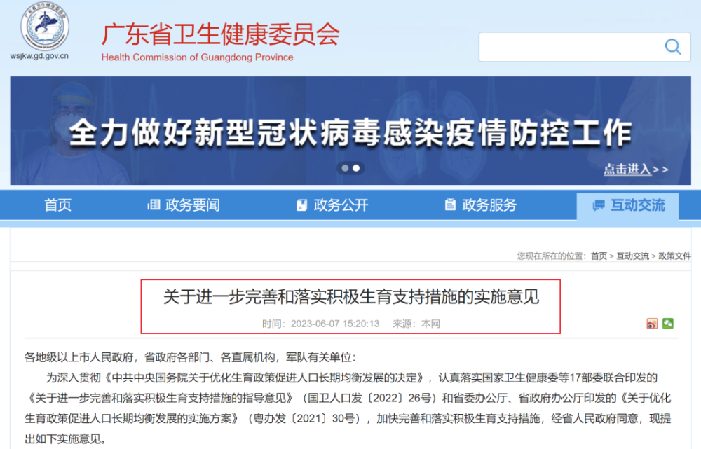
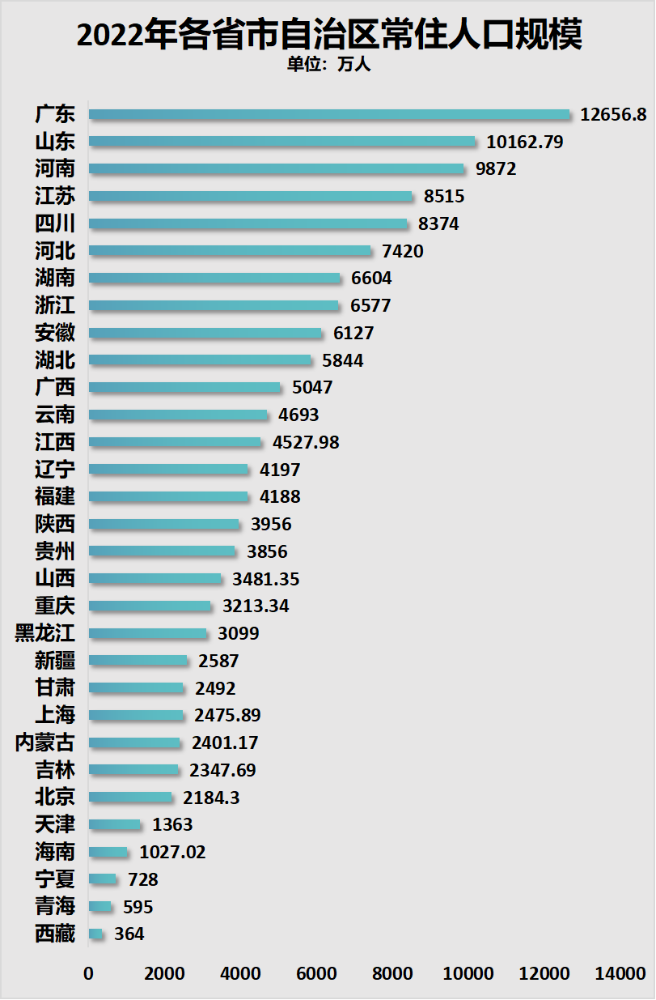
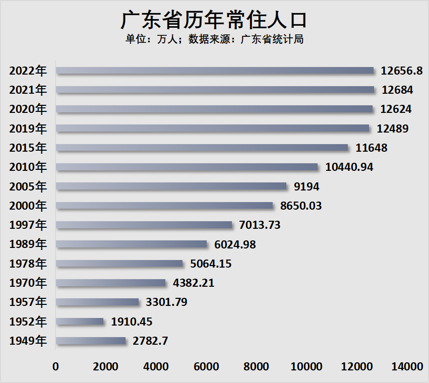
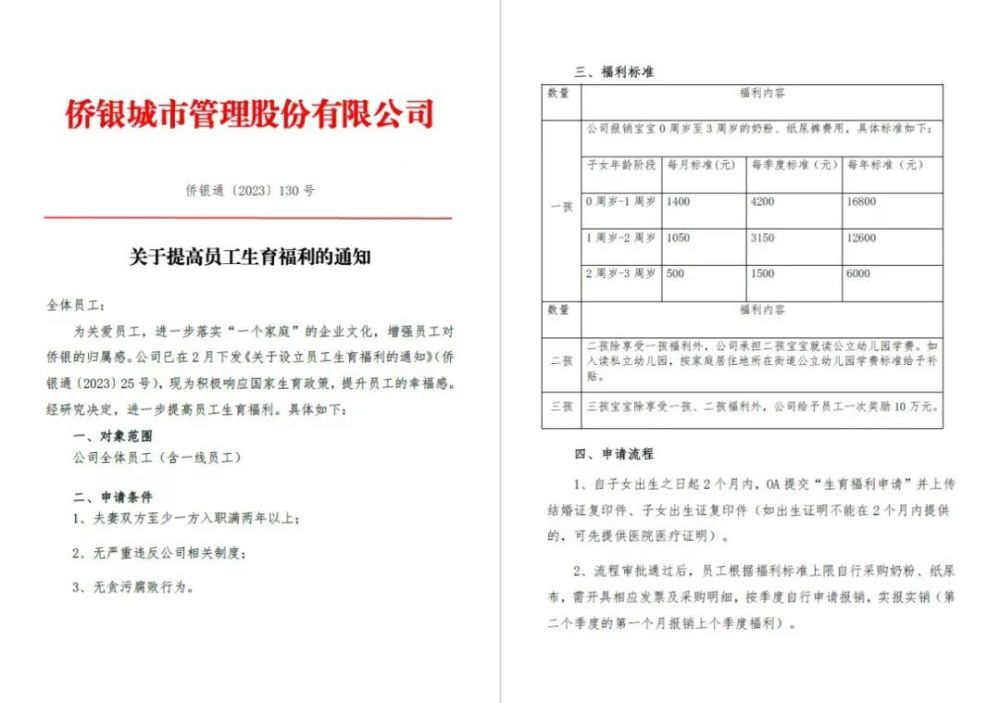
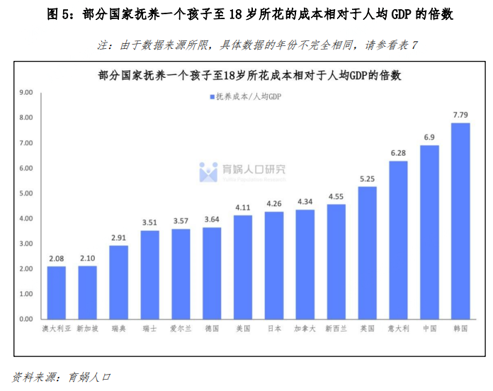

# 17部门联手催生！人口第一大省，急了

**作者：子非鱼**

**​01 |人口第一大省催生**

面对常住人口历史性转向，中国经济第一强省、人口第一大省广东，也开始催生了。

6月7日，广东省卫健委、财政厅、发改委、住建厅、民政厅、教育厅等17个部门联合发布了《关于进一步完善和落实积极生育支持措施的实施意见》，开启了鼓励生育模式。

_来源：广东省卫健委_

文件提出了18条鼓励生育措施。其中并无什么新颖的措施，无非还是那些不痛不痒、烂大街的招数，比如完善托育、财政、税收、保险、教育、住房、就业等方面的生育支持措施。

在托育方面，文件提出，巩固提升学前教育“5080”攻坚工程，逐年增加公办幼儿园学位供给，“十四五”期间新增33万个以上公办幼儿园学位，新建、改扩建2500所公办幼儿园。新建住宅小区的配套幼儿园设立为公办幼儿园。

若实在要找一个亮点，那就是文件提出：

**加快完善住房保障体系。加快发展保障性租赁住房，促进解决新市民、青年人等群体住房困难。进一步完善公租房保障对促进积极生育的支持措施，各地在配租公租房时，对符合条件且有未成年子女的家庭，可根据其未成年子女数量，在户型选择方面给予适当照顾。**

**实施精准购房租房倾斜政策。住房政策向多子女家庭倾斜，对在缴存城市无自有住房且租赁住房的多子女家庭，可适当提高租房提取额度，或按照实际房租支出提取住房公积金；对购买首套自住住房的多子女家庭，有条件的城市可给予适当提高住房公积金贷款额度等相关支持政策。**

简单理解，就是在住房和租房方面，给予多孩家庭优惠与照顾，比如提高公积金贷款。

**02 |人口历史性转向下的广东**

这些小恩小惠在生娃养娃的费用面前，杯水车薪。扭转不了人口下行的趋势。

2022年，伴随着全国人口历史性见顶转向，广东省人口也历史性转向了。

广东省统计局披露，2022年年末广东省常住人口12656.8万人。

这一数字，依旧稳稳当当位居全国第一。

_制图：城市财经；数据：各省市自治区统计局_

**但是，这一规模和去年相比，减少了27.2万人。**

我仔细查看了一下广东省统计局披露的历年人口数据，发现这是自1952年之后，广东省人口首次出现负增长。

1949年广东省人口2782.7万人，1951年降到了1910.45万人，此后一路增长。1957年突破3000万，1970年突破4000万，1978年突破5000万，1989年突破6000万，1997年突破7000万，2000年突破8000万，2005年突破9000万，2010年突破1亿，2015年突破1亿1千万，2019年突破1亿2千万。

_制图：城市财经；数据：广东省统计局_

同时，广东省统计局还披露，2022年，广东省全年出生人口105.20 万人，出生 率 8.30‰；死亡人口63.00万人，死亡率
4.97‰；自然增长人口42.20 万人。

自然增长人口42.2万，常住人口却减少了27.2万，这意味着去年一年广东省人口流出了69.4万人。

当然，广东省人口出现历史性减少，偶然因素为主。主要是因为去年疫情之下很多人口出现了回流，回流到中部和西部地区。

之前本号就梳理过各省市人口变化数据，东南沿海经济发达地区的省，人口都在降档换速。而中西部地区的人口有的增量在扩大，有的甚至扭转了此前的负增长，人口开始增加。

但是，无法否认一点的是，广东省出生人口虽然仍位居全国第一，自然人口增长仍为正数，但是出生人口与自然人口增量均创下历史新低。

我仔细查阅了广东省统计局公布的1978年以来的数据，结果可以看到：

**2022年广东省出生人口105.2万人，是1978年以来的最低值。出生率8.3‰，1978年以来历史最低。自然人口增量42.2万人，1978年以来历史最低。**

_制图：城市财经；数据：广东省统计局_

过去全国人口不断增长，有增量蛋糕，作为经济、产业、金融、科技、外贸最强的广东省，不愁没有人口。

事实也是如此。七普数据显示，2010年至2020年，广东常住人口增加了2169万人，平均每年增加216.9万人。

然而如今全国人口见顶转向，不仅没有了增量蛋糕，就连存量蛋糕也在不断缩小，这时候人口竞争会比之前更加激烈。

尤其是中心城市的人口争夺战，会越战越酣。

但是，仅靠争取存量还是不能解决根本问题，必须提高生育率，努力让人口蛋糕出现增量，或者说至少努力延缓人口蛋糕缩小的速度。

这是广东省17个部门发布文件，出手鼓励生育的根本意图。

**03 |新三座大山才是关键**

过去几年，很多城市都出台了鼓励生育措施，但大同小异，无非是给生育津贴，给产假，努力建设托育机构等等。

过去一年也有不少企业出手鼓励自己的员工生育，比如上市公司侨银股份近日正式公布了《关于提高员工生育福利的通知》。

我粗略计算了一下，生一个娃可以获得3.54万元补贴。生两个娃可以获得约7.7万补贴，生三个娃可以获得约21万的补贴。

但这样的企业毕竟是少数，而且即便力度如侨城股份，相比于生娃育娃成本，也只是泰山一抔土而已。

去年育娲人口披露数据，中国目前的平均养娃到18岁的成本是人均GDP的6.9倍，位居世界第二，仅次于韩国。这意味着，中国的人均养娃成本可能不是最大，但压力绝对是全球前列，毕竟韩国虽然成本最大，但收入比我们高很多。

分省市来看，养娃压力最大的是甘肃，养大一个娃到17岁，需要耗费一个家庭16.2年收入，相当于每年的家庭收入都投入到孩子身上了。

_制图：城市财经；数据：育娲人口、国家统计局_

压力最小的西藏，养大一个娃也需要耗费一个家庭11.75年的收入。需要说明一下的是，这里面还不包括买房。

面对如此压力，尚未富裕的我们，能有多少生娃养娃的力量。

这些压力得不到缓解，人口趋势就不会改变。最近有机构预测，2023年的出生人数可能会跌破800万。

人口减少，短期内首当其冲的便是高价学区房。

新生儿数量减少意味着什么？意味着学区房需求减少。买房的主要推动力，其实就是小孩上学、结婚、刚性居住与炒作。

当结婚的人逐渐下降，新生儿数量不断减少，学区房的需求就滑落。

高价学区房的泡沫，泡沫破灭已经进入了倒计时。

