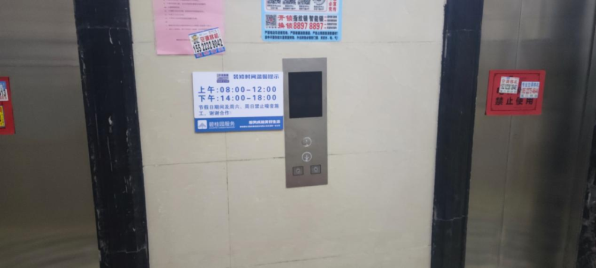
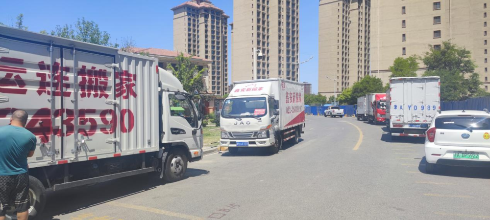
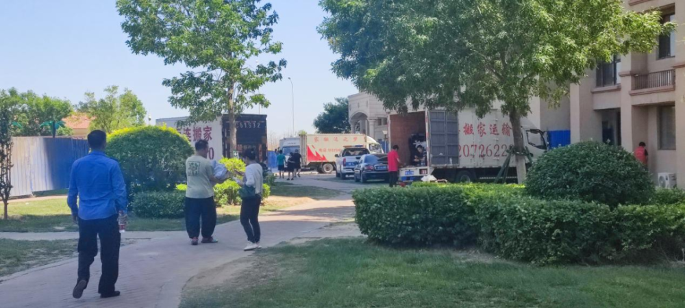
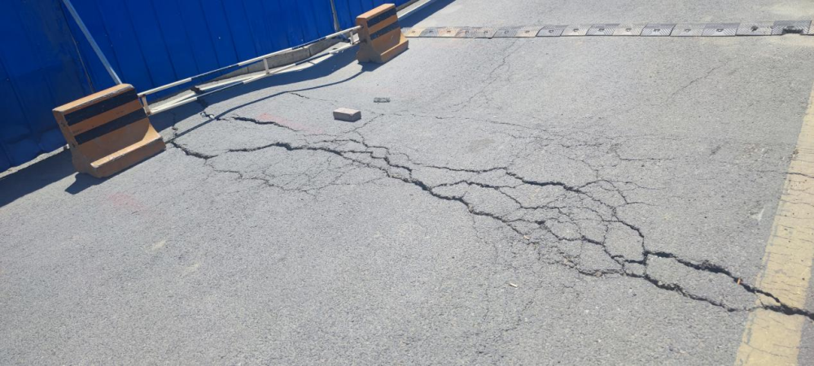
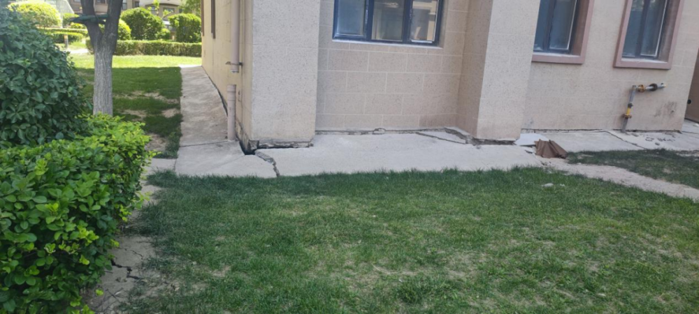

# 天津碧桂园地面沉降一周后：裂缝蔓延墙外，业主爬楼取物

**作者 张若庆**

**编辑 覃拓**

**运营 陶子枫**

造成沉降的原因仍待论证，但裂缝疑似仍在蔓延。

距离天津碧桂园出现地面沉降现象已有一周，对于事故成因，参与抢先工作的专家组有关专家在回复媒体采访时表示，推断1300米深度以下疑似存在地质空腔，不排除地热井打井施工触及了深层地质构造，从而导致涉事地区浅层水土流失，出现地面沉降等现象。

此外，《橡果商业评论》就有关抢险工作进展一事询问了有关方面的工作人员，但均得到“只能等官方消息”的答复。

多位业内人士对《橡果商业评论》表示，“造成如此大面积地面沉降的可能性确实有很多，现在网上也有各式各样的说法，但是大部分人都是没有数据与资料的，只能说是靠经验去猜测，而分析造成地面沉降的原因是不能靠猜的，每个场景的变量都很大。”

对于目前抢险工作的进展，《橡果商业评论》致电相关部门，但得到的回复均为“目前专家组还在调查阶段，一有进展就会在官方平台及时发布。”

**一：“搬”与“不搬”成难题**

不论成因如何，受影响的房子目前已经是无法居住的状态，而对于高层住户来说，想将自己的东西全部搬走也是一个难题。

“一个家在武清的十楼业主，搬了两趟车花了将近7000块钱。”一名现场的工作人员对《橡果商业评论》表示。

从开始允许搬离至今已时隔数日。在此期间，无论是业主还是工作人员对于动辄上千元的搬家费用都已见怪不怪。在无法使用电梯的当下，要从最高二十多层的地方人工搬下大件家具，这笔费用也着实是笔“辛苦费”。

_某涉事楼栋的电梯已无法使用 张若庆/摄_

对于搬家公司们提出的价格，住在25楼的业主老吴（化名）在对《橡果商业评论》表示理解的同时也无可奈何。“搬两个机器和两张床就要3000块钱，快赶上新买一套的费用了。但今天过来后感觉房子应该塌不了了，就不折腾了。”

而与老吴做出同样选择的业主并不在少数。让他们犹豫的除了动辄大几千的相关费用，在楼下频繁来往的现场工作人员也减少了几分他们对于塌房的担忧。“如果真要塌了，他们还会在这吗？现在搬走说不定到时候还得搬回来。”

对于搬家产生的高昂费用，现场工作人员也同样无奈。“目前我们是安排了业主住酒店以及提供餐食。现在是有需要回家取东西的可以随时来拿，但搬家的费用是需要自己去承担的，因为每个人的需求都不一样，这方面现在还没有安排。”

_有事发楼栋的业主自行搬离 张若庆/摄_

随着搬离工作的逐渐完成，眼见生意减少，便有半天没开张的搬家公司在现场打出了回收家具的广告。“我们可以帮你搬下来，但是回收价格就不高了。”一名往过路业主手中塞“高价回收”卡片的搬家公司对《橡果商业评论》表示。“嫌搬家麻烦的不在少数，刚才有一个十几层的业主直接就送了我们一个空调。”

_等待“生意上门”的搬家公司们 张若庆/摄_

位于天津津南区八里台镇的碧桂园凤锦庭院竣工于2009年，作为一座矗立了十余年的小区，大部分的高层外立面还很整洁，如若不是本次事件，在天津不到8000元/㎡均价的凤锦庭院将是相当部分外来刚需购房者的选择之一。

如今的凤锦庭院登上了许多购房软件的热搜小区第一名，但这样的登场方式显然是业主们最不希望发生的。

_正在搬家的工人与等待中的业主
张若庆/摄_

楼盘热度上来了，但受影响的楼盘后续成交走向仍未确定。多位天津本地的地产中介对《橡果商业评论》表示后续还得看楼盘的评估结果。“如果被定性为危房，那就直接无法交易了，程序上就不可行。”

至于网上流传的“十万收一套”言论，中介们认为纯属是网民在凑热闹。“在这里买房的都是刚需，就算后面可以正常交易，十几万、二十万的能去哪里买？没有别的房子的最后还只能是自己住。”

对于这样的结果，有业主向《橡果商业评论》表示已有预期。“现在的情况就是本来100万的房子挂牌50万也没人会真的要，他们不会成交的。”

**二：成因检测报告仍需时日**

从5月31日当晚开始，现场的抢险工作便一刻没有停止。

一名正在维持现场秩序的工作人员告诉《橡果商业评论》，不论是抢险还是安置工作都在以最快速度进行。“现在各方都很重视，像我们很多人都是从别的地方调过来支援的。事情肯定得解决，毕竟涉及这么多人呢。”

对于抢险工作的部署，一些处于外围的现场工作人员并不知晓。只知道“正在往裂缝里面灌东西。”

抢险工作结束的时日犹未可知，成因检测报告更是仍需时日。

6月4日，天津市津南区人民政府官方微博发布初步调查结果，称初步认定结果是“局部突发性、差异性地面沉降”。同时还表示应急措施初显成效，地面沉降趋势减缓。

虽然趋势减缓，但仍有居民发现地面裂缝仍在蔓延与加深。《橡果商业评论》在现场走访时发现，即使是处于看不见发生倾斜楼栋距离的路面，发生地面沉降的现象也时有发生。有停留在现场观察情况的居民告诉《橡果商业评论》“有些裂缝很浅，一开始是没有的，就是这一两天才出现的。”

对于新出现的裂缝，工作组的有关专家则回应称“目前处于平衡恢复期，虽然还有少量的变化，但总体可控。”

_裂缝出现在此前设置的围挡外 张若庆/摄_

对于网传可能塌房的言论，有业内人士对《橡果商业评论》表示可能性较小。“按照以往经验来看，造成地面沉降的主要问题一般是地面以下有地方空出来了一块。如果空的地方在基础着力面以上
，基础就还继续起着支撑作用，那基础上的楼体也就相对安全。从现场的照片来看，楼体沉降比地面要缓慢一些，所以形成了楼梯悬空的感觉，但这说明楼体下面基础还支撑着在。”

_部分未发生倾斜的楼栋底部同样出现开裂
张若庆/摄_

至于地面沉降原因是否与此次热议中开采地热有关，该业内人士表示“还是要看沉降的主要情况是怎么形成，以及地下空间的范围到底多大。如果范围涵盖了此次热议中的地热打井施工区域，那由打井造成的流沙层或者地下河流进入地下溶洞的可能性就比较大了。”

据此前天津国际矿业权交易所在官网发布的信息显示，津52区块地热需按照“以灌定采”的要求进行开发。若成功开发，该地热矿预计可达年开采量为40万立方米，预计年可利用的热量为102000吉焦，相当于3480吨标准煤的热能。

有分析人士对此指出，若此次地面沉降与地热开采有关，可能是由于地热矿开采时回灌不及时，造成地下水水位下降，致使地上建筑物基础下沉以及路面地基下沉不均匀导致了此次事件。“要求以灌定采的原因就是如果只抽水的话会引起地基下沉，而在抽水的同时进行回灌就可以避免对地面造成影响。”

_楼栋的边角出现开裂 张若庆/摄_

而除去开采成因，还有业内人士表示造成地面沉降的成因还有很多。“以前很多地方都是采集地下水饮用，地层下的水位降低，就很容易出现沉降。但是最近几十年里，城市用水已经全部变成地表水库取水了，但这样地下水就会慢慢多起来。地下水位上升了，地面很可能因此发生隆起，这些因素都将对报告的形成产生影响。”

但不论成因与否，多位业内人士均表示后续定责终究是个“麻烦事”。“因为没有多少公司有能力负担近4000户居民的安置，即使等到未来报告出来了，谁又能确定承担多少责任，又能不能负担得起责任都是未知数。”

**三: 未来五年地热能复合增长率预计为9%**

作为未来最有可能替代现有利用煤炭与天然气供暖的清洁能源，地热产业的发展与否将直接影响国内能源结构的改革与民生保供任务的走向。

根据头豹研究院的数据，中国中低温地热直接利用始终走在世界前列，连续多年总量排名全球第一。水热型地热能利用持续增长，近10年来以10%的速度增长，也已连续多年位居世界首位。深层地热能开发技术的研究相对而言起步较晚，但若能取得实质性的突破，将可推动中国地热能发电及梯级高效利用产业集群较快发展。

据报告预计，地热能市场规模预计到2027年达到1240.51亿元，2022—2027年地热能复合增长率为9%，预测地热能产业规模快速增长，现阶段的规划布局主要是以供暖为主，发电为辅。

对于在2022年全球地热新增装机中占据了25%的地热能板块龙头开山股份来说，效益问题仍是限制地热能产业发展的关键。

据开山股份年报数据，2009-2021年间，地热能的平准化度电成本降幅仅为1％，相较光伏发电90％与风能发电72％的高额降幅，在十几年的发展过程中，地热能在发电领域的成本几乎没有发生变化。

此外，根据公开资料显示，截至2022 年底全球地热发电装机量约为 16127 兆瓦，比上一年仅新增 286
兆瓦，全球主要地热国家新增装机增幅大大落后于2020年前。

但作为相对较新的清洁能源，初期的效益问题带来的困扰对资金雄厚的大企业来说只是一个正常的挑战。

同样布局地热能的中国石化在此前披露，随着“无烟城”的推动建设，山西太原经开区，河北雄县、大名、故城、清河、霸州、容城、辛集，陕西武功，河南清丰等市县地热供暖已经初具规模，目前已基本建成冬季供暖“无烟城”。地热业务已辐射河北、陕西、山西、河南、山东、湖北、天津等13个省区市，供暖能力达5000万平方米，年可替代标煤142万吨，减排二氧化碳370万吨。

而无论造成本次地面沉降的原因为何，除了基本的效益问题，安全问题也再次为这个年轻的行业敲响了警钟。

后续的人员安置问题将如何解决？地面沉降现象又将有何变化？《橡果商业评论》将持续关注。

