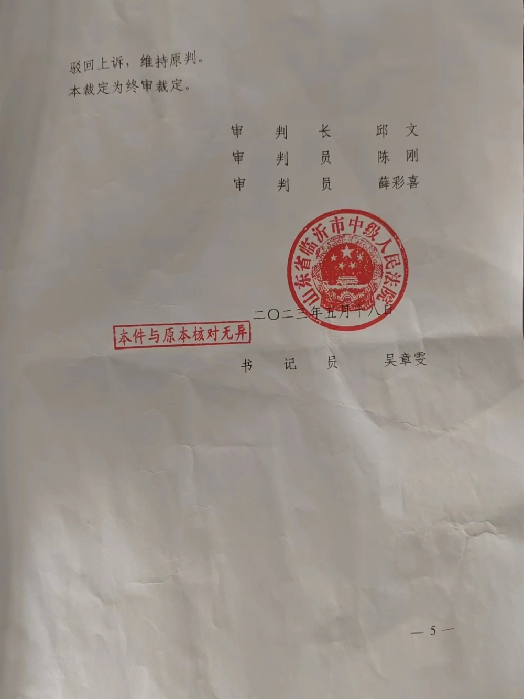

# 山东女子遭前夫注射激素致残案终审维持原判，被告人被判八年半

6月9日，“女子遭前夫注射激素致残案”被害人刘云（化名）告诉澎湃新闻（www.thepaper.cn），当日她收到了山东临沂中院于5月18日对该案作出的刑事裁定：驳回被告人上诉，维持原判。

此前，山东费县法院一审判决被告人高某犯故意伤害罪，判处有期徒刑8年6个月。

澎湃新闻此前报道，2016年11月，刘云感冒后，身为医生、当时还是她丈夫的高某为她打了多天吊瓶，此后她开始出现视物模糊、腿部抽筋等症状，并在很短的时间内容貌发生变化，整个人胖了一大圈，“皮肤仿佛要撕裂一样”。后来，刘云被确诊为“多囊卵巢综合征、糖尿病、代谢综合征”。

2017年9月，因家庭琐事产生矛盾，高某和刘云闹离婚，刘云母亲收拾东西时发现了地塞米松的药瓶。刘云怀疑自己此前遭遇的病变与家中出现的激素类药物地塞米松有关，随后，她就高某“偷取医院药品”、“为她注射激素针剂”向费县卫计局反映。与此同时，2017年9月，刘云向费县公安局报案。

2019年9月4日，刘云被确诊为双侧股骨头无菌性坏死，被评定为肢体三级残疾。2022年3月18日，费县公安局出具立案，同年4月28日，高某被当地检察院批捕。

2023年1月11日，该案在费县法院开庭，刘云前夫高某被诉故意伤害罪。

一审庭审上，高某当庭认罪，但对刘云的伤情严重程度存在异议，请求从轻处罚。对于犯罪动机，高某在法庭上称系因家庭矛盾，所以想惩罚刘云；检察机关则表示，鉴于高某作案手段残忍，社会影响恶劣，建议从重处罚。

2月10日下午，山东费县法院对该案作出一审宣判，高某犯故意伤害罪，判处有期徒刑8年6个月。一审宣判后，高某不服判决，提起上诉。

