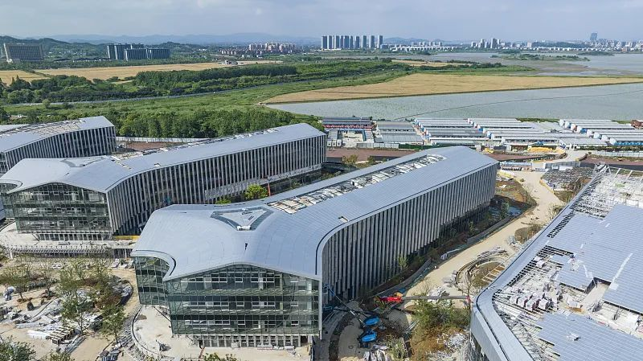
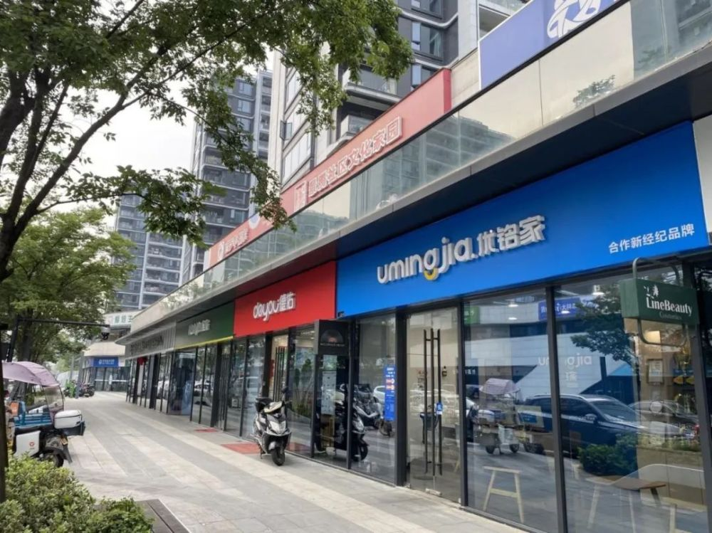
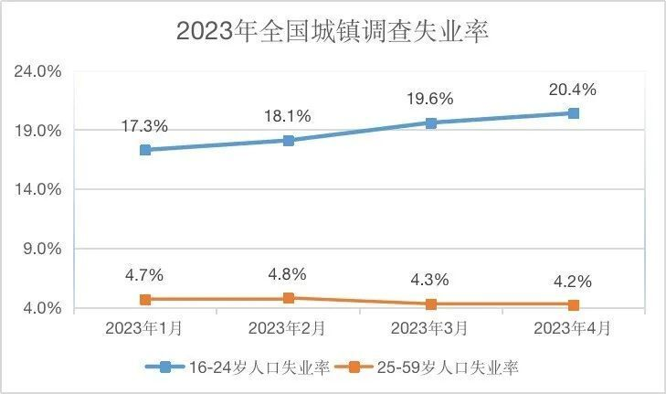
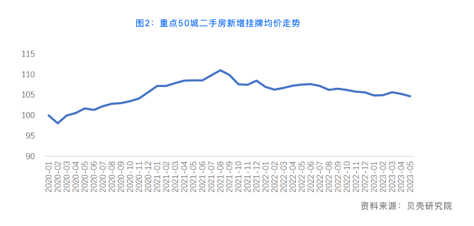

# 杭州“大厂房”近乎腰斩中介仍有信心：阿里分拆上市一批人会财富自由

中产失业的确影响楼市行情，但房价持续下跌，对未来收入稳定性的担忧，才是购房者不愿出手，犹豫不前的关键

**文 | 《财经》记者 杨立赟 实习生 胡耀丹**

**编辑｜余乐 王博**

杭州楼市开始花式内卷。6月8日，据界面新闻报道，临安区的华发荟天府卖房送黄金，最新一个批次的房源，119平米的房子返黄金1000克，按最新金价，大约能返现45万元。该区其他楼盘也在卷，有的送装修、送车位、送手机、送物业费。

虽说临安区离杭州主城区有相当的距离，但是杭州的房子这么不好卖了吗？此前网传阿里巴巴大幅裁员、阿里附近“核心楼盘跳水价甩卖”，引发了社会对互联网大厂裁员的再次关注，以及对杭州楼市会否跳水的猜测。

尽管阿里巴巴否认了网帖中的裁员比例，并称2023年需要新招1.5万人，但也承认存在“正常的组织和人员优化”。根据阿里财报，2021年底阿里集团员工数量为25.9万人，到了2023年3月31日，员工数量减少至23.5万人，净减员近10%。

**那些从阿里“毕业”的人，真的冲击到了杭州楼市吗？**

6月初，《财经》在阿里巴巴总部所在的余杭区实地跑盘了解到，这里的房价近两年明显下跌，有些小区距2021年的高点已接近“腰斩”。2023年初短暂的“小阳春”之后，二手房成交价和成交量又继续下滑，不少小区的跌幅达到了前段时间涨幅的两倍，有的甚至跌至一手房开盘价以下。

但是，多位房产中介和阿里员工表示，阿里裁员并不是杭州楼市量价齐跌的主要原因，而且被裁员工的近况也没有网络炒作的那么惨。但是，也有观点认为，大厂裁员的对楼市的影响要在后半年显现。

虽然目前情势不乐观，但是资深的房产中介对“一时得失”看得很淡。在阿里巴巴总部周边的一名德佑中介表示，在大厂旁边做生意，对未来仍然具有信心。“比如现在阿里拆分成六大业务板块，逐个上市，上市时就会有一批人财富自由，就会买房，拉动那些改善型住房、高品质的小区。对大众市场影响不大。”

_“未科三兄弟”之一的阳光城未来悦。摄影：杨立赟_

**最坏的情况还未出现**

近日，在阿里巴巴总部所在的余杭区，《财经》走访了未来科技城的核心楼盘——号称“未科三兄弟”的阳光城未来悦、中南樾府、东原印未来，在爱橙街上一字排开。

**阳光城未来悦的保安表示，最近这几天没什么人进出小区看房。**
在这个小区外，一条街上共有五家中介，其中三家紧挨着。记者以购房者身份咨询时，我爱我家的一名中介表示，这一片房价确实在下跌，“2021年这个小区单价7万元到8万元，现在只有四五万。”他坦言，很多人在观望，不敢出手，想等房价继续跌。

记者查阅到，阳光城未来悦在2018年首次开盘均价为3万元/平方米，到了2021年，曾有125平的房子最高成交总价达到1050万元，成交单价高达8.4万元/平方米，比买入价高出两倍，是当时的最高纪录。

目前，该小区在链家网上单价最低的是一套低楼层房源，总价350万元，单价3.9万元/平方米。小区房源当前的挂牌均价大约为5万元/平方米。

上述中介介绍，阳光城未来悦通常有100套挂牌，现在，挂牌房源没有变多，但是成交量变少了。“2月、3月成交量还在往上走，4月、5月往下降了，5月我们店只成交了一套。”他说。

**在阿里巴巴西溪园区——也就是传统意义上的阿里总部——步行距离10分钟距离的富力西溪悦居，房价也在持续下跌。**
该小区附近一家德佑的中介称，平台上有一套89平米的刚需房已经挂牌两年，从最初的500多万元，逐步降价到现在的385万元。他感觉，周边的成交量也在变少，现在，他的业绩从一个月签两三套，变成了两个月签一套。

张洪（化名）在杭州干了十三年的房屋中介，他坦言，“阿里辟谣说没裁员我是不信的”，因为感觉今年前四个月阿里周边的房价较为平稳，从5月开始，特别是阿里裁员消息传出，又开始下跌。但这次裁员的影响可能在6月下旬会比较明显。二手房市场下跌不会突然到底，而是一个过程。张洪比较悲观，他认为目前的房价还没到底，今年都不会太好。

针对阿里裁员，房价下跌，市场上有很多传言，如阿里百万年薪中层断供，卖楼回血等。

但前述德佑中介认为，并没有那么夸张，放出来的房子确实变多了，有些人被裁了就打算卖房回老家，但新挂盘的房主普遍不会一下子放出跳水价，而是都按目前的平均价格挂牌。

迄今为止，他还没有接触到断供的案例。“阿里员工赚钱能力很强，有个客户在阿里妈妈（阿里集团的大数据营销平台），收入非常高，第一年买房贷款70%，第二年就把贷款还完了。”

建平（化名）是一位阿里巴巴的前员工，于2022年底被裁。他告诉《财经》，自己背着未来科技城（阿里总部所在地）的房贷和其他城市的房贷，每月要还款约4万元。

离开阿里后，他又入职了一家新公司，2023年3月再度被裁，目前处于待业状态。

**“去年找工作还行，现在不太好找。”**
他认为，虽然被裁员后找一份稳定的工作挺艰难，但是存款再顶个两年没啥问题。他的妻子从事电商行业，“收入还不错”，也能为房贷出一份力。

当然，不管是不是阿里，各个行业的公司裁员都会造成部分交易落空。2022年，张洪同事的客户下定余杭区翡翠城的一套房子，交了30万定金，却被裁员，之后客户就算赔了定金，也要放弃购房。张洪替他暗自庆幸：“幸亏没买，去年那套房子650万，今年560万。”

多名在杭州阿里巴巴和北京腾讯总部周边的中介表示，互联网产业是当地房价的核心动力，但是裁员对房价的影响没那么快，而且5月并非第一次裁员，去年开始就陆续发生。

前述我爱我家中介也认为，杭州楼市量价齐跌主要原因并不是阿里裁员，而是从去年开始持续的大盘下跌。

据《钱江晚报》报道，2022年杭州二手房（不含临安）成交量为5.4万套，创下6年来新低，相比2021年下跌约33%，相比同样是下行市场的2018年也下跌了25%。2022年杭州市区（含富阳、临安）新房成交接近11万套，同样是近6年来最低，同比2021年下降43%。2022年杭州同一小区二手房成交价相比去年，均有10%-30%左右的降幅。

根据杭州贝壳研究院数据，2022年杭州二手房市场约有68%的业主对挂牌房源调价，其中91%的业主选择下调价格。全市二手住宅成交均价从1月起呈波动式下滑，在12月达到全年住宅网签均价最低点。

虽然今年小阳春杭州楼市有反弹，但也是疫情叠加春节被压抑的需求释放。这波刚需购买力得到满足后，楼市的萎靡之态也再次显现。

中指研究院数据显示，最近几个月杭州二手房市场成交规模继续回落，价格跌幅扩大。2月至3月，杭州市区二手房成交套数从5500套升至8100套，4月开始下跌至7500套左右，5月持续下跌，仅成交约4800套。

价格方面，杭州二手住宅价格在2月至4月同比略有上升，而环比逐月下跌，意味着比2022年的情况好，但是“小阳春”之后一直处于下滑趋势。5月二手房价格环比下跌0.23%，跌幅较上月扩大0.1个百分点，同比下跌0.54%。

**杭州不背锅，全国楼市都在回落**

其实，小阳春过后，不仅杭州，北京、广州、深圳的二手房市场均呈回落趋势。

根据中指研究院数据，2023年5月北京二手房市场挂牌量再创新高，价格由涨转跌；广州市场活跃度进一步回落，价格保持平稳；深圳成交量继续下降，价格由涨转跌。

58安居客研究院院长张波对《财经》说，裁员反应的是就业形势，整个就业形势对于楼市的影响很直接。在互联网大厂和产业聚集的城市，都存在裁员对房地产市场的影响。

_数据来源：国家统计局；制图：胡耀丹_

国家统计局最新数据显示，2023年4月，全国城镇调查失业率为5.2%。其中，16-24岁人口的失业率在4月达到20.4％，创下历史新高；25-59岁人口的失业率为4.2%。

**“年轻人失业、就业不稳定，导致买房很谨慎，存在两个趋势。”**
张波说，其一，对于工作预期不确定、未来收入不稳定，心态偏向谨慎和保守，影响首套房的购房决策。此外，今年互联网大厂开始裁高薪员工，影响改善型住房的需求。他们本来打算换房，但是工作不稳定，即便没有被裁，也不换房了。

其二，倾向于抛售手上的房产。被裁之后虽然获得一些补偿金，但是不足以支撑长期的还贷，他们可能会卖掉之前投资的房产，甚至把自住的大房子换成小的。

裁员对于房价和成交量同时下跌到底起了几分作用？张波表示，这一影响的比例无法量化，但是核心原因还是大的经济环境。目前并非互联网一个行业过得不好，而是各行各业都面临很大压力，每个个体都面临很大的不确定性，不敢买房，倾向于储蓄。

**“如果只是互联网一个行业不好也没事，经济环境好，一给政策、一救市就救起来了。但是经济不好，楼市救不起来。”** 他说。

多名杭州的资深中介都判断房价会继续跌，并且很坦诚地建议客户可以等一等，别着急买房。

张波认为，楼市正处于M型的波折周期，将出现起起伏伏，如果把时间维度拉长来看，趋向于L型，也就是说下行而达到平稳，不可能出现V型的反弹。

“如果不受到外力的干涉、影响，这一轮萧条期到2025年结束。2026年可能会是下一轮周期的起点。”他进一步表示，萧条期内也不一定持续往下走，如果有救市政策，价量未必持续下跌。

贝壳研究院则认为，如果仅关注3月到4月成交量的下滑，则是放大了短期的波动性。其报告称，今年一季度房地产销售高峰是防疫政策优化影响下积压需求释放、前期宽松政策效果累积释放叠加的结果，这样的阶段性高增速并非常态，二季度以来的回落是符合市场规律的正常调整。更应该关注年初至今的累计水平和调整后的绝对水平，不应过度关注季度间的波动。

尽管从高峰回落，但累计交易量仍然比去年同期有正增长。贝壳研究院监测数据显示，今年1月-5月的月均二手房成交量在2020年以来处于次高水平，仅低于2021年同期。国家统计局数据显示，1月-4月全国新建商品住宅累计销售面积同比增长2.7%。

从看房需求看，据贝壳研究院监测，5月重点50城带看客户量与4月相比基本持平，同比仍有超3成的增长，表明当前真实购房需求并不弱。

_贝壳研究院重点50城二手房新增挂牌均价走势_

虽然目前交易市场低迷，但是土地供应仍然保持了一定的热度。中指研究院土地市场研究负责人张凯表示，截至5月末，中指的核心22城中，有21个城市完成了至少一宗涉宅用地的供应，1月至5月整体土拍热度高于2022年任何一个批次。

各地方政府均通过减量提质的方式进行供地，核心区地块供应增加，郊区地块减量供应或折价供应。

张波表示，未来如果房地产市场重新起势，将从一线城市开始回温，继而带动二三线城市。

（应受访者要求，文中张洪、建平为化名）

