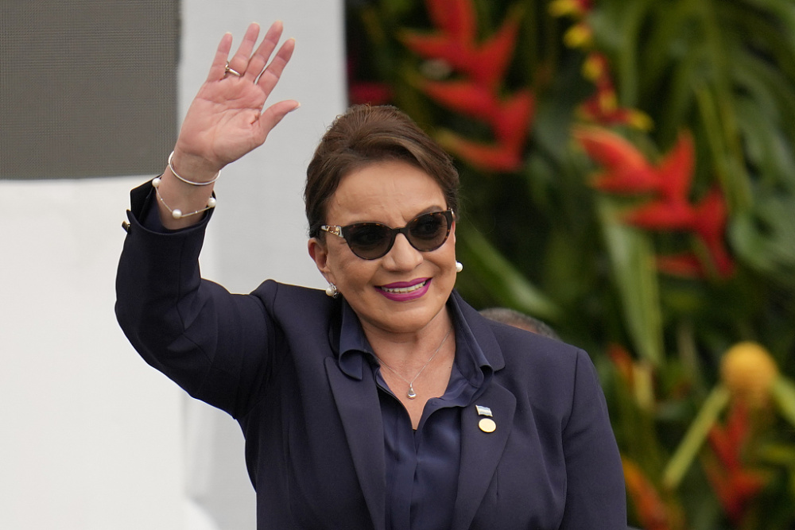

# 洪都拉斯总统今起访华，系中洪建交后首次，将到访北京上海

与中国建交两个多月后，洪都拉斯总统卡斯特罗将于6月9日至14日对中国进行首次国事访问。

_洪都拉斯总统卡斯特罗
视觉中国 资料图_

“洪都拉斯的重建需要新的政治、科学、技术、商业和文化视野。”卡斯特罗本月5日在推特上宣布了此次访华的消息。就在卡斯特罗宣布访华消息当天，中国驻洪都拉斯使馆举行了开馆仪式。

澎湃新闻从权威渠道了解到，卡斯特罗总统将于9日抵达上海开启访华之行，随后她也将前往北京。在京沪两地，中洪双方预计将展开政商文化等多领域合作交流活动。

今年3月25日，洪都拉斯外交部发表声明，正式宣布与中国台湾“断交”。次日，中国同洪都拉斯签署《中华人民共和国和洪都拉斯共和国关于建立外交关系的联合公报》。两国决定自公报签署之日起相互承认并建立大使级外交关系。洪都拉斯由此成为中国的第182个建交国。

中国国际问题研究院拉美和加勒比研究所所长宋均营在接受澎湃新闻（www.thepaper.cn）采访时表示，中洪建交之后不久就实现了访问层次中最高的国事访问，这反映了两国对双边关系的高度重视，以及对彼此定位有高度共识。此举有助于进一步提升双方的政治互信，为今后两国在外交、经贸等领域合作的顺利开展奠定更好基础。

不仅如此，洪都拉斯同中国建交还颇具象征性意义。在宋均营看来，作为美国“后院中的后院”，洪都拉斯能够冲破美国压力，反映了该国追求自主发展的决心。在“全球发展倡议”“一带一路”倡议等合作框架下，预期中洪两国将开展更多务实合作，而拉美地区国家也正抓住中国提供的机遇。

**中洪合作前景广阔、互补性强**

位于中美洲的洪都拉斯，是该地区国土面积第二大、人口第二多的国家。随着中洪建立外交关系以及洪总统即将开启的访华，两国未来的合作图景正循序展开。

3月26日中洪建交之际，中国国务委员兼外长秦刚在北京同洪都拉斯外长雷纳共见记者。对于两国未来合作前景，秦刚表示，中方欢迎洪都拉斯总统卡斯特罗尽早访华，邀请洪方组织企业家代表团来华商洽贸易、旅游、投资等领域合作。

雷纳也表态称，洪方愿同中方加强金融、贸易、基础设施、科技、文化、旅游等领域合作，密切在多边框架下沟通协调。实际上，在卡斯特罗3月宣布将同中国建交后，雷纳多次在一些公开表态中，表达过对华合作的具体意向。他曾表示，洪都拉斯“将很快启动”与中国的自由贸易协定谈判，“这将是我们的产品以更好的条件进入中国市场的好消息和好机会”。他还称，洪都拉斯对中方提出的全球发展倡议感兴趣，并将参与“一带一路”倡议。

“必须从‘非常务实’的立场出发，为洪都拉斯民众谋求最大福祉。”雷纳指出。据英国广播公司（BBC）报道，中国目前是洪都拉斯的第二大贸易伙伴，仅次于美国。据中国海关统计，2022年中洪贸易额为15.89亿美元，其中中方出口额15.6亿美元，进口2923.9万美元。

谈及两国未来合作的主要领域，宋均营向澎湃新闻表示，洪都拉斯是以农业为主的国家，两国关系有着高度的互补性。从贸易角度来看，洪都拉斯的一些特色农产品，例如咖啡、水产品等，可以更便捷、顺利地对华出口。同时，洪都拉斯的基础设施建设较为落后，这也是其经济发展的“瓶颈”。而设施联通是“一带一路”倡议中的重要内容，之后两国在该领域将会有更多合作。

实际上，在两国建交之前，中国电建作为承包商参建过洪方的水电站开发项目，主要包括帕图卡III水电项目。这是洪都拉斯30年来建设的首个大型水电项目，可以为全国提供4%的清洁能源发电需求，被称为“洪都拉斯的三峡工程”。2019年，中国电建又承建了洪都拉斯的阿雷纳水电项目，可为三个省份的约100万居民提供电力支撑。

**拉美地区国家自主性提升**

值得注意的是，在洪都拉斯同中国建交的背后，也折射出包括洪都拉斯在内的拉美国家对自主发展的追求。

这种“自主性”从卡斯特罗此前的表态中便可见一斑。她当时写道，洪都拉斯的发展，需要新的政治及文化视野等。而她早在就任总统时就曾表示，洪都拉斯应该自主决定跟谁发展外交关系。

“洪都拉斯同中国建交是一个很有象征性意义的事件。”宋均营分析称，洪都拉斯属于中美洲的“北三角国家”，长期以来被美国视为“后院中的后院”。但它仍能够冲破美国压力，宣布与中国建交，说明卡斯特罗总统对国家发展和民众福祉高度负责，也体现出她能看清世界发展大势。另一方面，也反映出美国对该地区的影响力和控制力正在下降。

尽管面临着来自美国的压力，也不能阻挡洪都拉斯等拉美国家追求自主发展的决心和意志。究其原因，宋均营解释称，尽管拉美国家对美国有所期待，但美国长期以来对拉美地区投入不足，“口惠而实不至”。

具体而言，美国长期推行歧视性移民政策。拉美多位专家此前在接受媒体采访时指出，近年来美国政府出台的强制移民儿童与父母“骨肉分离”的政策，“留在墨西哥”政策，打着“防控疫情”的幌子排斥拉美移民的政策，导致大量越境民众的基本人权受到侵犯。在对拉美地区的投入方面，在去年第九届美洲峰会开幕式上，美国总统拜登宣布将实施“美洲经济繁荣伙伴关系”的经济计划，承诺向拉美国家提供更多的支持，但至今却未兑现承诺。

与美国在拉美地区的参与不同，宋均营认为，中国提出的“一带一路”倡议、全球发展倡议，能够真正帮助拉美国家解决发展问题，尤其是新冠疫情之后，部分拉美国家的经济遭受重创、社会出现分化、政治面临极化，现在该地区国家愿意抓住中国提供的机遇。

2012年以来，中国一直保持拉美第二大贸易伙伴地位。即便在新冠疫情期间，中拉经贸合作仍彰显韧性。统计数据显示，拉中贸易总额2021年首次突破4500亿美元，2022年再创新高，达4857.9亿美元。

此外，外界也注意到，目前台湾的所谓“邦交国”只剩下13个，创下“新低”纪录。而自台湾民进党当局领导人蔡英文2016年5月上台以来，除洪都拉斯外，已有8个国家先后和台湾当局“断交”，分别为圣多美和普林西比、巴拿马、多米尼加、布基纳法索、萨尔瓦多、所罗门群岛、基里巴斯以及尼加拉瓜。

“洪都拉斯与中国建交会产生一定‘示范’效应。”尽管如此，宋均营提醒称，不能操之过急，一个国家是否选择和我们建交受到多种因素影响。”

外交部发言人3月26日就中国和洪都拉斯建交发表谈话时称，承认并承诺恪守一个中国原则，同台湾断绝所谓的“外交关系”，同中华人民共和国建立外交关系，并承诺不再同台湾发生任何官方关系，不进行任何官方往来，是顺应大势、合乎民心的正确抉择。

