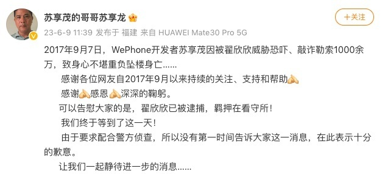
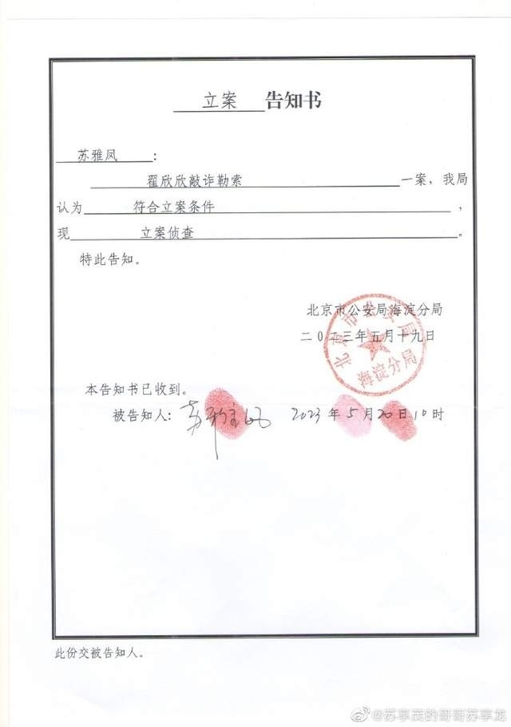
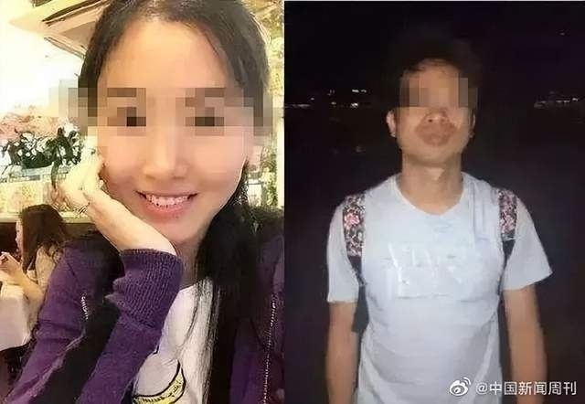

# 索要千万逼死丈夫？苏享茂家属：翟欣欣涉嫌敲诈勒索已被逮捕

6月9日，苏享茂的哥哥苏享龙发文称，翟欣欣已被逮捕，羁押在看守所。

2017年9月7日，WePhone开发者苏享茂因被翟欣欣威胁恐吓、敲诈勒索1000余万，致身心不堪重负坠楼身亡……

感谢各位网友自2017年9月以来持续的关注、支持和帮助。

感谢，感恩， 深深的鞠躬。

可以告慰大家的是，翟欣欣已被逮捕，羁押在看守所！

我们终于等到了这一天！

由于要求配合警方侦查，所以没有第一时间告诉大家这一消息，在此表示十分的歉意。

让我们一起静待进一步的消息……

**此前报道**

近日，5年前全网刷屏的“索要千万逼死丈夫”的翟欣欣案，有了最新消息。5月12日，苏享茂的哥哥苏享龙称，被告翟欣欣撤销了对其中一起相关民事案件判决的上诉申请，原告家属于12日确认收到翟欣欣的660万元还款。

今年4月，“翟欣欣案”迎来了两个相关民事案件。根据审理查明的情况，翟欣欣与苏享茂相识至协议离婚仅110余天，期间收受苏享茂赠与的车辆、物品、款价值超过300万元，婚恋过程具有明显的经济特征。翟欣欣在离婚中为取得高额补偿，对苏享茂实施了胁迫，未顾及到苏享茂赠与其财产、希望与其共同生活、维系感情的初衷以及苏享茂受胁迫下的主观感受和客观经济情况，是造成苏享茂自杀的重要因素。

**【来源：九派新闻综合当事人账号、中国新闻周刊、每日经济新闻】**

