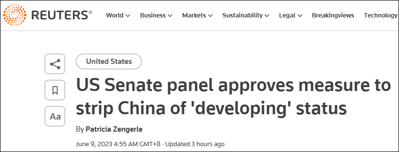
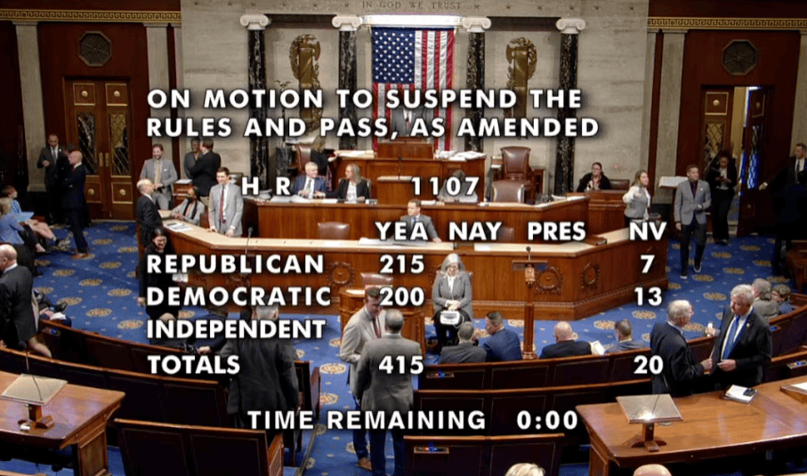

# 美参议院外交委员会通过“终止中国发展中国家地位法”，将全体审议

【文/观察者网 熊超然】继众议院之后，美国参议院也拿中国的发展中国家地位说事，同样在国会上演了一出反华闹剧。

据路透社当地时间6月8日报道，美国国会参议院外交关系委员会当天一致表决通过所谓“终止中国发展中国家地位法”，该法案将要求美国国务卿努力改变中国在国际组织中的“发展中国家”地位。

报道称，美国国会的议员们当前专注于同中国这个亚洲地区的大国进行竞争，对于当天通过的这项法案，法案支持者认为，中国所拥有的“发展中国家”地位，可以允许其在一些国际组织或条约中享有“特权”。

_路透社报道截图_

法案通过当天，马里兰州的克里斯·范·霍伦（Chris Van Hollen，法案提出者）、犹他州的米特·罗姆尼（Mitt
Romney，法案提出者）、阿肯色州的丹·沙利文（Dan Sullivan）、得克萨斯州的约翰·科宁（John
Cornyn）和南卡罗来纳州的蒂姆·斯科特（Tim
Scott）这些参议员就同时声称，中国已成为世界第二大经济体，甚至有望超过美国，不再是需要“特殊待遇”的“发展中国家”，否则这将是“荒谬的”。

路透社指出，在美国国会参议院外交关系委员会“无异议”通过法案后，这将为参议院全体成员审议表决此法案铺平道路，但目前还没有迹象表明何时会进行这项议程。

报道还称，在长期存在分歧的美国国会中，对华采取强硬立场是少数的、真正的“两党共识”，国会议员不断提出法案，寻求解决美中之间的竞争问题。

就在今年3月27日，美国国会众议院就曾以415票赞成、0票反对的表决结果，通过了一项类似的法案——所谓“中华人民共和国不是发展中国家法”。

_美国众议院投票现场。计票结果显示，有215位共和党议员投赞成票，7人未投；200位民主党议员投赞成票，13人未投；无人投反对票。_

这部法案由加利福尼州共和党籍众议员金映玉（Young Kim）与来自康涅狄格州民主党籍众议员杰里·康纳利（Gerry
Connolly）联合提出。该法案要求美国国务院对国际组织施加影响，“把中国重新归类为高收入、中高收入或者发达国家，而不再视其为发展中国家”。法案宣称，要确保“中国不会因发展中国家地位而在组织内获得优惠待遇及援助”。

“中华人民共和国是世界第二大经济体，占全球经济的18.6%，”法案发起者之一的金映玉当天在众议院发言称，“中国的经济规模仅次于美国。而（美国）被视为发达国家，中国也应如此。”这名共和党议员还煞有介事地宣称，美国这么做是为了阻止中国“伤害真正需要帮助的国家”。

此前，中国社科院亚太与全球战略研究院研究员、地区安全研究中心主任钟飞腾曾对观察者网表示，美国再三拿中国发展中国家地位说事，根本图谋是出于对华遏制战略的需要。改革开放以来，中国与世界银行等很多国际组织形成了互利共赢的合作关系，但中国从未凭借发展中国家地位和其他发展中国家抢夺国际组织资源。相反，中国在绝大多数机构中做出的市场开放承诺和让利程度远超一般发展中国家的应有水平，赢得了广大发展中国家的普遍赞誉。

“中国式现代化道路的成功证明，从发展中走向富裕的现代化道路并不是唯一的，美国式现代化并非人类社会的终极道路，美国由此担心自身影响力被削弱。”钟飞腾说，“当美国政客对中国的身份产生惊惧时，反而证明了中国坚持发展中国家地位的重大意义。”

针对美国国会频繁拿“发展中国家地位”之说操弄反华议题，中国外交部发言人汪文斌曾回应称，中国是各方公认的最大发展中国家，美国想给中国送顶“发达国家”的帽子，对不起，这顶帽子中国戴不了。中国是一个发展中国家，有着充分的事实依据。维护发展中国家地位是中国的合法权利。中国属不属于发展中国家，不由美国说了算。中方将坚定捍卫发展中国家的正当合法权益。

**本文系观察者网独家稿件，未经授权，不得转载。**

