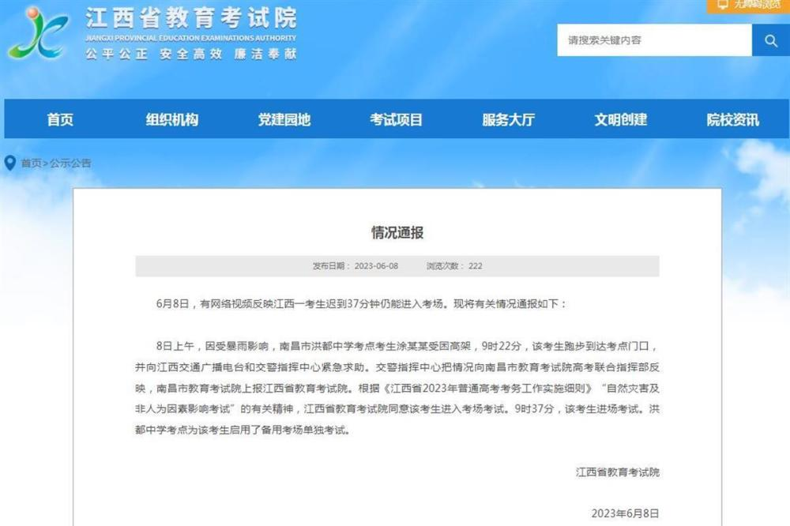

# 考生迟到37分钟仍能进考场？媒体：通报称符合规定，但还有2个疑问

极目新闻评论员 吴双建

6月8日，有网络视频反映江西一考生迟到37分钟仍能进入考场。江西省教育考试院通报称，根据《江西省2023年普通高考考务工作实施细则》中“自然灾害及非人为因素影响考试”的有关精神，江西省教育考试院同意该考生进入考场考试。9时37分，该考生进场考试。洪都中学考点为该考生启用了备用考场单独考试。

_相关通报_

首先，为江西省教育考试院及时回应舆论关切点赞。

从这则通报中，我们看到了更多细节。该生9时22分到达考点，就是说并不是迟到37分钟，这里面有15分钟花费在请示、回复等程序上。严格来说，按“开考15分钟后，迟到考生不能进入考点”的规定，是相差7分钟的事。

这份通报还解决了另一个疑问：涉事考生是通过什么流程进入考点的呢？此前，有人怀疑他有什么后台或关系，疏通了“高层”。现在来看，是通过了交警指挥中心、南昌教育考试院、江西省教育考试院等，程序看不出有问题。

那理由合不合规呢？根据《江西省2023年普通高考考务工作实施细则》中“自然灾害及非人为因素影响考试”的有关精神，有关部门就让考生进考点了，而且启用了备用考场单独考试。

但我们看到，还是有不少人表示有疑问，主要集中在两个方面。

首先是“自然灾害”的说法，下暴雨不等同于就是“自然灾害”，只有损伤到人或财物了，才叫灾害。下暴雨引发堵车，能不能称“自然灾害”？这是存疑的。不少网友认为，下暴雨受影响的并不是这位考生一人，考生应该为自己进入考场留下充足的时间，遇到困难了，要及时采取应急措施，确保自己不迟到。

如果说此例属于“非人为因素”，那暴雨堵车算“非人为因素”，还是堵车算“非人为因素”？如果暴雨堵车才算，那车祸堵车又算不算？有网友认为官方的理由并不充分。

该考生是跑步到达考点的，让人挺钦佩的。但堵车时，他有没有报警，让警方通过摩托车或其他方式送他到考点呢？毕竟，人生处处都是考场。现在，动用警车乃至情急之下用救护车送考生到考场，公众也是理解的，因为寒窗苦读并不容易，该为他们保驾护航。

其次，既然当天下暴雨，受影响的难道只是他一名考生？有没有其他学生迟到的情形，同样让考生进入考场了？还有，《江西省2023年普通高考考务工作实施细则》里的这些能“变通”的情形，学生们都掌握了吗？渠道是公开的吗？

这些当地有必要作出回应，以澄清疑问。

对于考生迟到的处理，当地必须慎重又慎重，严格按照各种规定和程序来。舆论对此要特别注意，没必要将矛头指向考生本人，对事不对人就好。

客观来说，就此个例而言，确能看出当地对该考生的呵护，不少网友为有关部门人情化、人性化的处理点赞。对该考生而言，不幸中的万幸，是进入了考场；万幸中的不幸，就是答题时间比别人少了很多，他也为此付出了代价。

高考最重要的是公平和公正，而公平公正按规定和程序办事，对所有人一视同仁。如果当地有相关规定，也有相关流程，大家都知晓，处置合理合法，就无可厚非。

当然，这同样给以后高考工作安排提了一个醒，相关规定可以更细化一些，不留模糊的空间，以免引起误解、误读。

（来源：极目新闻）

