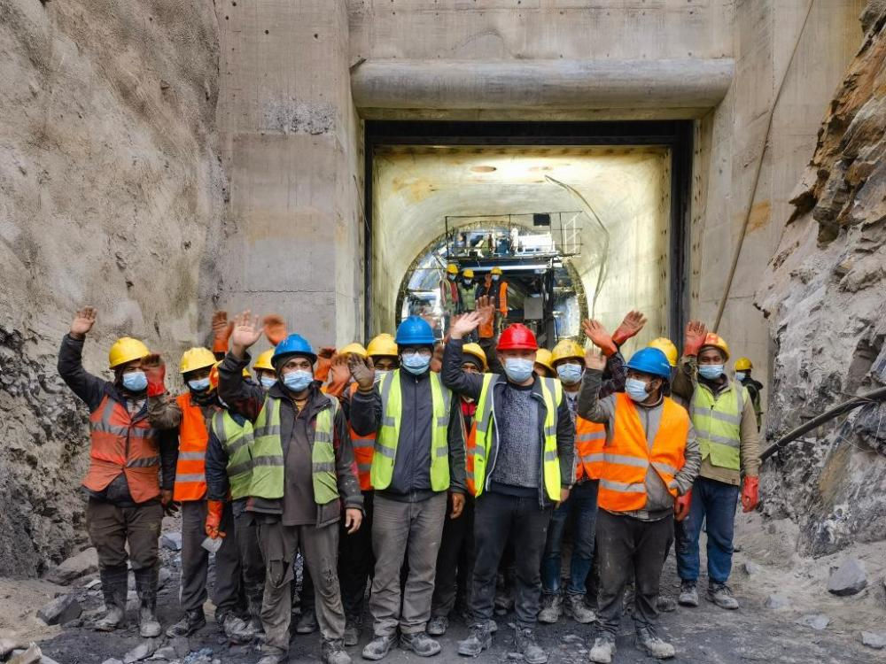

# 让中国在尼泊尔“退居二线”？印度水电市场出阴招

【环球时报驻尼泊尔特约记者
林克】“除了加强与尼泊尔的接触，印度还默默地试图通过经济外交来遏制中国在尼泊尔日益增长的影响力。”印度智库观察家研究基金会近日的一篇文章这样直言不讳地写道。南亚内陆山国尼泊尔北邻中国，其余三面与印度接壤。尼泊尔水力资源丰富，水电蕴藏量约占世界水电蕴藏总量的2.3%。过去10年，在中国企业的参与下，尼泊尔正朝着成为“电力纯出口国”的方向发展。而综合路透社报道以及印度、尼泊尔的相关信息可以清楚地看到，印度正试图让中国在尼泊尔“退居二线”——当尼泊尔水电站向印度大规模输送电力的时候，印度却出台相关政策，变相排挤在尼水电行业发展中发挥着重要作用的中资要素。不过，印度的这些伎俩并不能阻碍中尼之间的合作。

**尼水电发展迅速，中企贡献巨大**

大约10年前，尼泊尔还是一个电力供应十分紧缺的国家。有2013年在尼首都加德满都生活的中国人告诉《环球时报》特约记者：“当时每天停电都可达10余个小时，旱季（相当于国内冬、春两季）枯水期更甚。”

时过境迁，如今尼泊尔的发电、供电情况已大为改观。2022年8月，尼泊尔电力局高层在庆祝该局成立37周年的活动上表示，“截至7月中旬的上一个财政年度结束时，我国
92.52% 的人口已获得电力供应”，并强调“到2024年尼所有国民都将获得电力供应”。

_1月18日，尼泊尔工人庆祝中企承建的塔纳湖水电站第2标段项目完成尾水洞衬砌混凝土浇筑。（新华社）_

尼泊尔10年来电力供应发生天翻地覆的变化，中国企业贡献突出。2016年9月26日，历经45个月的建设，中国电建集团和尼方公司共同建设开发的上马相迪A水电站首台机组开始发电，尼方官员称赞该项目是中尼企业合作的典范，“向其他投资者传递尼泊尔是安全投资地的信息，并为尼能源领域发展开辟新途径”。上马相迪A水电站总装机容量为50兆瓦，是尼境内第一个由中国企业开发建设、运营的项目，也是尼泊尔水电建设史上第一座提前实现发电的水电站，为加德满都和著名旅游城市博卡拉提供长期稳定的电源。2022年11月，尼方还为该水电站项目颁发“水电行业特殊贡献奖”。

去年3月，由中国企业承建、被誉为尼泊尔“三峡工程”的尼最大水电站上塔马克西水电站全面投产。上塔马克西项目2010年开建。2021年7月，该水电站首台机组实现并网发电。据悉，上塔马克西水电站总装机将达到456兆瓦，整个工程将为尼国内生产总值贡献约1%的产值。

尼泊尔电力局数据显示，2022-2023财年尼电力需求峰值为2036兆瓦，但该国目前发电能力已超过2650兆瓦。《加德满都邮报》报道说，据电力局预测，2024年和2025年尼电力需求的峰值将逐步攀升至2280兆瓦和2568兆瓦，但与此同时该国的发电能力将逐步攀升至4507兆瓦和5251兆瓦。甚至到2026年时，即使在低水位的旱季，尼泊尔本国的发电能力也能够满足国内需求。

**电力出口是尼方现实需要**

由于喜马拉雅山南麓气候干湿两季分明，发电量的季节性波动成为尼发电能力的一个重要特征，也给该国电力发展造成难以解决的矛盾——如果能确保全年（包括旱季在内）电力自给自足，那么在雨季（大致为我们国内夏秋两季）必然会出现发电能力过剩的情况。这些电力如果不能找到国外市场，就只能被白白浪费掉，这反过来又会打击各种资本开发尼水电项目的积极性。

为了不浪费雨季的发电能力，珍惜为数不多的创汇渠道，尼泊尔亟须在雨季为过剩的电力寻找海外市场，其在南亚的重点目标市场就是印度和极度缺电的孟加拉国。目前，印度已允许尼方出售10个水电项目的452.6
兆瓦电力。至于尼孟两国之间的电力贸易，印度的态度也至关重要。翻看地图就可以知道，尼泊尔的东南部和孟加拉国的西北部被印度东北部狭窄的西里古里走廊隔开。

具体到尼泊尔和印度之间的电力交易，《环球时报》特约记者了解到以下信息。2021年4月，尼泊尔电力局被印度方面批准进入印度国家电力公司（NTPC）的电力交易市场。同年11月，印度中央电力局准许尼两个水电项目向印出售电力。自2021年11月起，尼泊尔在雨季按照与印方达成的配额向印度出售多余电力，并在旱季自印度进口电力。自2021年11月以来，尼方已向印度出售价值约合9000万美元的电力。

尼泊尔电力局常务董事库尔·吉辛2022年底向当地媒体介绍电力进出口情况时表示，尼一年中的4个月需要进口电力，但当年与以往不同，进口量少于出口量，从发电量和贸易盈亏看，尼泊尔将成为一个电力纯出口国。

5月26日晚间，由于降雨激增，河流水位迅速上升，尼泊尔连续6个小时向印度出口了总计100兆瓦的电。这是时隔5个多月来，尼泊尔在今年雨季开始后首次向印度出口电力。

**“印度对尼泊尔发出警告”**

5月24日，路透社刊文称：“印度 2014 年与尼泊尔达成电力购买协议，但在 2018
年改变了自己的政策，以防止从尼方购买与印度没有《电力部门合作双边协议》的国家投资生产的电力。”文章强调说：“根据印度制定的规则，它不能从尼泊尔购买由中国投资或参与生产的电力。”相关报道还援引尼能源部门官员的话说，自从印度改变购电政策，尼已将中国开发商从6个水电项目中剔除，并将4个水电合同给了印度公司。

《加德满都邮报》去年１月曾刊发一篇题为《没有中国参与是印度对采购尼泊尔电力的警告》的文章，揭露了相关真相。据尼泊尔独立电力生产商协会（IPPAN）一名官员透露，“印方一直明确地告诉我们，他们不会从中国投资的项目购买电力，甚至不会购买中国承包商承建项目的电力”，“我们已与印度大使馆和印度电力部门的官员讨论了此事，他们非常明确地表示，不太可能从中国投资的项目中购买电力”。据报道，尼泊尔的电力生产商如果想向印度出口电力，必须向印度提交包括股权结构等相关印方要求的文件材料，待印度方面审核通过后，方可具有向印度出口电力的资格。

尼泊尔《新商业时代》日前刊登《印度投资尼泊尔水电行业的前景》一文，文章写道：“中国有意投资尼水电项目，但印度采取的政策是不从尼方购买由他国特别是中国投资或建设的水电项目中生产的电力。在这样的背景下，中国投资尼方的电力产能很难进入印度电力市场。这同样增加了其他国家投资的尼泊尔水电项目进入印度电力市场的难度，而印度企业则不用面对此种麻烦。”

印度智库观察家研究基金会（ORF）网站今年4月一篇题为《印度让中国在尼泊尔退居二线》的文章透露：“除了加强与尼泊尔的接触，印度还默默地试图通过经济外交来遏制中国在尼泊尔日益增长的影响力。印度决定不从尼泊尔购买（有中国投资或建设的水电项目生产的）电力，这一决定对在尼泊尔的中国公司造成了严重打击，这些公司参与了该国不同的水电项目。现在，中国企业觉得在尼水电领域的投资是不安全的。印度当局的另一项决定是不向中国公司作为开发商甚至承包商在尼泊尔开展的项目提供炸药，这对中国企业来说也是一个巨大的挫折。”最后，该文表示：“近年来，印度对尼泊尔的经济外交似乎运作良好，呈现出尼泊尔和印度的双赢局面。在新形势下，许多印度公司对在尼泊尔开发巨型水电产生了兴趣，而中国在该国开展业务却遭遇挫折。”

尼泊尔能源部门的前官员达瓦瑞卡纳什·当戈尔在接受BBC尼语新闻网采访时表示，印度的相关政策意味着该国“试图控制中国投资进入尼泊尔”。当戈尔强调，“在任何情况下，印方都希望中国人不要在尼泊尔水资源领域施加影响，项目应该在他们的控制之下”。

不过，也有尼泊尔专家认为，印对尼水电投资仍不足。印度目前在尼投资7个水电项目，预计总发电能力为3491兆瓦。这些项目有的获得了勘察许可证，有的获得了施工许可证，还有的正在建设中。如印度国营建设企业SJVN正在建设的阿润三期（Arun-
III）水电项目，预计竣工后发电能力为900兆瓦。该项目计划2024年开始发电，SJVN公司将在发电后的25年内拥有运营权，尼方则免费获得21.9%的电力。

**“中尼之间建设跨境电网互联至关重要 ”**

印方政策对中资企业参与尼泊尔水电发展建设产生了一定的影响。据《加德满都邮报》报道，今年4月尼泊尔独立发电商协会举办第八届尼泊尔能源峰会，“中国公司没有表现出多少兴趣”。该协会副主席加内什·卡基表示：“我们已通过外交使团向包括中国企业在内的外国企业发出邀请，但没有中企及其代表确认参与。”报道显示，这次峰会的合作伙伴还有美国国际开发署（USAID）、印度驻尼泊尔大使馆等机构。

尼新闻网站“加德满都帕提”的主编罗山告诉《环球时报》特约记者，面对印度电力市场的电力准入政策，中尼之间建设跨境电网互联至关重要。据他介绍，除一些由印度援助、由尼方建设的水电项目完工外，由印度公司直接投资的尼水电项目迄今为止尚未有一个完工。

中尼电网互联是尼泊尔水电行业发展的新希望。2016年3月，中尼两国政府发表联合声明：同意建立能源合作对话机制，更好地开展长远合作规划，包括跨境电网领域；尼方希望中方建设跨境输变电项目，并请求中方将项目作为优先项目。2018年6月，双方签署《中尼电力联网可研合作协议》，标志着中尼电力联网项目进入工程可研阶段。2019年12月，经中尼两国专家联合勘察设计，确定了建设连接尼泊尔热索瓦和中国吉隆口岸的电网互联方案。今年1月，中尼跨境电网互联项目尼方负责人向当地媒体表示，“该项目对于吸引中国投资尼水电行业以向中国出售电力至关重要，这个可承载5000兆瓦电力输送的70公里项目将为尼中两国之间的电力贸易打开大门”。2月24日，尼泊尔电力局宣布完成尼中电网互联项目在尼境内的线路带电测试工作。

今年２月，在尼驻华大使馆举行的能源投资推介会上，尼驻华大使比什努·施雷斯塔表示，尼计划2026年从最不发达国家行列“毕业”，并在2030年成为中等收入国家。尼政府制定各种政策，希望吸引包括中国在内的外国投资进入该国“极具开发潜力的行业”。施雷斯塔举例说，尼泊尔水资源丰富，但开发不足，亟待释放水资源潜力以促进国家经济发展、提升人民生活水平。他表示，资金短缺一直是制约尼能源行业发展的主要原因。尼方将可再生能源列为优先发展事项，投资环境非常友好。

3月16日，尼泊尔丝路之友俱乐部在加德满都举办“‘一带一路’十周年—尼泊尔的经验”论坛。中国驻尼泊尔大使陈松在致辞中表示，“一带一路”是伙伴国家的大合唱，而不是中国的独奏曲。中方欢迎各国企业按照市场规则和公平原则，以公开透明方式开展合作，实现利益共享、风险共担。中国已连续7年稳居尼最大外资来源国，中国投资为尼创造了逾10万个就业岗位。

尼泊尔一家能源杂志的编辑拉克斯曼·比尤吉告诉《环球时报》特约记者：“分享技术和知识，创造双赢的投资氛围，加强可靠的输电网络连接对尼中双边能源合作至关重要。尼泊尔不仅在水电行业需要中国的投资，在包括太阳能、风能等可再生能源方面也需要中国投资，中尼在减少碳排放方面的合作空间非常大。”

