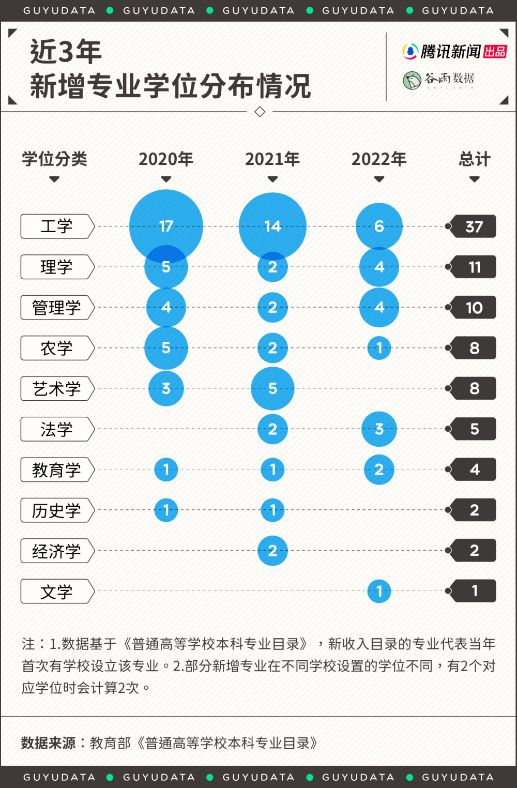

# 近5年国内大学被撤销专业排行，哪些专业不能让孩子再报了？

人刚毕业，专业没了。这种事情不止发生在冷门专业的毕业生身上，也是前些年不断扩张的各专业毕业生的处境。

高考之后选专业，就像一场赌博，天知道四年后你会不会是本专业的最后一批毕业生。每年，全国的高校都会撤销不少本科专业点，而且数量还在增加。2020年和2021年，分别有518和804个专业点被撤销。在2022年，总共有925个本科专业点被撤销。

与此同时，2022年，各个高校新增设了1641个本科专业点的备案。但选择这些新兴产业相关的热门专业，也不是轻松容易的路。

这些专业在逐渐消失

**最先消失的专业，不少属于交叉、偏应用的专业。简单来说，什么都学一点，什么都不精专。**

最多高校撤销的专业，是信息管理与信息系统。2022年有27所高校撤销这个专业，2021年更是多达33所。这是一个涉及到计算机、管理学领域的专业，多数属于管理学学位。它最早是在7、80年代，由人大、清华首先设立的。随着互联网的快速发展，再加上如今管理学领域的细分，这个看起来像万金油的专业设置已经不太适用当下职场了。

在小红书上，有信管专业的大四学生问，不想考研和考公，这个专业出来能做什么呢。不少同专业毕业生在评论里抱怨说，代码也只是学了个皮毛，其实更像管理类专业。但谁会让刚毕业的大学生直接管理别人呢？有人评论说，虽然有些同学去了大厂的技术岗，但是都属于在校外参加了编程培训班的情况。

被不少媒体报道过的公共事业管理专业，是近5年来数量第二多的被撤销专业。

这个专业最对口的出路是考公。但如今，不管啥专业都在考公，千军万马抢一个名额，公共事业管理专业的毕业生也并不占优势。

每日人物2022年的一篇报道中，一位公共事业管理的毕业生说，自己班上有八成的同学都准备考公，但最后只有不到20%能上岸。而且即便是考公，写明招“公共事业管理”专业毕业生的，多数也是通用型岗位，比其它管理学专业的机会还更少。至于去企业求职，如果没有额外的专业和技能，也很难占优势。

在理学专业中，教育技术学的毕业生面临同样的边缘处境。这个专业结合了教育学、心理学、计算机、摄影摄像领域，主要出路是中小学教师、考公。

此外，信息与计算科学、电子信息科学与技术，看似计算机相关，好就业，但如今技术更新换代很快，这些专业设置也不再符合市场需求了。

艺术类专业中，服装设计和产品设计是两个撤销得比较多的专业。而10年前热门的文科专业，比如市场营销、广告学，如今也热度褪去。

**有点出人意料的是，最近5年撤销的专业中，工科学位的占比最多，其次才是管理学。**

这也侧面反映了教育与产业需求适配的重要性——工科专业跟产业需求结合更紧密，更新换代更快，学校里学的东西不顶用了。

新设的专业，看准了人工智能、新能源行业

再来看新设立的专业集中在哪些领域。

在这些新设专业中，最多的是人工智能相关。“智能”“智慧”，是出现最多的关键词。跟其他工程的结合，成了新风口。

新能源领域也新设立了不少专业，比如“储能科学与工程”“新能源材料与器件”“新能源科学与工程”“新能源汽车工程”等等。

**最热门的新设专业是“数字经济”，今年多达77所学校新开了这门专业。**
它融合了经济学、数据科学和计算机科学三方面课程，授予管理学学位，有点像升级改版之后的“信息管理与信息系统”专业。

文学学位的专业里面，新设的“网络与新媒体”是更适应互联网行业的新闻专业。

艺术类专业也要跟互联网结合，比如数字媒体艺术，是高校开设比较多的专业。

虽然工科被砍掉的专业最多，但它新增的专业也相对较多。

相比之下，理科新增专业数量仅次于工科，但2022年新开设这些专业的学校数量还不算多。毕竟理科相对工科更基础，更少应用的内容，所以更新没那么快。

文科就业越来越难

大学专业调整的根本原因还是就业问题，在竞争激烈的就业市场上，首先被挤压的就是文科专业。

根据麦克思研究，在近5年来的12个“绿牌专业”里，11个都是工科。“绿牌专业”指的是失业量较小、毕业去向落实率、薪资和就业满意度综合较高的专业。

相较之下，就业情况不好的专业则比较集中。人文社科、艺术类各有3个专业，理科也有2个专业。

从近10年的高考热搜专业变化，不难看出就业市场对相关专业的需求转变，以及产业结构的变迁。

**比如17年还在热搜排名第4的法学专业，已经连续5年是就业满意度低、就业率低的“红牌专业”了。**

在豆瓣“大学后悔学法学专业”小组，有不少法学生的吐槽。

有坐标浙江的19级毕业生，22年刚经历了“超长待机”的法考。考试结束之后，开始投递简历，近100份简历只收到3个面试。他发现，不管是大型还是中小型律所，待遇都非常不好。大型律所开出的月薪只有2400，小型律所则需要“做地推、拓展案源以及打电话巩固客户，工资同样在法律边缘试探”。等到法考出成绩、发现自己通过之后，却依然找不到合适的工作。

管理类专业的就业状况确实明显在下滑。10年前很火的市场营销、工商管理专业，如今成了各个学校纷纷撤销的专业，无一进入榜单。

根据《2022大学生就业力调研报告》，截至22年4月，毕业生签约就业率中，经管类是最低的，只有10.5%，甚至比人文学科的12.4%还低。

不少人在小红书讨论，自己从二本的市场营销专业毕业，身边的学长学姐基本都是只能做销售。

在豆瓣“校招遗漏人才自救中心”，有位发帖女生是22届头部211学校、偏冷门的管理类专业毕业生，在校期间有国企实习经历以及科研经历。考编上岸失败之后，从今年3月开始投简历，只有中小型公司给她面试机会。好不容易收到了一个外包的国企offer，结果合同里面都没有写明薪资待遇。面试本以为没人愿意去的销售管培生项目，却发现竞争同一个岗位的不少是来自985院校的毕业生。

相比经管类专业，专业性更强的工科专业的热度越来越集中，但是变化也很快。土木工程专业19年是高考志愿填报搜索量第一，21年也还排在第3位。但随着房地产、建筑行业的衰落，近两年土木专业热度骤减。

如今的最热门的专业是人工智能、大数据。

**人工智能专业，2019年首次开始本科招生，就上榜了百度热搜前5名。**
且从2020年开始，它已经连续3年是关注度第一的专业，专业性强、高薪、好就业，未来的行业前景也很好。相应的，从一开始招生，名校的人工智能专业分数线就比同校的其他理科专业要高。

高薪的人工智能，已经开始卷起来了

新设立的专业，跟国家政策扶持的新兴产业有很大关联。

人才最紧缺的是智能制造行业，人才紧缺指数远高于其它，同时它也是15个新兴产业中最高薪的行业。在22年的新增本科专业备案中，就有39所高校开设了“智能制造工程”。

紧缺度其次是生物技术，但它的薪酬并没有和紧缺程度匹配，行业平均招聘薪资不到20万，跟智能、信息领域的几个新兴行业相比差距不小。

**想要赚到高薪，除了去做智能制造之外，就是人工智能，其平均薪酬超过30万。但这两年人工智能已经卷起来了，竞争相对变得激烈。**

在小红书上，有人工智能行业从业者分享自己公司的招聘情况——如今已经是“神仙打架”，大部分简历都来自C9高校的本硕或海外名校。最后录取的两位同学一个是清华本硕，妥妥的学霸；另一个是山大本硕，但有不少项目经验。在他看来，当下人工智能行业已经趋于稳定，不再是会python就能年薪百万的时代了。但是如果真的足够优秀，应届生进来确实能拿到50万的高薪年包。

**如人工智能这样的风口专业，是否要在本科开设，还有一定争议。**
业内不少岗位都需要硕博学历，本科生去了也没用。那么，是否需要在本科阶段就细分到人工智能，还是打好计算机领域的基础即可，见仁见智。另外，想要设立人工智能专业，需要所在学校有一定的师资和技术积淀，如果只是追赶热门，也撑不起来一个新设立的本科专业。

最近《人物》的一篇报道，提到了一些双非学校也开始设立人工智能专业，出现了各种问题。一方面，人工智能的课业繁重程度，超出很多人的想象。一位人工智能专业大三同学说，自己最忙的时候，周一到周四，每天晚上都被选修课和实验占满，早8晚10。学生认为课程设置浅而广，与就业所需的实际操作知识相去甚远。想要去实习，但根本抽不出时间。

更让人哭笑不得的是，自己系上的老师绝大部分是计算机专业毕业，缺乏人工智能背景。 **甚至有位老师上课时直接让同学自习，直言“我学得可能还没你们好”。**
他在人工智能领域的知识，主要是在某科技公司举办的暑期培训营里学来的。

新设立专业终究要考虑教学基础设施，更得考虑就业环境变化。对于即将高考的同学来说，这些新兴的专业也绝非轻松、容易的选择。没人能保证你四年后毕业，一定能找到高薪或稳定的工作。

未来总是不确定的，很多时候，走一步看一步也是大多数人生活的常态。

作者 | Heather 设计 | 镝数卢瑞丰 镝数王玉君 镝数陈力维 编辑 | 郝库 出品 | 腾讯新闻 谷雨工作室

腾讯新闻出品内容，未经授权，不得复制和转载，否则将追究法律责任。

