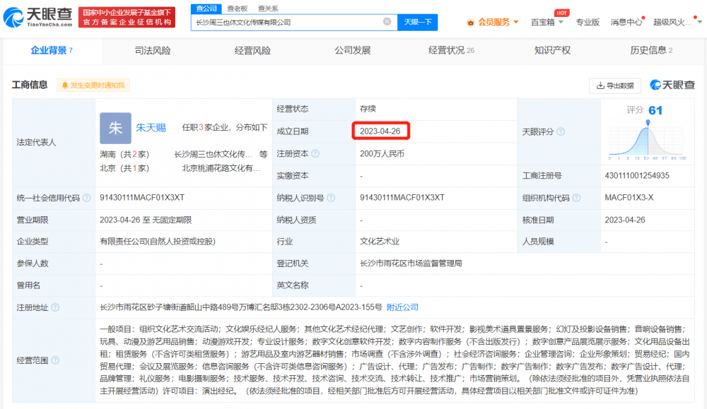
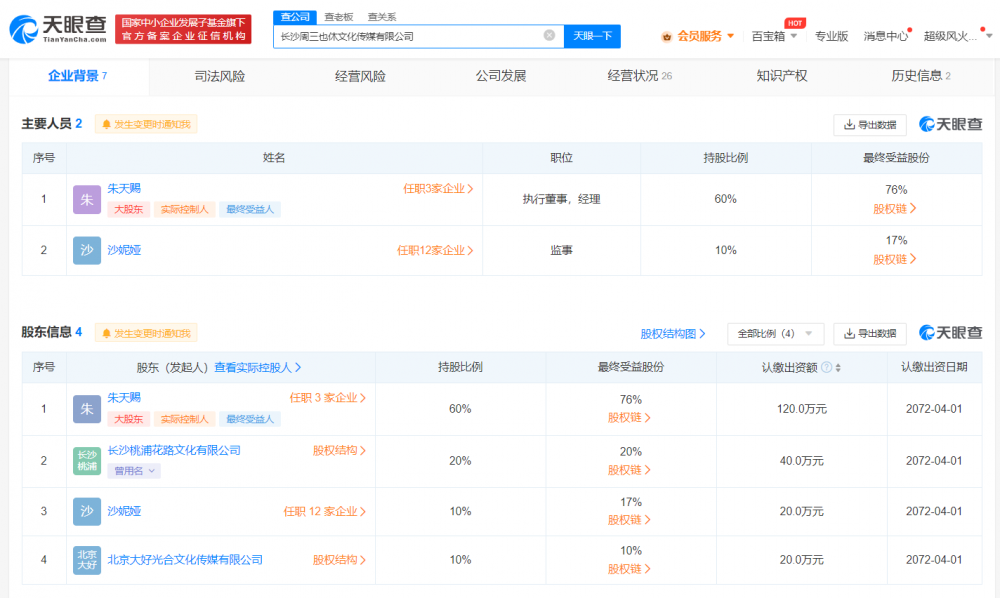

# 长沙一公司声称取消所有调休：曾发布周三带薪休假通知，成立仅1个月

中国经济周刊-经济网讯 据悉，近日，长沙一公司发布通知称取消所有节假日调休补班，引发网友热议。此前，该公司曾发布周三带薪休假通知。

天眼查App显示，涉事公司长沙周三也休文化传媒有限公司成立于2023年4月26日，注册资本200万人民币，法定代表人、执行董事、经理均为朱天赐，经营范围包括组织文化艺术交流活动、文化娱乐经纪人服务、其他文化艺术经纪代理、演出经纪等。股东信息显示，该公司由朱天赐、长沙桃浦花路文化有限公司等共同持股。

新媒体编辑：何颖曦

一审：何颖曦 二审：王新景 三审：周琦

