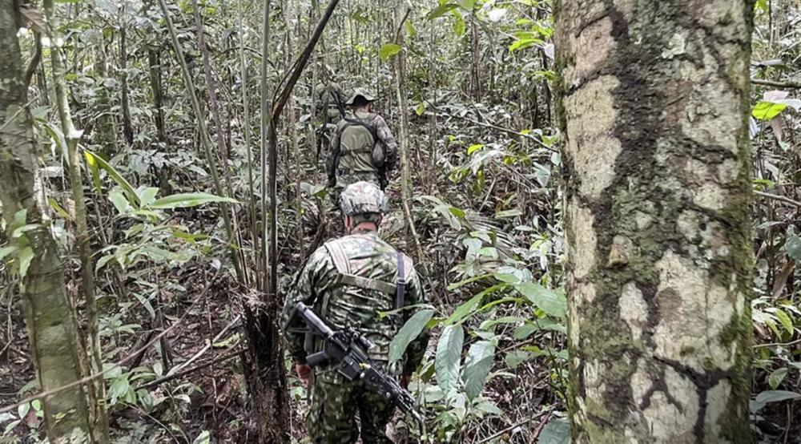

# 4名儿童空难幸存 在亚马孙雨林生活40天：是土著人 搜救队曾空投食物

极目新闻记者 胡莉

哥伦比亚发生空难40天后，机上4名儿童在丛林被发现幸存，最小的只有11个月大。据《卫报》6月10日报道，这4名儿童之所以能在丛林中活那么久，和他们是土著人，从小耳濡目染野外求生技能分不开。

**40天野外求生创奇迹，搜索队曾空投食物救生包**

5月1日凌晨，哥伦比亚一架小型飞机，在亚马逊省飞往瓜维亚雷省的途中，由于发动机故障在丛林中坠毁。

据悉，这架飞机为塞斯纳206轻型飞机，当时飞机上一共载有7个人，包括飞行员在内的3名成年人和4名儿童。

当局立即展开救援活动。5月16日，一支搜救队在茂密的热带雨林中找到了这架飞机，同时也找到了机上3名成年人的尸体，而4名儿童不知所踪。据了解，这4名儿童的年龄分别为13岁，9岁，4岁和11个月。

救援人员认为，事故发生后，他们一直在丛林中游荡。为孩子们获救埋下伏笔的是，在5月16日的救援中，搜索队空投到丛林中的食物救生包，成为孩子们的接下来续命的能量。

_搜救现场（图源：《卫报》）_

几周来，搜救人员找到了一些令人安心的线索，比如脚印、一块脏尿布和一个瓶子，因此推断失踪儿童仍有生命迹象。

9日，救援人员终于迎来好消息，这4个孩子还活着！

虽然找到他们的时候可以明显看出他们营养不良，但没有人有生命危险。随后，孩子们被送往圣何塞德尔瓜维亚雷进行健康检查和心理评估。

哥伦比亚总统佩特罗说：“孩子们是被一条搜救犬发现的。他们是丛林之子，也是哥伦比亚的孩子。”

附近的原住民领袖约翰·莫雷诺说：“孩子们在的地方是一片原始森林，茂密而危险……他们利用从小在土著社区中成长获得的知识来生存。”凭借非凡的复原力，孩子们在该国最荒凉的地区之一幸存下来。

**孩子们所属的维托托族，在哥伦比亚仅存2500人**

按照媒体说法，4名儿童所属的土著民族为维托托族，丛林生存经验较为丰富。

根据约书亚计划（旨在追寻世界各族裔群体的组织）的一项数据显示，维托托族人民友善，乐于改变，欢迎新事物融入他们的文化。但随着时间的流逝，这个族群在哥伦比亚仅存2500人。

80年代末，维托托族获得了哥伦比亚政府的土地赠款，他们现在住在保护区内。维托托族人擅长制作筛子、吊床、独木舟和编织篮子。他们将自己制作的产品卖出去以获得经济来源。狩猎和捕鱼也是他们为生的手段。

