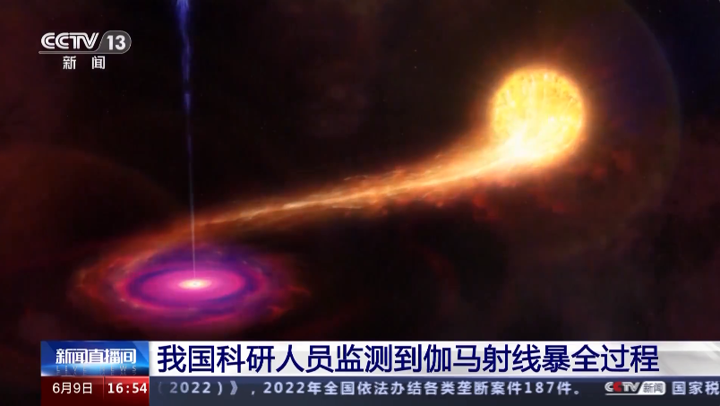
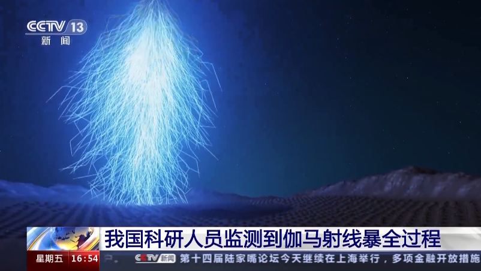

# 人类首次！我国科学家捕获史上最亮伽马射线暴

每经编辑：杜宇

6月9日，高海拔宇宙线观测站（LHAASO，中文简称“拉索”）对命名为GRB221009A的伽马射线暴（Gamma Ray
Burst，GRB）的最新观测研究成果在线发表于《科学》（Science）杂志，题为“极亮伽马射线暴221009A窄喷流的万亿电子伏特余辉”（A tera-
electronvolt afterglow from a narrow jet in an extremely bright gamma-ray
burst 221009A）。该论文由LHAASO国际合作组完成。

据央视财经，位于四川稻城的高海拔宇宙线观测站对宇宙中一次 **伽马射线暴** 进行了完整监测， **这是人类首次完整记录到这一高能爆发现象的全过程**
。相关研究成果北京时间6月9日在国际学术期刊《科学》（Science）在线发表。

伽马射线暴是人类已知宇宙中最强的爆发现象，理论上是巨大恒星在燃料耗尽时塌缩爆炸或者两颗邻近的致密星体合并而产生的。

这次由高海拔宇宙线观测站捕捉到的伽马射线暴抵达地球的时间是2022年10月9日21时20分。该观测站精确探测到了伽马射线暴高能光子爆发的完整过程，并记录了万亿电子伏特伽马射线流量增强和衰减的整个阶段，
**这在国际上尚属首次。** 经过半年左右对该伽马射线暴数据的分析，科研人员发现它有一个非常快速的起爆过程，并且其衰减的过程也是非常迅速。

专家说的这束光线产生自20多亿年前，一颗比太阳重20多倍的大质量恒星燃烧完引发的巨大爆炸火球，火球与星际物质碰撞产生的大量万亿电子伏特高能伽马光子在茫茫宇宙中穿行了20多亿年，正好抵达高海拔宇宙线观测站的视场范围内。凭借观测站内水切伦科夫探测器阵列强大的性能，科研人员在20多分钟内记录到了超过6万个光子的数据。

**而国外相同能区的观测装置目前还没有实现完整记录伽马射线暴全过程。**

据澎湃新闻，伽马射线暴是来自天空中某一方向的伽玛射线突然增强的爆发现象。2022年10月9日发生了一个“千年一遇”的异常明亮的伽马暴
，它正好位于“拉索”的视场范围内。“拉索”探测到了6万多个能量大于200GeV的高能伽马光子，对它们的分析表明这些高能光子来源于主暴之后的余辉辐射。“拉索”第一次探测到高能伽马射线余辉的起始阶段，揭示了余辉存在快速上升和缓慢上升两个阶段。尽管缓慢上升符合余辉模型的预期，但早期快速的上升现象前所未有，这或许由于中心引擎对余辉注入了大量能量所致。同时“拉索”发现主暴阶段没有高能辐射，其高灵敏度测量对主暴阶段高能辐射的强度给出了极强限制，对主暴的物理机制具有重要启示作用。

据四川新闻网，据介绍，“拉索”观测表明，高能辐射在起爆之后不到10分钟的某个时刻，亮度突然快速减弱了。“这可解释为爆炸后的抛射物是喷流状的结构，当辐射张角扩展到了喷流的边缘时造成亮度快速下降，”论文通讯作者之一，南京大学教授王祥玉说。由于这个亮度转折发生时间极早，由此测出了喷流的张角也极小，仅0.8度。这是迄今知道的最小张角的喷流，
**意味着观测到的实际上是一个典型内亮外暗喷流的最明亮的核心。**

“正是由于观测者碰巧正对喷流最明亮的核心， **自然地解释了为什么这个伽马射线暴是历史上最亮的**
，也解释了为什么这样的事件极其罕见，”论文通讯作者之一，中国科学技术大学教授戴子高表示。

_“拉索”航拍图
(图片来源：中科院高能所提供）_

中国科学院高能物理研究所研究员
曹臻：LHAASO（高海拔宇宙线观测站）最重要的科学目标，就是去解决一个一百年的谜题。这个一百年的谜题就是说，我们的宇宙的构成中的一部分，一些高能量的粒子是怎么被产生出来的，在哪里被产生出来的，而这些问题现在都在逐渐展开研究。

“截至当下，本场爆炸事件还有其他新发现，科学家们还在不懈地深耕‘拉索’的数据，力图揭示更多的奥秘，敬请等待‘拉索’的后续数据分析成果。”曹臻对LHAASO下一阶段成果给出了乐观的预期。

位于四川稻城的高海拔宇宙线观测站是目前世界上海拔最高、规模最大、灵敏度最强的伽马射线探测装置，是我国国家重大科技基础设施。该观测站平均海拔4410米，占地面积约1.36平方公里。观测站由电磁粒子探测器、缪子探测器、水切伦科夫探测器和大气切伦科夫望远镜四种类型的探测设备组成，可以宽波段、多手段地开展天体物理等方面的研究。观测站于2021年7月建成并投入运行，今年5月10日通过国家验收。

每日经济新闻综合央视财经、四川新闻网、澎湃新闻

封面图片来源：央视新闻视频截图

每日经济新闻

