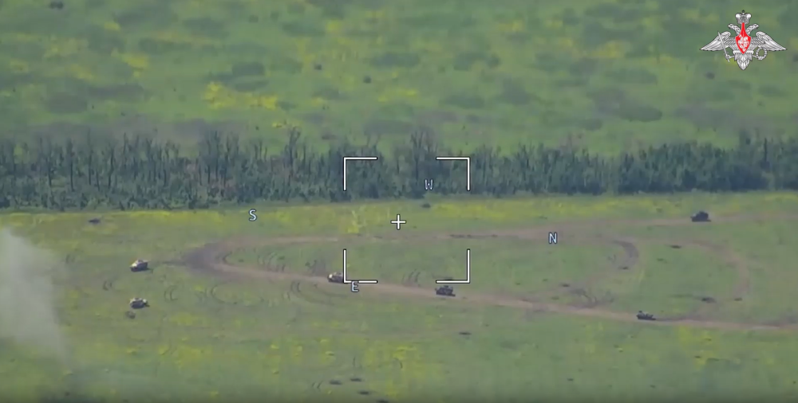

# 俄媒：俄国防部公布乌军装甲车辆被摧毁视频，引用二战时期经典语录

【环球网报道 记者
李律杉】据“今日俄罗斯”（RT）电视台网站报道，俄罗斯国防部9日公布了一段时长45秒的视频，视频展示了美国及其盟国向乌克兰提供的装甲车辆被俄军摧毁的画面。视频还配有1941年苏联宣布受到纳粹德国入侵的标志性无线电广播片段。

报道称，视频展示了西方国家提供的
“布莱德利”步兵战车和“豹”式坦克等装甲车辆被摧毁的画面。报道还称，虽然这段视频配有电子音乐，但视频开头是来自过去的声响。1941年，被誉为“苏联之声”的尤里·列维坦在广播中宣布了纳粹德国入侵苏联，他说，“我们的事业是正义的，敌人将被击溃”，而俄国防部在视频中引用了这句话。RT还称，俄罗斯国防部还经常引用列维坦在广播中的另一句话，“胜利属于我们！”

_RT称，视频以多辆装甲车在扎波罗热前线某处开阔地带被炮火击中开幕。
图源：俄罗斯国防部视频截图_

_RT称，视频展示了多辆被摧毁的由西方国家提供的美制“布莱德利”步兵战车和“豹”式坦克。
图源：俄罗斯国防部视频截图_

_RT称，视频还展示了一辆“豹”式坦克在一条泥泞的小道上燃烧的片段。 图源：俄罗斯国防部视频截图_

据该媒体此前报道，俄国防部9日发布的最新每日通报中称，乌军在24小时内损失多达1240名士兵和39辆坦克。莫斯科方面表示，基辅在近一周内伤亡惨重。

据俄罗斯卫星通讯社报道，俄罗斯总统普京9日在对记者发表讲话时表示，基辅政权在乌克兰军队最近发动的袭击中动用了其战略储备，这“绝对肯定”地表明，乌克兰发起的反攻已经开始。另据法新社补充，普京还表示，发起进攻的乌克兰军队未能达到其目标。

