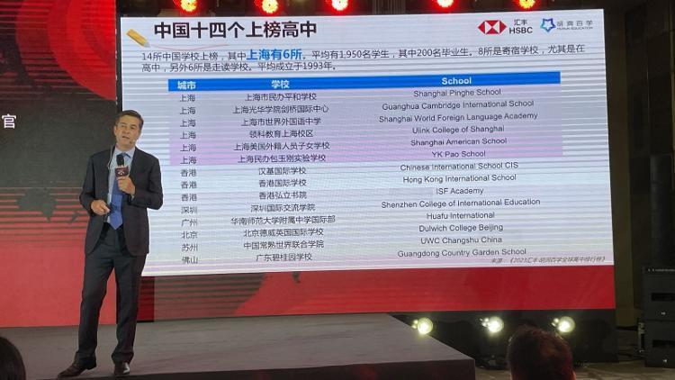
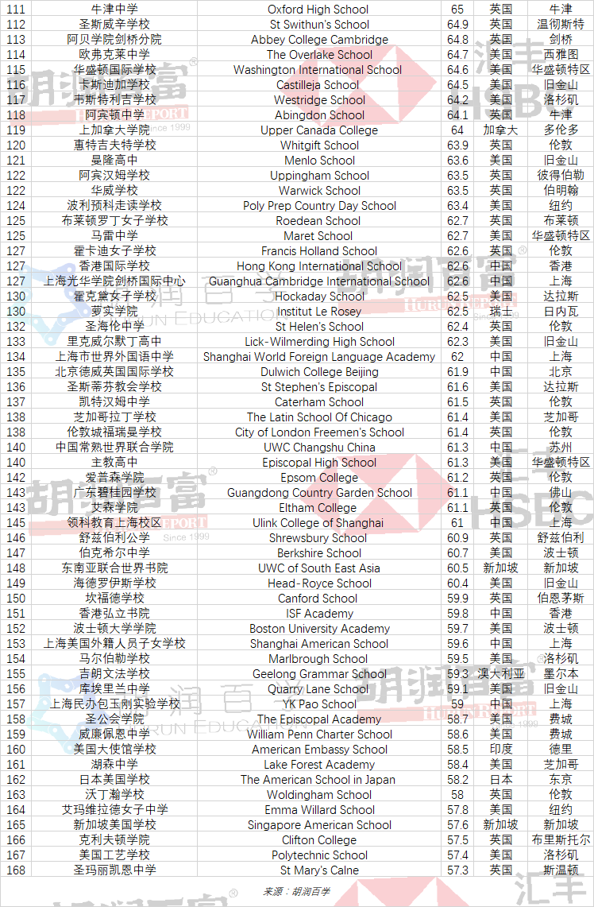

# 全球高中排行榜首次发布，中国14所学校上榜，排名全球第三

**海报新闻记者 于明效 上海报道**

6月10日，胡润百学全球高中排行榜于上海、孟买、伦敦同步发布，将全球顶尖非公立高中，根据毕业生去向、课外活动和学校声誉进行排名，该榜单为胡润百学首次发布。来自12个国家的168所学校上榜，中国14所学校上榜，排名全球第三；第一、第二分别为美国和英国。

海报新闻了解到，该榜单只包含拥有实体学校的非公立学校。上榜学校共有17万名学生，每年有2.4万名毕业生。平均每所学校有990名学生，其中33%是寄宿生，140名学生在毕业班。上榜学校平均有195年的历史。

联合国教科文组织的一份报告显示，中国、印度是出国留学高中学生的最大来源国，其次是韩国和德国，沙特阿拉伯排在前五名。美国国际教育协会《Project
Atlas 2020》报告显示，这些高中毕业生中有150万人出国读本科，其中70%的人在美国、英国、加拿大和澳大利亚学习。

中国上榜的14所学校中，上海占6所，香港3所，深圳、广州、北京、苏州和佛山各一所。平均有1,950名学生，其中200名毕业生。成立时间最早的是上海美国外籍人员子女学校，成立于1912年，另有8所学校为2000年之后成立。该14所学校中每年约有150余名学生进入牛津和哈耶普斯。

胡润表示，榜单上的中国学校平均成立才30年，短时间内，中国的世界级高中已经比后面九个国家加在一起还要多，而且与美国和英国的差距没特别明显。虽然中国国际学校这几年面临政策环境变化的挑战，但最近20年这些学校变化和进步非常大，主要原因首先是人才，即生源的质量很高，也离不开中国经济的稳健发展。

“自2017年起，胡润百学已五次发布‘中国国际化学校’排行榜，这份榜单以同行认可这一维度为主，主要因为中国的国际化学校相对比较年轻，平均不到20岁，很多学校刚刚有一些毕业生，很难从其他方面进行衡量。我们今天的‘全球高中排行榜’数据相对更为成熟。”胡润补充。

记者注意到，2021/2022学年，上榜走读学校的平均学费为4.4万美元（约合人民币30万元），寄宿学校的平均学费为5.7万美元（约合人民币40万元）。其中最贵的为瑞士萝实学院，一年寄宿学费为15.4万美元（约合人民币110万元）。

平均而言，上榜美国学校的学费比英国学校高55%。美国走读学校的年平均学费为5.1万美元（约合人民币35万元），而英国为3.9万美元（约合人民币28万元）。美国寄宿学校的年平均学费是6.5万美元（约合人民币45万元），英国为5.2万美元（约合人民币40万元）。

