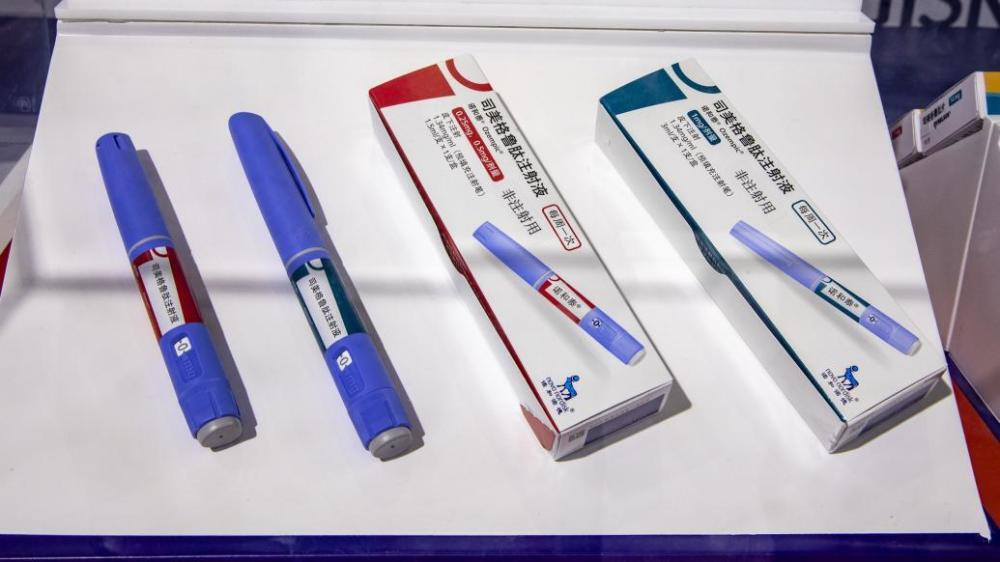
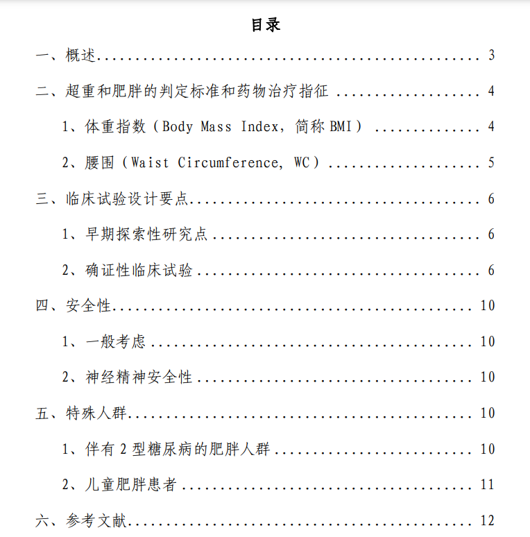

# 减肥神药调查我国肥胖人群超2亿，批准减肥药仅1款！安全性是研发难点

随着生活水平的提高，肥胖人群的数量快速增长。安信国际研报指出，我国肥胖人群从2017年的1.91亿人增至2021年的2.3亿人。根据Frost &
Sullivan预测，2030年中国肥胖人口将达3.29亿人。

2023年以来，司美格鲁肽、利拉鲁肽等GLP-1类药物的减肥功效备受关注，原本用于糖尿病治疗的降糖针，被不少人视为“减肥神药”，期待其减肥适应证尽快在国内获批。与人们巨大的减肥需求形成对比的是，目前全球获批的合规减肥药十分有限，国内批准的仅有一款奥利司他，而在美国，这一数量也不到10款。

**超2亿肥胖人群，减重药存在未被满足的需求**

肥胖不仅仅影响美观，更威胁着人的健康。

有减重专家此前在接受澎湃新闻记者采访时表示，肥胖初期有代偿期，即只是胖，还没有其他疾病，但随着时间的推移，肥胖可能引起200多种相关疾病，如高血脂、高血糖、高血压、睡眠呼吸暂停、内分泌紊乱，长时间控制不好会影响血管健康，出现心脑血管疾病，严重的甚至导致猝死。

需要强调的是，肥胖并非一个主观概念，而有专门的衡量标准，运用最多的是体重指数（BMI）、腰围等指标。《中国成人超重和肥胖症预防控制指南》2006版中指出，中国人肥胖诊断的BMI界值是24≤BMI＜28为超重，
BMI≥28为肥胖。

生活方式干预、吸脂手术为代表的医美手段、减重手术等方法均是减肥的选择之一，或者难以坚持，或者侵入性大，或费用高，靠吃药打针就能减重的减肥药始终备受人们的期待。尽管减肥是各大药企研发活跃的领域，但从获批的情况来看，目前合规减肥药的数量并不多。从美国食品药品监督管理局（FDA）披露的数据来看，目前获批用于体重管理的药物不到10款，包括奥利司他、芬特明-
托吡酯、安非他酮-纳曲酮、塞美拉肽、利拉鲁肽、司美格鲁肽等，获批时间横跨1999年到2021年。

近期在国内大火的司美格鲁肽于2021年6月获批，FDA当时官宣这条消息时特别强调，这是自2014年以来，FDA批准的首款用于控制普通肥胖症或超重的新药，FDA仍致力于推动相关开发或批准，为肥胖或超重的成年患者提供更多安全有效的疗法。

_奥利司他国产药品批准文号_

从国内来看，目前获批体重管理的药物仅有奥利司他一款。从国家药监局数据库来看，目前该药有19个国产药品批文，两个进口药品批文。2021年12月，国家药监局药审中心发布《体重控制药物临床试验技术指导原则》以鼓励和推动体重控制药物研发，其中就提到，体重控制药物存在未被满足的临床需求。

**减肥药研发难在哪里？**

实际上，历史上获批的减肥药远比现在要多，西布曲明、利莫那班、盐酸苯丙醇胺、芬氟拉明等多款减重药因不同程度的副反应被强制退出历史舞台。

以食欲抑制剂西布曲明为例，早在1997年，美国雅培公司就将其推出上市，随后在全球多个国家和地区上市。但是，从上市以来，西布曲明的安全性就饱受质疑，欧盟、澳大利亚等国家和地区进行了一项旨在研究西布曲明心血管不良事件的国际多中心临床研究，结果显示使用该药可增加受试者严重心血管风险。

西布曲明类减肥药于2000年来到中国，十年后的2010年，当时的国家食品药品监督管理局就发布通知，组织相关专家对西布曲明在我国使用的安全性进行了评估，认为使用西布曲明可能增加严重心血管风险，减肥治疗的风险大于效益，决定停止西布曲明制剂和原料药在我国的生产、销售和使用，撤销其批准证明文件，已上市销售的药品由生产企业负责召回销毁。

值得一提的是，西布曲明作为药品被禁用之后，有保健品违规加入该成分。《保健食品中可能非法添加的物质名单（第一批）》就包含西布曲明，被认定为是“有毒、有害的非食品原料”。

氯卡色林是2012年在美国获批的减重处方药，但2020年1月，FDA曾提醒公众，一项评估安全性的临床试验结果表明，该药可能会增加患癌症的风险，虽然不能断定氯卡色林会增加癌症风险，但必须让公众意识到这种潜在风险。之后的2月，FDA再次发布通知，要求这类药物从美国市场撤回，因为安全性临床试验显示癌症的发生率增加。

在具备一定的减重效果下，如何保证减肥药的安全性是减肥药研发的一大重点，也是难点。

_《体重控制药物临床试验技术指导原则》目录_

上述《体重控制药物临床试验技术指导原则》在减肥药的安全性方面指出，超重和肥胖是慢性代谢性疾病，长期的药物干预需重点考察对肝、肾、心血管等系统的影响。
近年来相继撤市的多种减肥药物暴露出可导致成瘾性、依赖性、增加心血管安全性风险、增加自杀倾向和对患者身心健康的影响等，这些特征性潜在不良反应需得到全面评估，还包括安全性药理学及非临床研究的关键毒理学发现。

上述指导原则还提到，一些体重控制药物（例如具有中枢性作用机制的药物）有可能引起严重神经精神不良事件。如果作用机制、非临床、早期临床或已上市药物数据提示有神经精神安全性问题，则应对精神性、神经兴奋性或认知不良事件（例如抑郁症和自杀倾向、激越、焦虑、失眠、精神病反应、注意力障碍）进行前瞻性评估。

需要注意的是，减重药的副反应或危害可能在使用多年后才会被发现。根据FDA公布的信息，上述被退市的氯卡色林在获批之初被要求进行随机双盲的临床试验，以评估心血管相关的风险。最终，该试验耗时5年多，纳入12000名患者的研究，发现致癌的风险。

**减重药并非万能神药**

即使目前上市的减肥药，其副反应不容忽视，安全性也在经受着真实世界的考验。

以国内唯一获批的奥利司他为例，财通证券研报指出，奥利司他仅能抑制脂肪的吸收不能抑制碳水的吸收，因此仍需配合低碳水饮食、体重控制效果有限。

上述CDE指导原则也提到，目前仅有奥利司他胶囊一种药物获批用于肥胖或体重超重（体重指数≥24 kg/m2）
患者的治疗，其减重效果有限，加之由于其作用机制（胃肠道脂肪酶抑制剂）相关的胃肠道不良反应如脂肪（油）性大便，脂肪泻等，其在临床上的应用受到限制。

副反应也影响了奥利司他的市场销售。华创证券研报指出，2022年奥利司他市场规模仅8.2亿元。

如今的GLP-1类药物提供了新的减重思路，但并非万能的“减肥神药”。以诺和诺德司美格鲁肽为例，其说明书列出了9大类不良反应，涉及免疫系统、神经系统、胃肠系统等。FDA在获批时还特别提醒，该药的处方信息包含一个黑框警告，告知医疗专业人员和患者存在甲状腺癌的潜在风险。此外，该药不能应用于有甲状腺髓样癌个人史或家族史的患者。

一位内分泌科医生向澎湃新闻记者提醒，司美格鲁肽、利拉鲁肽等GLP-1类药物在国外获批用于减肥，临床研究人群来自欧美，且都是大体重，在中国肥胖人群的效果如何仍需要看临床数据，目前不建议为了减肥自主乱用。

“其实GLP-1类药物用于减重，更多的是用在肥胖合并有糖尿病等代谢疾病的人群中，这种减重并不是为了美，而是为了改善代谢。”上述内分泌科医生强调，面对一种新药，且是处方药，人们需要了解它好的一面，也需要看到它不好的一面。另外，全社会对于什么是健康美，也需要有正确的引导，这也有利于患者的合理用药。

