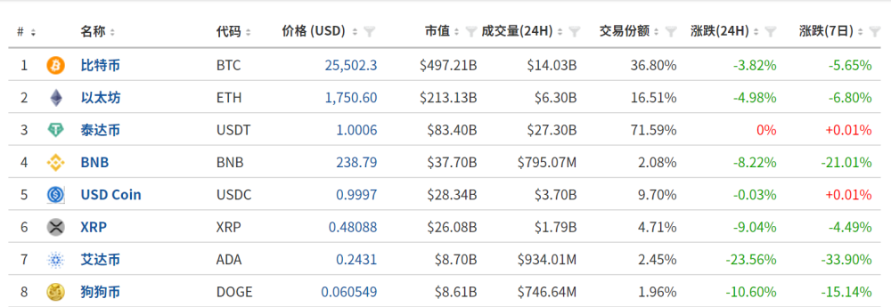
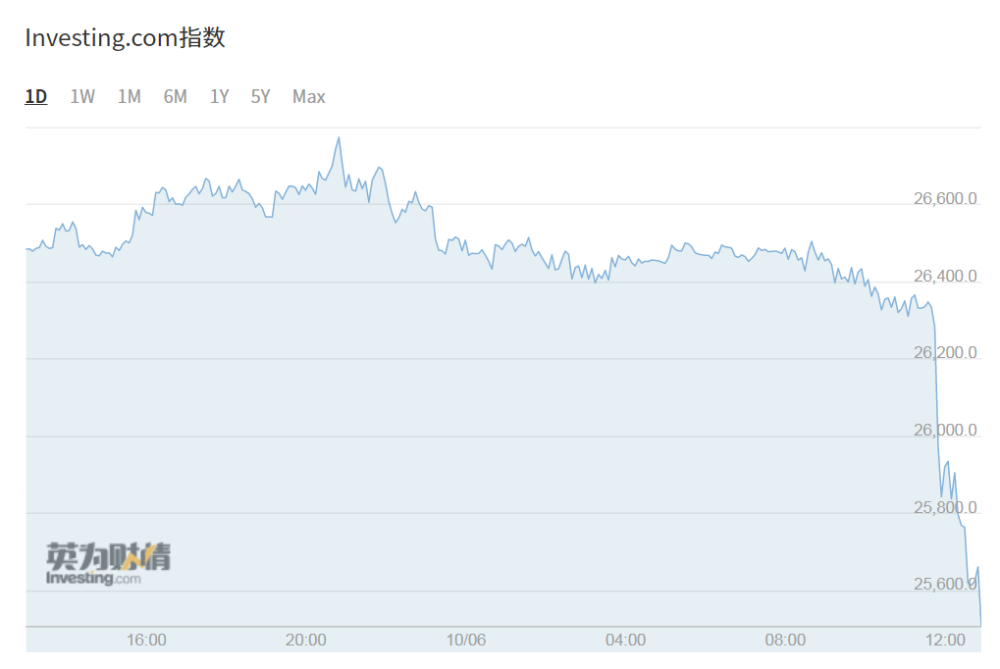
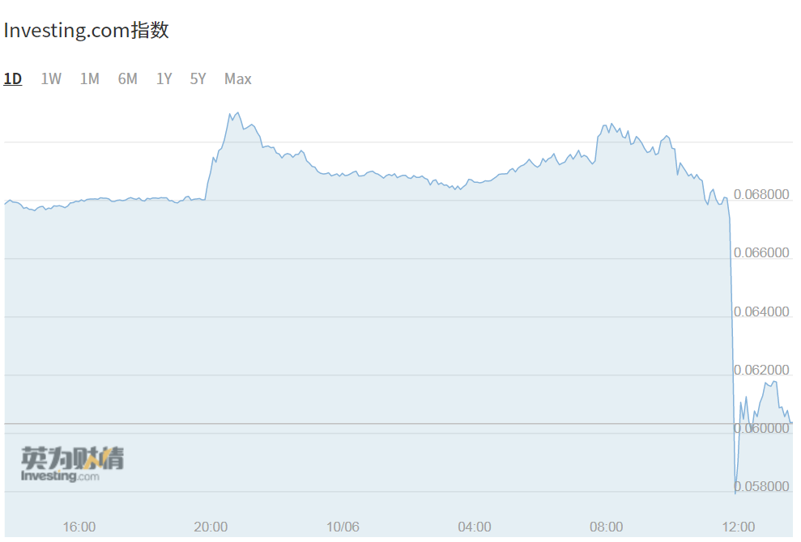
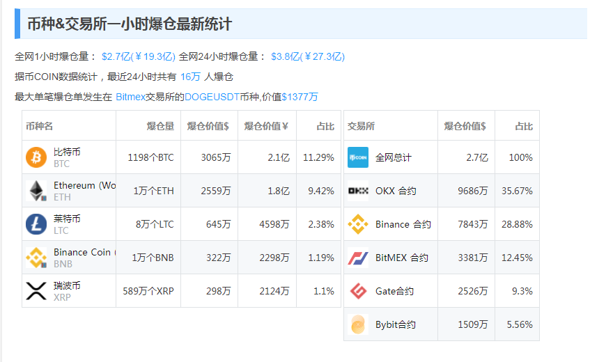
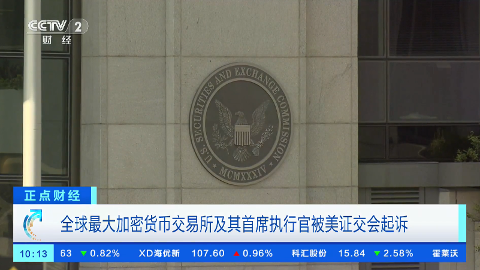

# 加密货币突发下跌！狗狗币跌超10%，一天内27亿元蒸发16万人爆仓

每经编辑：杜宇

6月10日，加密货币大幅下挫。截至发稿比特币报25502.3美元，跌3.82%；以太坊跌4.98%，狗狗币跌10.6%，莱特币跌12%，波场币跌15.89%。

_比特币走势图
（图片来源：英为财情）_

_狗狗币走势图（图片来源：英为财情）_

据币COIN数据统计， **最近24小时共有16万人爆仓，3.8亿美元（约27亿元）资金蒸发。**

据央视财经此前消息，路透社报道，当地时间6月5日，美国证券交易委员会表示，因违反美国证券交易规则，该委员会已对全球最大的加密货币交易所——币安交易所及其首席执行官提起诉讼。

当天，美国证交会向华盛顿特区联邦法院提起诉讼，指控币安及其首席执行官赵长鹏经营未注册的交易所、出售未注册的证券，以及存在滥用客户资金等违规行为。美国证交会还指控币安，至少在2019年9月到2022年6月之间，从事虚假交易、夸大交易量等。

对此，赵长鹏在社交媒体上称，团队将继续确保包括提款和存款在内的各系统的稳定，一旦接到相关投诉，将会做出回应。

每日经济新闻综合央视财经、公开资料

