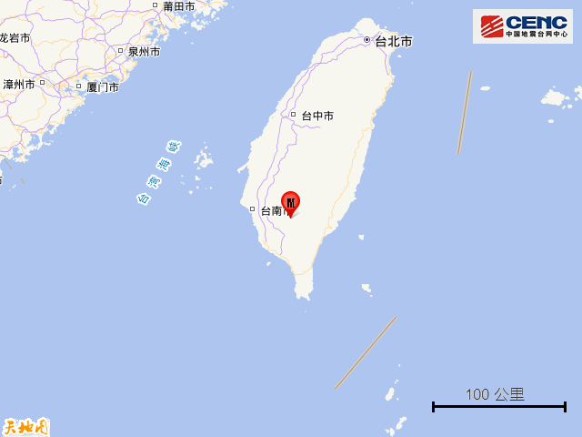
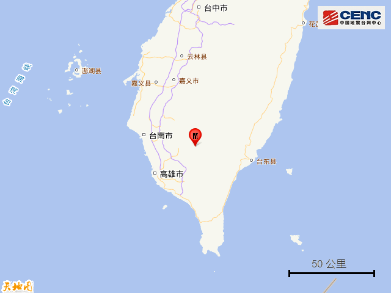
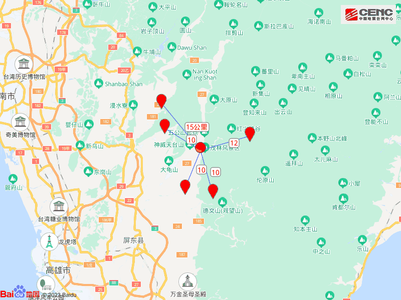
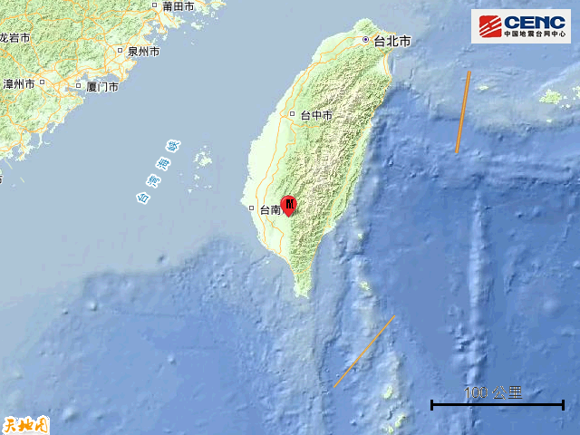
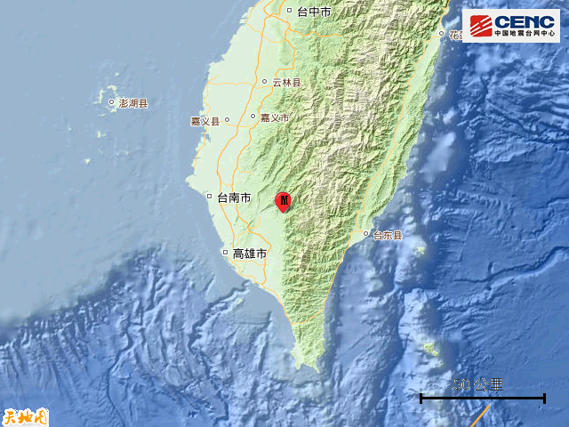
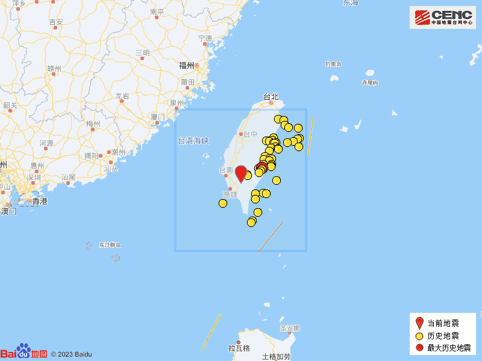

# 台湾高雄市发生4.7级地震

据中国地震台网正式测定，6月10日13时31分在台湾高雄市发生4.7级地震，震源深度14公里，震中位于北纬22.88度，东经120.65度。

震中距三地门乡10公里、距美浓区10公里、距高树乡10公里、距茂林区12公里、距杉林区15公里，距屏东县29公里，距桃园市241公里，距台北市255公里。

震中5公里范围内平均海拔约426米。

根据中国地震台网速报目录，震中周边200公里内近5年来发生4级以上地震共234次，最大地震是2022年9月18日在台湾花莲县发生的6.9级地震（距离本次震中73公里），按震级大小前50次历史地震分布如图。

