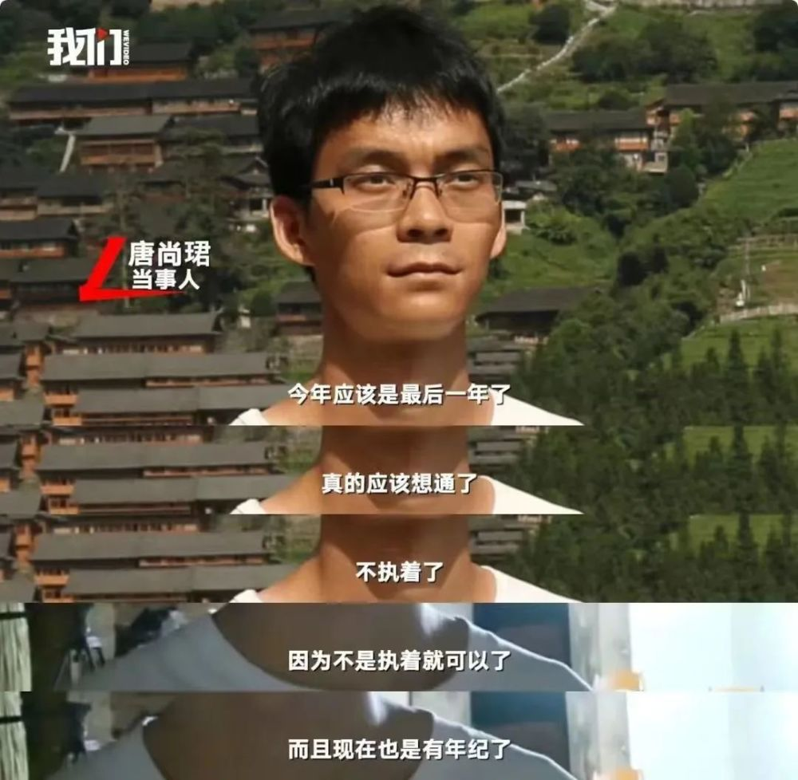

# 复读15年的唐尚珺承认考不上清华，媒体：对高分复读的奖励也该取消了

对于高分复读不宜给予奖励，应该成为共识。

**全文1590字，阅读约需4分钟**

**撰稿 / 熊丙奇（教育学者）编辑 / 何睿 校对 / 刘军**

_▲唐尚珺承认自己没有实力达到清北录取线。新京报我们视频截图_

又是一年高考季，总有一些“特殊”考生格外引人关注。比如，为考取清华大学已第15次参加高考的广西籍考生唐尚珺。

6月8日，新京报记者联系上了唐尚珺。谈及今年的高考，唐尚珺称今年高考内容相对去年容易一些， **“清华是不太可能了，不执着了，上985没问题”。**

唐尚珺真的想通了吗？这需要他自己给出答案。去年，他报考上海交大护理学院被录取，大家都以为他可以放下执念了，然而，他还是做出了放弃报到继续复读的选择。据报道，今年他计划报考农学或师范专业，这其实还是一个很随意的选择。已经15次参加高考的他，并没有清晰的上大学规划，报考的专业一直在变来变去。

**对于唐尚珺，舆论已经讨论很多。其多次复读的选择，主要源于他要“上清华”的执念。**
但促使他形成这种执念的，还有其他教育和社会因素，其中就有学校、教育机构、社会企业针对高考高分生、被名校录取考生的奖学金措施。

要遏制越演越烈的高分复读、“考霸”现象，全社会应该形成共识，比如取消针对高考高分生、被名校录取考生的奖励措施等，至少可以先取消针对高考复读生的所有奖励措施。

从本质上说，这种奖励措施也是在宣传、炒作高考高分生、升学率，是教育部所明确禁止的。但是，对于带有“自发意味”的奖励，如复读机构设立奖学金，企业出资重奖考上北大清华等名校的学生，社会舆论大多是乐见其成，教育主管部门也难以禁止。

可以说，正是这些奖励措施刺激了高分复读，促使唐尚珺们为上名校“一路走到黑”，成为“职业考生”。多年前，媒体就曾报道，有考生为获得高额奖学金，考上北大清华而放弃报到，来年继续复读考北大清华，成为“考霸”。

_▲唐尚珺表示自己的复读“今年应该是最后一年了”。新京报我们视频截图_

**唐尚珺虽不属于“考霸”，但支撑他不断选择复读的，除了他自己的意志，也有学校、教育机构给他的奖学金，虽然不高，却可以解决他复读的生活费用。**
据报道，唐尚珺表示，自己的实力没有达到清北录取线，成绩上600分才有奖学金，“平均一年就两万，刚够我下一年的生活费”。

考上不错的大学而选择放弃报到、继续复读，如果完全出于考生的自主意愿，倒也无可厚非。这也是考生为上自己理想学校、专业所做出的努力。但近年来，越来越多的考生选择高分复读，并不完全是出于学生的意愿，而是有“复读生意经”推波助澜，甚至也有公办高中卷入其中，动员高分生选择复读。

因为，高分复读对于学校、教育机构来说，不但可以打造升学业绩，而且可以用来吸引其他考生选择复读。既有名校升学率的面子，又有获得复读经济利益的里子。

但这无疑会误导学生的学业与职业发展规划，把追求高分作为自己的目标，却忘了自己究竟想要什么。尤其是，高分复读会加剧应试竞争，进而恶化教育生态。为此，需要加强对这一现象的治理。

首先，应该重申禁止公办高中举办复读班、招收高分复读生。近年来，公办高中举办复读班、招复读生，在一些地方“回潮”，甚至有公办高中把动员高分生复读作为打造升学政绩的重要手段。这已经严重背离了我国正在推进的教育评价改革方向。

与此同时，教育机构、社会企业，也要有营造良好教育生态的自觉性。我国正在推进破除唯分数、唯升学的教育评价改革，这不只是教育部门的事，更需要全社会的参与，不能让功利教育观成为改革阻力。

**当然，一刀切地取消或限制高考复读，并不现实，考生的复读权利也要尊重。**
但是，对于唐尚珺这类高分复读，我们应该有明确的共识，不宜给予奖励，方有利于建设良好教育生态。

**值班编辑 李加减**

**本文部分内容首发自新京报公号“新京报评论”**

**未经新京报书面授权不得转载使用**

