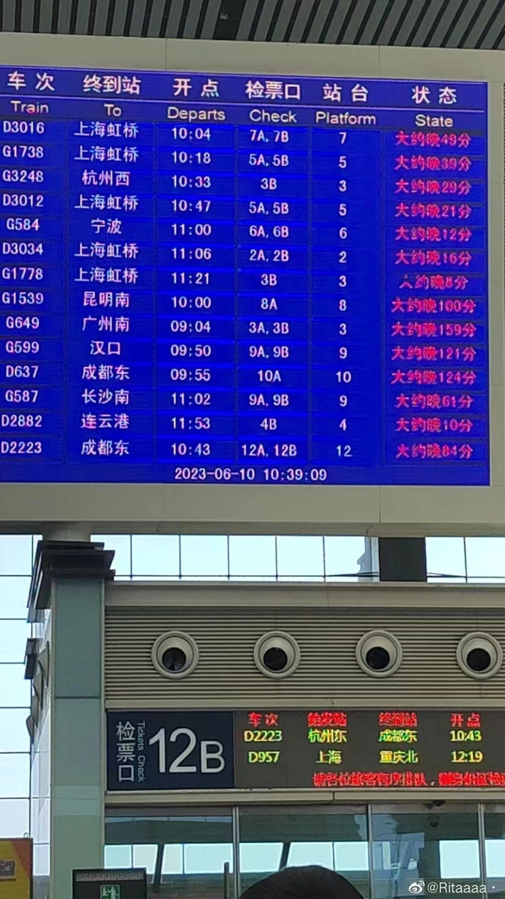
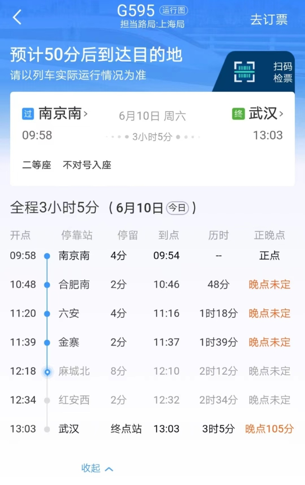
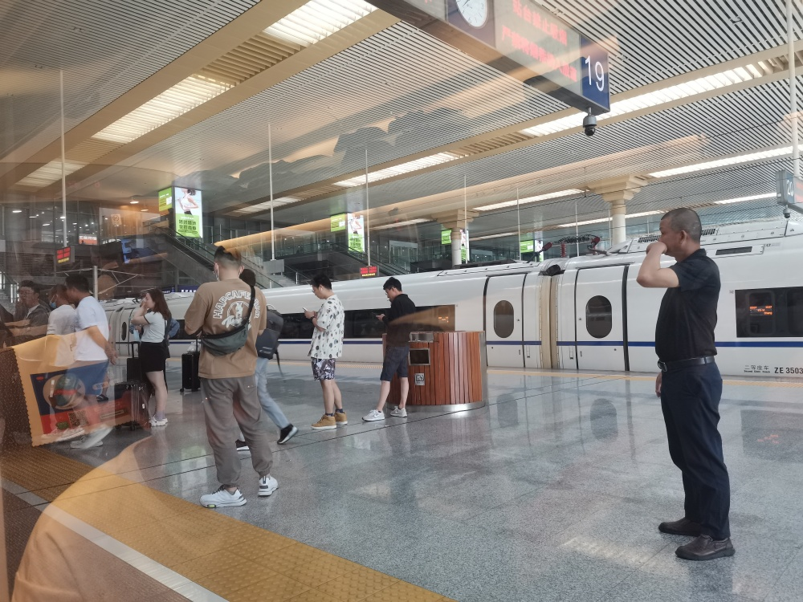
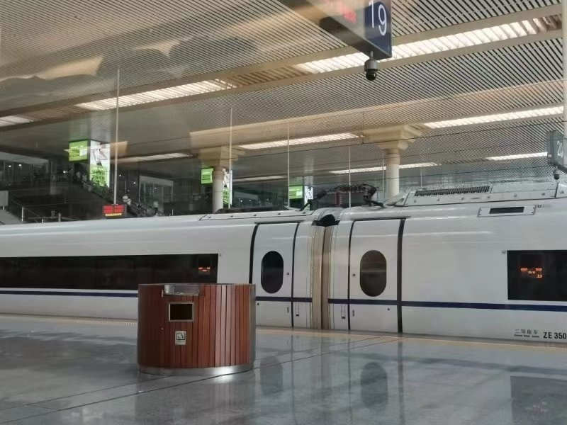

# 安徽等多地高铁晚点超3小时，有乘客错过考试：等了3年，不考无法转正

6月10日，江苏安徽等地多列开往合肥方向的列车晚点超三个小时。

据铁路合肥站发布的消息，因沪蓉线长安集至南分路间突发不明水源水淹道床，影响列车运行，造成途经该区段部分列车晚点。

经铁路部门紧急处置，该区段于11时15分恢复通车，列车运行秩序正逐步恢复。

_车站大屏显示，多趟列车晚点。
图/网络_

杭州西开往武汉的G595次列车上，乘客李玉（化名）因列车晚点，错过了基金从业资格考试的第一场考试。“相当于报名费白交了，而且报名还挺不容易的。”她说，“我已经等了三年，之前因为疫情考不了。”

这场资格考试对她来说很重要，“如果没有考过，就不能转正。”由于杭州报名人数满额，她不得不特意到合肥参加考试。错过这次考试，她可能要再等三个月才能重新报名。

第一场考试是中午12点40分开考，如果列车没有晚点，她原本可以在10点46分到合肥。而列车到达南京南站后，一直未发车，截至发稿前，这趟列车已经晚点3小时。

“从火车站到考场一个小时，我已经预留两个小时了，谁知道火车会晚点这么久。”李玉说，她现在只希望还能赶上下午的考试。

_杭州西开往武汉的高铁晚点已超两小时。图/受访者供图_

计划从南京乘坐动车前往武汉的王女士，到达南京南站后发现，她所购买的D953次列车晚点一个小时，她临时改签另一趟刚刚到站的G595次列车，却同样晚点。

“所有去合肥方向的列车都晚点了。”G595次列车的乘务员说，他们并不了解需要晚点多久，“我们也是看12306APP上的信息。”

APP所显示的晚点时间，从一小时改为两小时，又改为晚点未定，谁也不知道还要等多久。列车上多位乘客申请退票改签下车，有人询问乘务员，“开车到武汉需要多久。”

_G595次列车上乘客因列车晚点，选择退票或改签。图/九派新闻 王佳箐_

该列车上的乘警表示，暂不清楚列车晚点的具体原因，“只知道是线路信号问题。”

将近中午12点，列车乘务员称，已有部分列车恢复运行。南京南站内，一辆终点站为合肥南站的列车正常发车，但站内仍停有多排列车。

【来源：九派新闻】

版权归原作者所有，向原创致敬

